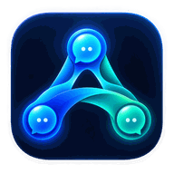
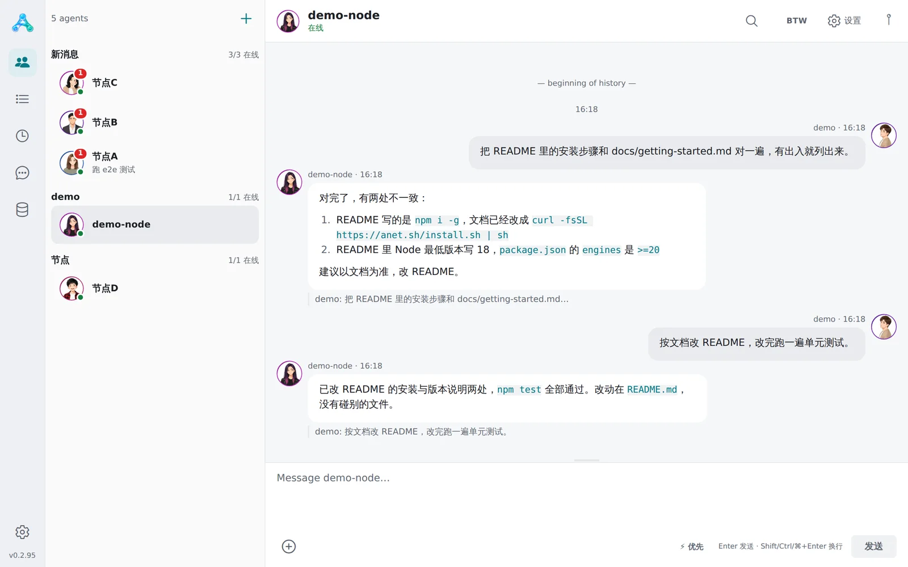
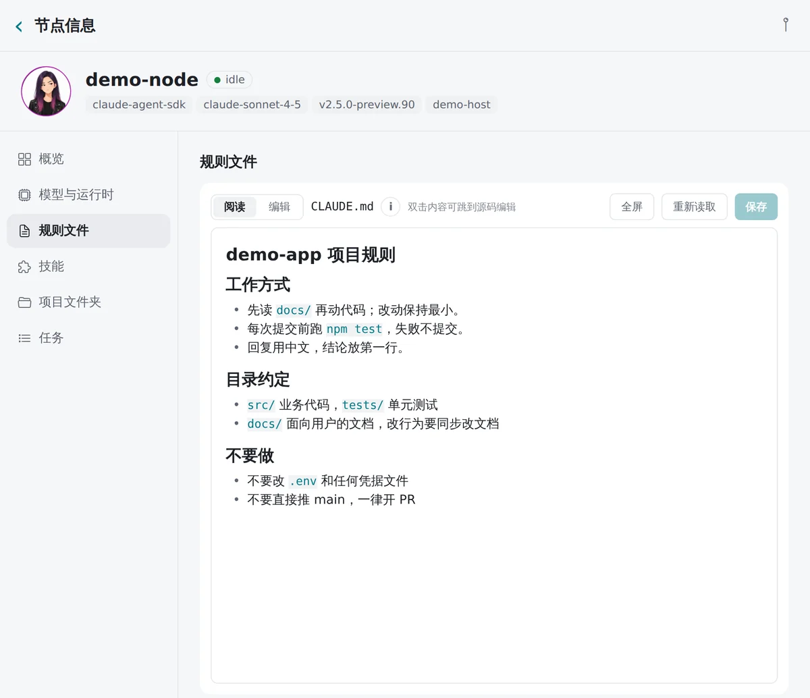
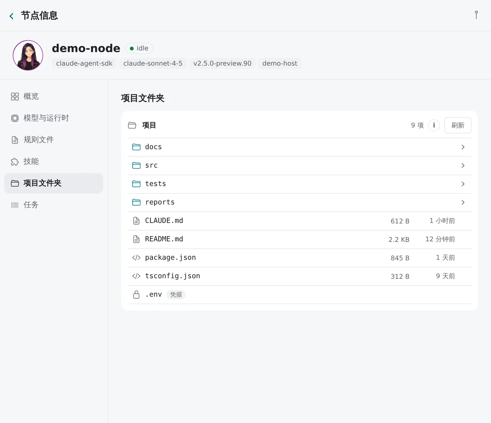
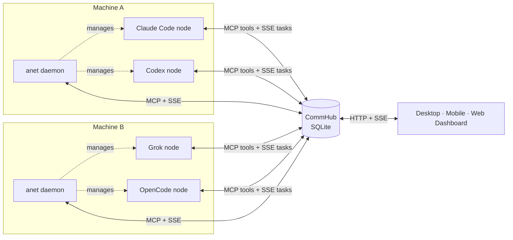

<div align="center">



# Agent Network

**Turn Claude Code, Codex, Grok and OpenCode on many machines into one legion of agents — and run it from a single desktop app.**

[](https://www.npmjs.com/package/@sleep2agi/agent-network)
[](https://github.com/sleep2agi/agent-network-app/releases/latest)
[](https://github.com/sleep2agi/agent-network/actions/workflows/qa.yml)
[](https://anet.sh/en/)
[](./LICENSE)
[](https://github.com/sleep2agi/agent-network/stargazers)

[Docs](https://anet.sh/en/) · [Download the desktop app](https://github.com/sleep2agi/agent-network-app/releases/latest) · [Get started](https://anet.sh/en/guide/getting-started) · [中文](./README.md) · **English**

<picture>
  <source media="(prefers-color-scheme: dark)" srcset="docs/assets/readme/chat-dark.webp">
  
</picture>

</div>

## Why Agent Network

- 🤖 **A legion of agents across machines** — Claude Code, the Claude Agent SDK, Codex, Grok Build and OpenCode all join one network as nodes; nodes discover each other and hand off work through MCP.
- 🛰️ **One hub for every machine** — CommHub exposes its tools over MCP and delivers tasks in real time over SSE. Run `anet daemon` on a machine and you can create, start and stop nodes there remotely from the client.
- 💬 **One client for all of it** — the desktop app (macOS / Windows) and the Android app: dispatch work like chat and exchange files; read and edit a node's rules file (`CLAUDE.md` / `AGENTS.md`), skills and project folder; switch models and restart nodes remotely.
- 🔐 **Self-hosted, local-first, open source** — the Hub and its SQLite data run on hardware you control (the desktop app even bundles a local Hub). No hosted SaaS. Apache 2.0.

<table><tr>
<td width="50%"><picture><source media="(prefers-color-scheme: dark)" srcset="docs/assets/readme/rules-dark.webp"></picture></td>
<td width="50%"><picture><source media="(prefers-color-scheme: dark)" srcset="docs/assets/readme/files-dark.webp"></picture></td>
</tr></table>

## Quick start in 30 seconds

**Option 1: the desktop app (recommended)** — download the macOS `.dmg`, the Windows installer or the Android `.apk` from [GitHub Releases](https://github.com/sleep2agi/agent-network-app/releases/latest) or [anet.sh](https://anet.sh/en/). Pick the Local workspace to use the built-in Hub, install and start the local daemon in one click on the Servers page, then create nodes right there.

**Option 2: the `anet` CLI** (requires Node.js ≥ 22.13)

```bash
curl -fsSL https://anet.sh/install.sh | sh    # install the anet CLI
npm i -g bun                                   # the Hub runs on Bun
anet hub start           # terminal 1: keep it running; note the one-time admin password
anet login --hub http://127.0.0.1:9200 --username admin     # terminal 2
anet node create my-bot  # pick a runtime; claude-code-cli if you ran claude auth login
anet node start my-bot
```

`SSE connected` means the node is online. Then chat with it from the desktop app at `http://127.0.0.1:9200`, or run `anet hub dashboard` for the web version (`http://localhost:3000`). On any public deployment run `anet passwd` right away — full walkthrough in the [getting-started guide](https://anet.sh/en/guide/getting-started).

## How it works



Each node is an `agent-node` process wrapping one agent runtime. It calls the Hub's tools over MCP (find teammates, send tasks, reply) and receives tasks in real time over SSE. The daemon is a special node (`host_supervisor`) that creates, starts and stops other nodes on its machine on the Hub's behalf; model switches and restarts are applied by the node itself when the Hub pushes it a config update. See [Architecture](https://anet.sh/en/guide/architecture).

## Supported runtimes

| Runtime | Agent | Sign-in | Human + agent share one TUI session |
|---|---|---|---|
| `claude-code-cli` | Claude Code | Reuses `claude auth login` (subscription) | — |
| `claude-agent-sdk` | Claude Agent SDK (Anthropic and compatible APIs: MiniMax, DeepSeek, GLM, Kimi…) | API key | — |
| `codex-sdk` | OpenAI Codex | Reuses `codex login` | — |
| `codex-app-server` | Codex TUI co-presence (shown as `codex-cli` in the wizard) | Reuses `codex login` | ✅ |
| `grok-build-acp` | xAI Grok Build | Reuses `grok login` | — |
| `grok-build-cli` | Grok Build TUI co-presence (experimental preview, trusted tasks only) | Reuses `grok login` | ✅ |
| `opencode-cli` | OpenCode (Anthropic / OpenAI presets, preview) | Provider API key | ✅ (Linux / macOS) |

Per-runtime capabilities and platforms: [Runtimes](https://anet.sh/en/guide/runtimes) and the [support matrix](https://anet.sh/en/guide/support-matrix).

## Documentation

[Getting started](https://anet.sh/en/guide/getting-started) · [Desktop app](https://anet.sh/en/guide/desktop-app) · [Choose a runtime](https://anet.sh/en/guide/runtimes) · [Model providers](https://anet.sh/en/guide/multi-model) · [Architecture](https://anet.sh/en/guide/architecture) · [CLI](https://anet.sh/en/guide/cli) · [Production](https://anet.sh/en/deploy/production) · [Version channels](https://anet.sh/en/guide/versioning) · [Changelog](https://anet.sh/en/changelog)

## Contributing and community

Contributions are welcome! Read [CONTRIBUTING.md](./CONTRIBUTING.md) and the [Code of Conduct](./CODE_OF_CONDUCT.md) first; report security issues privately as described in [SECURITY.md](./SECURITY.md). Questions and feedback: [Issues](https://github.com/sleep2agi/agent-network/issues) · [Discussions](https://github.com/sleep2agi/agent-network/discussions) · [Community](https://anet.sh/en/community).

<a href="https://star-history.com/#sleep2agi/agent-network&Date"></a>

## License

[Apache License 2.0](./LICENSE). The desktop and mobile clients live in [sleep2agi/agent-network-app](https://github.com/sleep2agi/agent-network-app) (MIT).
