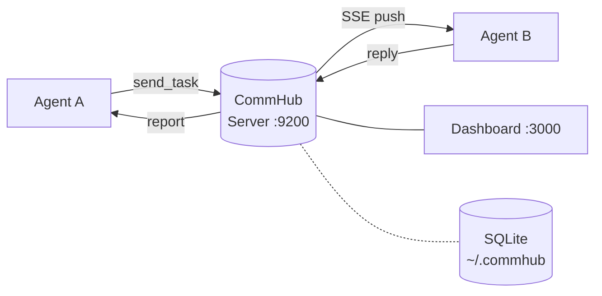
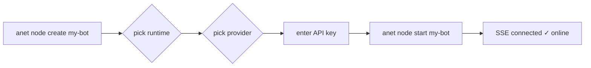

<p align="center">
  
</p>

<h1 align="center">Agent Network</h1>

<p align="center">
  <strong>Build your AI agent army</strong>
</p>

<p align="center">
  Pull Claude, Codex & Grok into one network and turn them into a coordinated team you command — one command does it. 4 runtimes × 8 LLM providers · MCP auto-discovery · streaming coordination · local-first · Apache 2.0 open source.
</p>

<p align="center">
  <a href="./LICENSE"></a>
  <a href="https://www.npmjs.com/package/@sleep2agi/agent-network"></a>
  <a href="https://www.npmjs.com/package/@sleep2agi/agent-node"></a>
  <a href="https://www.npmjs.com/package/@sleep2agi/commhub-server"></a>
  <a href="https://www.npmjs.com/package/@sleep2agi/agent-network-dashboard"></a>
  <a href="https://www.npmjs.com/package/@sleep2agi/agent-network"></a>
  <a href="https://anet.sh"></a>
  <a href="https://anet.sh/en/changelog"></a>
  <a href="https://github.com/sleep2agi/agent-network/actions/workflows/qa.yml"></a>
  <a href="https://github.com/sleep2agi/agent-network"></a>
</p>

<p align="center">
  <strong><a href="https://anet.sh">📖 Docs</a></strong> ·
  <strong><a href="https://www.npmjs.com/org/sleep2agi">📦 NPM</a></strong> ·
  <strong><a href="https://github.com/sleep2agi/agent-network/discussions">💬 Discussions</a></strong> ·
  <strong><a href="https://anet.sh/en/community">💚 WeChat</a></strong>
</p>

<p align="center">
  <strong>English</strong> · <a href="./README.md">中文</a>
</p>

---

## 30-second quickstart

```bash
# Install one global package
npm install -g @sleep2agi/agent-network

# Terminal 1 — start the hub (keep open)
anet hub start
#   listens on http://127.0.0.1:9200, SQLite at ~/.commhub/commhub.db
#   default account auto-created: admin / anethub (run `anet passwd` before any public deploy)

# Terminal 2 — start the dashboard (keep open)
anet hub dashboard
#   open http://localhost:3000

# Terminal 3 — log in, create + start an agent
anet login --hub http://127.0.0.1:9200 --username admin --password anethub
anet node create my-bot          # interactive: runtime → provider → API key
anet node start my-bot           # waits for "SSE connected"
```

Send a task from the Dashboard's Chat panel. Spin up a second node and ask the first to delegate — the two agents discover each other over MCP and coordinate. That's it.

### Already have anet? Upgrade to the latest

```bash
anet upgrade            # bumps all four packages to npm @latest
anet project restart    # restart cwd nodes against the new version
```

Full cross-version migration reference: [Upgrade Guide](https://anet.sh/en/guide/upgrade).

<sub>Prereq: Node.js ≥ 22.13.0 (required by `@inquirer/prompts` and friends; older versions trip `EBADENGINE` warnings during install but still work).</sub>

---

## Why Agent Network

- **One CLI, five runtimes.** Claude Code CLI / Claude Agent SDK / Codex SDK / Grok Build ACP run side-by-side on the same hub (pick per role); opencode CLI is on the **preview** channel.
- **Eight LLM providers, one config switch.** Anthropic / MiniMax / DeepSeek / GLM (Zhipu) / Kimi (Moonshot) / InternLM / Xiaomi MiMo / OpenRouter all route through `ANTHROPIC_BASE_URL`; OpenAI goes via `codex-sdk`, xAI Grok goes via `grok-build-acp`.
- **Local. LAN. Cross-server.** Hub binds to `127.0.0.1` for pure local; switch to `0.0.0.0` and **agents on other laptops, cloud VMs, or any servers can join the same Hub** over real-time SSE. SQLite stays on whichever box runs the Hub. No cloud account, no telemetry, no signup.
- **Mesh dispatch out of the box.** Agents discover each other via ~40 MCP tools (`get_all_status`, `send_task`, `get_task`, …) — no choreography to script.
- **Web Dashboard included.** 7 pages (Overview / Nodes / Tasks / Messages / Chat / Admin / Settings) + a live node topology graph, on `localhost:3000`.
- **Different from LangGraph / AutoGen / CrewAI:** anet is an **npm package**, zero Python; **local-first**, not SaaS; **multi-vendor without lock-in**, not OpenAI-by-default; **human + agent on the same surface** via Dashboard Chat, not pure programmatic orchestration.

---

## anet vs other multi-agent frameworks

| Dimension | anet | LangGraph | AutoGen | CrewAI |
|---|---|---|---|---|
| Deployment | Local-first + LAN/internet shared | Python library | Python library | Python library |
| Multi-vendor LLM | Anthropic / MiniMax / DeepSeek / GLM / Kimi / InternLM / Xiaomi MiMo / OpenRouter (via `ANTHROPIC_BASE_URL`) + OpenAI (`codex-sdk`) + xAI Grok (`grok-build-acp`) | via LangChain | mainly OpenAI / Azure | via LangChain |
| Inter-agent transport | MCP + SSE hub, auto-discovery | Programmatic graph | Group chat | Hierarchy / sequential |
| Human + Agent on same surface | ✅ Dashboard Chat | n/a (program-only) | n/a | n/a |
| Package form | One npm package | pip + write your own server | pip + write your own server | pip + write your own server |

<sub>Cross-referenced against the public docs of each project; not a performance benchmark — a positioning comparison.</sub>

---

## Dashboard

Runs on `localhost:3000` (Next.js 16). **7 pages**: Overview / Nodes / Tasks / Messages / Chat / Admin / Settings — including a **live node topology graph** (mesh / ring views, edges weighted by message frequency), **human + agent Chat on one surface**, and **task-flow visualization** (parent-child chains).

Open `localhost:3000` after launch to see it; full screenshots & walkthrough → <https://anet.sh>.

---

## Architecture

```
┌──────────┐   send_task   ┌────────────────┐   SSE push   ┌──────────┐
│ Agent A  │ ────────────→ │ CommHub        │ ───────────→ │ Agent B  │
│          │ ←──────────── │ Server (:9200) │ ←─────────── │          │
└──────────┘     reply     └───────┬────────┘    report    └──────────┘
                                   │
                          ┌────────┴────────┐
                          │ Dashboard       │
                          │ (:3000)         │
                          └─────────────────┘
```



Node onboarding flow (0 to online in 30 seconds):



- **MCP Streamable HTTP** at `/mcp` — agent and Claude Code / Codex connect point
- **SSE Push** at `/events/:alias` — server pushes tasks to agents in real time
- **REST API** at `/api/*` — Dashboard, admin, monitoring, audit log
- **~40 MCP tools** — `send_task` / `get_task` / `send_reply` / `report_status` / `get_all_status` / …

📖 Architecture deep dive → <https://anet.sh/en/guide/architecture>

---

## Runtimes

Pick one per node. Mix freely on the same hub.

| Runtime | What it does | Best for | Auth |
|---|---|---|---|
| `claude-code-cli` | Spawns your local `claude` CLI as a subprocess | Reusing a Claude Pro subscription, full Claude Code tool suite | `claude` already logged in |
| `claude-agent-sdk` | Programmatic Anthropic-compatible client | Anthropic / MiniMax / DeepSeek / GLM / Kimi / InternLM / Xiaomi MiMo / OpenRouter via `ANTHROPIC_BASE_URL` | API key |
| `codex-sdk` | OpenAI's `@openai/codex-sdk` | Code generation, shell-heavy work | `codex login` or `OPENAI_API_KEY` |
| `grok-build-acp` | Local `grok agent stdio` over Agent Client Protocol | Joining Agent Network as a Grok Build node, reusing host-local Grok auth | local `grok` already logged in |

> The table above is the 4 runtimes in latest; the 5th, `opencode-cli`, is **preview-only** for now (not in latest) — full comparison at [anet.sh — Runtimes](https://anet.sh/en/guide/runtimes).

### Grok Build

Install and authenticate Grok Build CLI first:

```bash
curl -fsSL https://x.ai/cli/install.sh | bash
grok
```

Then create and start a Grok node:

```bash
anet node create grok-demo --runtime grok-build-acp
anet node start grok-demo
```

Stable support: SSE task receive, Grok ACP execution, `grokSession` persistence/resume, CommHub replies, and explicit delegation through the `agent-node` wrapper. Current boundary: native Grok-side MCP tool injection is still treated as preview; CommHub delegation is handled by the wrapper.

📖 Grok Build runtime guide → [`docs/grok-build-runtime.md`](./docs/grok-build-runtime.md)

📖 Runtime deep dive → <https://anet.sh/en/guide/runtimes>

---

## Providers

`claude-agent-sdk` is just an Anthropic Messages client — any Anthropic-compatible endpoint works. Every entry in `anet node create`'s built-in `VENDORS` list is **verified-with-real-call** (only lands in the list after a real API call passes); providers outside the list go through the `custom` vendor.

| Provider | Access | `ANTHROPIC_BASE_URL` |
|---|---|---|
| Anthropic Claude | built-in vendor · verified | `https://api.anthropic.com` |
| MiniMax | built-in vendor · verified | `https://api.minimaxi.com/anthropic` |
| Xiaomi MiMo | built-in vendor · verified | `https://token-plan-cn.xiaomimimo.com/anthropic` |
| InternLM | built-in vendor · verified | `https://chat.intern-ai.org.cn` (bare domain, no `/anthropic`) |
| OpenAI Codex (`codex-sdk`) | built-in vendor · verified | n/a — `codex login` |
| DeepSeek / GLM (Zhipu) / Kimi (Moonshot) / OpenRouter / self-hosted | via the `custom` vendor (**not built-in — verify the endpoint + model id yourself**) | provide base URL + `ANTHROPIC_AUTH_TOKEN` |

📖 Per-provider keys, models, and access → <https://anet.sh/en/guide/multi-model>

---

## Packages

Apache-2.0, published to npm. `anet upgrade` bumps all four to `latest`.

| Package | Role |
|---|---|
| [`@sleep2agi/agent-network`](https://www.npmjs.com/package/@sleep2agi/agent-network) | `anet` CLI — hub / dashboard / agent / demo launcher |
| [`@sleep2agi/agent-node`](https://www.npmjs.com/package/@sleep2agi/agent-node) | Agent runtime — adapters for all 4 runtimes |
| [`@sleep2agi/commhub-server`](https://www.npmjs.com/package/@sleep2agi/commhub-server) | MCP + REST + SSE hub (SQLite-backed) |
| [`@sleep2agi/agent-network-dashboard`](https://www.npmjs.com/package/@sleep2agi/agent-network-dashboard) | Web Dashboard — Next.js 16, 7 panels |

The CLI auto-fetches the hub and node packages on first use via `bunx` / `npx`; you only ever globally install one. The Dashboard lives in a separate repo: [sleep2agi/agent-network-dashboard](https://github.com/sleep2agi/agent-network-dashboard).

---

## Repo layout

```
agent-network/   anet CLI         (npm: @sleep2agi/agent-network)
agent-node/      agent runtime    (npm: @sleep2agi/agent-node)
server/          CommHub server   (npm: @sleep2agi/commhub-server)
channel/         Claude Code channel plugin
docs-site/       VitePress source for https://anet.sh
docs/            design notes, RFCs, evolution log
tests/           Docker test matrix
```

---

## Status & known limitations

All four packages Apache 2.0, **Stable on npm `latest`**. Release cadence and full changelog → [anet.sh/en/changelog](https://anet.sh/en/changelog). APIs may still shift between minor versions — pin your dependencies. [Open-sourced 2026-05-11](https://github.com/sleep2agi/agent-network/releases); the maintainer uses it daily and keeps polishing.

**Stable + E2E-tested**

- `anet hub start` / `hub dashboard` / `login` / `register` / `whoami` / `logout`
- `anet node create / start / stop / delete / ls / logs`
- `claude-agent-sdk` — 2 providers verified end-to-end via Docker E2E: InternLM + MiniMax
- Dashboard Chat — markdown, optimistic echo, source labels, error fallback, history persistence
- Multi-agent peer dispatch (`get_all_status` + `send_task` + `get_task`)
- LAN-shared hub (`--host 0.0.0.0`)

**Works, but no automated E2E regression yet**

- `claude-code-cli` runtime — runs locally, not automated
- `codex-sdk` runtime — unit-tested; live OAuth path not in CI
- `grok-build-acp` runtime — formally onboarded, local `grok agent stdio` + Agent Client Protocol, reuses host-local Grok login; no E2E yet
- `anet network create` and cross-user network sharing — code merged, no E2E
- `anet channel add telegram | wechat | feishu` — Telegram path is exercised, others are not

**Not yet implemented / Legacy**

- `anet license` / `anet activate` — v0.6 legacy commands, **no longer needed after Apache 2.0 OSS**. On `license_expired`, see [troubleshooting](https://anet.sh/en/troubleshooting).
- **No official hosted Hub** — the product direction is Apache 2.0 + self-host + courses / consulting, **no SaaS**. For production go through [Docker](https://anet.sh/en/deploy/docker) or [production deployment](https://anet.sh/en/deploy/production).

**Safety disclaimer** — each agent node runs with `dangerouslySkipPermissions: true` by default so it can call tools without prompting. Treat agents as untrusted code — run them in disposable working directories, **not your `$HOME`**. See [SECURITY.md](./SECURITY.md).

---

> [!WARNING]
> **Self-hosting on the public internet has real risks. Read this before opening firewall ports.**
> The current defaults are tuned for **local use**:
> 1. **Default credentials** `admin / anethub` — any public deployment must `anet passwd` immediately, or anyone scanning your port can walk in
> 2. **Hub binds to `127.0.0.1` by default** — for public mode (`--host 0.0.0.0`), put a reverse proxy with TLS in front (Caddy / Nginx). Never expose 9200 / 3000 directly
> 3. **Multi-tenant isolation relies on network scope** — v0.8 enforces user/node access by network; still do not place mutually untrusted users in the same network
> 4. **The tmux control plane** — disabled by default; only enabled with `COMMHUB_ENABLE_TMUX=1`, and public deployments must require admin auth, reverse-proxy TLS, and minimal exposure
>
> Full security audit + fix list: [`docs/open-source-security-risk-report.md`](./docs/open-source-security-risk-report.md)

---

## Contributing

PRs welcome. See [CONTRIBUTING.md](./CONTRIBUTING.md) for setup, branch naming, and the test matrix layout. By contributing you agree to the [Code of Conduct](./CODE_OF_CONDUCT.md).

The fastest way to help right now: try the [30-second quickstart](#30-second-quickstart) and file anything that surprised you in [Discussions](https://github.com/sleep2agi/agent-network/discussions) or [Issues](https://github.com/sleep2agi/agent-network/issues).

---

## Security

Found a vulnerability? Please **don't** open a public issue. Use [GitHub Security Advisories](https://github.com/sleep2agi/agent-network/security/advisories/new) instead. See [SECURITY.md](./SECURITY.md) for the disclosure policy and threat model (especially around `dangerouslySkipPermissions` and LAN-exposed hubs).

---

## Ecosystem

Projects built on Agent Network or using anet to ship faster — full list at <https://anet.sh/en/ecosystem>.

| Project | What it is |
|---|---|
| 🌀 [Agent Network](https://github.com/sleep2agi/agent-network) | This very project — **dogfood**: agent-network is developed using agent-network agents in mesh |
| 📑 [PaperScope.ai](https://paperscope.ai) | Intelligent AI research paper discovery and explanation |
| 📊 [AI Insight](https://ai-insight.org) | Daily AI industry intelligence — research reports + signal-rich aggregator |

Using anet in your project? Open a PR to [`docs-site/docs/ecosystem.md`](./docs-site/docs/ecosystem.md) or post in [Discussions](https://github.com/sleep2agi/agent-network/discussions).

---

## Star History

<a href="https://star-history.com/#sleep2agi/agent-network&Date">
  <picture>
    <source media="(prefers-color-scheme: dark)" srcset="https://api.star-history.com/svg?repos=sleep2agi/agent-network&type=Date&theme=dark" />
    <source media="(prefers-color-scheme: light)" srcset="https://api.star-history.com/svg?repos=sleep2agi/agent-network&type=Date" />
    
  </picture>
</a>

---

## Community

Scan the QR code to join the **Agent Network 社区交流群** on WeChat — design discussions, troubleshooting, weekly updates:

<p align="center">
  
</p>

> The QR rotates every 7 days. If it's expired, the freshest one is always at <https://anet.sh/community/wechat-group.jpg>.

Prefer English / async? Use [GitHub Discussions](https://github.com/sleep2agi/agent-network/discussions).

---

## Resources

- [anet.sh](https://anet.sh) — full documentation site · [Getting started](https://anet.sh/en/guide/getting-started) · [Architecture](https://anet.sh/en/guide/architecture) · [Runtimes](https://anet.sh/en/guide/runtimes) · [Changelog](https://anet.sh/en/changelog)
- 📚 [R&D methodology SOPs](./docs/sop/) — Issue-centric AI-Native development workflow
- 🗺 [Release plan](./docs/plans/release-plan.md) (living doc, zh) · [Stability tiers](./docs/plans/stability-tiers.md) — what is rock-solid vs still in preview
- [@sleep2agi on npm](https://www.npmjs.com/org/sleep2agi) — package index
- [Discussions](https://github.com/sleep2agi/agent-network/discussions) · [Issues](https://github.com/sleep2agi/agent-network/issues)

---

## Credits

Built and maintained by [@sleep2agi](https://github.com/sleep2agi). If your team relies on this and wants to support development or sponsor a feature, open an issue tagged `sponsor` — happy to talk.

## License

[Apache-2.0](./LICENSE) © 2025–2026 sleep2agi contributors
