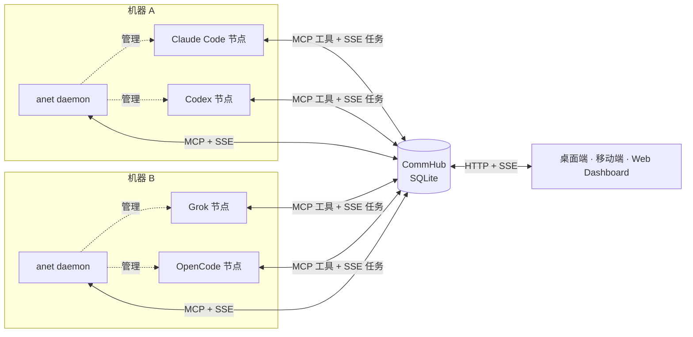

<div align="center">


# Agent Network

**把分布在多台机器上的 Claude Code、Codex、Grok、OpenCode 连成一支 Agent 军团 —— 在一个桌面应用里指挥它们。**

[](https://www.npmjs.com/package/@sleep2agi/agent-network)
[](https://github.com/sleep2agi/agent-network-app/releases/latest)
[](https://github.com/sleep2agi/agent-network/actions/workflows/qa.yml)
[](https://anet.sh)
[](./LICENSE)
[](https://github.com/sleep2agi/agent-network/stargazers)

[文档](https://anet.sh) · [下载桌面版](https://github.com/sleep2agi/agent-network-app/releases/latest) · [快速上手](https://anet.sh/guide/getting-started) · **中文** · [English](./README.en.md)

<br>

<picture>
  <source media="(prefers-color-scheme: dark)" srcset="docs/assets/readme/chat-dark.webp">
  
</picture>

</div>

## 为什么用 Agent Network

- 🤖 **一支跨机器的 Agent 军团** —— Claude Code、Claude Agent SDK、Codex、Grok Build、OpenCode 都能作为节点接入同一个网络，节点之间通过 MCP 互相发现、互相派活。
- 🛰️ **一个 Hub 串起所有机器** —— CommHub 通过 MCP 暴露工具、通过 SSE 实时投递任务；每台机器跑一个 `anet daemon`，就能从客户端远程创建、启动和停止那台机器上的节点。
- 💬 **一个客户端管全部** —— 桌面端（macOS / Windows）和 Android 端：像聊天一样派活、收发文件；查看和编辑节点的规则文件（`CLAUDE.md` / `AGENTS.md`）、技能和项目文件夹；远程切换模型、重启节点。
- 🔐 **自托管、本地优先、开源** —— Hub 和 SQLite 数据跑在你自己的机器上（桌面端还自带一个本地 Hub），不做 SaaS 托管；Apache 2.0。

<table><tr>
<td width="50%"><picture><source media="(prefers-color-scheme: dark)" srcset="docs/assets/readme/rules-dark.webp"></picture></td>
<td width="50%"><picture><source media="(prefers-color-scheme: dark)" srcset="docs/assets/readme/files-dark.webp"></picture></td>
</tr></table>

## 30 秒上手

**方式一：桌面应用（推荐）** —— 从 [GitHub Releases](https://github.com/sleep2agi/agent-network-app/releases/latest) 或 [anet.sh](https://anet.sh) 下载 macOS `.dmg` / Windows 安装程序 / Android `.apk`。选「本地工作区」即可使用内置 Hub，在「服务器」页一键安装并启动本机 daemon，然后直接创建节点。

**方式二：`anet` CLI**（需要 Node.js ≥ 22.13）

```bash
curl -fsSL https://anet.sh/install.sh | sh && npm i -g bun   # 装 anet；Hub 运行在 Bun 上
anet hub start                                   # 终端 1：保持运行，记下只打印一次的 admin 密码
anet login --hub http://127.0.0.1:9200 --username admin      # 终端 2
anet node create my-bot && anet node start my-bot            # 向导里选 runtime（已 `claude auth login` 就选 claude-code-cli）
```

看到 `SSE connected` 就说明节点上线了。之后用桌面端连 `http://127.0.0.1:9200` 和它对话，或运行 `anet hub dashboard` 打开 Web 版（`http://localhost:3000`）。公网部署请立刻 `anet passwd` 改密 —— 完整步骤见 [上手指南](https://anet.sh/guide/getting-started)。

## 工作原理



每个节点都是一个 `agent-node` 进程，包着一种 Agent 运行时，通过 MCP 调用 Hub 的工具（查队友、派任务、回复），通过 SSE 实时收任务。daemon 是一个特殊节点（`host_supervisor`），替 Hub 在它所在的机器上创建、启动和停止其他节点；切模型、重启这类操作由节点自己收到 Hub 下发的配置后执行。详见 [架构说明](https://anet.sh/guide/architecture)。

## 支持的运行时

| Runtime | Agent | 登录方式 | 人机共用一个 TUI 会话 |
|---|---|---|---|
| `claude-code-cli` | Claude Code | 复用 `claude auth login`（订阅） | — |
| `claude-agent-sdk` | Claude Agent SDK（Anthropic 及兼容 API：MiniMax、DeepSeek、GLM、Kimi…） | API Key | — |
| `codex-sdk` | OpenAI Codex | 复用 `codex login` | — |
| `codex-app-server` | Codex TUI 共存（向导里显示为 `codex-cli`） | 复用 `codex login` | ✅ |
| `grok-build-acp` | xAI Grok Build | 复用 `grok login` | — |
| `grok-build-cli` | Grok Build TUI 共存（实验性预览，仅可信任务） | 复用 `grok login` | ✅ |
| `opencode-cli` | OpenCode（Anthropic / OpenAI preset，预览） | 提供方 API Key | ✅（Linux / macOS） |

各运行时的能力与平台支持矩阵见 [Runtime 对比](https://anet.sh/guide/runtimes) 和 [支持矩阵](https://anet.sh/guide/support-matrix)。

## 文档

[上手指南](https://anet.sh/guide/getting-started) · [桌面应用](https://anet.sh/guide/desktop-app) · [Runtime 选择](https://anet.sh/guide/runtimes) · [多模型接入](https://anet.sh/guide/multi-model) · [架构](https://anet.sh/guide/architecture) · [CLI](https://anet.sh/guide/cli) · [生产部署](https://anet.sh/deploy/production) · [版本通道](https://anet.sh/guide/versioning) · [更新日志](https://anet.sh/changelog)

## 参与与社区

欢迎贡献！开始之前请阅读 [CONTRIBUTING.md](./CONTRIBUTING.md) 和 [行为准则](./CODE_OF_CONDUCT.md)；安全问题请按 [SECURITY.md](./SECURITY.md) 私下报告。提问和反馈：[Issues](https://github.com/sleep2agi/agent-network/issues) · [Discussions](https://github.com/sleep2agi/agent-network/discussions) · [社群](https://anet.sh/community)。

[](https://star-history.com/#sleep2agi/agent-network&Date)

## 许可证

[Apache License 2.0](./LICENSE)。桌面与移动客户端源码在 [sleep2agi/agent-network-app](https://github.com/sleep2agi/agent-network-app)（MIT）。
