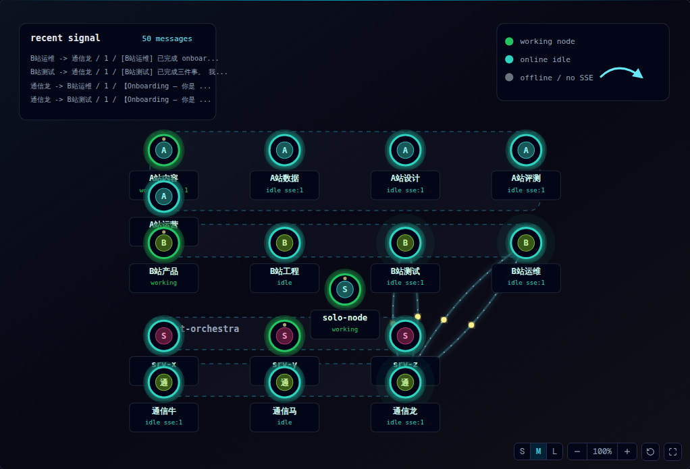
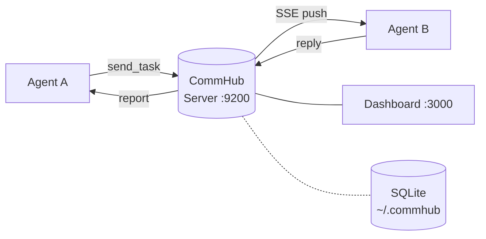
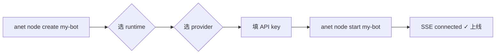

<p align="center">
  
</p>

<h1 align="center">Agent Network</h1>

<p align="center">
  <strong>多 Agent，一行命令。让 Claude / GPT / MiniMax / DeepSeek / GLM / Kimi / 书生 / OpenRouter 在你电脑上一起干活。</strong>
</p>

<p align="center">
  开发团队 · 内容工厂 · 研究小组 · 辩论赛 —— 都跑在你自己的机器上。
</p>

<p align="center">
  <a href="./LICENSE"></a>
  <a href="https://www.npmjs.com/package/@sleep2agi/agent-network"></a>
  <a href="https://www.npmjs.com/package/@sleep2agi/agent-network"></a>
  <a href="https://anet.sh"></a>
  <a href="https://anet.sh/changelog"></a>
  <a href="https://github.com/sleep2agi/agent-network/actions/workflows/qa.yml"></a>
  <a href="https://github.com/sleep2agi/agent-network/commits/main"></a>
  <a href="https://github.com/sleep2agi/agent-network/commits/main"></a>
  <a href="https://github.com/sleep2agi/agent-network/releases"></a>
  <a href="https://github.com/sleep2agi/agent-network"></a>
</p>

<p align="center">
  <strong><a href="https://anet.sh">📖 文档</a></strong> ·
  <strong><a href="https://www.npmjs.com/org/sleep2agi">📦 NPM</a></strong> ·
  <strong><a href="https://github.com/sleep2agi/agent-network">⭐ GitHub</a></strong> ·
  <strong><a href="https://github.com/sleep2agi/agent-network/discussions">💬 Discussions</a></strong> ·
  <strong><a href="https://anet.sh/community">💚 微信群</a></strong>
</p>

<p align="center">
  <a href="./README.en.md">English</a> · <strong>中文</strong>
</p>

---

## 30 秒上手（首次安装）

> **前置**：Node.js ≥ 22.13.0（`@inquirer/prompts` 等依赖要求；老版本会触发 `EBADENGINE` warnings）。

```bash
# 装一个全局包（拉 npm @latest，当前 v0.10.8 = agent-network 2.2.6）
npm install -g @sleep2agi/agent-network

# 终端 1 —— 起 Hub（保持开着）
anet hub start
#   监听 http://127.0.0.1:9200
#   SQLite 在 ~/.commhub/commhub.db
#   自动创建默认账号：admin / anethub

# 终端 2 —— 起 Dashboard（保持开着）
anet hub dashboard
#   浏览器访问 http://localhost:3000

# 终端 3 —— 登录 + 创建 + 启动 Agent
anet login --username admin --password anethub
anet node create my-bot          # 两步交互：选 runtime → 选 provider → 填 API key
anet node start my-bot           # 等到 "SSE connected" 即就绪
```

或一键脚本（含 admin password 等 UX 提示）：

```bash
curl -fsSL https://anet.sh/install.sh | bash
```

从 Dashboard 的 Chat 面板派任务即可。再起一个节点让第一个去派活，两个 Agent 会通过 MCP 自动发现彼此并协作。

### 已装 anet？升级到最新

```bash
anet upgrade            # 一键把 4 个包升到 npm @latest（当前 v0.10.8）
anet project restart    # 重启 cwd 节点接新版（详见 #117）
```

完整跨版本迁移参考 [升级指南](https://anet.sh/guide/upgrade)。

---

## 一键 Demo

```bash
export MINIMAX_KEY=sk-cp-xxx

# 6 角色 9 步辩论赛，约 10 分钟
anet demo debate --topic "AI 创造的岗位是否比消灭的多"

# 4 角色社媒内容工厂，约 3 分钟
anet demo socialmedia --topic "AI 时代如何提升专注力" --platform xiaohongshu
```

每个 demo 跑在独立 network 里，跑完自动清场，**不会污染** `default` network。

> 🎬 **Demo 录屏制作中**（`anet demo debate` / `socialmedia` 的实跑 GIF）。在那之前直接跑命令最快。

---

## 下一步

跑完 30 秒上手之后：

- 🎬 **跑 demo** —— `anet demo debate` 或 `anet demo socialmedia` 看多 Agent 协作真实姿态
- 📖 **看文档** —— [anet.sh/guide/getting-started](https://anet.sh/guide/getting-started) 全链路教程 + [架构概览](https://anet.sh/guide/architecture)
- 💚 **加微信群** —— [扫码进群](https://anet.sh/community/wechat-group.jpg) 设计讨论、版本动态、排查问题
- ⭐ **Star 项目** —— 觉得有用就给个 Star，活跃度直接反映在 release 节奏上

---

## 为什么用 Agent Network

- **一个 CLI，三种 Runtime。** Claude Code CLI / Claude Agent SDK / Codex SDK 同时跑在一个 Hub 上，按角色挑最合适的。
- **八家 LLM，一个开关切换。** Anthropic / OpenAI / MiniMax / DeepSeek / 智谱 GLM / 月之暗面 Kimi / 书生 InternLM / OpenRouter —— 通过 `ANTHROPIC_BASE_URL` 一键路由。
- **本地跑得动，跨服务器也跑得动。** Hub 默认绑 `127.0.0.1` 纯本机；改成 `0.0.0.0` 绑公网 IP，**多台云服务器 / 多个工位的 Agent 都能加入同一个 Hub**，SSE 实时双向。SQLite 数据全程在 Hub 所在那台机器，不用注册账号、不用登云、零遥测。
- **Mesh 派活开箱即用。** Agent 之间通过 17 个 MCP 工具（`get_all_status` / `send_task` / `get_task` …）自动发现 + 互相派活，不需要你写编排逻辑。
- **自带 Web Dashboard。** Overview / Nodes / Tasks / Messages / Chat / Admin / Settings 七大页 + 实时节点拓扑图（grid / ring 双视图，连线按消息频度分级）—— Next.js 16 + 4 套主题，跑在 `localhost:3000`。
- **和 LangGraph / AutoGen / CrewAI 不一样：** anet 是 **npm 包**，零 Python 依赖；**本地优先**而非 SaaS 框架；**多厂商不锁定**而非默认 OpenAI；**人 + Agent 同台**通过 Dashboard Chat 协作而非纯程序编排。

---

## anet vs 其他多 Agent 框架

| 维度 | anet | LangGraph | AutoGen | CrewAI |
|---|---|---|---|---|
| 部署模式 | 本地优先 + LAN/公网共享 | Python 库 | Python 库 | Python 库 |
| 多 LLM 厂商 | Anthropic / MiniMax / DeepSeek / GLM / Kimi / 书生 / OpenAI / OpenRouter | 走 LangChain | 主要 OpenAI / Azure | 走 LangChain |
| Agent 间通信 | MCP + SSE 中枢，自动发现 | 编程式 graph | group chat | hierarchy / sequential |
| 人 + Agent 同台 | ✅ Dashboard Chat 同界面 | n/a（纯程序） | n/a | n/a |
| 部署形态 | 一个 npm 包 | pip + 自写 server | pip + 自写 server | pip + 自写 server |

<sub>以 2026-05 各项目公开文档对照，不构成性能 benchmark，仅说明定位差异。</sub>

---

## 架构

```
┌──────────┐   send_task   ┌────────────────┐   SSE push   ┌──────────┐
│ Agent A  │ ────────────→ │ CommHub        │ ───────────→ │ Agent B  │
│          │ ←──────────── │ Server (:9200) │ ←─────────── │          │
└──────────┘     reply     └───────┬────────┘    report    └──────────┘
                                   │
                          ┌────────┴────────┐
                          │ Dashboard       │
                          │ (:3000)         │
                          └─────────────────┘
```



节点接入流程（从 0 到上线 30 秒）：



- **MCP Streamable HTTP**（`/mcp`）—— Agent / Claude Code / Codex 接入点
- **SSE 推送**（`/events/:alias`）—— Hub 实时把任务推给 Agent
- **REST API**（`/api/*`）—— Dashboard、管理、监控、审计日志
- **17 个 MCP 工具** —— `send_task`、`get_task`、`send_reply`、`report_status`、`get_all_status`、…

📖 架构详解 → <https://anet.sh/guide/architecture>

---

## 三种 Runtime

每个节点选一种，同一个 Hub 上自由混搭。

| Runtime | 工作方式 | 适合场景 | 鉴权 |
|---|---|---|---|
| `claude-code-cli` | spawn 本地 `claude` CLI 子进程 | 复用 Claude Pro 订阅，享 Claude Code 全套工具 | 本地 `claude` 已登录 |
| `claude-agent-sdk` | 编程式调 Anthropic 兼容 API | Anthropic / MiniMax / DeepSeek / GLM / Kimi / 书生 / OpenRouter 等（通过 `ANTHROPIC_BASE_URL`） | API key |
| `codex-sdk` | OpenAI `@openai/codex-sdk` | 写代码 / 跑命令 | `codex auth login` 或 `OPENAI_API_KEY` |

📖 Runtime 详解 → <https://anet.sh/guide/runtimes>

---

## Provider 接入

`claude-agent-sdk` 本质就是 Anthropic Messages 客户端，任何 Anthropic 兼容 endpoint 都能跑。`anet node create` 内置 `VENDORS` 供应商列表里的每一项都 **verified-with-real-call**（跑通真实 API 才进列表，#104-B 设计）；列表外的 provider 走「自定义」`custom` 接入。

| Provider | 接入方式 | `ANTHROPIC_BASE_URL` |
|---|---|---|
| Anthropic Claude | 内置 vendor · verified | `https://api.anthropic.com` |
| MiniMax | 内置 vendor · verified | `https://api.minimaxi.com/anthropic` |
| 小米 MiMo | 内置 vendor · verified | `https://token-plan-cn.xiaomimimo.com/anthropic` |
| 书生 Intern | 内置 vendor · verified | `https://chat.intern-ai.org.cn`（裸域名，无 `/anthropic`）|
| OpenAI Codex（`codex-sdk`）| 内置 vendor · verified | n/a —— `codex auth login` |
| DeepSeek / 智谱 GLM / 月之暗面 Kimi / OpenRouter / 自建 | 走 `custom` 供应商（**不在内置列表，自行验证 endpoint + model id**）| 自填 base URL + `ANTHROPIC_AUTH_TOKEN` |

📖 各家 Key / 模型 / 接入 → <https://anet.sh/guide/multi-model>

---

## 套件包

稳定版，Apache-2.0，已发 npm。

| 包 | 版本 | 角色 |
|---|---|---|
| [`@sleep2agi/agent-network`](https://www.npmjs.com/package/@sleep2agi/agent-network) | `2.2.6` | `anet` CLI —— Hub / Dashboard / Agent / Demo 启动器（v0.10.7 [#156](https://github.com/sleep2agi/agent-network/issues/156) codex-sdk batch path yolo flags parity + `--no-yolo` opt-out / v0.10.6 [#154](https://github.com/sleep2agi/agent-network/issues/154) anet upgrade Option B detached spawn 默认 + [#155](https://github.com/sleep2agi/agent-network/issues/155) batch wizard silent-exit 修 / v0.10.5 [#152](https://github.com/sleep2agi/agent-network/issues/152) batch wizard workdir mode + [#153](https://github.com/sleep2agi/agent-network/issues/153) codex/claude skip API key prompt / v0.10.4 [#151](https://github.com/sleep2agi/agent-network/issues/151) anet upgrade UX warning / v0.10.3 [#149](https://github.com/sleep2agi/agent-network/issues/149) codex-sdk gpt-5.5 vendor preset / v0.10.1 hotfix `PINNED_SERVER_VERSION` bump 0.8.0 → 0.8.2，[详见 changelog](https://anet.sh/changelog)）|
| [`@sleep2agi/commhub-server`](https://www.npmjs.com/package/@sleep2agi/commhub-server) | `0.8.2` | MCP + REST + SSE 通信中枢（SQLite）+ `/api/server/:host/health` + `/api/server/:host/agents` |
| [`@sleep2agi/agent-network-dashboard`](https://www.npmjs.com/package/@sleep2agi/agent-network-dashboard) | `0.5.3` | Web Dashboard —— Next.js 16，4 套主题 + Hero 3 网络节点前端 8/8 surface + Hero D 拓扑前缀标签 Option C + disk render（v0.10.2）+ [#150](https://github.com/sleep2agi/agent-network/issues/150) 拓扑图 orphan 节点 "其他" cluster box（v0.10.4）+ [#157](https://github.com/sleep2agi/agent-network/issues/157) Servers 面板 UI 文案修 + TopoGraph density tier polish（v0.10.8）+ 100+ 轮 typography & 圆角级联 polish |
| [`@sleep2agi/agent-node`](https://www.npmjs.com/package/@sleep2agi/agent-node) | `2.4.2` | Agent 运行时 —— Claude Code CLI / Claude Agent SDK / Codex SDK + per-agent process telemetry + host disk telemetry（v0.10.2 Hero A，`df -k` POSIX 标准）+ codex-sdk yolo flags（v0.10.3 [#149](https://github.com/sleep2agi/agent-network/issues/149)）|

CLI 第一次用到 hub 和 node 时会自动用 `bunx` / `npx` 拉取包，你只需要全局装一个。

---

## 仓库结构

```
agent-network/   anet CLI         (npm: @sleep2agi/agent-network)
agent-node/      Agent 运行时     (npm: @sleep2agi/agent-node)
server/          CommHub Server   (npm: @sleep2agi/commhub-server)
channel/         Claude Code Channel 插件
docs-site/       VitePress 源码（https://anet.sh）
docs/            设计文档 / RFC / 演进日志
tests/           Docker 测试矩阵
```

Dashboard 是独立 repo：[sleep2agi/agent-network-dashboard](https://github.com/sleep2agi/agent-network-dashboard)。

---

## 状态 & 已知限制

**已稳定 + E2E 通过**

- `anet hub start` / `hub dashboard` / `login` / `register` / `whoami` / `logout`
- `anet node create / start / stop / delete / ls / logs`
- `claude-agent-sdk` —— 经 Docker E2E 全链路验证 2 家 Provider：书生 Intern + MiniMax
- Dashboard Chat —— markdown 渲染、乐观回显、来源标签、错误兜底、历史持久
- 多 Agent 互派（`get_all_status` + `send_task` + `get_task`）
- 局域网共用 Hub（`--host 0.0.0.0`）

**能跑但缺 E2E 回归**

- `claude-code-cli` runtime —— 本机能跑，未自动化（v0.8.2 修了 session resume 默认丢失 bug，详见 [changelog](https://anet.sh/changelog)）
- `codex-sdk` runtime —— 单元测试通过，真实 OAuth 流程未上 CI
- `anet network create` + 跨用户网络共享 —— 代码已合并，未做 E2E
- `anet channel add telegram | wechat | feishu` —— Telegram 路径已跑通，其他未跑

**未实现**

- `anet license` / `anet activate` —— v0.6 legacy 命令，Apache 2.0 OSS 后**不再需要**；Hub 后向兼容仍创建 14 天 trial，命中 `license_expired` 见 [troubleshooting](https://anet.sh/troubleshooting)
- **没有官方托管 Hub** —— 产品方向是 Apache 2.0 + 自部署 + 课程 / 服务咨询，不做 SaaS；生产部署走 [Docker](https://anet.sh/deploy/docker) 或 [生产部署](https://anet.sh/deploy/production)

---

> [!IMPORTANT]
> **当前 stable: v0.10.8**（Apache 2.0，4 个包均在 npm `latest`：agent-network `2.2.6` / agent-node `2.4.2` / commhub-server `0.8.2` / agent-network-dashboard `0.5.3`）。v0.10 系列从 v0.10.0 的 Direct Runtime + Observability Foundations（[#141](https://github.com/sleep2agi/agent-network/issues/141) codex app-server stdio 直连 opt-in / [#99](https://github.com/sleep2agi/agent-network/issues/99) 守护节点 observability endpoint / [#142](https://github.com/sleep2agi/agent-network/issues/142) per-agent process telemetry）起，迭代了 8 个 patch —— `anet upgrade` UX、`anet create --batch` wizard、codex-sdk vendor preset、Dashboard 拓扑图与 Servers 面板 polish 等，详见 [changelog](https://anet.sh/changelog)；项目 [2026-05-11 开源](https://github.com/sleep2agi/agent-network/releases)。作者每天自用、持续打磨，欢迎试用 + 提意见。次要版本之间 API 仍可能变动，请固定依赖版本。
>
> **安全提示。** 每个 Agent 节点默认带 `dangerouslySkipPermissions: true` 启动，调工具不会跳确认。请把 Agent 当成不可信代码处理 —— 用一次性工作目录跑，**别在 `$HOME` 下直接跑**。详见 [SECURITY.md](./SECURITY.md)。

> [!WARNING]
> **公网自部署有风险，先看完这一段再开放安全组。**
> 当前默认配置只为**本机使用**优化：
> 1. **默认账号** `admin / anethub` —— 任何公网部署都必须立刻 `anet passwd` 改密，否则被人扫到端口就能进
> 2. **Hub 默认绑 `127.0.0.1`** —— 公网模式（`--host 0.0.0.0`）必须配反代（Caddy / Nginx）+ TLS，不要把 9200 / 3000 直接挂公网
> 3. **多租户隔离依赖 network scope** —— v0.8 起已强制用户 / 节点按 network 访问；仍不要把互不信任的人放进同一个 network
> 4. **tmux 控制面** —— 默认关闭；只有显式 `COMMHUB_ENABLE_TMUX=1` 才启用，生产环境必须配 admin 鉴权、反代 TLS 和最小暴露面
>
> 完整安全审计 + 修复清单：[`docs/open-source-security-risk-report.md`](./docs/open-source-security-risk-report.md)（v0.8.0 / v0.8.1 已修掉 P0）

---

## 贡献

欢迎 PR。环境搭建、分支命名、测试矩阵详见 [CONTRIBUTING.md](./CONTRIBUTING.md)。提交即代表同意 [Code of Conduct](./CODE_OF_CONDUCT.md)。

最快帮上忙的方式：跑一遍上面的 [30 秒上手](#30-秒上手)，把任何"咦？"的地方发到 [Discussions](https://github.com/sleep2agi/agent-network/discussions) 或 [Issues](https://github.com/sleep2agi/agent-network/issues)。

---

## 安全

发现漏洞？**别**开公开 issue。请用 [GitHub Security Advisories](https://github.com/sleep2agi/agent-network/security/advisories/new) 私下报告。完整披露流程和威胁模型（特别是 `dangerouslySkipPermissions` 和局域网 Hub 暴露相关）见 [SECURITY.md](./SECURITY.md)。

---

## 生态项目

基于 Agent Network 构建 / 用 anet 提升生产力的项目 —— 完整列表 <https://anet.sh/ecosystem>。

| 项目 | 是什么 |
|---|---|
| 🌀 [Agent Network](https://github.com/sleep2agi/agent-network) | 你正在看的这个项目本身 —— **dogfood**：agent-network 也是用 agent-network 开发的 |
| 📑 [PaperScope.ai](https://paperscope.ai) | 智能 AI 论文发现与解读平台 |
| 📊 [AI Insight](https://ai-insight.org) | 每日更新的 AI 行业研报与高信噪比资讯聚合 |

你的项目用了 anet？提个 PR 到 [`docs-site/docs/ecosystem.md`](./docs-site/docs/ecosystem.md) 或发到 [Discussions](https://github.com/sleep2agi/agent-network/discussions)。

---

## Star History

<a href="https://star-history.com/#sleep2agi/agent-network&Date">
  <picture>
    <source media="(prefers-color-scheme: dark)" srcset="https://api.star-history.com/svg?repos=sleep2agi/agent-network&type=Date&theme=dark" />
    <source media="(prefers-color-scheme: light)" srcset="https://api.star-history.com/svg?repos=sleep2agi/agent-network&type=Date" />
    
  </picture>
</a>

---

## 资源

- [anet.sh](https://anet.sh) —— 完整文档站
- [上手指南](https://anet.sh/guide/getting-started) —— 已 E2E 验证的全链路
- [节点 Runtime](https://anet.sh/guide/runtimes) —— Claude Code CLI vs Agent SDK vs Codex
- [架构概览](https://anet.sh/guide/architecture) —— MCP / SSE / REST / SQLite schema
- 📚 **[研发流程 SOP](./docs/sop/)** —— 以 Issue 为中心的 AI-Native 研发迭代流程（[方法论总览](./docs/sop/methodology.md)：Issue-Centric / Release Ops / Verify-First / Agent Dispatch / Retro 5 章节）
- [@sleep2agi on npm](https://www.npmjs.com/org/sleep2agi) —— 包索引
- [GitHub Discussions](https://github.com/sleep2agi/agent-network/discussions) —— 问答 / 想法
- [GitHub Issues](https://github.com/sleep2agi/agent-network/issues) —— bug 反馈

---

## 加入社群 / Join us

扫码加入 **Agent Network 社区交流群** —— 设计讨论、排查问题、版本动态：

<p align="center">
  
</p>

> 二维码每 7 天轮换一次，过期了到 <https://anet.sh/community/wechat-group.jpg> 拿最新版（地址不变）。

英文 / 异步用户：[GitHub Discussions](https://github.com/sleep2agi/agent-network/discussions)。

---

## 鸣谢

由 [@sleep2agi](https://github.com/sleep2agi) 构建和维护。如果你的团队在用、想资助开发或赞助某个 feature，开一个 `sponsor` 标签的 issue，欢迎聊。

## License

[Apache-2.0](./LICENSE) © 2025–2026 sleep2agi contributors
