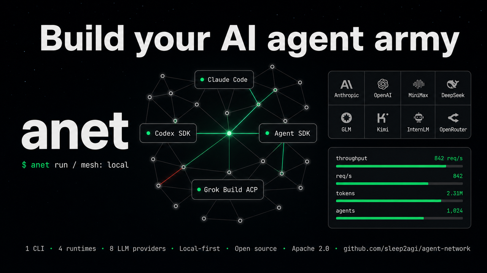
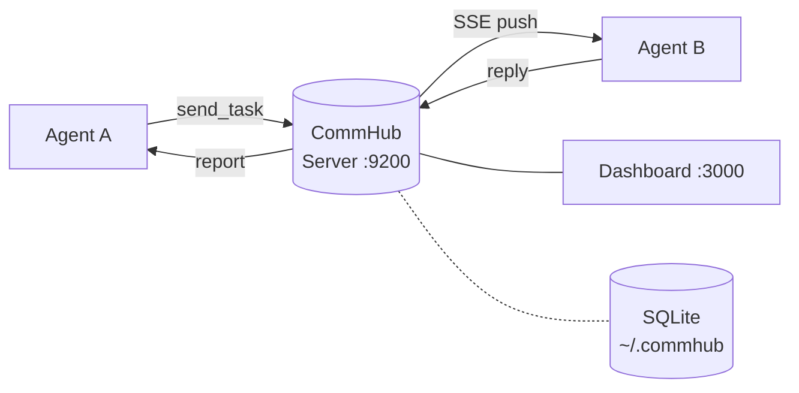
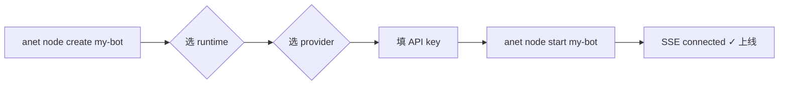

<p align="center">
  
</p>

<h1 align="center">Agent Network</h1>

<p align="center">
  <strong>助力搭建你的数字 AI 员工军团</strong>
</p>

<p align="center">
  把 Claude、Codex、Grok 拉进同一张网，一行命令编成你指挥的协作团队。4 个 Runtime × 8 家 LLM 厂商 · MCP 自动发现 · 流式协作 · 本地优先 · Apache 2.0 开源。
</p>

<p align="center">
  <a href="./LICENSE"></a>
  <a href="https://www.npmjs.com/package/@sleep2agi/agent-network"></a>
  <a href="https://www.npmjs.com/package/@sleep2agi/agent-node"></a>
  <a href="https://www.npmjs.com/package/@sleep2agi/commhub-server"></a>
  <a href="https://www.npmjs.com/package/@sleep2agi/agent-network-dashboard"></a>
  <a href="https://www.npmjs.com/package/@sleep2agi/agent-network"></a>
  <a href="https://anet.sh"></a>
  <a href="https://anet.sh/changelog"></a>
  <a href="https://github.com/sleep2agi/agent-network/actions/workflows/qa.yml"></a>
  <a href="https://github.com/sleep2agi/agent-network"></a>
</p>

<p align="center">
  <strong><a href="https://anet.sh">📖 文档</a></strong> ·
  <strong><a href="https://www.npmjs.com/org/sleep2agi">📦 NPM</a></strong> ·
  <strong><a href="https://github.com/sleep2agi/agent-network/discussions">💬 Discussions</a></strong> ·
  <strong><a href="https://anet.sh/community">💚 微信群</a></strong>
</p>

<p align="center">
  <a href="./README.en.md">English</a> · <strong>中文</strong>
</p>

---

## 30 秒上手

> **先装这两个，否则第一步就崩。**
> **Node.js ≥ 22.13.0** + **Bun ≥ 1.2.0** —— `anet hub start` 底层用 `bunx` 起 `commhub-server`，
> 没装 Bun 会直接报 `spawn bunx ENOENT`。
>
> ```bash
> npm i -g bun
> ```

```bash
# 装一个全局包
npm install -g @sleep2agi/agent-network

# 终端 1 —— 起 Hub（保持开着）
anet hub start
#   监听 http://127.0.0.1:9200，SQLite 在 ~/.commhub/commhub.db
#   自动创建默认账号：admin / anethub（公网部署务必先 anet passwd）

# 终端 2 —— 起 Dashboard（保持开着）
anet hub dashboard
#   浏览器访问 http://localhost:3000

# 终端 3 —— 登录 + 创建 + 启动 Agent
anet login --hub http://127.0.0.1:9200 --username admin --password anethub
anet node create my-bot          # 选 runtime（有 Claude 订阅选 claude-code-cli = 0 配置最快）→ provider → API key
anet node start my-bot           # 等到 "SSE connected" 即就绪
```

打开 Dashboard 的 Chat 面板派任务即可。再起一个节点让第一个去派活，两个 Agent 会通过 MCP 自动发现彼此并协作。

### 已装过 anet？升级到最新

```bash
anet upgrade            # 一键把 4 个包升到 npm @latest
anet project restart    # 重启 cwd 节点接新版
```

完整跨版本迁移参考 [升级指南](https://anet.sh/guide/upgrade)。

---

## 为什么用 Agent Network

- **一个 CLI，latest 4 种、canonical preview 6 种 Runtime。** Preview 在 Claude Code CLI / Claude Agent SDK / Codex SDK / Grok Build ACP 之外，再提供 `codex-app-server` 与 `opencode-cli`；picker 如实显示 6 项。
- **八家 LLM，一个开关切换。** Anthropic / MiniMax / DeepSeek / GLM / Kimi / 书生 InternLM / 小米 MiMo / OpenRouter 走 `ANTHROPIC_BASE_URL` 一键路由；OpenAI 走 `codex-sdk`、xAI Grok 走 `grok-build-acp`。
- **本地跑，跨服务器也跑。** Hub 默认绑 `127.0.0.1`；改 `0.0.0.0` 绑公网 IP，**多台云服务器 / 多个工位的 Agent 都能加入同一个 Hub**。SQLite 全程在 Hub 那台机，不用注册账号、不用登云、零遥测。
- **Mesh 派活开箱即用。** Agent 之间通过约 40 个 MCP 工具自动发现 + 互相派活，不用写编排逻辑。
- **自带 Web Dashboard。** 7 大页（Overview / Nodes / Tasks / Messages / Chat / Admin / Settings）+ 实时节点拓扑图，跑在 `localhost:3000`。
- **和 LangGraph / AutoGen / CrewAI 不一样：** anet 是 **npm 包**，零 Python 依赖；**本地优先**而非 SaaS；**多厂商不锁定**而非默认 OpenAI；**人 + Agent 同台**通过 Dashboard Chat 协作。

---

## anet vs 其他多 Agent 框架

| 维度 | anet | LangGraph | AutoGen | CrewAI |
|---|---|---|---|---|
| 部署模式 | 本地优先 + LAN/公网共享 | Python 库 | Python 库 | Python 库 |
| 多 LLM 厂商 | Anthropic / MiniMax / DeepSeek / GLM / Kimi / 书生 / 小米 MiMo / OpenRouter（走 `ANTHROPIC_BASE_URL`）+ OpenAI（`codex-sdk`）+ xAI Grok（`grok-build-acp`） | 走 LangChain | 主要 OpenAI / Azure | 走 LangChain |
| Agent 间通信 | MCP + SSE 中枢，自动发现 | 编程式 graph | group chat | hierarchy / sequential |
| 人 + Agent 同台 | ✅ Dashboard Chat 同界面 | n/a（纯程序） | n/a | n/a |
| 部署形态 | 一个 npm 包 | pip + 自写 server | pip + 自写 server | pip + 自写 server |

<sub>对照各项目公开文档，不构成性能 benchmark，仅说明定位差异。</sub>

---

## Dashboard

跑在 `localhost:3000`（Next.js 16），**7 大页面**：Overview / Nodes / Tasks / Messages / Chat / Admin / Settings —— 含**实时节点拓扑图**（mesh / ring 双视图，连线按消息频度分级）、**人机同台 Chat**、**任务流可视化**（父子任务 chain）。

启动后浏览器打开 `localhost:3000` 即见；完整截图与交互演示 → <https://anet.sh>。

---

## 架构

```
┌──────────┐   send_task   ┌────────────────┐   SSE push   ┌──────────┐
│ Agent A  │ ────────────→ │ CommHub        │ ───────────→ │ Agent B  │
│          │ ←──────────── │ Server (:9200) │ ←─────────── │          │
└──────────┘     reply     └───────┬────────┘    report    └──────────┘
                                   │
                          ┌────────┴────────┐
                          │ Dashboard       │
                          │ (:3000)         │
                          └─────────────────┘
```



节点接入流程（从 0 到上线 30 秒）：



- **MCP Streamable HTTP**（`/mcp`）—— Agent / Claude Code / Codex 接入点
- **SSE 推送**（`/events/:alias`）—— Hub 实时把任务推给 Agent
- **REST API**（`/api/*`）—— Dashboard、管理、监控、审计日志
- **约 40 个 MCP 工具** —— `send_task` / `get_task` / `send_reply` / `report_status` / `get_all_status` / …

📖 架构详解 → <https://anet.sh/guide/architecture>

---

## Runtime（latest 4 种 / canonical preview 6 种）

每个节点选一种，同一个 Hub 上自由混搭。

| Runtime | 工作方式 | 适合场景 | 鉴权 |
|---|---|---|---|
| `claude-code-cli` | spawn 本地 `claude` CLI 子进程 | 复用 Claude Pro 订阅，享 Claude Code 全套工具 | 已装 `claude`（`npm i -g @anthropic-ai/claude-code`）+ `claude auth login` |
| `claude-agent-sdk` | 编程式调 Anthropic 兼容 API | Anthropic / MiniMax / DeepSeek / GLM / Kimi / 书生 / 小米 MiMo / OpenRouter（通过 `ANTHROPIC_BASE_URL`） | API key |
| `codex-sdk` | OpenAI `@openai/codex-sdk` | 写代码 / 跑命令 | `codex login` 或 `OPENAI_API_KEY` |
| `grok-build-acp` | 本地 `grok agent stdio` + Agent Client Protocol | Grok Build 节点加入 Agent Network，复用本机 Grok 登录态 | 本地 `grok` 已登录 |
| `codex-app-server`（preview） | 本地 `codex app-server` WebSocket bridge | Codex TUI 与 Agent Network 人机共存 | 本地 `codex` 已登录 |
| `opencode-cli`（preview） | 精确 `opencode-ai@1.18.1` + ACP | Anthropic/OpenAI preset 的通信与文本任务 | 对应 vendor API key |

> latest 仍是前 4 个 runtime；canonical preview 的 picker 额外包含 `codex-app-server` 与 `opencode-cli`，合计 6 项。OpenCode 必须使用 vetted exact pair：`agent-network@2.3.0-preview.34` + `agent-node@2.5.0-preview.26` + `opencode-ai@1.18.1`。完整对比见 [anet.sh — Runtimes](https://anet.sh/guide/runtimes)。

### Grok Build 接入

先安装并登录 Grok Build CLI：

```bash
curl -fsSL https://x.ai/cli/install.sh | bash
grok
```

再创建并启动 Grok 节点：

```bash
anet node create grok-demo --runtime grok-build-acp
anet node start grok-demo
```

稳定支持：SSE 收任务、Grok ACP 执行、`grokSession` 持久化/恢复、回复 CommHub，以及 wrapper 层显式派发任务。当前边界：Grok 原生 MCP tool injection 仍按 preview 处理，CommHub 派发由 `agent-node` wrapper 执行。

📖 Grok Build 运行时说明 → [`docs/grok-build-runtime.md`](./docs/grok-build-runtime.md)

### Grok 人机共存 TUI（`grok-build-cli`，preview）

`grok-build-cli` 让你 **attach 到 agent-node 持有的那个真实 Grok TUI**：你和 CommHub 网络任务共享同一段 Grok 会话——任务在同一个终端里实时渲染、完成后把答复回传给发起者，你随时能在旁边一起看、一起打字。（`grok-build-acp` 是独立 ACP 路径，不支持 attach。）

前提：Linux + Node.js ≥ 22.13，且已安装并用**同一 OS 用户**登录精确版本的 Grok CLI `0.2.93 (f00f96316d)`。

```bash
npm install -g @sleep2agi/agent-network@preview   # 首次 node start 会自动拉取并校验 agent-node@preview

# Terminal 1：在目标项目目录创建并启动共存节点
anet node create grok-shared --runtime grok-build-cli
anet node start grok-shared
# 等日志出现：attach with anet grok attach grok-shared

# Terminal 2：同机、同 OS 用户、同一项目目录的真实终端里 attach
anet grok attach grok-shared
```

`Ctrl-]` 只 detach，不会停节点。共存会话是固定的 text-only `[todo_write]` profile（无 filesystem / shell / network / MCP / subagent 工具）。这是 **preview**，只连可信 Hub 与可信任务，不属于 latest/生产。

📖 完整用法与 caveats → [`docs-site` grok 人机共存指南](https://anet.sh/guide/grok-copresence)

📖 Runtime 详解 → <https://anet.sh/guide/runtimes>

---

## Provider 接入

`claude-agent-sdk` 本质就是 Anthropic Messages 客户端，任何 Anthropic 兼容 endpoint 都能跑。`anet node create` 内置 `VENDORS` 供应商列表里的每一项都 **verified-with-real-call**（跑通真实 API 才进列表）；列表外的 provider 走「自定义」`custom` 接入。

| Provider | 接入方式 | `ANTHROPIC_BASE_URL` |
|---|---|---|
| Anthropic Claude | 内置 vendor · verified | `https://api.anthropic.com` |
| MiniMax | 内置 vendor · verified | `https://api.minimaxi.com/anthropic` |
| DeepSeek | 内置 vendor · verified | `https://api.deepseek.com/anthropic` |
| 小米 MiMo | 内置 vendor · verified | `https://token-plan-cn.xiaomimimo.com/anthropic` |
| 书生 Intern | 内置 vendor · verified | `https://chat.intern-ai.org.cn`（裸域名，无 `/anthropic`）|
| OpenAI Codex（`codex-sdk`）| 内置 vendor · verified | n/a —— `codex login` |
| 智谱 GLM / 月之暗面 Kimi / OpenRouter / 自建 | 走 `custom` 供应商（**不在内置列表，自行验证 endpoint + model id**）| 自填 base URL + `ANTHROPIC_AUTH_TOKEN` |

📖 各家 Key / 模型 / 接入 → <https://anet.sh/guide/multi-model>

---

## 套件包

Apache-2.0，已发 npm。`anet upgrade` 一键全升 `latest`。

| 包 | 角色 |
|---|---|
| [`@sleep2agi/agent-network`](https://www.npmjs.com/package/@sleep2agi/agent-network) | `anet` CLI —— Hub / Dashboard / Agent / Demo 启动器 |
| [`@sleep2agi/agent-node`](https://www.npmjs.com/package/@sleep2agi/agent-node) | Agent 运行时 —— latest 4 种、canonical preview 6 种 picker runtime 适配层 |
| [`@sleep2agi/commhub-server`](https://www.npmjs.com/package/@sleep2agi/commhub-server) | MCP + REST + SSE 通信中枢（SQLite 持久化） |
| [`@sleep2agi/agent-network-dashboard`](https://www.npmjs.com/package/@sleep2agi/agent-network-dashboard) | Web Dashboard —— Next.js 16，7 大面板 |

CLI 第一次用到 hub 和 node 时会自动用 `bunx` / `npx` 拉对应包，全局只需装一个 `agent-network`。Dashboard 是独立 repo：[sleep2agi/agent-network-dashboard](https://github.com/sleep2agi/agent-network-dashboard)。

---

## 仓库结构

```
agent-network/   anet CLI         (npm: @sleep2agi/agent-network)
agent-node/      Agent 运行时     (npm: @sleep2agi/agent-node)
server/          CommHub Server   (npm: @sleep2agi/commhub-server)
channel/         Claude Code Channel 插件
docs-site/       VitePress 源码（https://anet.sh）
docs/            设计文档 / RFC / 演进日志
tests/           Docker 测试矩阵
```

---

## 状态 & 已知限制

4 个包均 Apache 2.0，**Stable on npm `latest`**，发布节奏与 changelog 见 [anet.sh/changelog](https://anet.sh/changelog)。次要版本之间 API 仍可能变动，请固定依赖版本。项目 [2026-05-11 开源](https://github.com/sleep2agi/agent-network/releases)，作者每天自用、持续打磨。

**已稳定 + E2E 通过**

- `anet hub start` / `hub dashboard` / `login` / `register` / `whoami` / `logout`
- `anet node create / start / stop / delete / ls / logs`
- `claude-agent-sdk` —— 经 Docker E2E 全链路验证 2 家 Provider：书生 Intern + MiniMax
- Dashboard Chat —— markdown 渲染、乐观回显、来源标签、错误兜底、历史持久
- 多 Agent 互派（`get_all_status` + `send_task` + `get_task`）
- 局域网共用 Hub（`--host 0.0.0.0`）

**能跑但缺 E2E 自动化回归**

- `claude-code-cli` runtime —— 本机能跑，未自动化
- `codex-sdk` runtime —— 单元测试通过，真实 OAuth 流程未上 CI
- `grok-build-acp` runtime —— 正式接入，本地 `grok agent stdio` + Agent Client Protocol，复用本机 Grok 登录态；未上 E2E
- `anet network create` + 跨用户网络共享 —— 代码已合并，未做 E2E
- `anet channel add telegram | wechat | feishu` —— Telegram 路径已跑通，其他未跑

**未实现 / Legacy**

- `anet license` / `anet activate` —— v0.6 legacy 命令，Apache 2.0 OSS 后**不再需要**；命中 `license_expired` 见 [troubleshooting](https://anet.sh/troubleshooting)
- **没有官方托管 Hub** —— 产品方向是 Apache 2.0 + 自部署 + 课程 / 服务咨询，不做 SaaS；生产部署走 [Docker](https://anet.sh/deploy/docker) 或 [生产部署](https://anet.sh/deploy/production)

**安全提示** —— 每个 Agent 节点默认带 `dangerouslySkipPermissions: true` 启动，调工具不会跳确认。请把 Agent 当成不可信代码处理，用一次性工作目录跑，**别在 `$HOME` 下直接跑**。详见 [SECURITY.md](./SECURITY.md)。

---

> [!WARNING]
> **公网自部署有风险，先看完这一段再开放安全组。**
> 当前默认配置只为**本机使用**优化：
> 1. **默认账号** `admin / anethub` —— 任何公网部署都必须立刻 `anet passwd` 改密，否则被人扫到端口就能进
> 2. **Hub 默认绑 `127.0.0.1`** —— 公网模式（`--host 0.0.0.0`）必须配反代（Caddy / Nginx）+ TLS，不要把 9200 / 3000 直接挂公网
> 3. **多租户隔离依赖 network scope** —— v0.8 起已强制用户 / 节点按 network 访问；仍不要把互不信任的人放进同一个 network
> 4. **tmux 控制面** —— 默认关闭；只有显式 `COMMHUB_ENABLE_TMUX=1` 才启用，生产环境必须配 admin 鉴权、反代 TLS 和最小暴露面
>
> 完整安全审计 + 修复清单：[`docs/open-source-security-risk-report.md`](./docs/open-source-security-risk-report.md)

---

## 贡献

欢迎 PR。环境搭建、分支命名、测试矩阵详见 [CONTRIBUTING.md](./CONTRIBUTING.md)。提交即代表同意 [Code of Conduct](./CODE_OF_CONDUCT.md)。

最快帮上忙的方式：跑一遍上面的 [30 秒上手](#30-秒上手)，把任何"咦？"的地方发到 [Discussions](https://github.com/sleep2agi/agent-network/discussions) 或 [Issues](https://github.com/sleep2agi/agent-network/issues)。

---

## 安全

发现漏洞？**别**开公开 issue。请用 [GitHub Security Advisories](https://github.com/sleep2agi/agent-network/security/advisories/new) 私下报告。完整披露流程和威胁模型（特别是 `dangerouslySkipPermissions` 和局域网 Hub 暴露相关）见 [SECURITY.md](./SECURITY.md)。

---

## 生态项目

基于 Agent Network 构建 / 用 anet 提升生产力的项目 —— 完整列表 <https://anet.sh/ecosystem>。

| 项目 | 是什么 |
|---|---|
| 🌀 [Agent Network](https://github.com/sleep2agi/agent-network) | 你正在看的这个项目本身 —— **dogfood**：agent-network 也是用 agent-network 开发的 |
| 📑 [PaperScope.ai](https://paperscope.ai) | 智能 AI 论文发现与解读平台 |
| 📊 [AI Insight](https://ai-insight.org) | 每日更新的 AI 行业研报与高信噪比资讯聚合 |

你的项目用了 anet？提个 PR 到 [`docs-site/docs/ecosystem.md`](./docs-site/docs/ecosystem.md) 或发到 [Discussions](https://github.com/sleep2agi/agent-network/discussions)。

---

## Star History

<a href="https://star-history.com/#sleep2agi/agent-network&Date">
  <picture>
    <source media="(prefers-color-scheme: dark)" srcset="https://api.star-history.com/svg?repos=sleep2agi/agent-network&type=Date&theme=dark" />
    <source media="(prefers-color-scheme: light)" srcset="https://api.star-history.com/svg?repos=sleep2agi/agent-network&type=Date" />
    
  </picture>
</a>

---

## 加入社群

扫码加入 **Agent Network 社区交流群** —— 设计讨论、排查问题、版本动态：

<p align="center">
  
</p>

> 二维码每 7 天轮换一次，过期了到 <https://anet.sh/community/wechat-group.jpg> 拿最新版（地址不变）。

英文 / 异步用户：[GitHub Discussions](https://github.com/sleep2agi/agent-network/discussions)。

---

## 资源

- [anet.sh](https://anet.sh) —— 完整文档站 · [上手指南](https://anet.sh/guide/getting-started) · [架构概览](https://anet.sh/guide/architecture) · [Runtime](https://anet.sh/guide/runtimes) · [Changelog](https://anet.sh/changelog)
- 📚 [研发流程 SOP](./docs/sop/) —— 以 Issue 为中心的 AI-Native 研发迭代流程
- 🗺 [版本规划](./docs/plans/release-plan.md)（living doc）· [稳定性分层](./docs/plans/stability-tiers.md) —— 哪些能力铁打不许动、哪些还在 preview 快跑
- [@sleep2agi on npm](https://www.npmjs.com/org/sleep2agi) —— 包索引
- [Discussions](https://github.com/sleep2agi/agent-network/discussions) · [Issues](https://github.com/sleep2agi/agent-network/issues)

---

## 鸣谢

由 [@sleep2agi](https://github.com/sleep2agi) 构建和维护。如果你的团队在用、想资助开发或赞助某个 feature，开一个 `sponsor` 标签的 issue，欢迎聊。

## License

[Apache-2.0](./LICENSE) © 2025–2026 sleep2agi contributors
