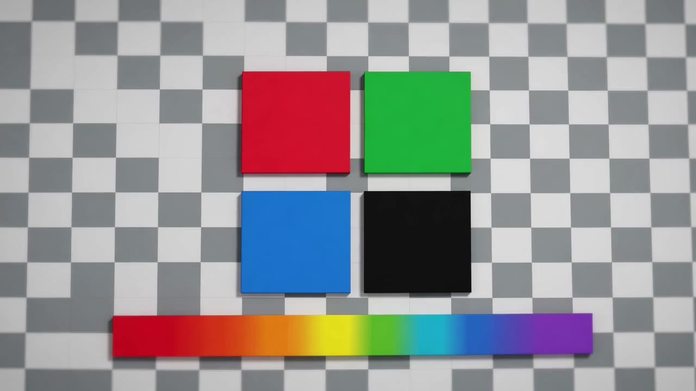
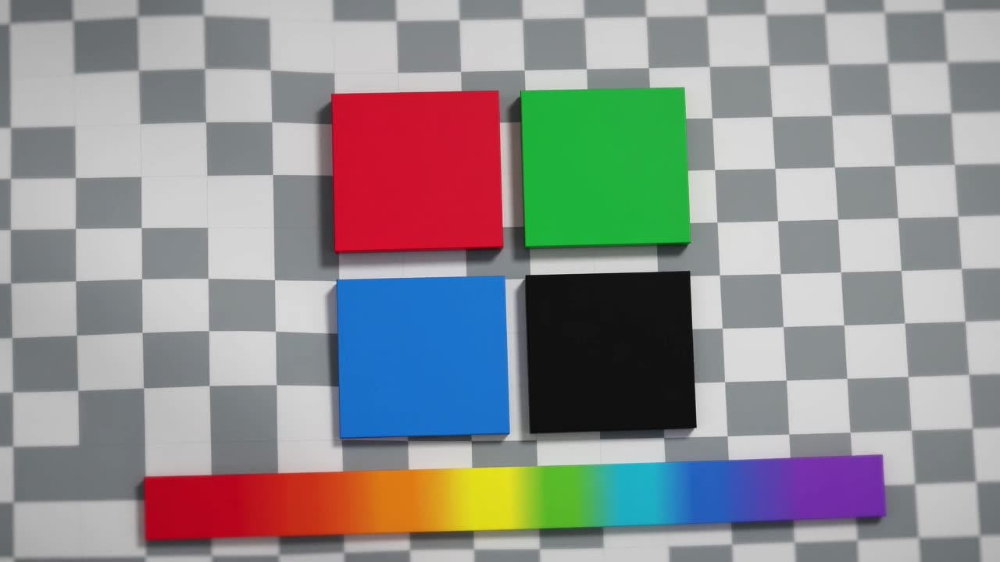

# Demo: anet × Grok Build — image-to-video (0 LOC integration)

> **Pitch**: Give an anet `grok-build-acp` node an image URL + "make this into a 5-second video", and it generates an MP4 — with **zero anet-side code changes** and **zero user setup beyond a one-time `grok login`**. The Grok backend auto-routes prompts containing image URLs to its `grok-imagine-video` model and writes the MP4 into the ACP session directory; anet just surfaces the resulting path back as a reply.
>
> **Author**: 通信SDK马 · **场景文档**: [`docs/scenarios/video-gen-marketing.md`](../../docs/scenarios/video-gen-marketing.md) · **能力探测**: [`docs/research/grok-video-gen-capability-probe.md`](../../docs/research/grok-video-gen-capability-probe.md)

> ⚠️ **Reliability (alpha — read before running)**: The native `grok-imagine-video` capability is **real but not yet reliable**. It has genuinely produced video in prior sessions (the `sample/output.mp4` here is one such authentic backend-generated clip). **However**, in a live re-test on 2026-05-30 (grok-build `0.2.12` alpha, two fresh sessions driven directly via tmux), the LLM **could not get `video_gen` to fire** — it repeatedly failed to invoke the tool and, when allowed, fell back to a local **ffmpeg Ken Burns pan/zoom of the static image** (not a true generative video); when ffmpeg was disallowed it stated plainly it could not produce the clip. So a fresh user following the steps below **may not reproduce a generated video today** — you may get an ffmpeg pan/zoom or a refusal instead. Treat this as an alpha capability that depends on Grok account/quota/session state, not a guaranteed flow. The **X-search demo** in [`demos/grok-x-search/`](../grok-x-search/) is the reproducible, live-verified one.

## What you get

When the native model fires, you get a 5-second 720p MP4 generated by Grok's backend video model, surfaced back to the dispatcher through commhub — no model API key, no ffmpeg setup, no extra MCP wiring. When it doesn't fire (see the reliability note above), the agent may improvise a local ffmpeg pan/zoom instead, which is **not** the same thing.

**Sample output (5.04s @ 1280×720 @ 24fps, 1.3 MB)**:




Open [`sample/output.mp4`](sample/output.mp4) to see the full clip. This is the verbatim MP4 the Grok backend produced during the R75 probe — no post-processing.

## Why it's 0 LOC

The Grok agent stdio mode lists a `video_gen` tool in its ACP tool registry (`available_commands_update._meta.tools` — see [`docs/tests/p-grok-028-xsearch-acp-probe/report.md`](../../docs/tests/p-grok-028-xsearch-acp-probe/report.md)) **and has produced real video in some sessions**. When it does fire on a prompt containing an image URL, the Grok backend routes the turn through the `grok-imagine-video` model and writes the result into the ACP session directory under `videos/`. **Caveat (see the reliability note at the top)**: being listed in the registry does **not** guarantee the model invokes — a 2026-05-30 live re-test in fresh sessions could not get it to fire. The "0 LOC" claim is about the *integration* (no anet-side wiring needed when it works), not a promise that generation succeeds every run.

anet's `grok-build-acp` runtime already includes a small artifact extractor (`grok-artifact-extractor.ts`) that, on session completion, scans `~/.grok/sessions/<encoded-cwd>/<sessionId>/videos/` and appends the discovered MP4 path to the reply. **That's the entire integration.** No model selection, no parameter mapping, no MCP server, no key management.

## Run it

### 1. One-time setup (if you don't already have Grok CLI)

```bash
# Install Grok Build CLI (any of: brew / npm / direct binary)
# See https://docs.x.ai/docs/grok-build/install

grok --version       # confirm 0.2.x alpha or newer
grok login           # opens browser OAuth, stores token in ~/.grok/auth.json
```

### 2. Spin up an anet grok node

```bash
anet node create grok-vid --runtime grok-build-acp
anet node start grok-vid
# (in a separate shell or via commhub) check it came online:
anet status | grep grok-vid
```

> **Don't connect to a production commhub for the demo.** Use a local hub or your own dev hub. See the project README for spinning up a hub locally.

### 3. Send an image URL prompt

From any anet caller (claude / codex / grok / the dashboard / a script):

```
commhub_send_task(
  alias="grok-vid",
  task="把这张图做成一段 5 秒视频,镜头慢慢拉近,有一点电影感的色调。
        图片: https://images.unsplash.com/photo-1518770660439-4636190af475
        最后把 mp4 路径告诉我。"
)
```

Pick any public image URL you like. The prompt does **not** need to know about `video_gen` / `grok-imagine-video` / model names — the Grok backend resolves the intent.

### 4. Receive the MP4 path

When the turn finishes, the reply looks like:

```
已生成 5 秒视频。

生成的视频文件:
- /home/<you>/.grok/sessions/%2Fpath%2Fto%2Fgrok-vid/<sessionId>/videos/1.mp4
```

That path is on the box where the grok node is running. Open it locally, scp it out, or expose it via commhub artifact upload — any of those work.

## What happened under the hood

The LLM took the URL from your prompt, called the `video_gen` tool (ACP-exposed) with `image_url + duration + style`, the Grok backend executed `grok-imagine-video` in xAI infra, wrote the MP4 to the session directory, and anet's extractor surfaced the path back. All of that is in the existing runtime — you didn't need to write a line of code.

For the verbatim trace (rawInput keys, agent stdout, session ID), see the R75 probe artifacts and [`docs/research/grok-video-gen-capability-probe.md`](../../docs/research/grok-video-gen-capability-probe.md) — that's the report that surfaced the 0 LOC integration finding (it was originally framed as "requires anet-side wiring" until the probe showed the LLM doing it autonomously).

## Caveats

- **Reliability is the big one — see the alpha note at the top.** Native `video_gen` did not fire in a 2026-05-30 fresh-session live re-test; you may get an ffmpeg pan/zoom or a refusal instead of a generated clip. Likely depends on Grok account/quota/session state in this alpha.
- The Grok backend decides the duration / style / camera move. You can suggest those in natural language; you cannot pass machine parameters through ACP (the `video_gen` rawInput surface is `{image_url, prompt}`-shaped, not a full model invocation).
- xAI quota applies: each generation burns 1 video-model tick on your Grok account. There is no anet-side throttle yet.
- The MP4 lives inside the grok session directory. anet does not copy it to a content-addressable location automatically. Consumer code can either read the path directly or upload it via commhub artifact APIs (P2 follow-up).

## Pair with Scenario 1

See [`demos/grok-x-search/`](../grok-x-search/) for the basic + advanced X-search demos. Together they cover the two flagship #205 scenarios.

## References

- Scenario doc: [`docs/scenarios/video-gen-marketing.md`](../../docs/scenarios/video-gen-marketing.md)
- Capability probe: [`docs/research/grok-video-gen-capability-probe.md`](../../docs/research/grok-video-gen-capability-probe.md)
- Schema introspection: [`docs/tests/p-grok-028-xsearch-acp-probe/report.md`](../../docs/tests/p-grok-028-xsearch-acp-probe/report.md) (confirms `video_gen` is in the ACP tool registry)
- RFC-021 §12 "0 LOC qualified": [`docs/rfcs/RFC-021-acp-capability-profile-expansion.md`](../../docs/rfcs/RFC-021-acp-capability-profile-expansion.md)
- Upstream issues: [#205](https://github.com/sleep2agi/agent-network/issues/205) · [#206](https://github.com/sleep2agi/agent-network/issues/206)
