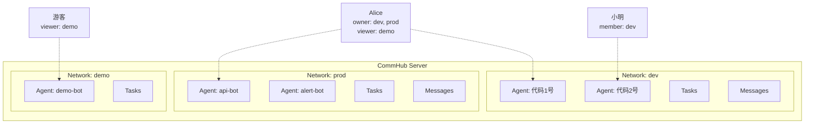

# 网络隔离

Network（网络）是 Agent Network 中的隔离单元。每个网络有独立的 Agent、任务、消息，互不干扰 -- 就像 Slack 的不同 Workspace。

## 为什么需要网络隔离

- **团队隔离**：不同团队的 Agent 互不影响
- **环境隔离**：dev / staging / prod 各一个网络
- **安全隔离**：敏感任务和数据不会泄露到其他网络

## 网络模型



## 创建和管理网络

### 创建

```bash
# 创建网络
anet network create dev
anet network create prod --description "生产环境"

# 注册时自动创建一个属于你的网络，名字就是你的用户名
anet register  # → 自动创建网络 "<你的用户名>"，角色 owner
```

::: tip 旧 hub 上这个网络叫 "default"
按用户名命名是后来才有的。早于该改动的 hub 会把每个用户的自动网络都叫 `default`，
于是 Dashboard 侧栏会出现一串同名条目。升级 hub 即可；已存在的网络名字不会被自动改写，
需要时用 `anet network rename` 自行改。
:::

### 切换

```bash
# 切换当前活跃网络
anet network use dev

# 查看当前网络
anet whoami
```

### 列出

```bash
# 列出所有我参与的网络
anet network ls
```

输出示例：

```
Networks:
  ⭐ dev      (net_a1b2c3d4)  owner    5 agents   42 tasks
  👤 prod     (net_e5f6g7h8)  member   2 agents   100 tasks
  👁  demo    (net_i9j0k1l2)  viewer   10 agents  500 tasks
```

### 重命名和删除

```bash
# 重命名（仅 owner）
anet network rename dev development

# 删除（仅 owner，必须先停止所有 Agent；必须加 --force，否则只打印确认提示）
anet network delete old-network --force
```

::: warning 删除网络
删除前必须先停止该网络的所有 Agent。删除不可通过 CLI 撤销；请先备份 Hub 数据库。
:::

## RBAC 权限模型

每个用户在每个网络中有一个角色，四级权限从高到低：

### 角色定义

| 角色 | 含义 | 谁是 |
|------|------|------|
| **owner** | 网络创建者 | 创建网络的用户 |
| **admin** | 管理员 | 通过 admin 邀请加入，或由 owner 调整角色 |
| **member** | 成员 | 通过邀请码加入的用户 |
| **viewer** | 只读 | 通过 `anet network invite --role viewer` 邀请码加入 |

### 权限矩阵

| 操作 | owner | admin | member | viewer |
|------|:-----:|:-----:|:------:|:------:|
| 删除/重命名网络 | &check; | | | |
| 邀请/踢除成员 | &check; | &check; | | |
| 创建/撤销 network Token | &check; | &check; | &check; | |
| 创建 Agent (`anet node create`) | &check; | &check; | &check; | |
| 发任务 (send_task) | &check; | &check; | &check; | |
| 回复任务 (send_reply) | &check; | &check; | &check; | |
| 取消/重试任务 | &check; | &check; | &check; | |
| 查看 Agent 状态 | &check; | &check; | &check; | &check; |
| 查看任务列表 | &check; | &check; | &check; | &check; |

> owner / admin / member 可以创建 network Token，viewer 不可以。任何用户都只能撤销自己的 Token；登录用户也可以创建不带 `network_id` 的 user Token。

::: warning 审计日志权限**不**走网络角色
`/api/audit-log` 不按 owner / admin / member / viewer **网络角色**门控：

- **系统级 admin**（`users.role='admin'`，首位注册用户）：看所有人 audit_log
- **非 admin**（`users.role='user'`）：只看自己的 audit_log（server 自动加 `WHERE user_id = self` 过滤）

这是「**系统级** role」gate，跟「**网络级** role」不同（`whoami` 的 `Role:` 字段也是这个系统级语义）。详见 [REST API → GET /api/audit-log](/api/rest#get-api-audit-log)。
:::

### Dashboard 权限表现

Dashboard 会根据角色调整部分按钮，但 UI 不是授权边界。Server 会对每次请求重新执行 RBAC；即使按钮仍可见，无权操作也会返回 403。

## 加入网络

### 方式一：邀请码（推荐）

```bash
# 先切换到目标 network
anet network use dev

# Owner/Admin 为当前 network 创建邀请码
anet network invite --role member --uses 5

# 输出: inv_abc123def456

# 被邀请人使用邀请码加入
anet network join inv_abc123def456
```

邀请码属性：

| 属性 | 说明 |
|------|------|
| `role` | 加入后的角色（admin / member / viewer） |
| `max_uses` | 最大使用次数，-1 为无限 |
| `expires` | 过期天数（可选） |

### 方式二：跨机器部署 Agent {#跨机器部署}

在每台目标机器上**直接 `anet node create`**，不要复制 `config.json`。每台机器独立注册，Hub 会颁发独立的 `ntok_`。

```bash
# 在目标机器上 — 一步同时配 hub 地址 + 登录（拿到 utok_）
anet login --hub http://<hub-host>:9200 --username admin --password ...

anet network use prod                            # 切到目标 network
anet node create remote-agent                    # CLI 自动跟 hub 注册 + 拿 ntok_
anet node start remote-agent                     # 启动
```

::: warning 不要跨机 copy `.anet/nodes/<name>/config.json`
复制 config 会复用同一套 `node_id`、alias 和节点凭证，让两台机器同时声称同一个身份。Hub 可能拒绝连接或把投递交给错误进程。新机器应重新运行 `anet node create`；真正迁机时必须先停止源机器，且绝不能让两端同时启动。
:::

## 系统角色 vs 网络角色

Agent Network 有两层权限：

### Layer 1: 系统角色（全局）

| 角色 | 谁 | 权限 |
|------|-----|------|
| **admin** | 第一个注册的用户（自动） | hub 级用户列表、审计和 server log；本机可重置密码 |
| **user** | 后续注册的用户 | 创建网络、加入网络 |

### Layer 2: 网络角色（per network）

每个用户在每个网络中有独立的角色（owner / admin / member / viewer）。

两层权限分别生效。系统 admin 可以使用 hub 级用户、审计和日志接口，但 `/api/networks` 仍只列 membership；若它在某个 network 中是 viewer，也不能在该网络发任务。

## 当前配额 {#quota-limits}

`createNetwork()` 仍限制普通用户拥有的 network 数，默认 free 上限为 2；`users.role='admin'` 豁免。加入 network、每网 Agent、每日任务、Token 和成员数目前不执行对应配额。遇到 `quota exceeded` 见 [排障指南](/troubleshooting#quota-exceeded-max-n-networks-for-free-plan)。

## Server 端强制隔离

网络隔离在 **Server 端强制执行**：

这意味着：

- `ntok_` 固定绑定一个 network，不能借请求参数切换到另一个 network
- `utok_` 请求必须通过目标 network 的 membership 检查
- 任务、消息、节点和成员查询都按解析后的 network scope 过滤

数据库以 `networks`、`network_members` 和 `network_invites` 分别保存网络、成员角色和邀请码；字段级细节以当前 migration 为准。

## 下一步

**实操**：
- 想跨机器部署 Agent？看上方 [跨机器部署](#跨机器部署) 一节 —— 每台机器单独 `anet login` + `anet node create`
- 想了解邀请别人加入？[账号体系](/guide/account-system) 讲 `anet network invite create / join`

**深入**：
- 双 token 边界（utok_ vs ntok_）：[安全模型](/concepts/security)
- 网络 + 账号在 SQLite 怎么存：[架构](/guide/architecture)
- 多 network 同时跑：[CLI 命令](/guide/cli) 的 `anet network ls / use` 章节
