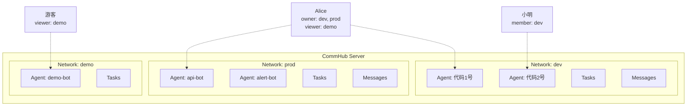

# 网络隔离

Network（网络）是 Agent Network 中的隔离单元。每个网络有独立的 Agent、任务、消息，互不干扰 -- 就像 Slack 的不同 Workspace。

## 为什么需要网络隔离

- **团队隔离**：不同团队的 Agent 互不影响
- **环境隔离**：dev / staging / prod 各一个网络
- **安全隔离**：敏感任务和数据不会泄露到其他网络

## 网络模型



## 创建和管理网络

### 创建

```bash
# 创建网络
anet network create dev
anet network create prod --description "生产环境"

# 注册时自动创建 default 网络
anet register  # → 自动创建 default 网络，角色 owner
```

### 切换

```bash
# 切换当前活跃网络
anet network use dev

# 查看当前网络
anet whoami
```

### 列出

```bash
# 列出所有我参与的网络
anet network ls
```

输出示例：

```
Networks:
  ⭐ dev      (net_a1b2c3d4)  owner    5 agents   42 tasks
  👤 prod     (net_e5f6g7h8)  member   2 agents   100 tasks
  👁  demo    (net_i9j0k1l2)  viewer   10 agents  500 tasks
```

### 重命名和删除

```bash
# 重命名（仅 owner）
anet network rename dev development

# 删除（仅 owner，必须先停止所有 Agent；必须加 --force，否则只打印确认提示）
anet network delete old-network --force
```

::: warning 删除网络
删除网络前必须先停止所有 Agent。网络删除后，所有关联的任务和消息数据将丢失。
:::

## RBAC 权限模型

每个用户在每个网络中有一个角色，四级权限从高到低：

### 角色定义

| 角色 | 含义 | 谁是 |
|------|------|------|
| **owner** | 网络创建者 | 创建网络的用户 |
| **admin** | 管理员 | 被 owner 提升的用户 |
| **member** | 成员 | 通过邀请码加入的用户 |
| **viewer** | 只读 | 通过 `anet network invite --role viewer` 邀请码加入；公开网络自动加入是设计目标（[方式三](#方式三-公开网络) 未实装） |

### 权限矩阵

| 操作 | owner | admin | member | viewer |
|------|:-----:|:-----:|:------:|:------:|
| 删除/重命名网络 | &check; | | | |
| 邀请/踢除成员 | &check; | &check; | | |
| 创建/撤销 network Token | &check; | &check; | &check; | |
| 启动 Agent Node | &check; | &check; | &check; | |
| 发任务 (send_task) | &check; | &check; | &check; | |
| 回复任务 (send_reply) | &check; | &check; | &check; | |
| 取消/重试任务 | &check; | &check; | &check; | |
| 查看 Agent 状态 | &check; | &check; | &check; | &check; |
| 查看任务列表 | &check; | &check; | &check; | &check; |

> 「创建/撤销 network Token」原本标 member ❌，实际 [`auth.ts:236-242 createToken`](https://github.com/sleep2agi/agent-network/blob/main/server/src/auth.ts#L236) 只挡 **viewer**（`viewer cannot create full-access network tokens`），owner / admin / member 都能建。撤销 Token 走 [`auth.ts revokeToken`](https://github.com/sleep2agi/agent-network/blob/main/server/src/auth.ts) `WHERE token_id = ? AND user_id = ?` —— 任何用户都能撤销**自己的** token，也不按网络角色门控。不带 `network_id` 的纯 user token（`utok_`）任何登录用户都能创建。

::: warning 审计日志权限**不**走网络角色
旧 doc 在这里列「查看审计日志」一行 —— 实际 `/api/audit-log` 不按 owner / admin / member / viewer **网络角色**门控（verify [`server/src/index.ts:1086-1089`](https://github.com/sleep2agi/agent-network/blob/main/server/src/index.ts#L1086)）：

- **系统级 admin**（`users.role='admin'`，首位注册用户）：看所有人 audit_log
- **非 admin**（`users.role='user'`）：只看自己的 audit_log（server 自动加 `WHERE user_id = self` 过滤）

这是「**系统级** role」gate，跟「**网络级** role」不同（`whoami` 的 `Role:` 字段也是这个系统级语义）。详见 [REST API → GET /api/audit-log](/api/rest#get-api-audit-log)。
:::

### Dashboard 权限表现

Dashboard 根据角色调整按钮可见性 / 可点击性（设计目标）：

- **viewer** 看不到"发任务"、"广播"按钮
- **member** 看不到"管理成员"、"设置"按钮
- **admin** 看不到"删除网络"按钮

::: info Dashboard `0.5.6` 实际行为（v0.10.10 stable）
角色 → 按钮可见性的 UI 联动**部分实装**。即使按钮当前还显示，**Server 端会 403 拒绝**（`canWrite()` 强制 RBAC），权限本身不会绕过。完整 UI 按钮 hiding **v0.9.x + v0.10.0-8 scope 都未动**（v0.9.x Recovery & Observability、v0.10.0 Direct Runtime + Observability Foundations、v0.10.1 PINNED hotfix、v0.10.2 Hero A disk + Hero D 拓扑前缀 Option C + disk render、v0.10.3 codex preset、v0.10.4 dashboard orphan-band + `anet upgrade` UX 警告、v0.10.5 batch wizard workdir + codex/claude skip API key、v0.10.6 `anet upgrade` Option B detached + wizard silent-exit、v0.10.7 codex-sdk batch yolo parity、v0.10.8 Servers UI 文案修 —— 主题都不在 RBAC UI），排到 v0.11+ Dashboard 改造里再补。
:::

## 加入网络

### 方式一：邀请码（推荐）

```bash
# 先切换到目标 network
anet network use dev

# Owner/Admin 为当前 network 创建邀请码
anet network invite --role member --uses 5

# 输出: inv_abc123def456

# 被邀请人使用邀请码加入
anet network join inv_abc123def456
```

邀请码属性：

| 属性 | 说明 |
|------|------|
| `role` | 加入后的角色（admin / member / viewer） |
| `max_uses` | 最大使用次数，-1 为无限 |
| `expires` | 过期天数（可选） |

### 方式二：跨机器部署 Agent {#跨机器部署}

**v0.8 推荐做法**：在每台目标机器上**直接 `anet node create`**，不要复制 `config.json`。每台机器的 node 是独立的注册，hub 自动颁发独立的 `ntok_`，互不冲突。

```bash
# 在目标机器上 — 一步同时配 hub 地址 + 登录（拿到 utok_）
anet login --hub http://<hub-host>:9200 --username admin --password ...

anet network use prod                            # 切到目标 network
anet node create remote-agent                    # CLI 自动跟 hub 注册 + 拿 ntok_
anet node start remote-agent                     # 启动
```

::: warning 不要跨机 copy `.anet/nodes/<name>/config.json`
config 里的 `node_id` 是 `anet node create` 时**本地随机生成**的稳定 ID（`generateNodeId()`，CommHub `resume_id` = `sdk-${node_id}`）。复制到另一台机器会让两台机器用同一个 `node_id` → 同一个 `resume_id`，hub 端 SSE 路由会乱（先到的连接接收 task，第二台机器收不到）。

如果一定要把 config 从 A 机器移到 B 机器（而不是新建），用 `anet node rename` 或在 B 上重新 `anet node create`。

> ⚠ `anet node rename` 的已知 gap（[#110](https://github.com/sleep2agi/agent-network/issues/110)）：节点必须**至少 `anet node start` 过一次**才能 rename（否则 commhub server 端没 sessions 行，`prepareRename` 失败）。复制 config 后第一步先 start 一次让 server 注册，再 rename。失败安全（PHASE 1 rollback 老节点完好）。
:::

### 方式三：公开网络

::: info 设计中
公开网络功能为设计目标，尚未完全实现。
:::

```bash
# (Planned, not yet implemented. Tracking: https://github.com/sleep2agi/agent-network/issues/new?title=network+visibility)
```

## 系统角色 vs 网络角色

Agent Network 有两层权限：

### Layer 1: 系统角色（全局）

| 角色 | 谁 | 权限 |
|------|-----|------|
| **admin** | 第一个注册的用户（自动） | 管理所有用户、全局统计 |
| **user** | 后续注册的用户 | 创建网络、加入网络 |

### Layer 2: 网络角色（per network）

每个用户在每个网络中有独立的角色（owner / admin / member / viewer）。

两层权限叠加。例如：系统 admin 可以看全局数据，但在某个网络中如果是 viewer，则不能在该网络中发任务。

## 配额限制（v0.6 设计目标 — v0.8 部分启用） {#quota-limits}

::: warning v0.6 配额体系多数已搁置
v0.6 时代设计过 Free / Pro / Admin 三档配额体系（下表），Apache 2.0 OSS 转向后**多数项已搁置**，但 **createNetwork 仍 enforces 一项**：

| 配额项 | v0.8 实际行为 |
|--------|---------------|
| **创建网络数** (`max_networks_owned`) | ✅ **仍 enforced** —— [`auth.ts:184-189 createNetwork`](https://github.com/sleep2agi/agent-network/blob/main/server/src/auth.ts#L184) 按 `users.plan || "free"` 查 `QUOTAS` 上限，free 默认 **2**，仅 `users.role='admin'` 豁免 |
| 加入网络数 | ❌ hub 没在 join path 调 quota check |
| 每网络 Agent 数 | ❌ |
| 每天任务数 | ❌ |
| Token 数 | ❌ |
| 网络最大成员 | ❌ `networks.max_members` 字段 dormant |

- `anet activate <key>` 是 v0.6 legacy 命令，OSS 后**不再用作"升级"路径**
- `users.role = 'admin'`（首位注册用户自动获得）才能突破 free 配额，详见 [troubleshooting → quota_exceeded 解决方案](/troubleshooting#quota-exceeded-max-n-networks-for-free-plan)

下表保留为自部署管理员**手动设置软配额**的设计参考（v0.9.x / v0.10.0-8 都未实现 —— v0.9.x Recovery & Observability、v0.10.0 Direct Runtime + Observability Foundations、v0.10.1 PINNED hotfix、v0.10.2 Hero A disk + Hero D 拓扑前缀、v0.10.3 codex preset、v0.10.4 dashboard orphan-band + `anet upgrade` UX、v0.10.5 batch wizard workdir + codex/claude skip API key、v0.10.6 `anet upgrade` Option B detached + wizard silent-exit、v0.10.7 codex-sdk batch yolo parity、v0.10.8 Servers UI 文案修 scope 都不在 quota 管理；排到 v0.11+ / 未排期）。
:::

| 配额项 | Free（v0.6 设计） | Pro（v0.6 设计） | Admin |
|--------|:----------:|:---------:|:-----:|
| 创建网络数 | 2 | 10 | 无限 |
| 加入网络数 | 3 | 20 | 无限 |
| 每网络 Agent 数 | 5 | 50 | 无限 |
| 每天任务数 | 100 | 5000 | 无限 |
| Token 数 | 3 | 20 | 无限 |
| 网络最大成员 | 5 | 50 | 无限 |

OSS 自部署场景下，硬件 / 数据库性能上限才是实际配额（SQLite 单机 100+ agent 验证过，多于此请 issue 讨论扩展方案）。

## Server 端强制隔离

网络隔离在 **Server 端强制执行**，客户端无法绕过：

```typescript
// Server 端：从 Token 提取 network_id，不信任客户端传入的
const effectiveNetId = enforceNetworkId ?? clientNetId ?? null;

// 所有查询自动加 network_id 过滤
sql = addScope(sql, params, effectiveNetId);
// → WHERE ... AND network_id = ?
```

这意味着：

- ntok_ 绑定了 network A → 所有操作都限定在 network A
- 即使客户端传 `network_id=B`，Server 会忽略，强制用 A
- 不同网络的数据完全不可见

## 数据库表

网络相关的数据库表：

```sql
-- 网络表
CREATE TABLE networks (
  -- 基础 schema（db.ts:168-177）
  network_id   TEXT PRIMARY KEY,
  network_name TEXT NOT NULL,
  owner_id     TEXT NOT NULL,
  description  TEXT,
  settings     TEXT,                     -- network 级配置 JSON（预留字段）
  created_at   TEXT NOT NULL DEFAULT (datetime('now')),
  updated_at   TEXT NOT NULL DEFAULT (datetime('now')),
  UNIQUE(owner_id, network_name),         -- 同一 owner 下 network 名唯一
  -- V3.13 ALTER TABLE 迁移补的列（db.ts:299-301）
  visibility   TEXT DEFAULT 'private',  -- private/public (**字段存在, 当前不启用**, 见下方 [配额限制 section](#quota-limits))
  max_members  INTEGER DEFAULT 50        -- **字段存在, server 端不强制检查**: addNetworkMember + joinByInvite 都没有 max_members gate, 是 v0.6 配额体系的预留字段, 见 [配额限制 v0.6 设计目标 — v0.8 部分启用](#quota-limits)
);

-- 网络成员表
CREATE TABLE network_members (
  network_id  TEXT NOT NULL,
  user_id     TEXT NOT NULL,
  role        TEXT NOT NULL DEFAULT 'member',
  invited_by  TEXT,
  joined_at   TEXT NOT NULL DEFAULT (datetime('now')),
  PRIMARY KEY (network_id, user_id)
);

-- 邀请码表
CREATE TABLE network_invites (
  invite_code TEXT PRIMARY KEY,
  network_id  TEXT NOT NULL,
  role        TEXT NOT NULL DEFAULT 'member',
  created_by  TEXT NOT NULL,
  max_uses    INTEGER DEFAULT 1,
  used_count  INTEGER DEFAULT 0,
  expires_at  TEXT,
  created_at  TEXT NOT NULL DEFAULT (datetime('now'))
);
```

## 下一步

**实操**：
- 想跨机器部署 Agent？看上方 [跨机器部署](#跨机器部署) 一节 —— 每台机器单独 `anet login` + `anet node create`
- 想看实战 demo？[辩论赛](/cases/debate) 每次跑都创建独立 network（`debate-<suffix>`）做隔离
- 想了解邀请别人加入？[账号体系](/guide/account-system) 讲 `anet network invite create / join`

**深入**：
- 双 token 边界（utok_ vs ntok_）：[安全模型](/concepts/security)
- 网络 + 账号在 SQLite 怎么存：上方 schema + [架构](/guide/architecture)
- 多 network 同时跑：[CLI 命令](/guide/cli) 的 `anet network ls / use` 章节
