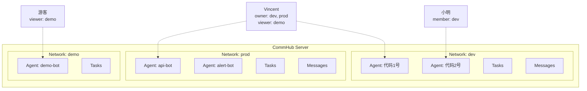

# 网络隔离

Network（网络）是 Agent Network 中的隔离单元。每个网络有独立的 Agent、任务、消息，互不干扰 -- 就像 Slack 的不同 Workspace。

## 为什么需要网络隔离

- **团队隔离**：不同团队的 Agent 互不影响
- **环境隔离**：dev / staging / prod 各一个网络
- **安全隔离**：敏感任务和数据不会泄露到其他网络
- **配额隔离**：每个网络独立计算任务数和 Agent 数

## 网络模型



## 创建和管理网络

### 创建

```bash
# 创建网络
anet network create dev
anet network create prod --description "生产环境"

# 注册时自动创建 default 网络
anet register  # → 自动创建 default 网络，角色 owner
```

### 切换

```bash
# 切换当前活跃网络
anet network use dev

# 查看当前网络
anet whoami
```

### 列出

```bash
# 列出所有我参与的网络
anet network ls
```

输出示例：

```
Networks:
  ⭐ dev      (net_a1b2c3d4)  owner    5 agents   42 tasks
  👤 prod     (net_e5f6g7h8)  member   2 agents   100 tasks
  👁  demo    (net_i9j0k1l2)  viewer   10 agents  500 tasks
```

### 重命名和删除

```bash
# 重命名（仅 owner）
anet network rename dev development

# 删除（仅 owner，必须先停止所有 Agent）
anet network delete old-network
```

::: warning 删除网络
删除网络前必须先停止所有 Agent。网络删除后，所有关联的任务和消息数据将丢失。
:::

## RBAC 权限模型

每个用户在每个网络中有一个角色，四级权限从高到低：

### 角色定义

| 角色 | 含义 | 谁是 |
|------|------|------|
| **owner** | 网络创建者 | 创建网络的用户 |
| **admin** | 管理员 | 被 owner 提升的用户 |
| **member** | 成员 | 通过邀请码加入的用户 |
| **viewer** | 只读 | 公开网络自动加入 |

### 权限矩阵

| 操作 | owner | admin | member | viewer |
|------|:-----:|:-----:|:------:|:------:|
| 删除/重命名网络 | &check; | | | |
| 邀请/踢除成员 | &check; | &check; | | |
| 创建/撤销 Token | &check; | &check; | | |
| 启动 Agent Node | &check; | &check; | &check; | |
| 发任务 (send_task) | &check; | &check; | &check; | |
| 回复任务 (send_reply) | &check; | &check; | &check; | |
| 取消/重试任务 | &check; | &check; | &check; | |
| 查看 Agent 状态 | &check; | &check; | &check; | &check; |
| 查看任务列表 | &check; | &check; | &check; | &check; |
| 查看审计日志 | &check; | &check; | | |

### Dashboard 权限表现

Dashboard 根据角色自动隐藏按钮：

- **viewer** 看不到"发任务"、"广播"按钮
- **member** 看不到"管理成员"、"设置"按钮
- **admin** 看不到"删除网络"按钮

## 加入网络

### 方式一：邀请码（推荐）

```bash
# 先切换到目标 network
anet network use dev

# Owner/Admin 为当前 network 创建邀请码
anet network invite --role member --uses 5

# 输出: inv_abc123def456

# 被邀请人使用邀请码加入
anet network join inv_abc123def456
```

邀请码属性：

| 属性 | 说明 |
|------|------|
| `role` | 加入后的角色（admin / member / viewer） |
| `max_uses` | 最大使用次数，-1 为无限 |
| `expires` | 过期天数（可选） |

### 方式二：跨机器部署 Agent

**v0.8 推荐做法**：在每台目标机器上**直接 `anet node create`**，不要复制 `config.json`。每台机器的 node 是独立的注册，hub 自动颁发独立的 `ntok_`，互不冲突。

```bash
# 在目标机器上
anet init --hub http://<hub-host>:9200         # 配置 hub 地址
anet login --username admin --password ...      # 用账号登录（拿到 utok_）
anet network use prod                            # 切到目标 network
anet node create remote-agent                    # CLI 自动跟 hub 注册 + 拿 ntok_
anet node start remote-agent                     # 启动
```

::: warning 不要跨机 copy `.anet/nodes/<name>/config.json`
config 里的 `node_id` 是 hub 端注册时分配的唯一 ID。复制到另一台机器会让两台机器都报告同一个 node，hub 端 SSE 路由会乱（先到的连接接收 task，第二台机器收不到）。

如果一定要把 config 从 A 机器移到 B 机器（而不是新建），用 `anet node rename` 或在 B 上重新 `anet node create`。
:::

### 方式三：公开网络

::: info 设计中
公开网络功能为设计目标，尚未完全实现。
:::

```bash
# (Planned, not yet implemented. Tracking: https://github.com/sleep2agi/agent-network/issues/new?title=network+visibility)
```

## 系统角色 vs 网络角色

Agent Network 有两层权限：

### Layer 1: 系统角色（全局）

| 角色 | 谁 | 权限 |
|------|-----|------|
| **admin** | 第一个注册的用户（自动） | 管理所有用户、全局统计 |
| **user** | 后续注册的用户 | 创建网络、加入网络 |

### Layer 2: 网络角色（per network）

每个用户在每个网络中有独立的角色（owner / admin / member / viewer）。

两层权限叠加。例如：系统 admin 可以看全局数据，但在某个网络中如果是 viewer，则不能在该网络中发任务。

## 配额限制

不同 Plan 有不同的配额：

| 配额项 | Free (试用) | Pro (付费) | Admin |
|--------|:----------:|:---------:|:-----:|
| 创建网络数 | 2 | 10 | 无限 |
| 加入网络数 | 3 | 20 | 无限 |
| 每网络 Agent 数 | 5 | 50 | 无限 |
| 每天任务数 | 100 | 5000 | 无限 |
| Token 数 | 3 | 20 | 无限 |
| 网络最大成员 | 5 | 50 | 无限 |
| 试用期 | 14 天 | 无限 | 无限 |

超配额提示：

```bash
anet network create third-net
# → 错误: Free plan 最多创建 2 个网络。升级: anet activate <key>
```

## Server 端强制隔离

网络隔离在 **Server 端强制执行**，客户端无法绕过：

```typescript
// Server 端：从 Token 提取 network_id，不信任客户端传入的
const effectiveNetId = enforceNetworkId ?? clientNetId ?? null;

// 所有查询自动加 network_id 过滤
sql = addScope(sql, params, effectiveNetId);
// → WHERE ... AND network_id = ?
```

这意味着：

- ntok_ 绑定了 network A → 所有操作都限定在 network A
- 即使客户端传 `network_id=B`，Server 会忽略，强制用 A
- 不同网络的数据完全不可见

## 数据库表

网络相关的数据库表：

```sql
-- 网络表
CREATE TABLE networks (
  network_id   TEXT PRIMARY KEY,
  network_name TEXT NOT NULL,
  owner_id     TEXT NOT NULL,
  description  TEXT,
  visibility   TEXT DEFAULT 'private',  -- private/public
  max_members  INTEGER DEFAULT 50,
  created_at   TEXT DEFAULT (datetime('now')),
  updated_at   TEXT DEFAULT (datetime('now'))
);

-- 网络成员表
CREATE TABLE network_members (
  network_id  TEXT NOT NULL,
  user_id     TEXT NOT NULL,
  role        TEXT NOT NULL DEFAULT 'member',
  invited_by  TEXT,
  joined_at   TEXT DEFAULT (datetime('now')),
  PRIMARY KEY (network_id, user_id)
);

-- 邀请码表
CREATE TABLE network_invites (
  invite_code TEXT PRIMARY KEY,
  network_id  TEXT NOT NULL,
  role        TEXT NOT NULL DEFAULT 'member',
  created_by  TEXT NOT NULL,
  max_uses    INTEGER DEFAULT 1,
  used_count  INTEGER DEFAULT 0,
  expires_at  TEXT,
  created_at  TEXT DEFAULT (datetime('now'))
);
```
