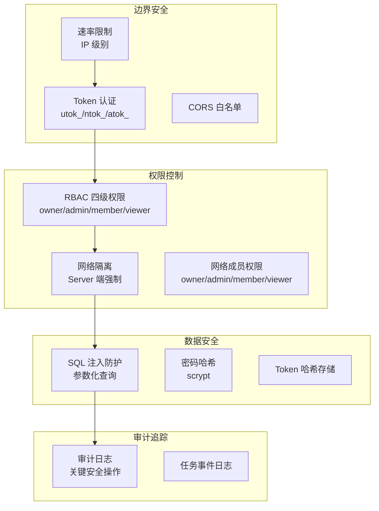

# 安全设计

Agent Network 的安全架构涵盖认证、授权、数据隔离、审计四个层面。

## 安全架构总览



::: info 当前边界
网络绑定和 membership 由 Server 强制检查。`api_tokens.scope` 会被记录，但当前权限判定主要依赖 token 的用户/网络绑定与 `network_members`，不要把 `scope` 字符串单独当作授权证明。
:::


## 🔴 已知:`latest` 通道的 `/health` 会向匿名调用方泄露在线 agent

::: danger 不要不带版本地跑 `bunx @sleep2agi/commhub-server`
不带版本会解析到 npm 的 `latest` dist-tag,而 **`latest` 目前是 `0.8.8`(发布于 2026-06-24)**。

`0.8.8` 的匿名 `GET /health` 会**返回每个活跃 SSE 连接的 `{networkId}:{alias}` 明细** ——
不需要任何 token。脱敏修复是
[`7bacb729`](https://github.com/sleep2agi/agent-network/commit/7bacb729)(`security(#473)`,**2026-07-29**),
比 `0.8.8` 晚 **35 天**,所以 `0.8.8` 不含它。

**改用固定版本或 preview 通道:**

```bash
bunx --bun @sleep2agi/commhub-server@preview      # 已含脱敏修复
```

或走受支持的路径 `anet hub start`(它按 `PINNED_SERVER_VERSION` 拉固定版本,不走 `latest`)。

自查:`curl -sS http://<host>:9200/health | jq 'has("sse_sessions")'` —— 返回 `true` 就是受影响的版本。
:::

回归测试见 `server/src/health-redaction.test.ts`(在 main 上)。
本节记录的是**发布通道**的状态,不是代码的状态 —— 代码里这个问题 2026-07-29 就修了。

## 认证（Authentication）

### Token 体系

当前使用三类 Token：

| Token | 前缀 | 绑定 | 用途 |
|-------|------|------|------|
| 用户 Token | `utok_` | 用户 | CLI / Dashboard 登录 |
| 网络 Token | `ntok_` | 用户 + 网络 | Agent 连接 |
| API Token | `atok_` | 用户，可选绑定网络 | `anet token create` 创建的长期 API 凭证 |

详见 [Token 体系](/concepts/tokens)。

### Token 存储

Token **不明文存储**在数据库中，使用 SHA-256 哈希：

```typescript
// 生成 Token
const token = generateUserToken();  // utok_xxxxxxxx

// 存储到数据库（只存哈希）
const hash = hashToken(token);  // SHA-256 hash
db.run("INSERT INTO api_tokens ... VALUES (?, ?)", [tokenId, hash]);

// 验证时
const inputHash = hashToken(inputToken);
const row = db.get("SELECT * FROM api_tokens WHERE token_hash = ?", inputHash);
```

### Vendor 凭据存储（envRef 模式） {#vendor-凭据存储-envref-模式-v0-9-0}

agent node 跑 `claude-agent-sdk` runtime 时需要厂商 API key（`ANTHROPIC_AUTH_TOKEN` / `OPENAI_API_KEY` / `MINIMAX_KEY` 等）。`config.json` 的 env map 支持两种值形态：

```jsonc
// 老格式（仍兼容、deprecated）—— 明文 token 落 config.json
{
  "env": {
    "ANTHROPIC_AUTH_TOKEN": "sk-abc...xyz"        // ❌ 风险高
  }
}

// 新格式 envRef —— 只存 env-var 名字，值留在 process.env
{
  "env": {
    "ANTHROPIC_AUTH_TOKEN": { "_envRef": "ANTHROPIC_AUTH_TOKEN" }   // ✅ 推荐
  }
}
```

**为啥要 envRef**：避免把明文 token 写进 `config.json`，进而泄漏到 git、配置展示或日志。启动器可以从进程环境或节点目录下权限为 0600 的 `.env` 读取实际值；envRef 不是“永不落盘”的承诺。

**agent-node 兼容两种**：
- 拿到 `string` → 仍按明文用，同时 print 一次 deprecation banner 提示用 `anet node migrate-token-to-envref <alias>` 迁
- 拿到 `{ _envRef: "<NAME>" }` → 读 `process.env[NAME]`；**unset 时启动直接 FATAL exit**（refuse to start silently broken），打印 `export NAME='...'` remediation hint

**`anet node create` 自动用 envRef**：`config.json` 只保存变量名；实际 API key 写入 `.anet/nodes/<alias>/.env`（mode 0600，并加入 `.anet/.gitignore`），启动时自动加载。跨机部署仍需安全迁移这份 secret；详见 [`anet node create`](/guide/cli#anet-node-create)。

**已有节点一键迁**：

```bash
anet node migrate-token-to-envref <alias>
# 1. 备份原文件到 config.json.bak-<ts>
# 2. 把所有 secret-shaped env value 改成 { _envRef: ... }
# 3. print 必要的 export 行让你持久化
# 幂等：非 secret value 和已 envRef 的 value 不动
```

`anet doctor` 也会 enumerate plain-secret 节点 + 提示迁移路径（passive scan，不自动改）。

**Secret 识别启发式**（agent-node / cli.ts / doctor 共享）：env key 后缀匹配 `/_TOKEN|_KEY|_SECRET|AUTH$/`，或 value 前缀匹配 `/sk-|utok_|ntok_|atok_|ak-|gsk_|key-|Bearer/` —— 任一命中就当作 secret 处理。

### Token 验证流程

Hub 从 Bearer header（少数 SSE/兼容接口也接受 query token）解析凭证，检查 token 是否存在、过期或撤销，再应用用户身份、network 绑定和 membership。`--dev-open` 只适合隔离的本地演示。

::: warning Legacy master token
`COMMHUB_AUTH_TOKEN` 仍是向后兼容的 master 路径，权限范围较宽。新部署不要启用；旧部署应迁移到 `utok_` / `ntok_`，但不能假设该兼容路径已从代码删除。
:::

### 密码安全

- 密码用 **salted scrypt** 哈希存储（Node 内建 `crypto.scryptSync`，不是 SHA-256）：
  ```ts
  export function hashPassword(plain: string): string {
    const N = getScryptN();               // 默认 14 → 2^14≈16384 iter (~50ms)，可用 COMMHUB_SCRYPT_N 调
    const salt = randomBytes(16);         // 每个密码独立随机 salt
    const hash = scryptSync(plain, salt, 64, { N: 1 << N, r: 8, p: 1, maxmem: 128 * 1024 * 1024 });
    return `scrypt$${N}$${salt.toString("base64")}$${hash.toString("base64")}`;
  }
  ```
  **每个密码独立 16 字节随机 salt**（一并存进哈希串），所以同一密码在不同账户哈希值不同。旧的裸 SHA-256 哈希在成功登录后惰性迁移到 scrypt。

- **密码强度**由 `validatePasswordStrength()` 统一检查：
  - 用户自选密码（register / `anet passwd`）：**≥ 8 字符** + 拒绝 [`password-dict.ts WEAK_PASSWORDS`](https://github.com/sleep2agi/agent-network/blob/main/server/src/password-dict.ts) 字典
  - 首次 bootstrap admin 的 register 例外：最低 4 字符；**`anet passwd` / `reset-user` 无此豁免**，要求 ≥ 8 且不在弱密码字典
  - 公网部署必须**立刻** `anet passwd` 改强密码

- 用户名支持字母、数字、下划线、中文
- 登录失败不提示是用户名错还是密码错，避免 username enumeration

::: info 密码与 Token 使用不同哈希策略
密码使用带独立 salt 的 scrypt，旧 SHA-256 密码哈希在成功登录后惰性迁移。Token 本身是高熵随机值，数据库只保存其 SHA-256 哈希。
:::

## 授权（Authorization）

### RBAC 权限检查

MCP 写工具通过共享的 `canWrite` 检查目标 network 的 membership：

**关键点**:
- `ntok_` → 由 token 锁死 `enforceNetworkId`，**不接受**客户端传入的 network_id（防跨 network 写）
- `utok_` → 解析目标 network 后查询 `network_members.role`
- 任何一种 token，只要 role 是 `viewer` 都拒绝写

### Server 端网络强制

`ntok_` 的 network 由 token 绑定，客户端参数不能覆盖。`utok_` 可以选择目标 network，但 Server 会验证该用户确实是成员；它不是“信任任意客户端 network_id”。

### REST API 权限

REST API 根据 Token 类型自动限制范围：

| Token 类型 | REST API 范围 |
|-----------|-------------|
| `ntok_` | 只能看绑定网络的数据 |
| `utok_` | 可以看用户所属的所有网络 |
| `atok_` | 若绑定 network 则仅该网络；未绑定则按用户 membership |
| Legacy master token | 可通过通用 REST scope；不能替代需要具体 user membership 的端点 |
| 系统 admin | 可用 hub 级管理和跨网络查询端点；成员管理仍检查该 network 的角色 |

## 速率限制（Rate Limiting）

### IP 级别限制

| 端点 | 限制 | 说明 |
|------|------|------|
| `POST /api/auth/register` | 30 次/分 | 防注册攻击 |
| `POST /api/auth/login` | 10 次/分 | 防暴力破解 |

::: info register 与 login 用不同机制
- **register**：通用 `checkRateLimit()`（30/min）。
- **login**：专用 `LoginIpRateLimiter`（每 IP 每 60 秒窗口 10 次）**外加**账户级渐进锁定（连续失败 ≥ 5 次触发，30 秒起、指数退避至 15 分钟上限）。
- **其它 endpoint 当前不做 IP rate limit** —— 担心写操作被滥用，前置反向代理（nginx / cloudflare 等）补即可。
:::

### 429 响应

```json
{ "ok": false, "error": "too many requests, try again later" }
```

上面是 register 的响应。Login 的 IP 限流返回 `rate_limited`，账户锁定返回 `login_locked`；两者都带 `Retry-After` 和 `retry_after_ms`。

### 本地豁免

register 的通用 limiter 对 localhost 和 `"unknown"` 豁免；login 的专用 limiter **不豁免**这些值。生产环境应由可信反向代理写入客户端 IP，并在网关再加一层限流。

## CORS 配置

```bash
# 没有 CLI flag —— 只能用 env 变量
COMMHUB_CORS_ORIGINS="https://dashboard.example.com,http://localhost:3000" anet hub start

# 或单条
COMMHUB_CORS_ORIGINS="https://dashboard.example.com" anet hub start
```

::: warning CORS 默认 **不是** `*`
`COMMHUB_CORS_ORIGINS` 未设时默认白名单是 `http://localhost:3000` 和 `http://localhost:3001`，**不是** `*`。设置该变量会完全替换默认值。

`Access-Control-Allow-Origin` 只在请求的 `Origin` 命中白名单时回显该 origin，否则回空字符串（浏览器据此拦截跨域请求）。源码不 hardcode 任何作者域名 —— 生产部署 Dashboard 跨域必须显式设 `COMMHUB_CORS_ORIGINS`。
:::

## 审计日志

关键操作写入 `audit_log`，包含调用用户、action、目标、详情、IP、network 与时间。Action 会随能力增加，不在这里维护易过时的固定总数。

常见 action 分组：

- 登录与密码：`register`、`login`、`login_failed`、`login_rate_limited`、`login_locked`、`password_changed`
- Network 与成员：`network_renamed`、`network_deleted`、`network_joined`、`member_*`、`invite_created`
- Token 与节点：`token_*`、`node_token_created`、`node_rename_*`、`node_attrs_updated`

::: info 创建 network 当前不写 audit
POST `/api/networks` 不写 `create_network` 或 `network_created`。不要依赖不存在的 action。
:::

### 查询审计日志

```bash
# Via REST API (no dedicated CLI command for audit log yet)
UTOK=$(jq -r .token ~/.anet/config.json)
curl -H "Authorization: Bearer $UTOK" "$HUB/api/audit-log?limit=50"
```

## SQL 注入防护

数据库查询使用参数绑定，不拼接用户输入：

```typescript
// 正确：参数化查询
db.run("SELECT * FROM sessions WHERE alias = ?1", [alias]);

// 错误：字符串拼接（不使用）
db.run(`SELECT * FROM sessions WHERE alias = '${alias}'`);
```

## 数据库安全

::: tip 后端是 SQLite —— 完整性保证也基于 SQLite
anet 生产用 **SQLite**（`~/.commhub/commhub.db`）。本节及授权/审计的完整性与隔离保证都建立在 SQLite 的事务 / 约束语义上。代码里虽有 `DATABASE_URL` 的 PostgreSQL 入口，但**未做端到端验证、不建议生产使用**（见 [FAQ — PostgreSQL 支持如何？](/faq#_20-postgresql-支持如何)）。
:::

### SQLite WAL 模式

```sql
PRAGMA journal_mode = WAL;
PRAGMA busy_timeout = 5000;
```

- **WAL 模式**：支持并发读写，防止锁冲突
- **busy_timeout**：等待 5 秒再报错，处理并发请求

### 数据库文件权限

```bash
# 数据库文件权限建议
chmod 600 ~/.commhub/commhub.db
```

### 敏感数据

| 数据 | 存储方式 | 细节 |
|------|---------|------|
| 密码 | salted scrypt（`scrypt$N$salt$hash`） | 每密码独立随机 salt，旧 SHA-256 哈希登录时惰性迁移 |
| Token | SHA-256 哈希（无 salt） | token 由 `crypto.randomUUID()` 生成，数据库不保存明文 |
| API Key | 不存 Hub 数据库 | agent-node 从进程环境或节点 `.env` 读取；envRef 让 `config.json` 只保存变量名 |
| 任务内容 | 明文 | `tasks.content` 列；多用户共享 hub 时 admin 能看所有；`audit_log` 不含 task body |
| 审计日志 | 明文 | `audit_log` 10 列含 user_id / username / action / detail / ip / network_id |

## 通信安全

### 建议配置

```bash
# 1. 使用 TLS（反向代理）
# nginx.conf
server {
    listen 443 ssl;
    ssl_certificate /path/to/cert.pem;
    ssl_certificate_key /path/to/key.pem;

    location / {
        proxy_pass http://127.0.0.1:9200;
    }
}

# 2. 防火墙限制
# 只允许特定 IP 访问 9200 端口
ufw allow from 10.0.0.0/8 to any port 9200

# 3. 设置 CORS
COMMHUB_CORS_ORIGINS="https://dashboard.example.com"
```

### SSE 连接安全

SSE 连接使用与 REST API 相同的认证机制（Bearer Token / URL token 参数）。agent-node 在 SSE 返回 401 后会重新加载 token 并重连。

### Dashboard 鉴权

Dashboard 使用 thin cookie-proxy：

- 浏览器走 username / password 登录 Dashboard → Next.js 后端拿到 `utok_` 写入 HttpOnly cookie
- Dashboard 前端不持有长效 service token
- 后端把请求透传到 Hub 时附上当前 session 的 `utok_` Bearer Header
- session cookie 过期 / 用户登出 → cookie 清除 → 下次请求 401 强制重登

## Agent 运行时安全

### 隔离策略

`claude-agent-sdk` 默认用 `settingSources: []`，不会自动载入宿主的 Claude 配置：

```typescript
const options = {
  settingSources: [],  // 不读任何全局配置
  // model / permissionMode / mcpServers / env ...
};
for await (const message of query({ prompt, options })) { /* ... */ }
```

这不等于操作系统级隔离：Agent 获得的文件、Shell 和网络工具仍作用于宿主环境。需要强隔离时应使用容器或专用低权限账户。

### 工具权限（默认 Claude Code preset，user responsibility）

`claude-agent-sdk` runtime 的默认 toolset 是 Claude Code preset 全集。每个新节点启动后就能：

- 文件系统：`Read` / `Write` / `Edit` / `Glob` / `Grep`
- Shell：`Bash`（受 `dangerouslySkipPermissions` 默认开启影响，不弹确认）
- 网络：`WebFetch` / `WebSearch`
- 子任务：`Task` / `NotebookEdit` / ...

加上 hub 端约 40 个 MCP 工具（`commhub_send_task` / `commhub_reply` / ...）。

**控制粒度**：

```bash
# 默认（不指定 --tools）→ Claude Code 全集 preset
anet node create my-agent

# 显式 "all" → 同 preset（单一 source-of-truth，不是老版的硬编码 8-tool 列表）
anet node create my-agent --tools all

# 显式 allowlist（只读 agent）—— 跳过 preset，给字符串数组
anet node create my-agent --tools Read,Glob,Grep

# 跑时看实际生效的 toolset
anet info my-agent           # 列 tools: + flags: 行
```

`anet node create` 成功后会打印实际工具和权限 flags。用户仍需根据工作目录和数据敏感度配置隔离。

> ⚠ **User responsibility**：默认 preset + 默认 `dangerouslySkipPermissions=true` 意味着 agent 启动后能**改文件、跑 shell、访问网络且不弹确认**。请：
> 1. **不要在 `$HOME` 直接跑 agent**，用一次性工作目录（`mkdir agent-work && cd agent-work && anet node create ...`）—— 详见 [SECURITY.md](https://github.com/sleep2agi/agent-network/blob/main/SECURITY.md)
> 2. 需要严格 sandbox 时显式 `--tools Read,Glob,Grep` 只给只读权限
> 3. 关掉自动批准（yolo）：codex-sdk 节点用 `anet node create --no-yolo`；claude 系（claude-code-cli / claude-agent-sdk）把 node `config.json` 的 `dangerouslySkipPermissions` 设为 `false`（**没有 `--no-skip-permissions` 这个 flag**）。注意关掉后每次工具调用都会弹确认，长任务体验差
> 4. 单任务预算限制：`--max-budget 0.1`（见下方 [预算控制](#预算控制)）

### 预算控制

`--max-budget` 是 **agent-node 运行时 flag**（不是 `anet node create` 的 flag），**仅对 `claude-agent-sdk` runtime 生效**：

```bash
# 限制每任务花费（美元），传给 agent-node 进程
npx @sleep2agi/agent-node --alias my-agent --max-budget 0.1
```

也可写进 `config.json` 的 `flags.maxBudgetUsd` 持久化。

## 安全检查清单

### 生产部署

- [ ] `anet hub start` 后**立刻** `anet passwd` 改强密码
- [ ] 新部署不要设置 legacy `COMMHUB_AUTH_TOKEN`，使用 `utok_` / `ntok_`
- [ ] 使用 TLS（HTTPS），Caddy 自动 cert
- [ ] 配置防火墙规则（只放 80/443）
- [ ] 配置 CORS 白名单 `COMMHUB_CORS_ORIGINS`
- [ ] Agent 节点用 ntok_（每个 agent 一个，hub 强制 network 锁）
- [ ] 确认 `~/.anet/server/admin-utok.json` 权限为 600
- [ ] 定期备份 `~/.commhub/commhub.db`
- [ ] 监控审计日志（`/api/audit-log`）

### Agent 节点

- [ ] 限制工具权限（不要 `--tools all`）
- [ ] 设置预算上限
- [ ] 使用 Docker 隔离
- [ ] 不把密钥明文写入 `config.json`；使用 envRef、受控 `.env` 或 secrets manager
- [ ] `.anet/` 加入 `.gitignore`

## 下一步

**深入对应实现**：
- [架构概览 — 安全章节](/guide/architecture#安全架构) — token 流和数据库表的对应
- [账号体系](/guide/account-system) — utok_ / ntok_ / 密码 三者关系

**实操**：
- 忘密码：在 Hub 机器跑 `anet hub admin reset-user <username>`
- 修复过期 token：`anet doctor --fix` 自动 probe + 重发 ntok_
- 改密码：`anet passwd` 交互式

**生产部署清单**：
- [生产部署指南](/deploy/production) — TLS / 防火墙 / CORS / 备份 完整 checklist
- [Docker 部署](/deploy/docker) — 容器化最佳实践
