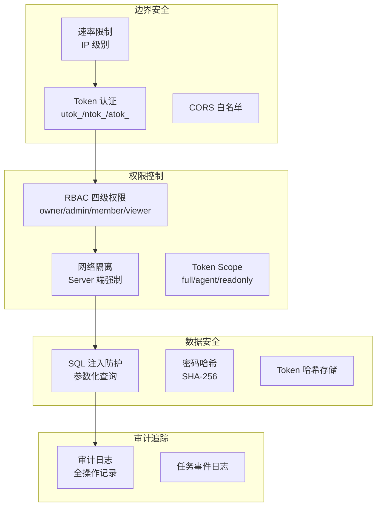
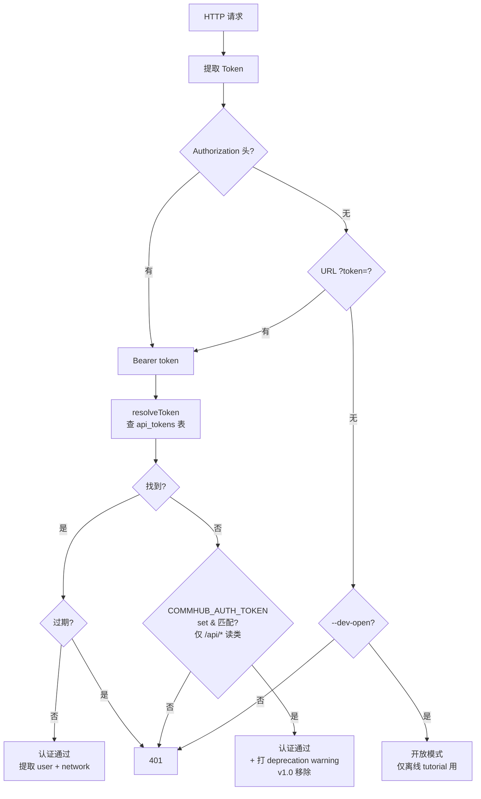

# 安全设计

Agent Network 的安全架构涵盖认证、授权、数据隔离、审计四个层面。

## 安全架构总览



::: info v0.10.11 实际启用 vs 设计目标
上图反映**设计目标**，当前 v0.10.11 实际执行情况：

- ✅ **已启用**：速率限制 / Token 认证（utok_/ntok_/atok_）/ CORS / RBAC 四级权限 / 网络隔离（Server 端强制） / SQL 注入防护 / 密码 SHA-256 / 审计日志 / 任务事件日志
- ⏳ **未完全启用**：Token Scope 字段（`api_tokens.scope` 列存在 + [`auth.ts:73-137`](https://github.com/sleep2agi/agent-network/blob/main/server/src/auth.ts#L73) `createToken` 按 token 类型写不同 scope，但 [`auth.ts:143-165 resolveToken`](https://github.com/sleep2agi/agent-network/blob/main/server/src/auth.ts#L143) 返回结构里**没 scope 字段** —— RBAC 决策不消费 scope 写入；security report **R12** v0.9.x / v0.10.x 都未动（Recovery & Observability / Direct Runtime + Observability Foundations / Hero A+D / 后续 UX 修复 chain 主题为先），排到 v0.11+ / 未排期；详见 [安全审计报告](https://github.com/sleep2agi/agent-network/blob/main/docs/open-source-security-risk-report.md)）
- ⏳ **计划升级**：密码哈希 SHA-256 → Argon2id（verify [`db.ts:503-505 hashPassword`](https://github.com/sleep2agi/agent-network/blob/main/server/src/db.ts#L503) 仍 `Bun.CryptoHasher("sha256")`，security report **R9** v0.9.x / v0.10.x 都未动，排到 v0.11+ / 未排期）
:::

## 认证（Authentication）

### Token 体系

v0.8 是**双 Token 体系**：

| Token | 前缀 | 绑定 | 用途 |
|-------|------|------|------|
| 用户 Token | `utok_` | 用户 | CLI / Dashboard 登录 |
| 网络 Token | `ntok_` | 用户 + 网络 | Agent 连接 |

`atok_`（V2 时代的 api token）已被 `utok_` + `ntok_` 取代 —— 代码里还保留前缀兼容判断（不报错），但**新用户不需要接触**，`anet token create / ls / revoke` 底层走的都是 `utok_` / `ntok_`。详见 [Token 体系](/concepts/tokens)。

### Token 存储

Token **不明文存储**在数据库中，使用 SHA-256 哈希：

```typescript
// 生成 Token
const token = generateUserToken();  // utok_xxxxxxxx

// 存储到数据库（只存哈希）
const hash = hashToken(token);  // SHA-256 hash
db.run("INSERT INTO api_tokens ... VALUES (?, ?)", [tokenId, hash]);

// 验证时
const inputHash = hashToken(inputToken);
const row = db.get("SELECT * FROM api_tokens WHERE token_hash = ?", inputHash);
```

### Vendor 凭据存储（envRef 模式，v0.9.0+）

agent node 跑 `claude-agent-sdk` runtime 时需要厂商 API key（`ANTHROPIC_AUTH_TOKEN` / `OPENAI_API_KEY` / `MINIMAX_KEY` …），存哪里非常关键。从 [#125](https://github.com/sleep2agi/agent-network/issues/125)（v0.9.0 promote gate #2）起，**agent node config.json env map 支持两种值形态**（tagged union）：

```jsonc
// 老格式（仍兼容、deprecated）—— 明文 token 落 config.json
{
  "env": {
    "ANTHROPIC_AUTH_TOKEN": "sk-abc...xyz"        // ❌ 风险高
  }
}

// 新格式 envRef —— 只存 env-var 名字，值留在 process.env
{
  "env": {
    "ANTHROPIC_AUTH_TOKEN": { "_envRef": "ANTHROPIC_AUTH_TOKEN" }   // ✅ 推荐
  }
}
```

**为啥要 envRef**：明文 token 写进 `config.json` 会泄漏到 git history / dashboard payload / `anet ls` 输出 / error envelope / log line 等多处 surface。secret 留在 `process.env` 则永远不落盘。

**agent-node 兼容两种**：
- 拿到 `string` → 仍按明文用，同时 print 一次 deprecation banner 提示用 `anet node migrate-token-to-envref <alias>` 迁
- 拿到 `{ _envRef: "<NAME>" }` → 读 `process.env[NAME]`；**unset 时启动直接 FATAL exit**（refuse to start silently broken），打印 `export NAME='...'` remediation hint

**`anet node create` 自动用 envRef**：[#125](https://github.com/sleep2agi/agent-network/issues/125) 之后，`saveCreatedNode` 前会跑 `rewritePlainSecretsToEnvRef()` —— 新建节点的 vendor secret **永不持久化明文**，原值临时塞进当前 shell `process.env`（spawn 直接拿）+ print `export NAME='value'` 让你自己抄进 `~/.bashrc` 或 secrets manager。

**v0.10.10 起 envRef Option A wizard 自动衔接（[#193](https://github.com/sleep2agi/agent-network/issues/193)）**：除了上面 `process.env` + print export 行为，`anet node create` **额外**把 API key 写入 `.anet/nodes/<alias>/.env`（mode 0600，自动加入 `.anet/.gitignore`）。同一 shell 跑 `anet node start <alias>` 时启动前自动 source 该 `.env`，**无需手动 `export ANTHROPIC_AUTH_TOKEN_N_<id>=...` 也无需抄到 `~/.bashrc`**。跨机部署仍需手动 copy 一次（`anet node create` 也会 print 一次 export 命令供 copy）。详见 [cli.md `anet node create`](/guide/cli#anet-node-create) ::: tip envRef wizard 自动衔接段。

**已有节点一键迁**：

```bash
anet node migrate-token-to-envref <alias>
# 1. 备份原文件到 config.json.bak-<ts>
# 2. 把所有 secret-shaped env value 改成 { _envRef: ... }
# 3. print 必要的 export 行让你持久化
# 幂等：非 secret value 和已 envRef 的 value 不动
```

`anet doctor` 也会 enumerate plain-secret 节点 + 提示迁移路径（passive scan，不自动改）。

**Secret 识别启发式**（agent-node / cli.ts / doctor 共享）：env key 后缀匹配 `/_TOKEN|_KEY|_SECRET|AUTH$/`，或 value 前缀匹配 `/sk-|utok_|ntok_|atok_|ak-|gsk_|key-|Bearer/` —— 任一命中就当作 secret 处理。

### Token 验证流程（v0.8）



::: warning v0.8 关键变化
- v0.5 时代 `COMMHUB_AUTH_TOKEN` 未设 → 自动 open mode 的路径**已删除**。现在 hub 不带 `--dev-open` 必须有 utok_/ntok_。
- master token 兼容路径**只允许少量 `/api/*` 读请求**，写操作一律拒绝。
- 这条 legacy 路径 v1.0 完全移除（[RFC-001 阶段 3](https://github.com/sleep2agi/agent-network/blob/main/docs/rfcs/RFC-001-deprecate-commhub-auth-token.md)；tracking issue 见 [open issues: COMMHUB_AUTH_TOKEN](https://github.com/sleep2agi/agent-network/issues?q=is%3Aissue+COMMHUB_AUTH_TOKEN)）。
:::

### 密码安全

- 密码使用 SHA-256 哈希存储 + 静态 prefix salt `anet:` —— verify [`server/src/db.ts:427-429 hashPassword`](https://github.com/sleep2agi/agent-network/blob/main/server/src/db.ts#L427):
  ```ts
  export function hashPassword(password: string): string {
    return new Bun.CryptoHasher("sha256").update(`anet:${password}`).digest("hex");
  }
  ```
  `anet:` prefix 让跨项目通用 rainbow table 失效，但**不是 per-user salt** —— 同密码在不同账户哈希值相同。Argon2id 迁移规划见下文 ::: info。

- **密码强度** —— verify [`server/src/auth.ts:24-50 validatePasswordStrength`](https://github.com/sleep2agi/agent-network/blob/main/server/src/auth.ts#L24):
  - 用户自选密码（register / `anet passwd`）：**≥ 8 字符** + 拒绝 [`password-dict.ts WEAK_PASSWORDS`](https://github.com/sleep2agi/agent-network/blob/main/server/src/password-dict.ts) 字典
  - 首次 bootstrap admin **register 例外**：≥ 4 字符即可（让快速上手 `admin / anethub` 默认成立）—— [`auth.ts:43-44`](https://github.com/sleep2agi/agent-network/blob/main/server/src/auth.ts#L43) 检测「首位注册用户」时只校验 length ≥ 4；**`anet passwd` / `reset-user` 无此豁免**，永远强制 ≥ 8 + 非弱密码
  - 公网部署必须**立刻** `anet passwd` 改强密码

- 用户名支持字母、数字、下划线、中文
- 登录失败不提示是用户名错还是密码错（[`auth.ts:99-100`](https://github.com/sleep2agi/agent-network/blob/main/server/src/auth.ts#L99) 故意把两种错误合并成同一文案，避免 username enumeration）

::: info 计划中（v0.11+ / 未排期）
SHA-256 → Argon2id 升级（[security report R9](https://github.com/sleep2agi/agent-network/blob/main/docs/open-source-security-risk-report.md)），提升抗暴力破解能力 + per-user salt 防止同密码哈希碰撞。**v0.9.x / v0.10.x 整条 stable 线都未触碰**（每个 release 的具体改动见 [changelog](/changelog)），留 v0.11+ 安全主题专项升级。Token 哈希（cli.ts hashToken 用纯 SHA-256 无 salt）不需要 Argon2id —— token 是 128-bit 随机字符串，rainbow table 不适用。
:::

## 授权（Authorization）

### RBAC 权限检查

每次 MCP 工具调用都进行权限检查（[`server/src/tools.ts:24-30 canWrite`](https://github.com/sleep2agi/agent-network/blob/main/server/src/tools.ts#L24)）：

```typescript
const canWrite = (effectiveNetworkId?: string | null): boolean => {
  if (!enforceUserId) return true; // legacy 全局 token 模式（仅 dev-open / 旧 atok_ 路径）
  // ntok_: enforceNetworkId 由 token 绑定锁死；utok_: 从 effectiveNetworkId 走（MCP 调用传入）
  const netId = enforceNetworkId ?? effectiveNetworkId ?? null;
  if (!netId) return false;        // 解析不到 network 拒绝
  const role = getUserNetworkRole(enforceUserId, netId);
  return !!role && role !== "viewer"; // owner/admin/member 可写
};
```

**关键点**:
- `ntok_` → 由 token 锁死 `enforceNetworkId`，**不接受**客户端传入的 network_id（防跨 network 写）
- `utok_` → `enforceNetworkId` 为空，**接受**客户端在 MCP 调用里传 `effectiveNetworkId`，并查 `network_members.role`
- 任何一种 token，只要 role 是 `viewer` 都拒绝写

### Server 端网络强制

这是安全设计的核心 -- 网络 ID **不信任客户端**：

```typescript
// Server 从 Token 提取 network_id，不用客户端传入的
const getNetworkId = (clientNetId) => enforceNetworkId ?? clientNetId ?? null;
```

即使客户端传了 `network_id=other_network`，Server 会忽略，强制使用 Token 绑定的网络。

### REST API 权限

REST API 根据 Token 类型自动限制范围：

| Token 类型 | REST API 范围 |
|-----------|-------------|
| `ntok_` | 只能看绑定网络的数据 |
| `utok_` | 可以看用户所属的所有网络 |
| `atok_` (full) | 可以看用户所属的所有网络 |
| 全局 Token | 可以看所有数据 |
| 系统 admin | 可以看所有数据 |

## 速率限制（Rate Limiting）

### IP 级别限制

| 端点 | 限制 | 说明 |
|------|------|------|
| `POST /api/auth/register` | 30 次/分 | 防注册攻击 |
| `POST /api/auth/login` | 10 次/分 | 防暴力破解 |

::: info v0.8 当前只有 register + login 两端点做了 IP rate limit
verify [`server/src/index.ts:430`](https://github.com/sleep2agi/agent-network/blob/main/server/src/index.ts#L430)（register，30/min）+ [L444](https://github.com/sleep2agi/agent-network/blob/main/server/src/index.ts#L445)（login，10/min）`checkRateLimit()` 调用点 —— 全 server 只这两处。`checkRateLimit` 函数签名 `maxPerMinute = 60` 默认值是为未来扩展预留，**当前其他 endpoint 不做 IP rate limit**。如果你担心写操作被滥用，前置反向代理（nginx / cloudflare 等）补 rate limit 即可。
:::

### 实现方式

```typescript
// 内存存储，per IP（verify server/src/index.ts:55-67）
const rateLimits = new Map<string, { count: number; resetAt: number }>();

function checkRateLimit(ip: string, maxPerMinute = 60): boolean {
  // localhost / internal / unknown 免限制（开发/测试）
  if (!ip || ip === "unknown" || ip === "127.0.0.1" || ip === "::1") return true;

  const now = Date.now();
  const entry = rateLimits.get(ip);
  if (!entry || now > entry.resetAt) {
    rateLimits.set(ip, { count: 1, resetAt: now + 60000 });
    return true;
  }
  if (entry.count >= maxPerMinute) return false;  // 命中上限，不再 ++
  entry.count++;
  return true;
}
```

超过限制返回 HTTP 429，body 形如：

```json
{ "ok": false, "error": "too many requests, try again later" }
```

（`/login` 命中是 `"too many attempts, try again later"`；命中后 server 还写 audit `action='login_rate_limited'` + clientIP detail。verify [`server/src/index.ts:445-446`](https://github.com/sleep2agi/agent-network/blob/main/server/src/index.ts#L445)。**响应不含 `retry_after_seconds` / `Retry-After` header**——窗口固定 60 秒，等就完事。）

### 本地豁免

localhost (`127.0.0.1` / `::1`)、以及 IP 解析为空 / `"unknown"` 的请求免速率限制，方便开发和测试（[`index.ts:58`](https://github.com/sleep2agi/agent-network/blob/main/server/src/index.ts#L58)）。

## CORS 配置

```bash
# 没有 CLI flag —— 只能用 env 变量
COMMHUB_CORS_ORIGINS="https://dashboard.example.com,http://localhost:3000" anet hub start

# 或单条
COMMHUB_CORS_ORIGINS="https://dashboard.example.com" anet hub start
```

::: warning CORS 默认 **不是** `*`
verify [`server/src/index.ts:256-258`](https://github.com/sleep2agi/agent-network/blob/main/server/src/index.ts#L256)：`COMMHUB_CORS_ORIGINS` 未设时默认白名单 = `["http://localhost:3000", "http://localhost:3001"]`（**仅本机 dev origin**），**不是** `*`。设了 `COMMHUB_CORS_ORIGINS`（逗号分隔）会**完全替换**这个默认值。

`Access-Control-Allow-Origin` 只在请求的 `Origin` 命中白名单时回显该 origin，否则回空字符串（浏览器据此拦截跨域请求）。源码不 hardcode 任何作者域名 —— 生产部署 Dashboard 跨域必须显式设 `COMMHUB_CORS_ORIGINS`。
:::

## 审计日志

所有关键操作记录到 `audit_log` 表（verify [`server/src/db.ts:201-212`](https://github.com/sleep2agi/agent-network/blob/main/server/src/db.ts#L201)）：

```sql
CREATE TABLE audit_log (
  id            INTEGER PRIMARY KEY AUTOINCREMENT,
  user_id       TEXT,
  username      TEXT,
  action        TEXT NOT NULL,
  target_type   TEXT,           -- 'user' / 'network' / 'token' / 'auth' / ...
  target_id     TEXT,           -- 关联的 user_id / network_id / token_id
  detail        TEXT,           -- 操作描述，如 '<user_id> as <role>' / '<old> → <new>'
  ip            TEXT,           -- 触发请求的 client IP（rate-limited 等场景）
  network_id    TEXT,           -- 操作发生在哪个 network
  created_at    TEXT NOT NULL DEFAULT (datetime('now'))
);
```

记录的 action 取值（**共 19 个**；verify `grep logAudit server/src/*.ts + auth.ts:294 + cli.ts` —— 18 个走 [`logAudit()` helper](https://github.com/sleep2agi/agent-network/blob/main/server/src/db.ts#L447)，`password_reset_by_admin` 走 [`auth.ts:294`](https://github.com/sleep2agi/agent-network/blob/main/server/src/auth.ts#L294) 直接 INSERT）：

| 操作 | 触发场景 |
|------|---------|
| `register` | 用户注册（[`index.ts:436`](https://github.com/sleep2agi/agent-network/blob/main/server/src/index.ts#L436)） |
| `login` | 用户登录成功 |
| `login_failed` | 用户登录失败（密码不匹配 / username 不存在） |
| `login_rate_limited` | login 触发 IP rate limit（10/分） |
| `password_changed` | `anet passwd` 改密码（[`index.ts:504`](https://github.com/sleep2agi/agent-network/blob/main/server/src/index.ts#L504)） |
| `password_reset_by_admin` | hub admin 用 `anet hub admin reset-user` 强制重置（[`auth.ts:294`](https://github.com/sleep2agi/agent-network/blob/main/server/src/auth.ts#L294) + [`cli.ts`](https://github.com/sleep2agi/agent-network/blob/main/agent-network/bin/cli.ts)） |
| `network_renamed` / `network_deleted` / `network_joined` | network 改名 / 删除 / 加入 |
| `member_added` / `member_role_changed` / `member_removed` | network 成员变更（`detail` 字段记 `<user_id> as <role>` / `<user_id> → <role>`） |
| `token_created` / `token_revoked` | API token 生命周期 |
| `node_token_created` | `anet node create` 自动 mint `ntok_` |
| `node_rename_prepared` / `node_rename_committed` / `node_rename_aborted` | RFC-010 节点改名两阶段事务（PREPARE / COMMIT / ABORT 各写一条 audit） |
| `invite_created` | 创建网络邀请码 |

::: info `create_network` / `network_created` 不写 audit
当前 [`index.ts:635`](https://github.com/sleep2agi/agent-network/blob/main/server/src/index.ts#L635) 的 POST `/api/networks` 不调 `logAudit`，所以新建 network 不留 audit 行。仅 rename / delete / join 写 audit。
:::

### 查询审计日志

```bash
# Via REST API (no dedicated CLI command for audit log yet)
UTOK=$(jq -r .token ~/.anet/config.json)
curl -H "Authorization: Bearer $UTOK" "$HUB/api/audit-log?limit=50"
```

## SQL 注入防护

所有数据库操作使用参数化查询：

```typescript
// 正确：参数化查询
db.run("SELECT * FROM sessions WHERE alias = ?1", [alias]);

// 错误：字符串拼接（不使用）
db.run(`SELECT * FROM sessions WHERE alias = '${alias}'`);
```

全部 `db.run()` / `db.get()` / `db.all()` 调用（[`server/src/*.ts` grep 当前 150+ 处](https://github.com/sleep2agi/agent-network/tree/main/server/src)）都已迁移到参数化方式。（原 doc 写「85+」是 v0.5 时代估算，server 端代码量翻倍后实际 150+。）

## 数据库安全

### SQLite WAL 模式

```sql
PRAGMA journal_mode = WAL;
PRAGMA busy_timeout = 5000;
```

- **WAL 模式**：支持并发读写，防止锁冲突
- **busy_timeout**：等待 5 秒再报错，处理并发请求

### 数据库文件权限

```bash
# 数据库文件权限建议
chmod 600 ~/.commhub/commhub.db
```

### 敏感数据

| 数据 | 存储方式 | 细节 |
|------|---------|------|
| 密码 | SHA-256 哈希 + 静态 prefix salt `anet:` | [db.ts:427-429](https://github.com/sleep2agi/agent-network/blob/main/server/src/db.ts#L427)；非 per-user salt，Argon2id 迁移见 [::: info 计划](#密码安全) |
| Token | SHA-256 哈希（无 salt） | token 是 `crypto.randomUUID()` 128-bit 随机值，rainbow table 不适用 |
| API Key | 不存储（仅 process env / config.env） | agent-node 进程内 `ANTHROPIC_API_KEY` / `OPENAI_API_KEY` env，hub 端 db 不存 |
| 任务内容 | 明文 | `tasks.content` 列；多用户共享 hub 时 admin 能看所有；`audit_log` 不含 task body |
| 审计日志 | 明文 | `audit_log` 10 列含 user_id / username / action / detail / ip / network_id |

## 通信安全

### 建议配置

```bash
# 1. 使用 TLS（反向代理）
# nginx.conf
server {
    listen 443 ssl;
    ssl_certificate /path/to/cert.pem;
    ssl_certificate_key /path/to/key.pem;

    location / {
        proxy_pass http://127.0.0.1:9200;
    }
}

# 2. 防火墙限制
# 只允许特定 IP 访问 9200 端口
ufw allow from 10.0.0.0/8 to any port 9200

# 3. 设置 CORS
COMMHUB_CORS_ORIGINS="https://dashboard.example.com"
```

### SSE 连接安全

SSE 连接使用与 REST API 相同的认证机制（Bearer Token / URL token 参数）。**v0.8.1 起 agent-node SSE 收到 401 会自动 reload token 并重连**，避免老 ntok_ 过期导致 agent 静默离线。

### Dashboard 鉴权（v0.8 thin cookie-proxy）

v0.8.0 起 Dashboard（`@sleep2agi/agent-network-dashboard@0.4.2+`）改为**thin cookie-proxy** 模式：

- 浏览器走 username / password 登录 Dashboard → Next.js 后端拿到 `utok_` 写入 HttpOnly cookie
- Dashboard 前端**不再持有任何长效 service token**（旧 v0.7 时代需要 `COMMHUB_AUTH_TOKEN` 或 `DASHBOARD_PASSWORD` env，已全部移除）
- 后端把请求透传到 Hub 时附上当前 session 的 `utok_` Bearer Header
- session cookie 过期 / 用户登出 → cookie 清除 → 下次请求 401 强制重登

这是 RFC-001 Phase 2 在 Dashboard 端的落地，**结合 `admin-utok.json` 本地恢复机制实现 0-token-config** 起步部署。完整设计见 [RFC-001](https://github.com/sleep2agi/agent-network/blob/main/docs/rfcs/RFC-001-deprecate-commhub-auth-token.md)。

## Agent 运行时安全

### 隔离策略

每个 Agent Node 完全隔离，不读取宿主机配置 —— claude-agent-sdk 调 `query()` 时传 `settingSources: []`（claude-agent-sdk 入口是 `query()` 函数，不是 `new Agent({...})` 类）：

```typescript
const options = {
  settingSources: [],  // 不读任何全局配置
  // model / permissionMode / mcpServers / env ...
};
for await (const message of query({ prompt, options })) { /* ... */ }
```

### 工具权限（默认 Claude Code preset，user responsibility）

从 [#101](https://github.com/sleep2agi/agent-network/issues/101) Option B 起（anet v0.9.0+），`claude-agent-sdk` runtime 的**默认 toolset 是 Claude Code preset 全集** —— 不再是空集。每个新节点 spawn 起来后就能：

- 文件系统：`Read` / `Write` / `Edit` / `Glob` / `Grep`
- Shell：`Bash`（受 `dangerouslySkipPermissions` 默认开启影响，不弹确认）
- 网络：`WebFetch` / `WebSearch`
- 子任务：`Task` / `NotebookEdit` / ...

加上 hub 端 17 个 MCP 工具（`commhub_send_task` / `commhub_reply` / ...）。

**为啥默认改成 preset**：[#101 root cause](https://github.com/sleep2agi/agent-network/issues/101) —— 老版 `config.json` 没 `tools` 字段时 agent-node 设 SDK `options.tools = undefined`，SDK 解读为「零内建工具」，agent 只能调 MCP 工具，被问 `WebFetch` / `Bash` / `Read` 时会幻觉成「网络受限」。Option B 强制 fallback 到 SDK `{ type: 'preset', preset: 'claude_code' }` sentinel —— SDK 类型定义里这是「给我全套 Claude Code 工具」的正确表达。

**控制粒度**：

```bash
# 默认（不指定 --tools）→ Claude Code 全集 preset
anet node create my-agent

# 显式 "all" → 同 preset（单一 source-of-truth，不是老版的硬编码 8-tool 列表）
anet node create my-agent --tools all

# 显式 allowlist（只读 agent）—— 跳过 preset，给字符串数组
anet node create my-agent --tools Read,Glob,Grep

# 跑时看实际生效的 toolset
anet info my-agent           # 列 tools: + flags: 行
```

`anet node create` 成功后 print **行为披露 banner**：built-in tools 清单（list 或 "all (Claude Code preset)"）+ MCP tools + 当前 flags（`dangerouslySkipPermissions=true` / `teammateMode=true`）+ "The agent can read/write files, run shell commands, and access the network"。Vincent [4927](https://github.com/sleep2agi/agent-network/issues/101) push 加这个 banner 的初衷：**用户必须看见，承担起 sandboxing 责任**。

> ⚠ **User responsibility**：默认 preset + 默认 `dangerouslySkipPermissions=true` 意味着 agent 启动后能**改文件、跑 shell、访问网络且不弹确认**。请：
> 1. **不要在 `$HOME` 直接跑 agent**，用一次性工作目录（`mkdir agent-work && cd agent-work && anet node create ...`）—— 详见 [SECURITY.md](https://github.com/sleep2agi/agent-network/blob/main/SECURITY.md)
> 2. 需要严格 sandbox 时显式 `--tools Read,Glob,Grep` 只给只读权限
> 3. 关掉 yolo mode：`anet node create --no-skip-permissions`（注意：跑就会一直弹工具调用确认，长任务体验差）
> 4. 单任务预算限制：`--max-budget 0.1`（见下方 [预算控制](#预算控制)）

### 预算控制

`--max-budget` 是 **agent-node 运行时 flag**（不是 `anet node create` 的 flag），**仅对 `claude-agent-sdk` runtime 生效**：

```bash
# 限制每任务花费（美元），传给 agent-node 进程
npx @sleep2agi/agent-node --alias my-agent --max-budget 0.1
```

也可写进 `config.json` 的 `flags.maxBudgetUsd` 持久化。

## 安全检查清单

### 生产部署

- [ ] `anet hub start` 后**立刻** `anet passwd` 改强密码（默认 `admin/anethub` 仅供本机快速上手）
- [ ] **不要**设置 `COMMHUB_AUTH_TOKEN` env（v0.8 软废弃 / v1.0 移除；新部署直接走 admin `utok_` bootstrap）
- [ ] 使用 TLS（HTTPS），Caddy 自动 cert
- [ ] 配置防火墙规则（只放 80/443）
- [ ] 配置 CORS 白名单 `COMMHUB_CORS_ORIGINS`
- [ ] Agent 节点用 ntok_（每个 agent 一个，hub 强制 network 锁）
- [ ] `~/.anet/server/admin-utok.json` 权限设为 600（v0.8 bootstrap 自动）
- [ ] 定期备份 `~/.commhub/commhub.db`
- [ ] 监控审计日志（`/api/audit-log`）

### Agent 节点

- [ ] 限制工具权限（不要 `--tools all`）
- [ ] 设置预算上限
- [ ] 使用 Docker 隔离
- [ ] 不在环境变量中硬编码密钥
- [ ] `.anet/` 加入 `.gitignore`

## 下一步

**深入对应实现**：
- [RFC-001 — COMMHUB_AUTH_TOKEN 废弃路线图](https://github.com/sleep2agi/agent-network/blob/main/docs/rfcs/RFC-001-deprecate-commhub-auth-token.md) — 三阶段 master token 软废弃机制
- [架构概览 — 安全章节](/guide/architecture#安全架构) — token 流和数据库表的对应
- [账号体系](/guide/account-system) — utok_ / ntok_ / 密码 三者关系

**实操**：
- 想升级到 v0.8 admin 体系？看 [升级指南 — v0.7 → v0.8](/guide/upgrade#v0-7-v0-8-升级注意-最新)
- 忘密码：在 Hub 机器跑 `anet hub admin reset-user <username>`
- 修复过期 token：`anet doctor --fix` 自动 probe + 重发 ntok_
- 改密码：`anet passwd` 交互式

**生产部署清单**：
- [生产部署指南](/deploy/production) — TLS / 防火墙 / CORS / 备份 完整 checklist
- [Docker 部署](/deploy/docker) — 容器化最佳实践

::: warning 当前阶段
v0.10.15 stable 密码哈希仍是 SHA-256（verify [`db.ts:503-505 hashPassword`](https://github.com/sleep2agi/agent-network/blob/main/server/src/db.ts#L503)）。**Argon2id 迁移 v0.9.x / v0.10.x 整条 stable 线都未动**（每个 release 的具体改动见 [changelog](/changelog)）；security report **R9** 排到 v0.11+ / 未排期 — 搜索 [开放 issue: Argon2id](https://github.com/sleep2agi/agent-network/issues?q=is%3Aissue+Argon2id)，如果没 tracking issue 欢迎开一个。生产环境必须配合：强密码 + TLS + 防火墙 + 定期备份。
:::
