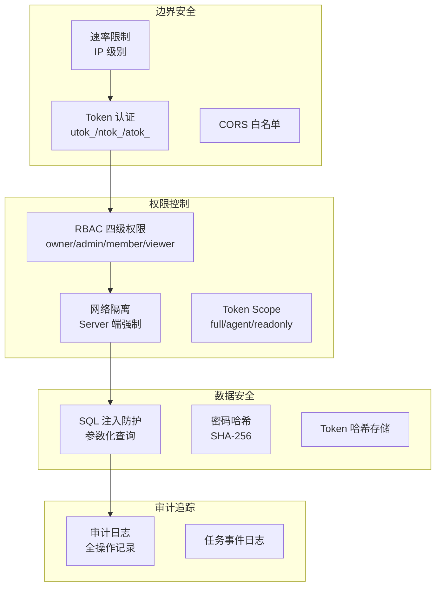
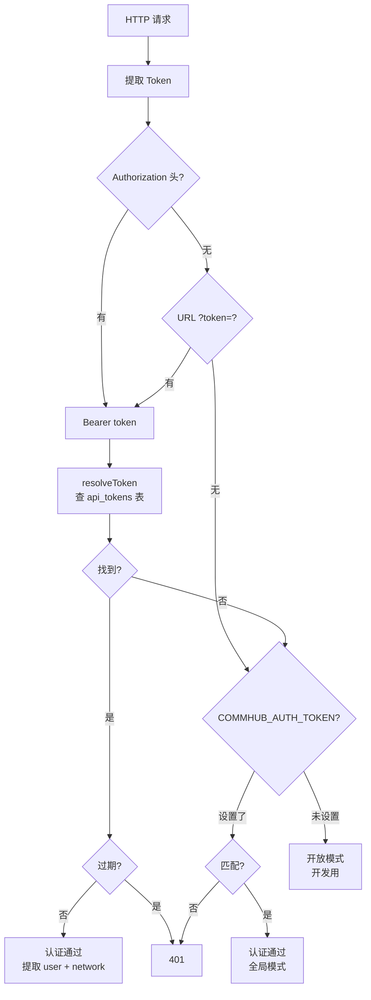

# 安全设计

Agent Network 的安全架构涵盖认证、授权、数据隔离、审计四个层面。

## 安全架构总览



## 认证（Authentication）

### Token 体系

三种 Token 满足不同场景：

| Token | 前缀 | 绑定 | 用途 |
|-------|------|------|------|
| 用户 Token | `utok_` | 用户 | CLI / Dashboard 登录 |
| 网络 Token | `ntok_` | 用户 + 网络 | Agent 连接 |
| API Token | `atok_` | 用户 + 可选网络 | 通用 API |

详见 [Token 体系](/concepts/tokens)。

### Token 存储

Token **不明文存储**在数据库中，使用 SHA-256 哈希：

```typescript
// 生成 Token
const token = generateUserToken();  // utok_xxxxxxxx

// 存储到数据库（只存哈希）
const hash = hashToken(token);  // SHA-256 hash
db.run("INSERT INTO api_tokens ... VALUES (?, ?)", [tokenId, hash]);

// 验证时
const inputHash = hashToken(inputToken);
const row = db.get("SELECT * FROM api_tokens WHERE token_hash = ?", inputHash);
```

### Token 验证流程



### 密码安全

- 密码使用 SHA-256 哈希存储
- 密码最少 6 位
- 用户名支持字母、数字、下划线、中文
- 登录失败不提示是用户名错还是密码错（防枚举）

::: info 改进计划
当前使用 SHA-256 哈希，计划升级为 bcrypt（更强的抗暴力破解能力）。
:::

## 授权（Authorization）

### RBAC 权限检查

每次 MCP 工具调用都进行权限检查：

```typescript
const canWrite = (): boolean => {
  if (!enforceUserId) return true;      // 全局 Token 模式
  if (!enforceNetworkId) return false;  // utok_ 没有网络 → 不能写
  const role = getUserNetworkRole(enforceUserId, enforceNetworkId);
  return !!role && role !== "viewer";   // owner/admin/member 可写
};
```

### Server 端网络强制

这是安全设计的核心 -- 网络 ID **不信任客户端**：

```typescript
// Server 从 Token 提取 network_id，不用客户端传入的
const getNetworkId = (clientNetId) => enforceNetworkId ?? clientNetId ?? null;
```

即使客户端传了 `network_id=other_network`，Server 会忽略，强制使用 Token 绑定的网络。

### REST API 权限

REST API 根据 Token 类型自动限制范围：

| Token 类型 | REST API 范围 |
|-----------|-------------|
| `ntok_` | 只能看绑定网络的数据 |
| `utok_` | 可以看用户所属的所有网络 |
| `atok_` (full) | 可以看用户所属的所有网络 |
| 全局 Token | 可以看所有数据 |
| 系统 admin | 可以看所有数据 |

## 速率限制（Rate Limiting）

### IP 级别限制

| 端点 | 限制 | 说明 |
|------|------|------|
| `POST /api/auth/register` | 30 次/分 | 防注册攻击 |
| `POST /api/auth/login` | 10 次/分 | 防暴力破解 |
| 其他 API | 60 次/分 | 通用限制 |

### 实现方式

```typescript
// 内存存储，per IP
const rateLimits = new Map<string, { count: number; resetAt: number }>();

function checkRateLimit(ip: string, maxPerMinute: number): boolean {
  // localhost 免限制（开发/测试）
  if (!ip || ip === "127.0.0.1" || ip === "::1") return true;

  const now = Date.now();
  const entry = rateLimits.get(ip);
  if (!entry || now > entry.resetAt) {
    rateLimits.set(ip, { count: 1, resetAt: now + 60000 });
    return true;
  }
  return entry.count++ < maxPerMinute;
}
```

超过限制返回 HTTP 429：

```json
{
  "error": "rate_limit_exceeded",
  "retry_after_seconds": 60
}
```

### 本地豁免

localhost (127.0.0.1 / ::1) 免速率限制，方便开发和测试。

## CORS 配置

```bash
# Flag does not exist — use env var instead
COMMHUB_CORS_ORIGINS="https://dashboard.example.com,http://localhost:3000" anet hub start

# 或单条
COMMHUB_CORS_ORIGINS="https://dashboard.example.com" anet hub start
```

默认 CORS 为 `*`（允许所有来源），生产环境建议配置白名单。

## 审计日志

所有关键操作记录到 `audit_log` 表：

```sql
CREATE TABLE audit_log (
  id         INTEGER PRIMARY KEY AUTOINCREMENT,
  user_id    TEXT,
  username   TEXT,
  action     TEXT NOT NULL,
  detail     TEXT,
  ip         TEXT,
  created_at TEXT DEFAULT (datetime('now'))
);
```

记录的操作包括：

| 操作 | 说明 |
|------|------|
| `register` | 用户注册 |
| `login` | 用户登录 |
| `create_network` | 创建网络 |
| `delete_network` | 删除网络 |
| `create_token` | 创建 Token |
| `revoke_token` | 撤销 Token |
| `change_password` | 修改密码 |
| `add_member` | 添加网络成员 |
| `remove_member` | 移除网络成员 |

### 查询审计日志

```bash
# Via REST API (no dedicated CLI command for audit log yet)
UTOK=$(jq -r .token ~/.anet/config.json)
curl -H "Authorization: Bearer $UTOK" "$HUB/api/audit-log?limit=50"
```

## SQL 注入防护

所有数据库操作使用参数化查询：

```typescript
// 正确：参数化查询
db.run("SELECT * FROM sessions WHERE alias = ?1", [alias]);

// 错误：字符串拼接（不使用）
db.run(`SELECT * FROM sessions WHERE alias = '${alias}'`);
```

全部 85+ 个 `db.query()` 调用都已迁移到参数化方式。

## 数据库安全

### SQLite WAL 模式

```sql
PRAGMA journal_mode = WAL;
PRAGMA busy_timeout = 5000;
```

- **WAL 模式**：支持并发读写，防止锁冲突
- **busy_timeout**：等待 5 秒再报错，处理并发请求

### 数据库文件权限

```bash
# 数据库文件权限建议
chmod 600 ~/.commhub/commhub.db
```

### 敏感数据

| 数据 | 存储方式 |
|------|---------|
| 密码 | SHA-256 哈希 |
| Token | SHA-256 哈希 |
| API Key | 不存储（环境变量） |
| 任务内容 | 明文（可加密） |
| 审计日志 | 明文 |

## 通信安全

### 建议配置

```bash
# 1. 使用 TLS（反向代理）
# nginx.conf
server {
    listen 443 ssl;
    ssl_certificate /path/to/cert.pem;
    ssl_certificate_key /path/to/key.pem;

    location / {
        proxy_pass http://127.0.0.1:9200;
    }
}

# 2. 防火墙限制
# 只允许特定 IP 访问 9200 端口
ufw allow from 10.0.0.0/8 to any port 9200

# 3. 设置 CORS
COMMHUB_CORS_ORIGINS="https://dashboard.example.com"
```

### SSE 连接安全

SSE 连接使用与 REST API 相同的认证机制（Bearer Token / URL token 参数）。

## Agent 运行时安全

### 隔离策略

每个 Agent Node 完全隔离，不读取宿主机配置：

```typescript
const agent = new Agent({
  settingSources: [],  // 不读任何全局配置
});
```

### 工具权限

通过 `--tools` 参数控制 Agent 可使用的工具：

```bash
# 限制只能读，不能写
anet node create my-agent --tools Read,Glob,Grep

# 全量工具（谨慎使用）
anet node create my-agent --tools all
```

### 预算控制

```bash
# 限制每任务花费
anet node create my-agent --max-budget 0.1
```

## 安全检查清单

### 生产部署

- [ ] `anet hub start` 后**立刻** `anet passwd` 改强密码（默认 `admin/anethub` 仅供本机快速上手）
- [ ] **不要**设置 `COMMHUB_AUTH_TOKEN` env（v0.8 软废弃 / v1.0 移除；新部署直接走 admin `utok_` bootstrap）
- [ ] 使用 TLS（HTTPS），Caddy 自动 cert
- [ ] 配置防火墙规则（只放 80/443）
- [ ] 配置 CORS 白名单 `COMMHUB_CORS_ORIGINS`
- [ ] Agent 节点用 ntok_（每个 agent 一个，hub 强制 network 锁）
- [ ] `~/.anet/server/admin-utok.json` 权限设为 600（v0.8 bootstrap 自动）
- [ ] 定期备份 `~/.commhub/commhub.db`
- [ ] 监控审计日志（`/api/audit-log`）

### Agent 节点

- [ ] 限制工具权限（不要 `--tools all`）
- [ ] 设置预算上限
- [ ] 使用 Docker 隔离
- [ ] 不在环境变量中硬编码密钥
- [ ] `.anet/` 加入 `.gitignore`
