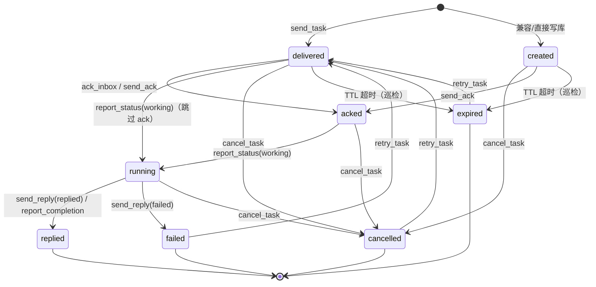
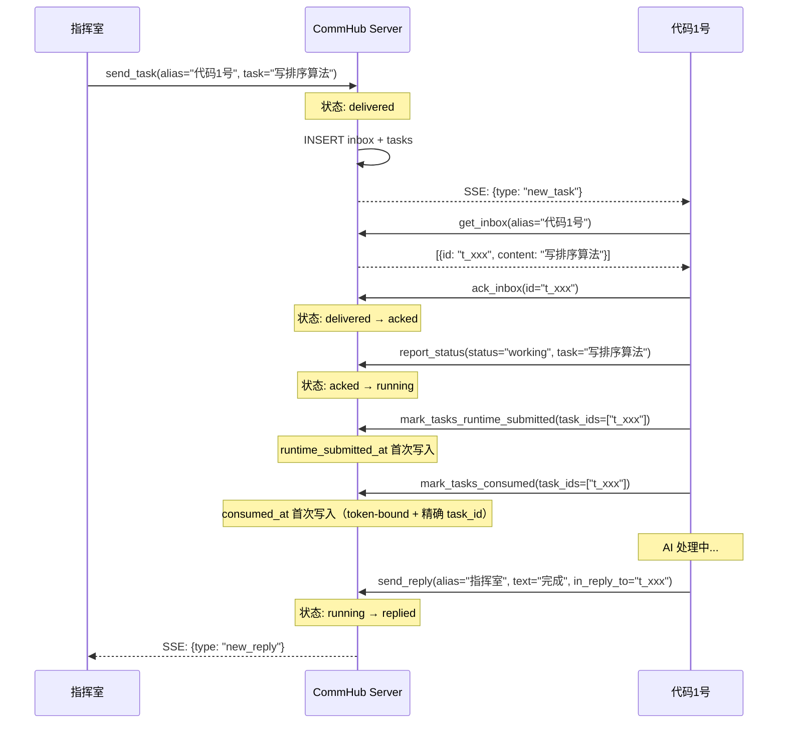
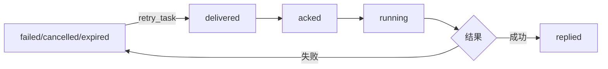
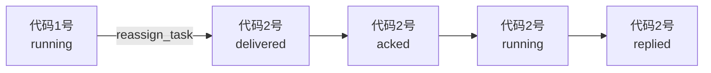
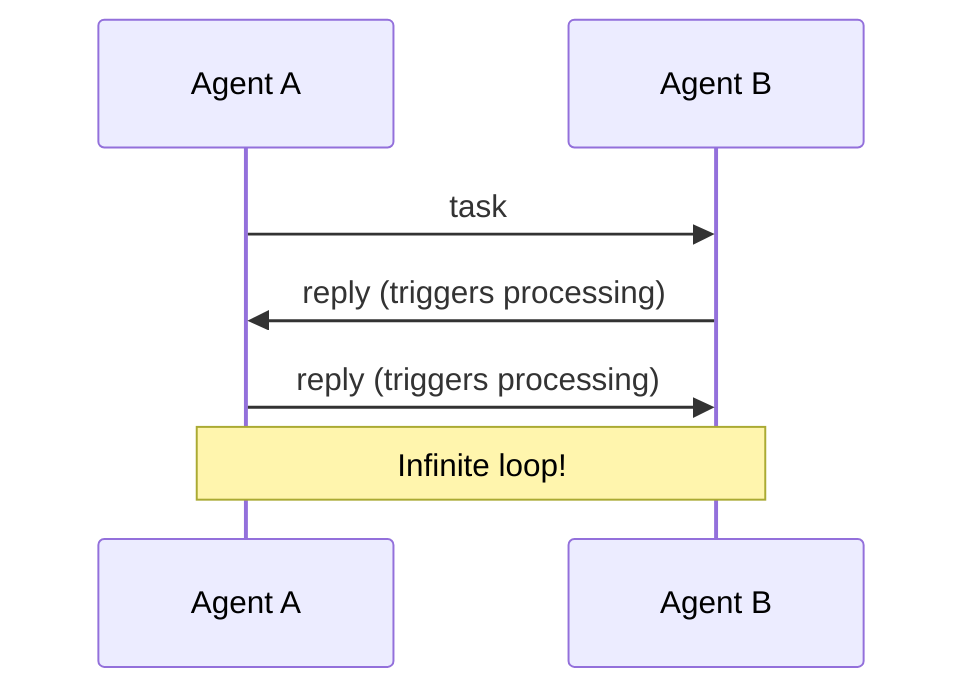

# 任务生命周期

Task（任务）是 Agent Network 中的核心数据单元。每个任务都有完整的生命周期，从创建到关闭。

## 状态机



::: warning `created` 在生产路径上基本不可见
`created` 是数据库默认值，但正常 REST/MCP 发送路径会直接写入 `delivered`。它只作为兼容兜底被 `cancel_task`、`send_ack` 和过期巡检接受；`ack_inbox` 只接受 `delivered`。因此正常调用中通常看不到 `created`。
:::

## 状态说明

| 状态 | 含义 | 触发动作 | 下一步 |
|------|------|---------|--------|
| `created` | Schema 默认值（DB column DEFAULT） | 仅在绕过 `send_task` 直接 INSERT 时出现 | 正常 API 路径不经过此状态 |
| `delivered` | 已投递到 inbox | 写入 inbox + SSE 推送 | 等待 Agent ack |
| `acked` | Agent 确认收到 | `ack_inbox` / `send_ack` | 等待 Agent 开始处理 |
| `running` | Agent 正在处理 | `report_status(working)` | 等待处理完成 |
| `replied` | 已回复结果 | `send_reply` / `report_completion` | 终态 |
| `failed` | 处理失败 | `send_reply(status=failed)` | 可重试 |
| `cancelled` | 已取消 | `cancel_task` | 可重试 |
| `expired` | TTL 超时 | 自动检测 | 可重试 |

### `runtime_submitted_at` 与 `consumed_at`：两级运行时证据

状态字段和消费证据是两条不同的轴。`delivered_at` 只证明 Hub 已把任务写入投递队列，`acked` 只证明常驻的 agent-node 进程取走了 inbox 行；二者都不能证明模型轮次已经开始。`started_at` 由兼容的 `report_status(working)` 路径维护，可能早于厂商运行时真正接手任务，因此不能单独用于判断“节点已唤醒模型”。

`runtime_submitted_at` 表示 agent-node 已把正文交给厂商 runtime（例如发出 prompt/turn 请求或写入受控共存会话），但尚不承诺模型已经开始推理。`consumed_at` 是更强的、只写一次的证据：agent-node 只有在当前 `task_id` 能归因到厂商运行时的 turn-start 或第一条活动事件后，才用自身 token-bound 身份上报。任务仍在 agent-node 本地队列中、仅完成 ACK、或进程在线但正文尚未交给 runtime 时，两个字段都保持 `null`；已经提交但尚无权威活动时只有 `runtime_submitted_at` 有值。两者是逻辑任务全生命周期的单调证据；重试或转派会保留已有值。新的 inbox 投递行通过 `task_id` 继续关联原逻辑任务，避免把延迟回调误认成另一个任务或丢掉已发生的事实。

不同运行时可提供的最早可靠信号不同；例如 Codex app-server 使用精确 `task_started`，Grok 共存桥使用精确匹配当前网络任务的 `network_user` 事件，而缺少可归因 start 事件的 OpenCode 共存模式要等到精确关联的 assistant response。后者更晚，但不会把“已入队”误报成“模型已接手”。

::: warning 不要用 `sessions.task` 判断模型是否已接手
兼容字段 `sessions.task` 同时会被派单路径写入任务原文、也会被节点的 `report_status(task=...)` 写入，并可能保留历史值。它是一个旧版展示字段，不是当前模型轮次的身份或消费确认。逐任务诊断请读取 `tasks.runtime_submitted_at` / `tasks.consumed_at`；节点存活只看心跳字段。
:::

### 终态（Terminal States）

以下状态是终态，不能再变更（除了 retry）：

- `replied` -- 任务成功完成
- `failed` -- 任务失败
- `cancelled` -- 任务被取消
- `expired` -- 任务过期

## 完整生命周期流程



## 双写机制

每个任务同时写入两张表：

| 表 | 用途 | 生命周期 |
|-----|------|---------|
| `inbox` | 消息投递队列 | ACK 后标记已处理 |
| `tasks` | 任务状态追踪 | 完整生命周期 |

```sql
-- send_task 时双写
INSERT INTO inbox (id, session_name, type, content, ...) VALUES (...);
INSERT INTO tasks (task_id, from_name, to_name, status, content, ...) VALUES (...);
```

`inbox` 负责消息的投递和 ACK，`tasks` 负责任务的状态追踪和历史查询。

## TTL 和过期

每个任务有 TTL（Time To Live），默认 1 小时：

```bash
# 设置 TTL
commhub_send_task(alias="代码1号", task="...", ttl_seconds=7200)  # 2 小时
```

| 参数 | 默认值 | 范围 |
|------|--------|------|
| `ttl_seconds` | 3600（1 小时） | 1 ~ 86400（1 天） |

过期任务可以通过 `retry_task` 重新投递。

```sql
-- 过期时间存在 tasks 表
expires_at = datetime('now', '+3600 seconds')
```

::: warning 过期巡检只覆盖 `created` / `delivered`
过期不是实时的：默认每 5 分钟运行一次 patrol，把 `expires_at < now` 且状态为 `created` 或 `delivered` 的任务改为 `expired`。可通过 `COMMHUB_TASK_PATROL_MS` 调整周期。

含义：
- 实际状态翻转最多比 `expires_at` 晚 ~5 分钟
- **已经 `acked` 或 `running` 的任务不会被自动过期** —— agent 已经接手了，即使超过 TTL patrol 也不动它（所以状态机图里没有 `acked → expired` 边）。要终止一个卡住的 `running` 任务用 [`cancel_task`](/api/mcp-tools#cancel-task)
:::

## 重试机制

失败、取消、过期的任务都可以重试：

::: tip
下面的管理调用走 REST `POST /mcp`。Claude Code channel wrapper 只暴露通信与状态工具，不提供 `cancel_task` / `retry_task` / `reassign_task` / `get_inbox`。
:::

```bash
# 重试任务（POST /mcp，tool=retry_task）
retry_task(task_id="t_xxx")
```

重试流程：

1. 验证任务状态为 `failed` / `cancelled` / `expired`
2. 重置任务状态为 `delivered`
3. 清除 result、completed_at、started_at；保留逻辑任务全生命周期的 runtime_submitted_at、consumed_at
4. 重设 expires_at（+1 小时）
5. 创建新的 inbox 条目，并用 task_id 关联原逻辑任务
6. SSE 推送 new_task



## 取消任务

可以取消尚未完成的任务：

```bash
# POST /mcp，tool=cancel_task
cancel_task(task_id="t_xxx", reason="不再需要")
```

取消会：

1. 更新任务状态为 `cancelled`
2. 标记 inbox 条目为已 ACK（防止 Agent 继续处理）
3. 记录取消原因到 result 字段
4. 记录 task_event

可取消状态是 `created` / `delivered` / `acked` / `running`。终态 `replied` / `failed` / `cancelled` / `expired` 不能直接取消。

## 转移任务

将任务从一个 Agent 转给另一个：

```bash
# POST /mcp，tool=reassign_task
reassign_task(task_id="t_xxx", new_alias="代码2号")
```

转移流程：

1. 标记原 Agent 的 inbox 条目为已 ACK
2. 更新 tasks.to_name 为新 Agent
3. 重置状态为 `delivered`
4. 创建新的 inbox 条目给新 Agent
5. SSE 推送 new_task 给新 Agent



## 消息类型

Agent Network 区分五种消息类型，只有 `task` 和 `broadcast` 触发 AI 处理：

| 类型 | 语义 | 触发 AI | 入 inbox | SSE 事件 |
|------|------|:-------:|:--------:|---------|
| `task` | 正式任务 | &check; | &check; | `new_task` |
| `reply` | 任务回复 | | &check; | `new_reply` |
| `message` | 聊天消息 | | &check; | `new_message` |
| `ack` | 纯确认 | | | (不推送) |
| `broadcast` | 广播 | &check; | &check; | `broadcast` |

### 为什么区分消息类型

如果所有消息都触发 AI 处理，会导致无限循环：



区分消息类型后，只有 `task` 和 `broadcast` 触发处理，`reply` 和 `message` 只展示不处理。

## 任务事件日志

每个状态变更都记录到 `task_events` 表：

```sql
CREATE TABLE task_events (
  id            INTEGER PRIMARY KEY AUTOINCREMENT,
  task_id       TEXT NOT NULL,
  from_status   TEXT,                                    -- 列名是 from_status 不是 from_state
  to_status     TEXT NOT NULL,                           -- 列名是 to_status 不是 to_state
  actor         TEXT NOT NULL DEFAULT 'system',          -- NOT NULL + 默认 'system'
  detail        TEXT,
  created_at    TEXT NOT NULL DEFAULT (datetime('now'))
);
```

查询任务事件：

```bash
# REST API（无 CLI 快捷方式 —— anet tasks 子命令仅支持 status（positional 或 --status）/ --limit 过滤，不支持 --detail）
curl "http://localhost:9200/api/task_events?task_id=t_xxx" \
  -H "Authorization: Bearer ntok_xxx"
```

示例输出：

```
Task t_a1b2c3d4 events:
  10:00:01  → delivered  by 指挥室  (→ 代码1号)
  10:00:03  delivered → acked  by 代码1号
  10:00:03  acked → running  by 代码1号
  10:00:15  running → replied  by 代码1号  (完成排序算法)
```

## 优先级

任务支持三种优先级：

| 优先级 | 含义 | inbox 排序 |
|--------|------|-----------|
| `high` | 紧急任务 | 排在最前 |
| `normal` | 普通任务 | 默认 |
| `low` | 低优先级 | 排在最后 |

```bash
# 发高优先级任务
commhub_send_task(alias="代码1号", task="紧急修复", priority="high")
```

Agent 拉取 inbox 时，自动按优先级排序：

```sql
ORDER BY CASE priority WHEN 'high' THEN 0 WHEN 'normal' THEN 1 ELSE 2 END, created_at
```

## 持久化字段

`tasks` 保存发送方、接收方、状态、优先级、内容、结果、过期时间、`network_id` 和可选的 `parent_task_id`；`inbox` 保存面向具体会话的投递记录。字段会随 migration 演进，集成方应使用 REST/MCP 契约，而不是依赖表列数量。

::: info `from_node_id` / `to_node_id` vs `from_name` / `to_name`
`*_node_id` 是持久节点 ID，`*_name` 是任务创建时的人类可读 alias。两者并存是为了在 alias 重命名后仍保留稳定关联；非 agent 发起的任务可使用 `from_name='hub'`。
:::

## 下一步

**实操**：
- 发任务的入口：`commhub_send_task`、Dashboard ChatPanel 或 REST `/api/tasks`；Hub 再通过 SSE 通知在线接收方
- 想看任务流：[Dashboard — Tasks 面板](/guide/dashboard#tasks-任务管理)
- 重试 / 取消失败任务：Dashboard 直接点按钮

**深入**：
- 为什么 task 和 message 是两套：看本节顶部"任务 vs 消息"对比
- network_id 字段怎么用：[网络与节点](/concepts/networks)
