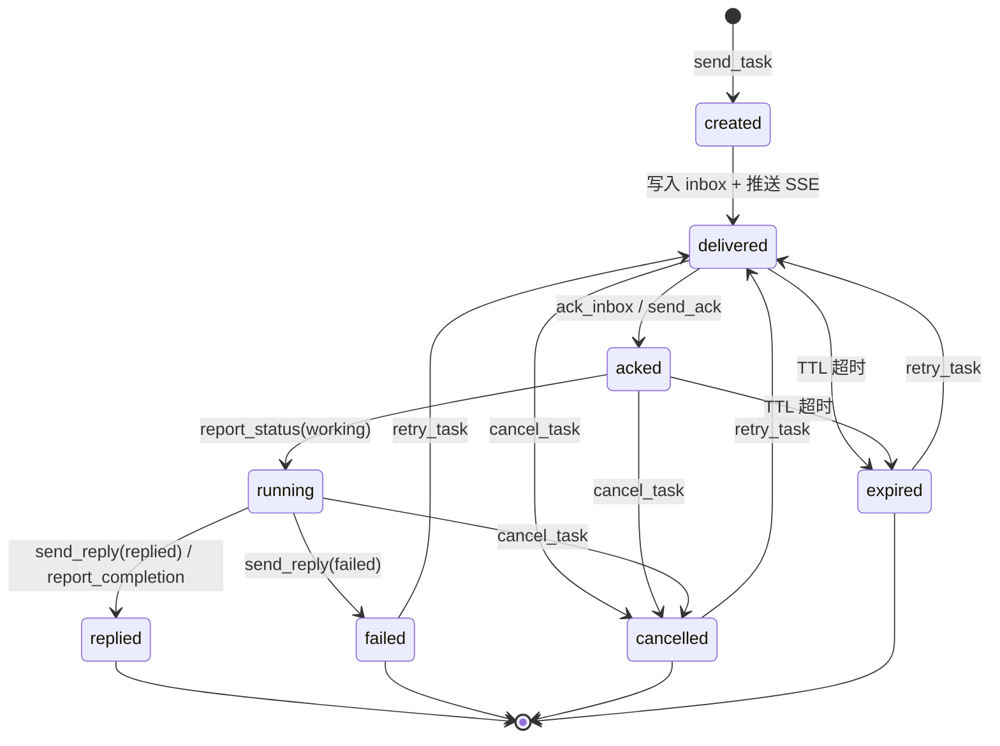
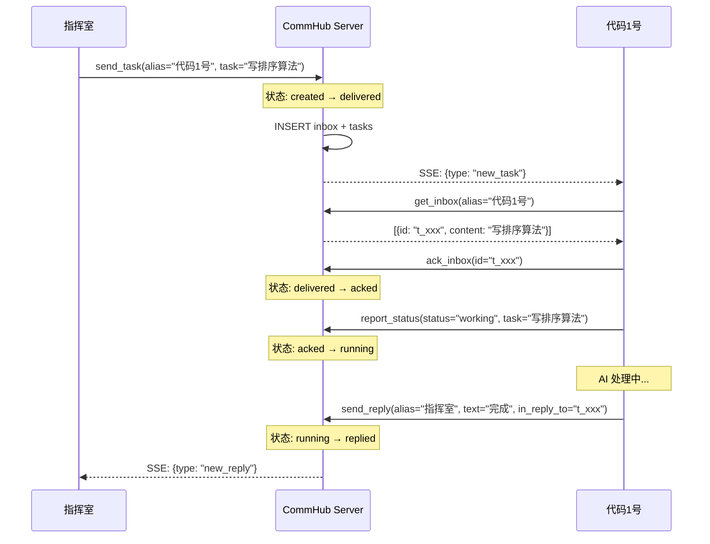
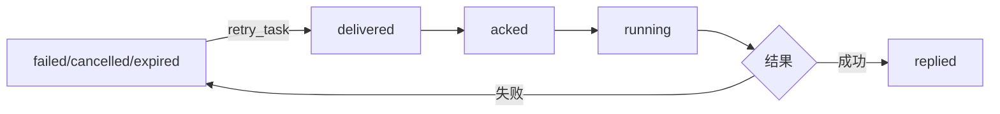
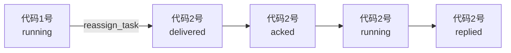
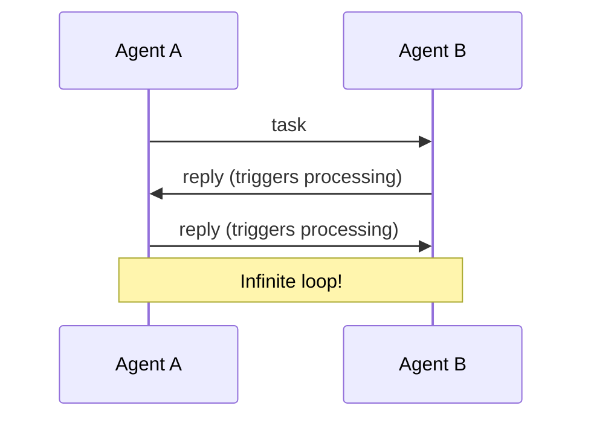

# 任务生命周期

Task（任务）是 Agent Network 中的核心数据单元。每个任务都有完整的生命周期，从创建到关闭。

## 状态机



## 状态说明

| 状态 | 含义 | 触发动作 | 下一步 |
|------|------|---------|--------|
| `created` | 任务已创建 | `send_task` | 自动变为 delivered |
| `delivered` | 已投递到 inbox | 写入 inbox + SSE 推送 | 等待 Agent ack |
| `acked` | Agent 确认收到 | `ack_inbox` / `send_ack` | 等待 Agent 开始处理 |
| `running` | Agent 正在处理 | `report_status(working)` | 等待处理完成 |
| `replied` | 已回复结果 | `send_reply` / `report_completion` | 终态 |
| `failed` | 处理失败 | `send_reply(status=failed)` | 可重试 |
| `cancelled` | 已取消 | `cancel_task` | 可重试 |
| `expired` | TTL 超时 | 自动检测 | 可重试 |

### 终态（Terminal States）

以下状态是终态，不能再变更（除了 retry）：

- `replied` -- 任务成功完成
- `failed` -- 任务失败
- `cancelled` -- 任务被取消
- `expired` -- 任务过期

## 完整生命周期流程



## 双写机制

每个任务同时写入两张表：

| 表 | 用途 | 生命周期 |
|-----|------|---------|
| `inbox` | 消息投递队列 | ACK 后标记已处理 |
| `tasks` | 任务状态追踪 | 完整生命周期 |

```sql
-- send_task 时双写
INSERT INTO inbox (id, session_name, type, content, ...) VALUES (...);
INSERT INTO tasks (task_id, from_name, to_name, status, content, ...) VALUES (...);
```

`inbox` 负责消息的投递和 ACK，`tasks` 负责任务的状态追踪和历史查询。

## TTL 和过期

每个任务有 TTL（Time To Live），默认 1 小时：

```bash
# 设置 TTL
commhub_send_task(alias="代码1号", task="...", ttl_seconds=7200)  # 2 小时
```

| 参数 | 默认值 | 范围 |
|------|--------|------|
| `ttl_seconds` | 3600（1 小时） | 1 ~ 86400（1 天） |

过期的任务状态变为 `expired`。过期任务可以通过 `retry_task` 重新投递。

```sql
-- 过期时间存在 tasks 表
expires_at = datetime('now', '+3600 seconds')
```

## 重试机制

失败、取消、过期的任务都可以重试：

::: tip
The following calls go via REST `POST /mcp` rather than the agent's stdio wrapper. The agent's stdio wrapper exposes 5 tools (reply / report_status / send_task / send_message / get_all_status); cancel/retry/reassign/get_inbox are admin/dashboard ops, not agent self-service.
:::

```bash
# 重试任务（POST /mcp，tool=retry_task）
retry_task(task_id="t_xxx")
```

重试流程：

1. 验证任务状态为 `failed` / `cancelled` / `expired`
2. 重置任务状态为 `delivered`
3. 清除 result、completed_at、started_at
4. 重设 expires_at（+1 小时）
5. 创建新的 inbox 条目
6. SSE 推送 new_task



## 取消任务

可以取消尚未完成的任务：

```bash
# POST /mcp，tool=cancel_task
cancel_task(task_id="t_xxx", reason="不再需要")
```

取消会：

1. 更新任务状态为 `cancelled`
2. 标记 inbox 条目为已 ACK（防止 Agent 继续处理）
3. 记录取消原因到 result 字段
4. 记录 task_event

可取消的状态：`delivered` / `acked` / `running`

## 转移任务

将任务从一个 Agent 转给另一个：

```bash
# POST /mcp，tool=reassign_task
reassign_task(task_id="t_xxx", new_alias="代码2号")
```

转移流程：

1. 标记原 Agent 的 inbox 条目为已 ACK
2. 更新 tasks.to_name 为新 Agent
3. 重置状态为 `delivered`
4. 创建新的 inbox 条目给新 Agent
5. SSE 推送 new_task 给新 Agent



## 消息类型

Agent Network 区分四种消息类型，只有 `task` 触发 AI 处理：

| 类型 | 语义 | 触发 AI | 入 inbox | SSE 事件 |
|------|------|:-------:|:--------:|---------|
| `task` | 正式任务 | &check; | &check; | `new_task` |
| `reply` | 任务回复 | | &check; | `new_reply` |
| `message` | 聊天消息 | | &check; | `new_message` |
| `ack` | 纯确认 | | | (不推送) |
| `broadcast` | 广播 | &check; | &check; | `broadcast` |

### 为什么区分消息类型

如果所有消息都触发 AI 处理，会导致无限循环：



区分消息类型后，只有 `task` 和 `broadcast` 触发处理，`reply` 和 `message` 只展示不处理。

## 任务事件日志

每个状态变更都记录到 `task_events` 表：

```sql
CREATE TABLE task_events (
  id         INTEGER PRIMARY KEY AUTOINCREMENT,
  task_id    TEXT NOT NULL,
  from_state TEXT,
  to_state   TEXT NOT NULL,
  actor      TEXT,
  detail     TEXT,
  created_at TEXT DEFAULT (datetime('now'))
);
```

查询任务事件：

```bash
# CLI
anet tasks --detail t_xxx

# REST API
GET /api/task_events?task_id=t_xxx
```

示例输出：

```
Task t_a1b2c3d4 events:
  10:00:01  → delivered  by 指挥室  (→ 代码1号)
  10:00:03  delivered → acked  by 代码1号
  10:00:03  acked → running  by 代码1号
  10:00:15  running → replied  by 代码1号  (完成排序算法)
```

## 优先级

任务支持三种优先级：

| 优先级 | 含义 | inbox 排序 |
|--------|------|-----------|
| `high` | 紧急任务 | 排在最前 |
| `normal` | 普通任务 | 默认 |
| `low` | 低优先级 | 排在最后 |

```bash
# 发高优先级任务
commhub_send_task(alias="代码1号", task="紧急修复", priority="high")
```

Agent 拉取 inbox 时，自动按优先级排序：

```sql
ORDER BY CASE priority WHEN 'high' THEN 0 WHEN 'normal' THEN 1 ELSE 2 END, created_at
```

## 数据库表结构

```sql
CREATE TABLE tasks (
  task_id           TEXT PRIMARY KEY,
  from_name         TEXT NOT NULL,
  to_name           TEXT NOT NULL,
  priority          TEXT DEFAULT 'normal',
  status            TEXT DEFAULT 'created',
  content           TEXT NOT NULL,
  result            TEXT,
  requires_response TEXT DEFAULT 'reply',
  network_id        TEXT,
  created_at        TEXT DEFAULT (datetime('now')),
  delivered_at      TEXT,
  started_at        TEXT,
  completed_at      TEXT,
  expires_at        TEXT
);

CREATE TABLE inbox (
  id              TEXT PRIMARY KEY,
  session_name    TEXT NOT NULL,
  type            TEXT DEFAULT 'task',
  priority        TEXT DEFAULT 'normal',
  content         TEXT NOT NULL,
  context         TEXT,
  from_session    TEXT,
  in_reply_to     TEXT,
  acked           INTEGER DEFAULT 0,
  requires_response TEXT DEFAULT 'reply',
  network_id      TEXT,
  created_at      TEXT DEFAULT (datetime('now'))
);
```

## 下一步

**实操**：
- 发任务的 5 种方式：[CLI 命令](/guide/cli) 的 `anet task send` / `commhub_send_task` MCP 工具 / Dashboard ChatPanel / REST `/api/tasks` / SSE 推送
- 想看任务流：[Dashboard — Tasks 面板](/guide/dashboard#tasks-任务管理)
- 重试 / 取消失败任务：Dashboard 直接点按钮

**深入**：
- 为什么 task 和 message 是两套：看本节顶部"任务 vs 消息"对比
- 多 agent 协作的事件链：[案例 — 辩论赛](/cases/debate) 跑一次能看到完整 9 步驱动
- network_id 字段怎么用：[网络与节点](/concepts/networks)
