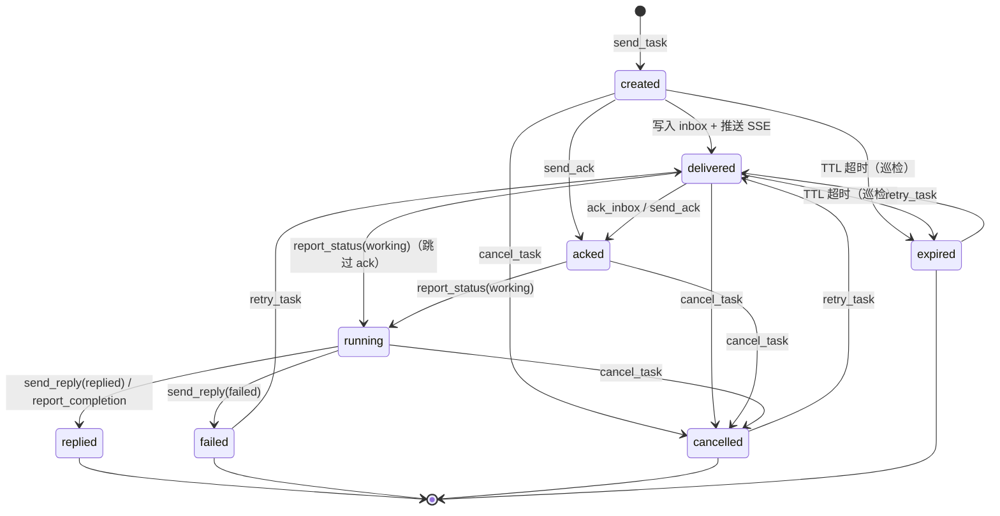
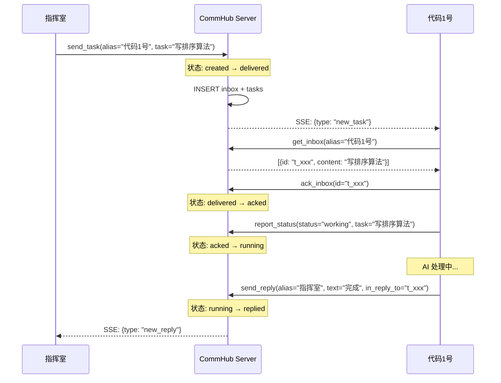
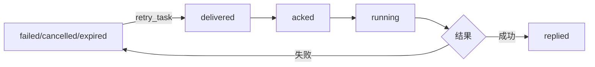
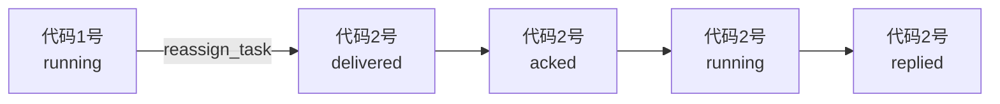
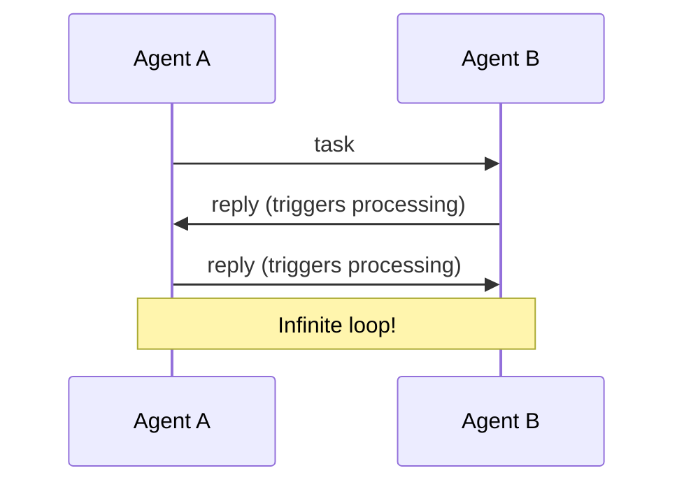

# 任务生命周期

Task（任务）是 Agent Network 中的核心数据单元。每个任务都有完整的生命周期，从创建到关闭。

## 状态机



::: warning `created` 在生产路径上基本不可见
状态机里的 `[*] → created → delivered` 是按 schema 默认值（[`server/src/db.ts:151`](https://github.com/sleep2agi/agent-network/blob/main/server/src/db.ts#L151) `status TEXT NOT NULL DEFAULT 'created'`）画的，但 **没有任何代码路径会把 `created` UPDATE 成 `delivered`**：[`server/src/tools.ts:637-639`](https://github.com/sleep2agi/agent-network/blob/main/server/src/tools.ts#L637) 的 `send_task` 在 INSERT 时就直接写 `VALUES (..., 'delivered', ...)`，跳过默认值。所以正常 API 流程里**永远观察不到** `created` 这个状态。

`created` 仍然作为防御性兜底出现在三条 WHERE 子句里：

| 操作 | 接受的当前状态 | 源码 |
|------|---------------|------|
| `cancel_task` | `created` / `delivered` / `acked` / `running` | [tools.ts:946](https://github.com/sleep2agi/agent-network/blob/main/server/src/tools.ts#L946) |
| `send_ack`（Hub tool） | `created` / `delivered` | [tools.ts:808](https://github.com/sleep2agi/agent-network/blob/main/server/src/tools.ts#L808) |
| 过期巡检（patrol） | `created` / `delivered` | [index.ts:390-392](https://github.com/sleep2agi/agent-network/blob/main/server/src/index.ts#L390) |
| `ack_inbox`（Agent tool） | `delivered`（**仅 1 个**） | [tools.ts:480](https://github.com/sleep2agi/agent-network/blob/main/server/src/tools.ts#L480) |

`ack_inbox` 和 `send_ack` 的 WHERE 子句不同 —— `ack_inbox`（agent 端 tool，L354）只接受 `delivered`，`send_ack`（hub 端 tool，L679）接受 `created` / `delivered` 两种。「4 个可取消状态」就是 `cancel_task` 那行；本节状态机图为简化未画 `created` 的出边，实际 SQL 允许（直接构造 DB row 走 INSERT 默认值才能进入 `created` 态，REST/MCP 没有这种入口）。
:::

## 状态说明

| 状态 | 含义 | 触发动作 | 下一步 |
|------|------|---------|--------|
| `created` | Schema 默认值（DB column DEFAULT） | 仅在绕过 `send_task` 直接 INSERT 时出现 | 正常 API 路径不经过此状态 |
| `delivered` | 已投递到 inbox | 写入 inbox + SSE 推送 | 等待 Agent ack |
| `acked` | Agent 确认收到 | `ack_inbox` / `send_ack` | 等待 Agent 开始处理 |
| `running` | Agent 正在处理 | `report_status(working)` | 等待处理完成 |
| `replied` | 已回复结果 | `send_reply` / `report_completion` | 终态 |
| `failed` | 处理失败 | `send_reply(status=failed)` | 可重试 |
| `cancelled` | 已取消 | `cancel_task` | 可重试 |
| `expired` | TTL 超时 | 自动检测 | 可重试 |

### 终态（Terminal States）

以下状态是终态，不能再变更（除了 retry）：

- `replied` -- 任务成功完成
- `failed` -- 任务失败
- `cancelled` -- 任务被取消
- `expired` -- 任务过期

## 完整生命周期流程



## 双写机制

每个任务同时写入两张表：

| 表 | 用途 | 生命周期 |
|-----|------|---------|
| `inbox` | 消息投递队列 | ACK 后标记已处理 |
| `tasks` | 任务状态追踪 | 完整生命周期 |

```sql
-- send_task 时双写
INSERT INTO inbox (id, session_name, type, content, ...) VALUES (...);
INSERT INTO tasks (task_id, from_name, to_name, status, content, ...) VALUES (...);
```

`inbox` 负责消息的投递和 ACK，`tasks` 负责任务的状态追踪和历史查询。

## TTL 和过期

每个任务有 TTL（Time To Live），默认 1 小时：

```bash
# 设置 TTL
commhub_send_task(alias="代码1号", task="...", ttl_seconds=7200)  # 2 小时
```

| 参数 | 默认值 | 范围 |
|------|--------|------|
| `ttl_seconds` | 3600（1 小时） | 1 ~ 86400（1 天） |

过期任务可以通过 `retry_task` 重新投递。

```sql
-- 过期时间存在 tasks 表
expires_at = datetime('now', '+3600 seconds')
```

::: warning 过期巡检只覆盖 `created` / `delivered`
verify [`server/src/index.ts:286-303`](https://github.com/sleep2agi/agent-network/blob/main/server/src/index.ts#L286)：过期不是实时的 —— 一个 **每 5 分钟跑一次的 patrol** 把 `expires_at < now` 且 **`status IN ('created', 'delivered')`** 的任务 UPDATE 成 `expired`。

含义：
- 实际状态翻转最多比 `expires_at` 晚 ~5 分钟
- **已经 `acked` 或 `running` 的任务不会被自动过期** —— agent 已经接手了，即使超过 TTL patrol 也不动它（所以状态机图里没有 `acked → expired` 边）。要终止一个卡住的 `running` 任务用 [`cancel_task`](/api/mcp-tools#cancel_task)
:::

## 重试机制

失败、取消、过期的任务都可以重试：

::: tip
下面的调用走 REST `POST /mcp`，不是 Claude Code agent 的 stdio channel wrapper。channel wrapper（[`channel/commhub-channel.ts:138-196`](https://github.com/sleep2agi/agent-network/blob/main/channel/commhub-channel.ts#L138)）只暴露 5 个 `commhub_*` tool（`commhub_reply` / `commhub_report_status` / `commhub_send_task` / `commhub_send_message` / `commhub_get_all_status`）；`cancel_task` / `retry_task` / `reassign_task` / `get_inbox` 属于管理 / Dashboard 操作，不对 agent self-service 开放。
:::

```bash
# 重试任务（POST /mcp，tool=retry_task）
retry_task(task_id="t_xxx")
```

重试流程：

1. 验证任务状态为 `failed` / `cancelled` / `expired`
2. 重置任务状态为 `delivered`
3. 清除 result、completed_at、started_at
4. 重设 expires_at（+1 小时）
5. 创建新的 inbox 条目
6. SSE 推送 new_task



## 取消任务

可以取消尚未完成的任务：

```bash
# POST /mcp，tool=cancel_task
cancel_task(task_id="t_xxx", reason="不再需要")
```

取消会：

1. 更新任务状态为 `cancelled`
2. 标记 inbox 条目为已 ACK（防止 Agent 继续处理）
3. 记录取消原因到 result 字段
4. 记录 task_event

可取消的状态：`created` / `delivered` / `acked` / `running`（4 个状态，verify [`server/src/tools.ts:817`](https://github.com/sleep2agi/agent-network/blob/main/server/src/tools.ts#L817) `WHERE status IN ('created', 'delivered', 'acked', 'running')` —— server 的 tool description 字符串只列 3 个少一个 `created`，实际 SQL 4 个；终态 `replied` / `failed` / `cancelled` / `expired` 不能直接 cancel，需先 retry 再 cancel）

## 转移任务

将任务从一个 Agent 转给另一个：

```bash
# POST /mcp，tool=reassign_task
reassign_task(task_id="t_xxx", new_alias="代码2号")
```

转移流程：

1. 标记原 Agent 的 inbox 条目为已 ACK
2. 更新 tasks.to_name 为新 Agent
3. 重置状态为 `delivered`
4. 创建新的 inbox 条目给新 Agent
5. SSE 推送 new_task 给新 Agent



## 消息类型

Agent Network 区分五种消息类型，只有 `task` 和 `broadcast` 触发 AI 处理：

| 类型 | 语义 | 触发 AI | 入 inbox | SSE 事件 |
|------|------|:-------:|:--------:|---------|
| `task` | 正式任务 | &check; | &check; | `new_task` |
| `reply` | 任务回复 | | &check; | `new_reply` |
| `message` | 聊天消息 | | &check; | `new_message` |
| `ack` | 纯确认 | | | (不推送) |
| `broadcast` | 广播 | &check; | &check; | `broadcast` |

### 为什么区分消息类型

如果所有消息都触发 AI 处理，会导致无限循环：



区分消息类型后，只有 `task` 和 `broadcast` 触发处理，`reply` 和 `message` 只展示不处理。

## 任务事件日志

每个状态变更都记录到 `task_events` 表（verify [`server/src/db.ts:134-147`](https://github.com/sleep2agi/agent-network/blob/main/server/src/db.ts#L134)）：

```sql
CREATE TABLE task_events (
  id            INTEGER PRIMARY KEY AUTOINCREMENT,
  task_id       TEXT NOT NULL,
  from_status   TEXT,                                    -- 列名是 from_status 不是 from_state
  to_status     TEXT NOT NULL,                           -- 列名是 to_status 不是 to_state
  actor         TEXT NOT NULL DEFAULT 'system',          -- NOT NULL + 默认 'system'
  detail        TEXT,
  created_at    TEXT NOT NULL DEFAULT (datetime('now'))
);
```

查询任务事件：

```bash
# REST API（无 CLI 快捷方式 —— anet tasks 子命令仅支持 status（positional 或 --status）/ --limit 过滤，不支持 --detail）
curl "http://localhost:9200/api/task_events?task_id=t_xxx" \
  -H "Authorization: Bearer ntok_xxx"
```

原 doc 写 `anet tasks --detail t_xxx` CLI 命令不存在（[`cli.ts:3059-3094 tasksCommand`](https://github.com/sleep2agi/agent-network/blob/main/agent-network/bin/cli.ts#L3059) 只解析 status（positional `args[1]` 或 `--status`）和 `--limit`，没 `--detail` 参数），用户跑会 hit `?` 占位输出。

示例输出：

```
Task t_a1b2c3d4 events:
  10:00:01  → delivered  by 指挥室  (→ 代码1号)
  10:00:03  delivered → acked  by 代码1号
  10:00:03  acked → running  by 代码1号
  10:00:15  running → replied  by 代码1号  (完成排序算法)
```

## 优先级

任务支持三种优先级：

| 优先级 | 含义 | inbox 排序 |
|--------|------|-----------|
| `high` | 紧急任务 | 排在最前 |
| `normal` | 普通任务 | 默认 |
| `low` | 低优先级 | 排在最后 |

```bash
# 发高优先级任务
commhub_send_task(alias="代码1号", task="紧急修复", priority="high")
```

Agent 拉取 inbox 时，自动按优先级排序：

```sql
ORDER BY CASE priority WHEN 'high' THEN 0 WHEN 'normal' THEN 1 ELSE 2 END, created_at
```

## 数据库表结构

下方是 v0.8 实际生效的 schema（含所有 ALTER TABLE migration 之后的字段）。CREATE TABLE 原文 + migrations 见 [`server/src/db.ts:88-111`](https://github.com/sleep2agi/agent-network/blob/main/server/src/db.ts#L88)（tasks 原 17 列）+ [`db.ts:326-328`](https://github.com/sleep2agi/agent-network/blob/main/server/src/db.ts#L326) (V3 给 `tasks` 等 6 张表加 `network_id`) + [`db.ts:415`](https://github.com/sleep2agi/agent-network/blob/main/server/src/db.ts#L415) (加 `parent_task_id`)。

```sql
-- 实际 tasks 表 19 列（原 17 + migration 2）
CREATE TABLE tasks (
  task_id           TEXT PRIMARY KEY,
  from_node_id      TEXT,
  from_name         TEXT NOT NULL DEFAULT 'hub',
  to_node_id        TEXT,
  to_name           TEXT NOT NULL,
  priority          TEXT NOT NULL DEFAULT 'normal',
  status            TEXT NOT NULL DEFAULT 'created',
  content           TEXT NOT NULL,
  result            TEXT,
  in_reply_to       TEXT,
  requires_response TEXT DEFAULT 'reply',
  scope             TEXT DEFAULT 'single',
  created_at        TEXT NOT NULL DEFAULT (datetime('now')),
  delivered_at      TEXT,
  started_at        TEXT,
  completed_at      TEXT,
  expires_at        TEXT,
  network_id        TEXT,           -- ALTER (V3)
  parent_task_id    TEXT            -- ALTER (子任务 chain)
);

-- 实际 inbox 表（原 9 + migration 5）
CREATE TABLE inbox (
  id                TEXT PRIMARY KEY,
  session_name      TEXT NOT NULL,
  type              TEXT DEFAULT 'task',
  priority          TEXT DEFAULT 'normal',
  content           TEXT NOT NULL,
  context           TEXT,
  from_session      TEXT DEFAULT 'hub',
  acked             INTEGER DEFAULT 0,
  created_at        TEXT NOT NULL DEFAULT (datetime('now')),
  in_reply_to       TEXT,           -- ALTER
  requires_response TEXT DEFAULT 'reply',  -- ALTER
  expires_at        TEXT,           -- ALTER
  scope             TEXT DEFAULT 'single', -- ALTER
  network_id        TEXT            -- ALTER (V3)
);
```

::: info `from_node_id` / `to_node_id` vs `from_name` / `to_name`
`*_node_id` 是**持久节点 ID**（跟 `nodes` 表 join 用，agent 删除后 task 还能回查 metadata）；`*_name` 是**当时的 alias** 字符串（人类可读，渲染表用）。两者并存是因为 alias 可以重命名/重用，但 node_id 永远唯一。`from_name` 默认 `'hub'`（非 agent 发起的 task）。
:::

## 下一步

**实操**：
- 发任务的 5 种方式：[CLI 命令](/guide/cli) 的 `anet task send` / `commhub_send_task` MCP 工具 / Dashboard ChatPanel / REST `/api/tasks` / SSE 推送
- 想看任务流：[Dashboard — Tasks 面板](/guide/dashboard#tasks-任务管理)
- 重试 / 取消失败任务：Dashboard 直接点按钮

**深入**：
- 为什么 task 和 message 是两套：看本节顶部"任务 vs 消息"对比
- 多 agent 协作的事件链：[案例 — 辩论赛](/cases/debate) 跑一次能看到完整 9 步驱动
- network_id 字段怎么用：[网络与节点](/concepts/networks)
