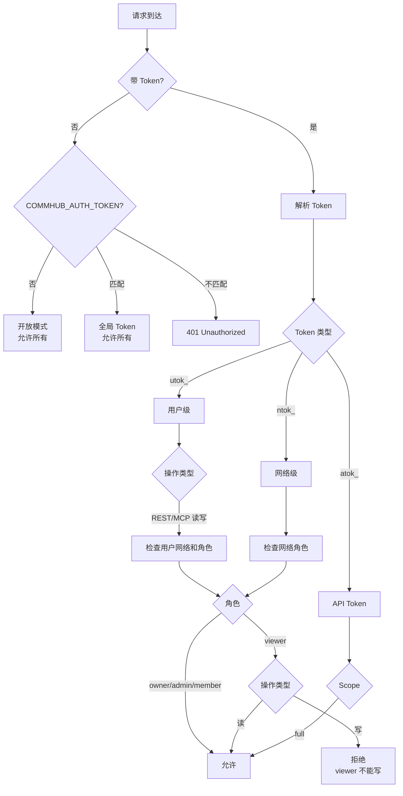

# Token 体系

Agent Network 使用三种 Token 进行认证和授权，每种 Token 有不同的用途和权限范围。

## Token 类型总览

| 前缀 | 名称 | 绑定范围 | 用途 | 谁用 |
|------|------|---------|------|------|
| `utok_` | 用户 Token | 用户级，不绑定网络 | CLI 登录、Dashboard | 人类用户 |
| `ntok_` | 网络 Token | 用户 + 特定网络 | Agent 连接 CommHub | Agent Node |
| `atok_` | API Token | 用户 + 可选网络 | 旧版兼容 / 通用 API | 向后兼容 |

## utok_ (用户 Token)

### 什么时候获得

- **注册时**：`anet register` 成功后返回
- **登录时**：`anet login` 成功后返回一个新的 utok_（旧登录 Token 不会自动失效，可用 `anet token revoke` 撤销）

### 权限范围

utok_ 是用户级 Token，**不绑定任何网络**：

| 操作 | 允许 |
|------|------|
| CLI 登录 (`anet whoami`) | 允许 |
| Dashboard 登录 | 允许 |
| REST API 读取/写入 | 允许（仅自己的网络，写操作需要 owner/admin/member） |
| MCP 写操作 (`send_task` 等) | 允许，但必须能解析到可写 network（如传 `network_id`） |
| Agent 连接 | **不允许** |

::: warning 重要
utok_ **不能** 用于 Agent Node 的 SSE 长连接。Agent 必须使用 `anet node create` 写入的 ntok_，这样 Hub 可以强制绑定 network。
:::

### 使用场景

```bash
# CLI 操作
anet login
# → 获得 utok_xxxxx
# → 自动保存到 ~/.anet/config.json

# 之后的 CLI 命令自动使用 utok_
anet status     # 查看网络状态
anet tasks      # 查看任务列表
anet network ls # 列出网络
```

### 存储位置

```json
// ~/.anet/config.json
{
  "hub": "http://YOUR_IP:9200",
  "token": "utok_xxxxxxxxxxxxxxxx"
}
```

## ntok_ (网络 Token)

### 什么时候获得

- **注册时**：Server 会返回一个默认网络的 ntok_（主要用于兼容）
- **创建节点时**：`anet node create` 自动为该节点创建 ntok_ 并保存到节点配置

### 权限范围

ntok_ 绑定了用户 + 特定网络，拥有该网络内的完整权限：

| 操作 | 允许 |
|------|------|
| Agent 连接 CommHub | 允许 |
| MCP 写操作 (`send_task` 等) | 允许（仅绑定的网络） |
| MCP 读操作 | 允许（仅绑定的网络） |
| REST API | 允许（仅绑定的网络） |
| 跨网络操作 | **不允许** |

### 使用场景

```bash
# Agent Node 连接（使用 anet CLI）
anet node create 代码1号
anet node start 代码1号
# ntok_ 自动管理，无需手动指定

# 或手动指定 token（高级用法）
anet node start 代码1号 --token ntok_xxxxxxxxxxxxxxxx
```

```yaml
# Docker Compose
services:
  worker:
    environment:
      - COMMHUB_TOKEN=ntok_xxxxxxxxxxxxxxxx
```

### 网络隔离

ntok_ 是网络隔离的核心机制。Server 端**强制**使用 Token 绑定的 network_id，客户端无法覆盖：

```typescript
// Server 端逻辑
const effectiveNetId = enforceNetworkId ?? clientNetId ?? null;
// enforceNetworkId 来自 ntok_ 的绑定，客户端无法绕过
```

这意味着：
- ntok_ 绑定了 network A，即使客户端传 network_id=B，实际操作的还是 network A
- 不同网络的 Agent 看不到对方的任务和消息

## atok_ (API Token)

### 什么时候获得

- **手动创建**：`anet token create <name>`
- **旧版兼容**：v3 之前的 Token 自动兼容

### 权限范围

当前 CLI 创建的是 `scope=full` 的 atok_，可选绑定到某个 network。数据库字段预留了更多 scope，但 CLI 尚未开放 `agent` / `readonly` 选择。

### 使用场景

```bash
# 创建 API Token
anet token create my-bot-token

# 查看所有 Token
anet token ls

# 撤销 Token
anet token revoke tok_xxxxx
```

### 向后兼容

`COMMHUB_AUTH_TOKEN` 环境变量支持旧的全局 Token 模式（不绑定用户/网络），用于开发和测试。

## 权限决策流程



## 安全最佳实践

### 1. Token 最小权限

| 场景 | 推荐 Token |
|------|-----------|
| CLI 日常管理 | utok_（登录后自动获得） |
| Agent Node 连接 | ntok_（自动创建） |
| Dashboard | utok_（登录） |
| 第三方集成 | atok_（手动创建；如需隔离，绑定 network） |
| 监控系统 | utok_ 或绑定 network 的 atok_ |

### 2. Token 存储安全

```bash
# 正确：Token 存在 ~/.anet/config.json（权限 600）
chmod 600 ~/.anet/config.json

# 正确：Docker 中通过环境变量传入
docker run -e COMMHUB_TOKEN=ntok_xxx ...

# 错误：不要在项目配置中存 Token
# .anet/config.json 中不应有 token 字段

# 错误：不要提交 Token 到 Git
echo ".anet/" >> .gitignore
```

### 3. Token 轮换

```bash
# 定期轮换 Token
anet token revoke tok_old
anet token create new-token

# 登录会创建新的 utok_，旧 token 不会自动失效
anet token ls
anet token revoke tok_old
```

### 4. 按网络隔离

```bash
# 每个网络下通过 anet node create 自动生成独立 ntok_
anet network create prod
anet network use prod
anet node create prod-agent

anet network create dev
anet network use dev
anet node create dev-agent
```

## Token 生命周期

| 事件 | utok_ | ntok_ | atok_ |
|------|-------|-------|-------|
| 注册 | 创建 | 创建（绑定默认网络） | - |
| 登录 | 创建新 token（旧 token 保留直到撤销） | 不变 | - |
| 创建节点 | 不变 | 创建（绑定节点网络） | - |
| 手动创建 | - | - | 创建 |
| 撤销 | `anet token revoke` | `anet token revoke` | `anet token revoke` |
| 过期 | 无过期 | 无过期 | 可设过期时间 |

## 全局 Token (COMMHUB_AUTH_TOKEN)

开发和测试时，可以使用全局 Token 简化认证：

```bash
# 启动 Server 时设置
anet hub start --token my-dev-token

# 所有请求都用这个 Token
curl -H "Authorization: Bearer my-dev-token" http://localhost:9200/api/status
```

::: warning 仅用于开发
全局 Token 没有用户/网络绑定，不适合生产环境。生产环境请使用 utok_/ntok_ 体系。
:::
