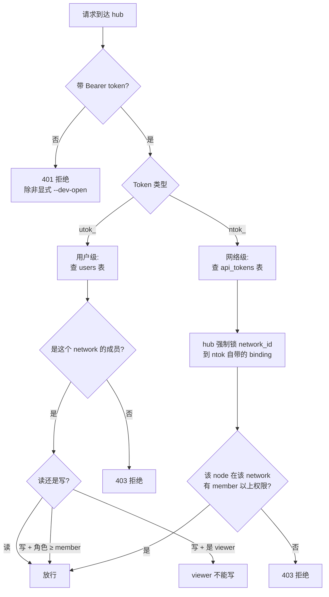

# Token 体系

::: tip 一句话
**日常你只有 2 个 token：`utok_`（你的）和 `ntok_`（每个 agent 的）。** 都是 CLI 自动管理，不用手输。本文 95% 内容讲这两个。
:::

## 简到不能再简的图

```
你（人）          ──── utok_ ────►   hub
                                       │
                                       │ 验证 OK 后发 ntok_ 给每个 agent
                                       ▼
你的 agent 节点 ──── ntok_ ────►   hub
```

完了。**你的 token 心智模型就这两个**。

---

## 1. `utok_`：你的 token（人面对）

### 怎么来的

```bash
anet login --username admin --password anethub
```

hub 验账号密码 OK，发一个 `utok_xxxxxxxx...` 给你。

> ℹ️ 首次 `anet hub start` 默认账户是 `admin / anethub`（快速上手）。**立刻用 `anet passwd` 改成你自己的强密码**。也可以 `anet hub start --username vincent --password mypass2026` 自定义。

### 存哪

```bash
~/.anet/config.json
```

里面长这样：
```json
{
  "hub": "http://hub:9200",
  "token": "utok_xxxxxxxxxxxxxxxx",
  "user": { "username": "admin", ... }
}
```

### 干啥用

CLI 自动带着它去调 hub：
- `anet status`、`anet tasks`、`anet network ls` — 全用它
- 浏览器登录 dashboard — 拿它换 cookie

**你不用手动输**。一次 `anet login` 之后就不用管它了。

### 不能干啥

- ❌ 不能给 agent 直连 hub 用（agent 必须用 `ntok_`）

---

## 2. `ntok_`：agent 的 token（每个 agent 一个）

### 怎么来的

```bash
anet node create 翻译官 --runtime claude-agent-sdk ...
```

CLI 在背后做了一件事：拿你的 `utok_` 找 hub 换一个 `ntok_xxxxxxxx...` 给"翻译官"这个 agent 用。

### 存哪

```bash
.anet/nodes/翻译官/config.json
```

里面长这样：
```json
{
  "node_name": "翻译官",
  "token": "ntok_xxxxxxxxxxxxxxxx",
  "network_id": "net_xxx",
  ...
}
```

### 干啥用

```bash
anet node start 翻译官
```

启动 agent 时，agent 拿 `ntok_` 跟 hub 建 SSE 长连接。**你也不用手动输**。

### 为啥每个 agent 一个

每个 `ntok_` 跟一个 `(agent, network)` 绑死，hub 端**强制**不允许跨网络。这是网络隔离的核心机制。

---

## 就这两个，没了。

完。 **你日常用 anet 接触的 token 只有这两个，CLI 全帮你管好**：

| 你做啥 | CLI 帮你管哪个 token |
|---|---|
| `anet login` | 写 `utok_` 到 `~/.anet/config.json` |
| `anet node create X` | 用 `utok_` 跟 hub 换 `ntok_`，写到 `.anet/nodes/X/config.json` |
| `anet node start X` | 拿 X 的 `ntok_` 连 hub SSE |
| `anet status` 等其他命令 | 自动用 `utok_` |

你**不需要**：
- ❌ 手动 copy/paste token 字符串
- ❌ 记住 token 是啥
- ❌ 知道 token 长啥样

---

# 运维补充：Bootstrap Admin Token

v0.8 起，`COMMHUB_AUTH_TOKEN` 进入软废弃。Hub 的长期身份统一收敛到用户 token：管理员也是 `utok_`，Agent 仍然是 `ntok_`。

首次 `anet hub start` 会自动创建 admin 用户，并把一个本机恢复用的 admin `utok_` 写到：

```bash
~/.anet/server/admin-utok.json
```

文件权限为 `600`，内容包含 `username`、`user_id`、`token`、`created_at`。它只用于本机运维命令和启动 Dashboard 的便利路径，不需要复制到别的机器。

::: warning
`~/.anet/server/config.json` 里的 `auth_token` 从 v0.8 开始会被忽略并打印迁移 warning。`COMMHUB_AUTH_TOKEN` 只保留软兼容到 v1.0，并且只允许少量 `/api/*` 读请求。
:::

---

## 法务 / 安全审计才看的部分

### Token 生命周期对照

| 事件 | utok_ | ntok_ |
|---|---|---|
| 部署 hub | 自动 bootstrap admin `utok_` 到 `admin-utok.json` | - |
| 注册账号 | 创建一个 | 附带创建一个绑默认网络 |
| 登录 | 创建一个新的（老的不自动失效） | 不变 |
| 改密码 | 当前设备换新 `utok_`，其他设备 `utok_` 失效 | 不变 |
| 创建 node | 不变 | 创建一个绑该 node + network |
| 删 node | 不变 | hub 撤销 |
| 手动撤销 | `anet token revoke <id>` | 同左 |

### 权限决策（hub 端怎么判断你能不能调）



### 安全实践

```bash
# 1. 配置文件 chmod 600（CLI 自动做，v0.8 bootstrap 也是 600）
chmod 600 ~/.anet/config.json ~/.anet/server/admin-utok.json

# 2. .anet/ 不要提交 git
echo ".anet/" >> .gitignore

# 3. v0.8 起公网部署，默认 admin/anethub 必须立刻改密
anet login --username admin --password anethub
anet passwd   # 改成强密码（≥ 8 位 + 非弱密码字典）
# 或者 bootstrap 时直接设你自己的：
anet hub start --username vincent --password 'mypass2026!'

# 4. 定期轮换登录 token
anet token ls                  # 看现有 utok_
anet token revoke tok_xxx      # 撤销老的
anet login                     # 重新登录拿新 utok_
```

---

## 历史兼容（不用关心）

### `atok_`

V2 时代有过 `atok_`（api token）。V3 改成 `utok_` + `ntok_` 体系。

代码里还保留对 `atok_` 前缀的兼容判断（不报错），但**新用户完全不需要接触**。`anet token create / ls / revoke` 命令底层走的都是 `utok_` / `ntok_`。

---

## FAQ

**Q：我每天接触几个 token？**
A：**0 个手动输入**。CLI 全自动管理。你只要 `anet login` 一次 + `anet node create` 每个 agent 一次，token 自动写文件，之后就不管了。

**Q：admin 账户的默认密码是什么？**
A：`admin / anethub`（快速上手默认）。**首次 `anet login` 之后立刻 `anet passwd` 改成你自己的强密码**（≥ 8 位 + 非弱密码）。也可以在 `anet hub start --username … --password …` 时直接传你想要的。

**Q：我在另一台服务器加 agent，要用 COMMHUB_AUTH_TOKEN 吗？**
A：**不要**。另一台服务器加 agent 只要：
1. `anet init --hub http://hub:9200`
2. `anet login --username admin --password anethub`
3. `anet node create xxx ...`
4. `anet node start xxx`

整个流程 0 接触 COMMHUB_AUTH_TOKEN。

**Q：utok_ 和 ntok_ 实际差别？**
A：`utok_` 是**你**的身份证，可跨 network。`ntok_` 是**某个 agent**在**某个 network** 的身份证，被 hub 锁死，跨不出去。

**Q：v0.5.x 没设 COMMHUB_AUTH_TOKEN 会怎样？**
A：v0.5 默认 open mode，匿名请求放行（R3 漏洞，**已于 v0.7 / v0.8 修掉**）。**v0.8+ 已完全不需要 `COMMHUB_AUTH_TOKEN`** —— hub 起来自动 bootstrap admin 用户，凭 `utok_` 鉴权；旧 master token 仅作为兼容路径打 deprecation warning，v1.0 移除。

**Q：升级 hub 到 v0.8+ 后，已有 agent 的 ntok_ 还能用吗？**
A：能用。`api_tokens` schema 不变。`COMMHUB_AUTH_TOKEN` env 即使设了也只会触发 deprecation warning，不影响 hub 启动 —— v0.8 hub 不再依赖 master token，直接 `anet hub start` 就能起。

## 下一步

- **CLI 操作**：[CLI 命令 — token 章节](/guide/cli)（`anet token ls/create/revoke`）
- **架构对应**：[架构概览 — 安全章节](/guide/architecture#安全架构)
- **完整安全模型**：[安全设计](/concepts/security)
- **升级指南**：从 v0.7 master token 模式升 v0.8 utok_/ntok_：[升级指南](/guide/upgrade#v0-7-v0-8-升级注意-最新)
- **RFC**：[RFC-001 — COMMHUB_AUTH_TOKEN 废弃路线图](https://github.com/sleep2agi/agent-network/blob/main/docs/rfcs/RFC-001-deprecate-commhub-auth-token.md)
