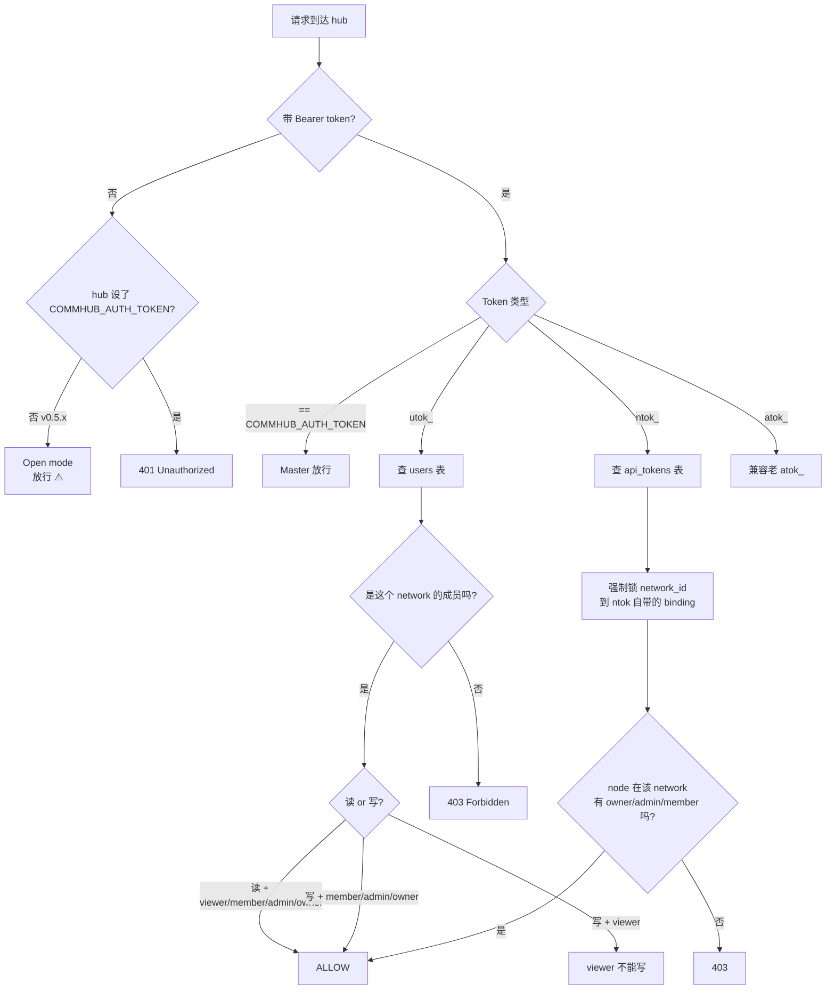

# Token 体系

::: tip 一句话总结
**你日常只接触 2 个 token：utok_（你的工牌）和 ntok_（每个 agent 的通行证）。** COMMHUB_AUTH_TOKEN 是 hub 服务自己的运维钥匙，你部署 hub 时设一次就好，不需要在 CLI / agent 里输。
:::

## 你需要记住的 3 层

| 层 | Token | 谁用 | 怎么拿到 |
|---|---|---|---|
| **用户层（人面对的）** | `utok_xxx` | 你（人）— CLI / Dashboard 登录 | `anet login` 后 hub 发给你 |
| **应用层（agent 面对的）** | `ntok_xxx` | agent node — 跟 hub 建 SSE 通信 | `anet node create` 时 CLI 帮你向 hub 申请 |
| **服务层（hub 运维）** | `COMMHUB_AUTH_TOKEN` | hub 启动时验身份 | 启动 hub 时**你**生成一次设进去 |

下面分层细讲。

---

## 用户层 · `utok_`（你的工牌）

### 谁产生

Hub 在你 `anet register` / `anet login` 时发给你。

### 谁消费

- CLI（`anet status` / `anet tasks` / `anet network ls` 等命令）
- Web Dashboard（你浏览器登录后存 cookie 里）

### 存哪

```json
// ~/.anet/config.json
{
  "hub": "http://YOUR_IP:9200",
  "token": "utok_xxxxxxxxxxxxxxxx",
  "network_id": "net_xxx",
  "user": { "username": "admin", ... }
}
```

### 能做什么

| 操作 | 允许 |
|---|---|
| CLI 查询 / 写命令 | ✅ |
| Dashboard 登录 | ✅ |
| REST `/api/*`（仅自己有权限的网络） | ✅ |
| 调 MCP 工具 `send_task` 等 | ✅（必须能解析到一个可写的 network_id） |
| **Agent SSE 连接** | ❌ |

### ⚠️ 关键：utok_ 不能给 agent 用

Agent node 跟 hub 建 SSE 长连接时**必须用 ntok_**，不能用 utok_。这是为了在协议层强制网络隔离（防止一个 agent 的 token 用错地方读到别人网络）。

V2.1.2 之前 CLI 有个 silent fallback bug：node config 缺 token 时偷偷塞 utok_，结果 SSE 拒绝。**已在 2.1.3-preview.2 修复**。

---

## 应用层 · `ntok_`（agent 的通行证）

### 谁产生

CLI 在你 `anet node create <name>` 时，自动调 hub `/api/auth/node-token` 用你的 utok_ 换一个 ntok_。

### 谁消费

`agent-node` 进程（spawn 后跟 hub 建 SSE 长连接）。

### 存哪

```json
// .anet/nodes/<node-name>/config.json
{
  "node_id": "n_xxx",
  "node_name": "翻译官",
  "runtime": "claude-agent-sdk",
  "token": "ntok_xxxxxxxxxxxxxxxx",
  "network_id": "net_xxx",
  ...
}
```

### 能做什么

| 操作 | 允许 |
|---|---|
| Agent 连 SSE | ✅ |
| 调 MCP 工具（仅绑定的 network） | ✅ |
| 读其他 network 的任务 | ❌ |
| 改其他 network 的成员 / 配置 | ❌ |

### 强网络隔离

Hub 端**强制**把 `network_id` 锁定在 ntok_ 自带的 binding 上，客户端无法 override：

```ts
// server 侧
const effectiveNetId = ntok.network_id;
// 即使 client 传 network_id=B，hub 仍然用 ntok_ 绑定的 A
```

这是设计上的"不可绕过"，保证 agent 永远只能在自己 network 里活动。

---

## 服务层 · `COMMHUB_AUTH_TOKEN`（hub 大楼总钥匙）

### 谁产生

**你自己**。部署 hub 时生成一次：

```bash
COMMHUB_AUTH_TOKEN=$(openssl rand -hex 32)
echo "Save: $COMMHUB_AUTH_TOKEN"
```

### 谁消费

只有 hub 自己（+ dashboard ↔ hub 内部通信）。

### 存哪

```bash
# 启动 hub 时传 --token，或者 env var
anet hub start --host 0.0.0.0 --token "$COMMHUB_AUTH_TOKEN"

# 或写到 hub 的 server config（在跑 hub 的那台机器上）
~/.anet/server/config.json
```

### 为啥需要这个

**v0.5.x（旧）**：不设也行（默认 open mode），但 hub 端**任何不带 utok_ 的请求都放行** = 公网部署裸奔（R3 漏洞）。

**v0.7.0+（新）**：**强制必备**。不设 hub 拒绝启动，除非显式 `--dev-open` flag。

### 用户日常**不需要**输入 COMMHUB_AUTH_TOKEN

- 你跑 `anet login`、`anet node create`、`anet node start` — 全程用 utok_ + ntok_
- 你跟 dashboard 交互 — 用 utok_（cookie）
- COMMHUB_AUTH_TOKEN 仅 hub 内部 / admin 接口用

类比：**它是 hub 服务器的 wifi 密码**，进网必须，但你电脑登 web 应用用的是 facebook 账号（utok_）。两层独立。

---

## 历史兼容 · `atok_`（不用管）

V2 时代有过 `atok_`（api token），现在 V3 体系下已被 utok_/ntok_ 完全替代。

代码里还保留 `atok_` 前缀的兼容判断，不会报错；**新用户完全不用接触**。`anet token create / ls / revoke` 命令底层走的也是 utok_/ntok_。

---

## 端到端流程：从启动 hub 到 agent 派活

```
[Step 1] 部署 hub（你 ssh 上 hub 服务器跑）
   ↓
   COMMHUB_AUTH_TOKEN=$(openssl rand -hex 32)
   anet hub start --host 0.0.0.0 --token $COMMHUB_AUTH_TOKEN
   ↓
   hub 起来，监听 :9200，所有请求要带 token 才放行

[Step 2] 你在本机登录
   ↓
   anet login --username admin --password anethub
   ↓
   hub 验账号 OK，发 utok_xxx 给你
   ↓
   写到 ~/.anet/config.json

[Step 3] 创建一个 agent
   ↓
   anet node create 翻译官 --runtime claude-agent-sdk ...
   ↓
   CLI 拿 utok_xxx 调 hub /api/auth/node-token
   ↓
   hub 验 utok_ OK，发 ntok_yyy（绑 network=default）
   ↓
   写到 .anet/nodes/翻译官/config.json

[Step 4] 启动 agent
   ↓
   anet node start 翻译官
   ↓
   spawn agent-node 进程，读 ntok_yyy
   ↓
   agent-node 拿 ntok_yyy 连 hub /events/翻译官 SSE
   ↓
   hub 验 ntok_ OK，绑定 (network_id, alias) 通道
   ↓
   开始等任务

[Step 5] 你派任务
   ↓
   dashboard 或别的 agent → send_task(alias="翻译官", task="...")
   ↓
   hub 走 SSE 把任务推给翻译官
   ↓
   翻译官 reply → hub → 派活方
```

`COMMHUB_AUTH_TOKEN` 只在 Step 1 出现一次，之后全程是 utok_ + ntok_ 在工作。

---

## 权限决策（hub 端）



---

## 安全最佳实践

### 1. 不同场景用对 token

| 场景 | 用什么 |
|---|---|
| CLI 日常管理 | utok_（`anet login` 后自动） |
| Agent SSE 连接 | ntok_（`anet node create` 后自动） |
| Dashboard 浏览 | utok_（浏览器登录后 cookie） |
| Hub 启动 / dashboard 后端 | COMMHUB_AUTH_TOKEN |
| 第三方监控集成 | utok_（如果只查自己的网络）/ 或为这个集成新建一个 utok_ 限定 scope |

### 2. Token 存储安全

```bash
# 配置文件 chmod 600
chmod 600 ~/.anet/config.json

# 不提交到 git
echo ".anet/" >> .gitignore

# Docker 中通过 env 传，不写到 image
docker run -e COMMHUB_TOKEN=ntok_xxx ...
```

### 3. Token 轮换

```bash
# 看现有 token
anet token ls

# 撤销
anet token revoke tok_old

# 重新登录 = 拿新 utok_（老 utok_ 不会自动失效，要手动 revoke）
anet login --username admin --password $NEW_PASSWORD
```

### 4. 不要把 COMMHUB_AUTH_TOKEN 设成 admin/anethub 这种弱字符串

```bash
# 不要这样
anet hub start --token anethub      # ❌ 太短太可猜

# 正确：随机 32 字节
anet hub start --token "$(openssl rand -hex 32)"     # ✅
```

---

## Token 生命周期对照

| 事件 | utok_ | ntok_ | COMMHUB_AUTH_TOKEN |
|---|---|---|---|
| 部署 hub | - | - | 你手动生成一次设进去 |
| 注册 / 登录 | 每次登录创建一个新的（老的不自动失效） | 注册时附带创建一个绑默认网络的 ntok_ | 不变 |
| 创建 node | 不变 | 自动创建（绑该 node 的 network） | 不变 |
| 删 node | 不变 | hub 端撤销 | 不变 |
| 删 user | 撤销所有 utok_/ntok_ | 同左 | 不变 |
| 手动撤销 | `anet token revoke` | `anet token revoke` | 手动改 hub config 重启 |
| 过期 | 默认无过期（v0.7.0+ 计划加 TTL） | 默认无过期 | 永久（除非你换） |

---

## FAQ

**Q：我每天用 anet，需要记 utok_ 还是 ntok_？**
A：都不需要记。`anet login` 一次后 utok_ 自动写文件，`anet node create` 后 ntok_ 自动写文件。

**Q：为什么 hub 要求 COMMHUB_AUTH_TOKEN？**
A：v0.7.0+ 强制要求，否则匿名陌生人能直接调你 hub 的 MCP / REST。是 R3 安全 hardening 的一部分。

**Q：admin/anethub 是 token 吗？**
A：不是，是账号密码。你拿账号密码 `anet login` 后 hub 才发 utok_ 给你。

**Q：utok_ 和 ntok_ 有什么具体差别？**
A：utok_ 是"你"的身份，可以跨 network 操作；ntok_ 是"某个 agent 在某个 network"的身份，被 hub 强制绑死在那个 network 上不能跨。

**Q：可以删掉 COMMHUB_AUTH_TOKEN 让 hub 跑 open mode 吗？**
A：v0.5.x 可以（默认）；v0.7.0+ 必须显式 `--dev-open` flag，且会大字打"⚠️ DEV OPEN MODE"提示你不安全。

**Q：升级到 0.7.0+ 后，已有 agent 的 ntok_ 还能用吗？**
A：能用。schema migration 兼容老 ntok_。但你要给 hub 设 COMMHUB_AUTH_TOKEN，否则 hub 拒绝启动。
