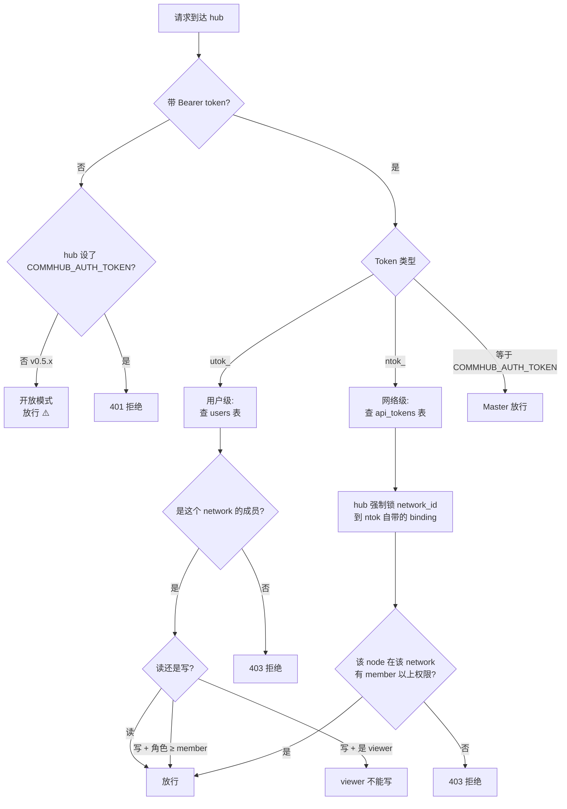

# Token 体系

::: tip 一句话
**日常你只有 2 个 token：`utok_`（你的）和 `ntok_`（每个 agent 的）。** 都是 CLI 自动管理，不用手输。本文 95% 内容讲这两个。
:::

## 简到不能再简的图

```
你（人）          ──── utok_ ────►   hub
                                       │
                                       │ 验证 OK 后发 ntok_ 给每个 agent
                                       ▼
你的 agent 节点 ──── ntok_ ────►   hub
```

完了。**你的 token 心智模型就这两个**。

---

## 1. `utok_`：你的 token（人面对）

### 怎么来的

```bash
anet login --username admin --password anethub
```

hub 验账号密码 OK，发一个 `utok_xxxxxxxx...` 给你。

### 存哪

```bash
~/.anet/config.json
```

里面长这样：
```json
{
  "hub": "http://hub:9200",
  "token": "utok_xxxxxxxxxxxxxxxx",
  "user": { "username": "admin", ... }
}
```

### 干啥用

CLI 自动带着它去调 hub：
- `anet status`、`anet tasks`、`anet network ls` — 全用它
- 浏览器登录 dashboard — 拿它换 cookie

**你不用手动输**。一次 `anet login` 之后就不用管它了。

### 不能干啥

- ❌ 不能给 agent 直连 hub 用（agent 必须用 `ntok_`）

---

## 2. `ntok_`：agent 的 token（每个 agent 一个）

### 怎么来的

```bash
anet node create 翻译官 --runtime claude-agent-sdk ...
```

CLI 在背后做了一件事：拿你的 `utok_` 找 hub 换一个 `ntok_xxxxxxxx...` 给"翻译官"这个 agent 用。

### 存哪

```bash
.anet/nodes/翻译官/config.json
```

里面长这样：
```json
{
  "node_name": "翻译官",
  "token": "ntok_xxxxxxxxxxxxxxxx",
  "network_id": "net_xxx",
  ...
}
```

### 干啥用

```bash
anet node start 翻译官
```

启动 agent 时，agent 拿 `ntok_` 跟 hub 建 SSE 长连接。**你也不用手动输**。

### 为啥每个 agent 一个

每个 `ntok_` 跟一个 `(agent, network)` 绑死，hub 端**强制**不允许跨网络。这是网络隔离的核心机制。

---

## 就这两个，没了。

完。 **你日常用 anet 接触的 token 只有这两个，CLI 全帮你管好**：

| 你做啥 | CLI 帮你管哪个 token |
|---|---|
| `anet login` | 写 `utok_` 到 `~/.anet/config.json` |
| `anet node create X` | 用 `utok_` 跟 hub 换 `ntok_`，写到 `.anet/nodes/X/config.json` |
| `anet node start X` | 拿 X 的 `ntok_` 连 hub SSE |
| `anet status` 等其他命令 | 自动用 `utok_` |

你**不需要**：
- ❌ 手动 copy/paste token 字符串
- ❌ 记住 token 是啥
- ❌ 知道 token 长啥样

---

# 下面是高级 / 运维内容

::: warning 普通用户不用看
下面是部署 hub 的人（运维 / DevOps）才需要了解的。如果你只是**用 anet 接入别人的 hub**，到这里就够了，下面跳过。
:::

---

## 高级 · 部署 hub 才会碰到的 `COMMHUB_AUTH_TOKEN`

### 是啥

Hub 服务器自己的"启动口令"。**只有 hub 自己内部用**，给 hub 进程验证调用者身份。

### 谁会碰

- **部署 hub 的人**（启动 hub 时设一次）
- **dashboard 后端**（自动跟 hub 同机读取）
- **管理员 curl hub admin 接口**（如审计日志、wipe-db 等）

### 普通 agent 用户不接触

- 用 anet CLI 在另一台机器加 agent → **不需要**
- 浏览器登录 dashboard → **不需要**
- 写代码用 SDK 调 hub → **不需要**

类比：你住公寓不需要知道大楼的"主电闸密码"，只有物业管理员碰它。

### 怎么用

部署 hub 时（**仅一次**）：

```bash
# 在 hub 服务器上
COMMHUB_AUTH_TOKEN=$(openssl rand -hex 32)
echo "记下来：$COMMHUB_AUTH_TOKEN"
anet hub start --host 0.0.0.0 --token $COMMHUB_AUTH_TOKEN
```

设好后再也不用碰。CLI 会把它写到 `~/.anet/server/config.json`，下次重启 hub 自动读。

::: tip v0.7.0+ 之后会更简单
`anet hub start` 不带 `--token` 时会**自动生成**一个随机 token 写到 `~/.anet/server/config.json`，你完全不用管。
:::

### 不设会怎样

- **v0.5.x（老）**：可以不设（默认 open mode），但 hub 公网部署 = 谁都能匿名调你 hub 接口（R3 安全漏洞）
- **v0.7.0+（新）**：必须设。不设 hub 拒绝启动（除非显式加 `--dev-open` flag）

### Dashboard 跟 hub 不同机部署

如果 dashboard 部署在另一台机器（不是 hub 那台），dashboard 启动时要把 hub 的 `COMMHUB_AUTH_TOKEN` 传过去：

```bash
COMMHUB_AUTH_TOKEN=<hub 的 token> anet hub dashboard
```

同机部署不用，CLI 自动读。

---

## 法务 / 安全审计才看的部分

### Token 生命周期对照

| 事件 | utok_ | ntok_ | COMMHUB_AUTH_TOKEN |
|---|---|---|---|
| 部署 hub | - | - | 启动 hub 时手动设 / 自动生成 |
| 注册账号 | 创建一个 | 附带创建一个绑默认网络 | - |
| 登录 | 创建一个新的（老的不自动失效） | 不变 | - |
| 创建 node | 不变 | 创建一个绑该 node + network | - |
| 删 node | 不变 | hub 撤销 | - |
| 删 user | 全部撤销 | 同左 | - |
| 手动撤销 | `anet token revoke <id>` | 同左 | 改 hub config 重启 |
| 过期 | 无（v0.7.0+ 计划加 TTL） | 无 | 永久（除非你换） |

### 权限决策（hub 端怎么判断你能不能调）



### 安全实践

```bash
# 1. 配置文件 chmod 600（CLI v0.7.0+ 会自动做）
chmod 600 ~/.anet/config.json ~/.anet/server/config.json

# 2. .anet/ 不要提交 git
echo ".anet/" >> .gitignore

# 3. COMMHUB_AUTH_TOKEN 用强随机字符串，别用 "anethub" 这种弱字符串
anet hub start --token "$(openssl rand -hex 32)"   # ✅
anet hub start --token "anethub"                    # ❌ 太可猜

# 4. 定期轮换登录 token
anet token ls                  # 看现有 utok_
anet token revoke tok_xxx      # 撤销老的
anet login                     # 重新登录拿新 utok_
```

---

## 历史兼容（不用关心）

### `atok_`

V2 时代有过 `atok_`（api token）。V3 改成 `utok_` + `ntok_` 体系。

代码里还保留对 `atok_` 前缀的兼容判断（不报错），但**新用户完全不需要接触**。`anet token create / ls / revoke` 命令底层走的都是 `utok_` / `ntok_`。

---

## FAQ

**Q：我每天接触几个 token？**
A：**0 个手动输入**。CLI 全自动管理。你只要 `anet login` 一次 + `anet node create` 每个 agent 一次，token 自动写文件，之后就不管了。

**Q：admin / anethub 是 token 吗？**
A：不是。是账号密码。用账号密码 `anet login` 后才换到 `utok_`。

**Q：我在另一台服务器加 agent，要用 COMMHUB_AUTH_TOKEN 吗？**
A：**不要**。另一台服务器加 agent 只要：
1. `anet init --hub http://hub:9200`
2. `anet login --username admin --password ...`
3. `anet node create xxx ...`
4. `anet node start xxx`

整个流程 0 接触 COMMHUB_AUTH_TOKEN。

**Q：utok_ 和 ntok_ 实际差别？**
A：`utok_` 是**你**的身份证，可跨 network。`ntok_` 是**某个 agent**在**某个 network** 的身份证，被 hub 锁死，跨不出去。

**Q：v0.5.x 没设 COMMHUB_AUTH_TOKEN 会怎样？**
A：默认 open mode，匿名请求放行。R3 安全漏洞 — 公网部署等于裸奔。v0.7.0+ 强制要求设。

**Q：升级 hub 到 0.7.0+ 后，已有 agent 的 ntok_ 还能用吗？**
A：能用。schema migration 兼容老 ntok_。但 hub 启动必须设 `COMMHUB_AUTH_TOKEN`，否则起不来。
