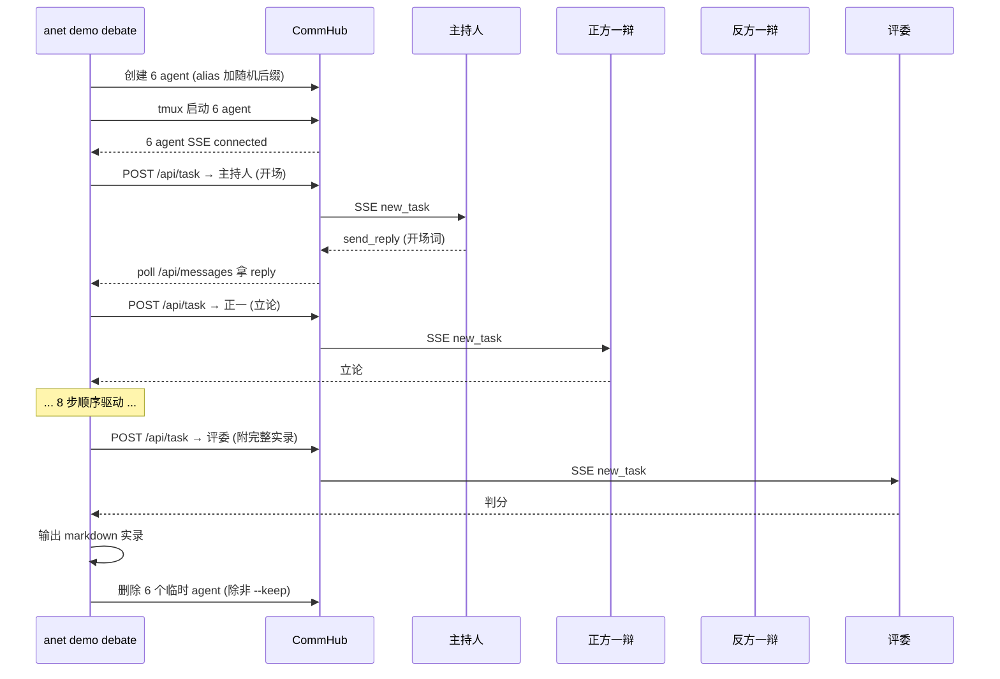

# 辩论赛 Demo (`anet demo debate`)

一键起 6 个 AI agent 跑一场完整辩论赛，自动输出 markdown 实录。适合录屏传播 / 给团队演示多 agent 协作。

## 一句话跑

```bash
anet demo debate --topic "AI 创造的岗位是否比消灭的多"
```

预计 8-12 分钟跑完。需要先 `anet login` 到 hub + 准备 MiniMax key（Token Plan）。

## 6 个角色

| 角色 | 姓名 | 个性 | 职责 |
|------|------|------|------|
| 主持人 | 周老师 | 节奏感强 | 开场介绍议题 + 闭幕回顾 |
| 正方一辩 | 林希 | 逻辑严密 | 立论 + 总结陈词 |
| 正方二辩 | 陈一川 | 犀利好斗 | 质询反方 |
| 反方一辩 | 沈墨 | 冷静现实派 | 立论 + 总结陈词 |
| 反方二辩 | 白川 | 辛辣直接 | 质询正方 |
| 评委 | 张教授 | 公允深刻 | 打分 + 宣判胜负 |

每个角色独立 `systemPrompt`，跑同样 LLM（MiniMax-M2.7）但表现差异明显。

## 流程（9 步）

1. 主持人开场（议题 + 流程）
2. 正方一辩立论
3. 反方一辩立论（带正一立论作 context）
4. 正方二辩质询反一
5. 反方二辩质询正一
6. 反方一辩总结陈词
7. 正方一辩总结陈词
8. 评委打分判胜负
9. 主持人闭幕

加 `--quick` 走 4 步简化版（开场 → 双方立论 → 评委判分），约 4 分钟跑完。

## 参数

| Flag | 默认 | 说明 |
|------|------|------|
| `--topic <text>` | 交互输入 | 辩题 |
| `--key <key>` | `$MINIMAX_KEY` 或交互 | MiniMax API key |
| `--out <path>` | `./debate-<topic>-<ts>.md` | 实录保存路径 |
| `--keep` | false | 跑完保留 6 个临时 agent（默认执行清理流程） |
| `--quick` | false | 4 步简化版 |
| `--step-timeout <s>` | 360 | 每步超时秒数 |
| `--suffix <s>` | 随机 4 hex | alias 后缀（避免重名冲突） |

## Network 绑定

当前实现会把脚本派发的任务绑定到登录用户的默认 network；如果 `/api/auth/me` 没返回默认 network，会退回到 network 列表里的 `default` 或第一项。这样可以避免 `ntok_` 作用域 agent 收到 SSE 但拉不到 inbox。

注意：当前 `anet demo debate` 不会为每次运行自动创建独立 network。为了让 demo 数据和日常网络隔离，先手动切到一个临时 network 再运行：

```bash
anet network create debate-demo
anet network use debate-demo
anet demo debate --topic "..."
```

## 工作机制



## 示例输出

终端：
```
  🎙️  辩题: AI 创造的岗位是否比消灭的多
  📡 Hub:  http://47.116.5.73:9200
  🆔 Run:  1a2b

  [1/4] 创建 6 个 agent (alias 后缀 -1a2b)...
        ✓ 创建/更新 6 个 agent
  [2/4] 启动 6 个 agent (tmux session)...
        ✓ 6 agent 全部 SSE connected
  [3/4] 驱动辩论流程 (9 步)...
  [1/9] 开场 (主持人-1a2b) ... ✓ 21s, 361 字
  [2/9] 正一立论 (正方一辩-1a2b) ... ✓ 85s, 619 字
  [3/9] 反一立论 (反方一辩-1a2b) ... ✓ 100s, 1031 字
  [4/9] 正二质询 (正方二辩-1a2b) ... ✓ 44s, 549 字
  [5/9] 反二质询 (反方二辩-1a2b) ... ✓ 77s, 629 字
  [6/9] 反一总结 (反方一辩-1a2b) ... ✓ 38s, 537 字
  [7/9] 正一总结 (正方一辩-1a2b) ... ✓ 95s, 484 字
  [8/9] 评委判分 (评委-1a2b) ... ✓ 110s, 1122 字
  [9/9] 闭幕 (主持人-1a2b) ... ✓ 19s, 172 字
  [4/4] 写入实录: ./debate-AI创造的岗位是否比消灭的多-1714766365.md

  🧹 清理 6 个 agent (用 --keep 跳过)...
        ✓ 清理完成

  🏁 完成！实录: ./debate-AI创造的岗位是否比消灭的多-1714766365.md
```

实录文件结构（markdown）：
```markdown
# 辩论赛实录

**议题**: AI 创造的岗位是否比消灭的多
**时间**: 2026-05-03 22:01:18
**Run**: 1a2b

## 1. 开场 — 主持人

【开场】
各位观众朋友们...

## 2. 正一立论 — 正方一辩
...
```

## 自定义议题建议

戏剧性强 + 录屏好看的话题：

- AI 创造的岗位是否比消灭的多 ✅（默认推荐）
- 应该立法禁止深度伪造（deepfake）吗
- 远程办公该不该被立法保护
- 中国应不应该立法暂停大模型训练
- 应该全面禁止使用 AI 写论文吗

## 资源消耗

- 6 个 claude-agent-sdk runtime agent ≈ 3-4 GB 内存（每个 ~500-700MB）
- 单次跑约 8-15 分钟（取决于 MiniMax 响应速度 + token 消耗）
- MiniMax Token Plan：一场约消耗 30k tokens（远低于 30k/周配额）

如果机器内存不够 4GB，建议：
- 在大内存机器（≥8GB）上跑 agent，连远程 hub
- 或先 `anet hub start` 起 hub，再 `anet demo debate` 在另一台跑

## 故障排查

**问题**：agent 收到 SSE 但 hang，不处理任务
- 原因：`POST /api/task` 没带 `network_id`，inbox.network_id=NULL；ntok-scoped agent 拉 inbox 时被 scope 过滤掉
- 修复：v2.0.3-preview.4+ 已自动用默认 network 派任务；当前预览线为 v2.0.3-preview.4

**问题**：每步 360s 超时
- 原因：claude-agent-sdk 首次启动需 warm up 几分钟（拉 binary + bootstrap session）
- 解法：加大 `--step-timeout 600` 或先手动起一次 agent 让它热身

**问题**：tmux session 或本地 agent 配置跑完没清干净
- 解法：`tmux ls | grep debate-<suffix>- | awk -F: '{print $1}' | xargs -I{} tmux kill-session -t {}`
- 如 `.anet/nodes/` 里仍有 `主持人-<suffix>` 等临时配置，逐个执行 `anet node delete <name> --force`
