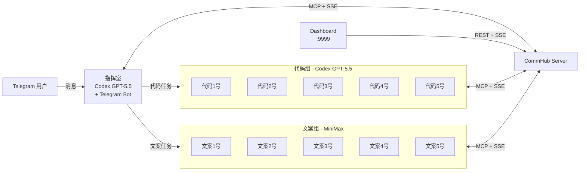
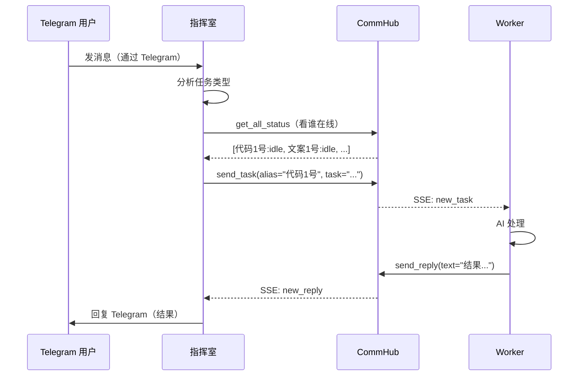

# Demo 编排

Codex Telegram Squad 是 Agent Network 的旗舰 Demo -- 1 个指挥室 + 10 个 AI Worker 通过 Docker Compose 一键启动。

## 架构



## 容器组成

| 容器 | 角色 | Runtime | 模型 | 说明 |
|------|------|---------|------|------|
| server | CommHub Server | Bun | - | 通信中枢 |
| seed | 初始化 | curl | - | 注册管理员、导出 ntok_ |
| commander | 指挥室 | codex-sdk | GPT-5.5 | 接收 Telegram 消息，智能分配 |
| worker-1~5 | 代码组 | codex-sdk | GPT-5.5 | 代码生成、文件操作 |
| worker-6~10 | 文案组 | claude-agent-sdk | MiniMax | 文本处理、翻译、分析 |
| dashboard | Web UI | Next.js | - | 实时监控 |

共 **13 个容器**。

## 快速开始

### 前置条件

| 依赖 | 说明 |
|------|------|
| Docker | Docker Desktop 或 Docker Engine |
| docker compose | Docker Compose V2 |
| Codex 认证 | `~/.codex` 目录（`codex auth login`） |
| Claude 认证 | `~/.claude.json` 文件（可选） |
| Telegram Bot | BotFather 创建的 Bot Token |
| MiniMax API Key | MiniMax 开放平台获取 |

### Step 1: 配置

```bash
cd demos/codex-telegram-squad

# 创建 .env 文件
cat > .env << 'EOF'
# CommHub 认证 Token
COMMHUB_AUTH_TOKEN=squad-token

# Telegram Bot
TELEGRAM_BOT_TOKEN=123456789:ABCdefGhIJKlmNoPQRsTUVwxyz
TELEGRAM_ALLOW_USER=7612221352

# MiniMax API Key
MINIMAX_API_KEY=eyJhbGciOiJSUzI1NiIsInR5cCI6IkpXVCJ9...

# Dashboard
DASHBOARD_PASSWORD=my-secure-password
EOF
```

### Step 2: 启动

```bash
# 构建并启动所有容器
docker compose up -d

# 查看容器状态
docker compose ps
```

预期输出：

```
NAME                          STATUS              PORTS
codex-telegram-squad-server   Up (healthy)        0.0.0.0:9299->9200/tcp
codex-telegram-squad-seed     Exited (0)
codex-telegram-squad-commander Up                 
codex-telegram-squad-worker-1  Up                 
codex-telegram-squad-worker-2  Up                 
...
codex-telegram-squad-dashboard Up                 0.0.0.0:9999->3000/tcp
```

### Step 3: 验证

```bash
# 检查 Server 健康
curl http://localhost:9299/health

# 查看 Agent 状态
curl -H "Authorization: Bearer squad-token" http://localhost:9299/api/status

# 打开 Dashboard
open http://localhost:9999
```

### Step 4: 使用

在 Telegram 中给你的 Bot 发消息：

```
你：帮我写一个 Python 快排算法

Commander：好的，我把这个代码任务分配给代码1号。
[send_task → 代码1号: 写一个 Python 快排算法]

代码1号：完成！
```python
def quicksort(arr):
    if len(arr) <= 1:
        return arr
    pivot = arr[len(arr) // 2]
    left = [x for x in arr if x < pivot]
    middle = [x for x in arr if x == pivot]
    right = [x for x in arr if x > pivot]
    return quicksort(left) + middle + quicksort(right)
```

Commander：代码1号已完成，结果如上。
```

## 指挥室工作流程

指挥室（Commander）的核心逻辑由系统提示词定义：

```
你是指挥室，负责接收 Telegram 消息并分配任务：
- 代码类任务（读写文件/命令/代码）→ 派给 代码1号-代码5号
- 文本类任务（翻译/分析/写作）→ 派给 文案1号-文案5号
- 用 commhub_send_task 派发
- 用 commhub_get_all_status 查看谁在线和状态
```

**工作流程**：



## 日志和调试

### 查看日志

```bash
# 所有容器日志
docker compose logs

# 指挥室日志
docker compose logs -f commander

# Worker 日志
docker compose logs -f worker-1

# Server 日志
docker compose logs -f server
```

### 常见日志信息

```
# Server 日志
[09:00:01] 指挥室 (sdk-xxx) → report_status: idle
[09:00:05] 指挥室 → send_task → 代码1号: 写一个快排
[09:00:06] 代码1号 → get_inbox: 1 pending messages
[09:00:07] 代码1号 → ack_inbox: t_xxx
[09:00:08] 代码1号 → report_status: working | 写一个快排
[09:00:15] 代码1号 → send_reply (replied) → 指挥室: def quicksort...
```

### 进入容器调试

```bash
# 进入 Commander 容器
docker compose exec commander bash

# 进入 Server 容器
docker compose exec server bash

# 手动发任务
docker compose exec server curl -X POST http://localhost:9200/api/task \
  -H "Content-Type: application/json" \
  -H "Authorization: Bearer squad-token" \
  -d '{"alias":"代码1号","task":"写一个 Hello World"}'
```

## 停止和清理

```bash
# 停止所有容器
docker compose down

# 停止并清理数据卷（重置所有数据）
docker compose down -v

# 只停止 Worker
docker compose stop worker-1 worker-2

# 重启 Commander
docker compose restart commander
```

## 自定义扩展

### 添加更多 Worker

在 `docker-compose.yml` 中添加：

```yaml
worker-11:
  <<: *common
  environment:
    - ALIAS=代码6号
    - RUNTIME=codex-sdk
    - MODEL=gpt-5.5
    - COMMHUB_URL=http://server:9200
    - TOOLS=Read,Write,Edit,Bash,Glob,Grep
```

### 替换模型

将 MiniMax 替换为 DeepSeek：

```yaml
worker-6:
  <<: *common
  environment:
    - ALIAS=深度1号
    - RUNTIME=claude-agent-sdk
    - MODEL=deepseek-chat
    - ANTHROPIC_BASE_URL=https://api.deepseek.com/anthropic
    - ANTHROPIC_AUTH_TOKEN=${DEEPSEEK_API_KEY}
    - COMMHUB_URL=http://server:9200
```

### 修改指挥室策略

修改 Commander 的 `SYSTEM_PROMPT` 环境变量来改变分配策略：

```yaml
commander:
  environment:
    - SYSTEM_PROMPT=你是指挥室。优先把任务分给 idle 状态的 Worker。如果所有 Worker 都在忙，排队等待。代码任务给代码组，其他给文案组。
```

## 成本估算

| 组件 | 模型 | 每任务成本 | 说明 |
|------|------|-----------|------|
| Commander | GPT-5.5 | ~$0.03 | 分析 + 分配 |
| 代码组 | GPT-5.5 | ~$0.05 | 代码生成 |
| 文案组 | MiniMax | ~$0.003 | 文本处理 |
| Server | - | 免费 | 自部署 |

一个典型任务（用户提问 -> 分配 -> 处理 -> 回复）的总成本约 $0.05-0.10。
