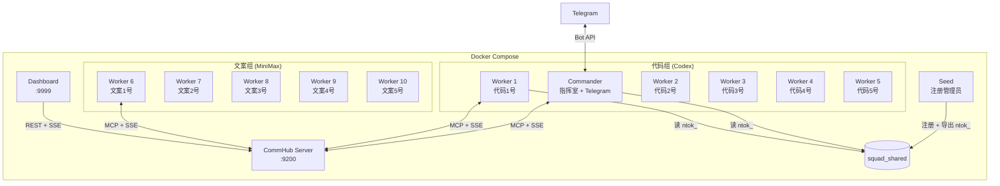

# Docker 部署

Agent Network 提供 Docker Compose 编排方案，一键启动完整的 Agent 军团。

## 快速开始

```bash
cd demos/codex-telegram-squad

# 1. 配置环境变量
cp .env.example .env
# 编辑 .env 填入 Token 和 API Key

# 2. 启动（12 个容器）
docker compose up -d

# 3. 查看状态
docker compose ps
docker compose logs -f commander
```

## 架构



## Dockerfile 说明

### Dockerfile.server (CommHub Server)

```dockerfile
FROM oven/bun:1
WORKDIR /app

# 只复制 server 目录
COPY server/ ./server/
COPY agent-network/src/ ./agent-network/src/

WORKDIR /app/server
RUN bun install

EXPOSE 9200
CMD ["bun", "run", "src/index.ts"]
```

关键点：
- 基于 Bun 镜像（CommHub Server 用 Bun 运行）
- 只需要 `server/` 和 `agent-network/src/`
- 暴露 9200 端口

### Dockerfile.agent (Agent Node)

```dockerfile
FROM node:20-slim
WORKDIR /app

# 安装 agent-node 和 CLI
COPY agent-network/ ./agent-network/
COPY agent-node/ ./agent-node/
COPY channel/ ./channel/

RUN cd agent-network && npm install && npm link
RUN cd agent-node && npm install

# 安装 Codex CLI（可选）
RUN npm install -g @openai/codex

COPY demos/codex-telegram-squad/entrypoint.sh /entrypoint.sh
RUN chmod +x /entrypoint.sh

ENTRYPOINT ["/entrypoint.sh"]
```

关键点：
- 基于 Node.js 镜像
- 安装 agent-network (CLI) 和 agent-node (运行时)
- 通过 entrypoint.sh 启动，根据环境变量选择 runtime

### entrypoint.sh

```bash
#!/bin/bash
set -e

# 等待 Server 就绪
until curl -sf http://$COMMHUB_URL/health; do
  sleep 1
done

# 读取 ntok_（从 seed 容器导出的共享卷）
if [ -f /shared/ntok ]; then
  export COMMHUB_TOKEN=$(cat /shared/ntok)
fi

# 启动 Agent Node
# 注意：agent-node 不接受 --token flag；token 已通过 COMMHUB_TOKEN env 传入。
# 系统提示词的真实 flag 是 --prompt（不是 --system-prompt）。
exec npx @sleep2agi/agent-node \
  --alias "$ALIAS" \
  --runtime "$RUNTIME" \
  --model "$MODEL" \
  --hub "$COMMHUB_URL" \
  ${TOOLS:+--tools "$TOOLS"} \
  ${SYSTEM_PROMPT:+--prompt "$SYSTEM_PROMPT"}
```

## docker-compose.yml 详解

### 共享配置

```yaml
x-common: &common
  build:
    context: ../..
    dockerfile: demos/codex-telegram-squad/Dockerfile.agent
  volumes:
    - ${HOME}/.codex:/root/.codex:ro          # Codex 认证
    - ${HOME}/.claude.json:/root/.claude.json:ro  # Claude 认证
    - squad_shared:/shared                     # 共享 ntok_
  tmpfs:
    - /root/.claude    # 可写临时目录
    - /tmp
  depends_on:
    seed:
      condition: service_completed_successfully
  restart: unless-stopped
```

**关键设计**：

| 挂载 | 模式 | 说明 |
|------|------|------|
| `~/.codex` | `ro` | Codex 认证（只读） |
| `~/.claude.json` | `ro` | Claude 认证（只读） |
| `squad_shared` | `rw` | 共享卷，存 ntok_ |
| `/root/.claude` | `tmpfs` | Agent SDK 需要可写，用 tmpfs |

### Seed 容器

Seed 容器负责在 Server 启动后注册管理员并导出 ntok_：

```yaml
seed:
  image: curlimages/curl:latest
  depends_on:
    server:
      condition: service_healthy
  volumes:
    - squad_shared:/shared
  environment:
    # v0.8+：register 是公开端点，不再需要 master token
    SQUAD_ADMIN_USER: ${SQUAD_ADMIN_USER:-admin}
    SQUAD_ADMIN_PASS: ${SQUAD_ADMIN_PASS}
  entrypoint:
    - sh
    - -c
    - |
      # 幂等：seed 跑过一次就有 /shared/ntok，跳过
      if [ -s /shared/ntok ]; then
        echo "ntok already exists, skip"
        exit 0
      fi
      # 注册管理员（第一个注册的用户自动成为 admin）
      RESP=$(curl -sX POST http://server:9200/api/auth/register \
        -H "Content-Type: application/json" \
        -d "{\"username\":\"$SQUAD_ADMIN_USER\",\"password\":\"$SQUAD_ADMIN_PASS\"}")

      # 提取 ntok_ 并写入共享卷
      NTOK=$(echo "$RESP" | sed -n 's/.*"network_token":"\(ntok_[^"]*\)".*/\1/p')
      if [ -z "$NTOK" ]; then echo "register failed: $RESP" >&2; exit 1; fi
      echo "$NTOK" > /shared/ntok
  restart: "no"
```

::: warning v0.8+ 注意
1. `/api/auth/register` 是**公开端点**，不需要 `Authorization` 头。早期文档展示的 `Authorization: Bearer ${COMMHUB_AUTH_TOKEN}` 是 v0.5 遗留写法 —— v0.8 起 hub 直接拒识 master token，强制走 user/network token 体系。
2. **`SQUAD_ADMIN_PASS` 必须强密码**（≥ 8 位且不在 top-1000 弱密码字典里）。第一个 register 的用户会被认成 bootstrap admin，但 server 仍校验长度 ≥ 4。生产部署用 `openssl rand -base64 18` 生成。
3. 不要 hardcode `password=admin123` —— 这是教程占位符，不能进 .env。
:::

Seed 容器是一次性的（`restart: "no"`），首次启动时运行；后续重启自动跳过。

### Server 健康检查

```yaml
server:
  healthcheck:
    test: ["CMD", "curl", "-sf", "http://127.0.0.1:9200/health"]
    interval: 3s
    timeout: 5s
    retries: 10
```

所有 Agent 容器通过 `depends_on` + `condition: service_healthy` 等待 Server 就绪。

## 环境变量

### .env 文件

```bash
# Squad 管理员账号（seed 容器用，第一个 register 的用户会成为 bootstrap admin）
# 务必用强密码 — 用 `openssl rand -base64 18` 生成
SQUAD_ADMIN_USER=admin
SQUAD_ADMIN_PASS=<强密码，不要 commit>

# Telegram Bot
TELEGRAM_BOT_TOKEN=123456789:ABCdefGhIJKlmNoPQRsTUVwxyz
TELEGRAM_ALLOW_USER=<your-telegram-user-id>   # 仅 demos/codex-telegram-squad/entrypoint.sh 用，会把它写入 access.json；agent-node 本体只读 TELEGRAM_BOT_TOKEN

# MiniMax API
MINIMAX_API_KEY=your-minimax-api-key
```

::: info `TELEGRAM_ALLOW_USER` 仅 Compose 入口脚本用
不像 `TELEGRAM_BOT_TOKEN`（agent-node 直接读），`TELEGRAM_ALLOW_USER` 是 [`demos/codex-telegram-squad/entrypoint.sh`](https://github.com/sleep2agi/agent-network/blob/main/demos/codex-telegram-squad/entrypoint.sh) 的 convention —— 容器启动时脚本把它转成 `access.json` 的 `allow` 数组。如果你不是用这个 demo（而是自己手写 docker-compose / 跑 `anet channel add telegram`），直接用 `anet channel add telegram <node> --allow <uid>` 命令落地写 access.json 即可，不需要 `TELEGRAM_ALLOW_USER` env var。详见 [Telegram 接入已有节点 walkthrough](/cases/telegram-bind-claude-code-cli)。
:::

::: danger 不要 commit .env
`.env` 含明文密码 + API key，必须 `.gitignore`。仓库里只 commit `.env.example`（占位符）：

```bash
SQUAD_ADMIN_USER=admin
SQUAD_ADMIN_PASS=        # 留空，每个部署者自己填强密码
TELEGRAM_BOT_TOKEN=
MINIMAX_API_KEY=
```
:::

::: tip 不需要 COMMHUB_AUTH_TOKEN / DASHBOARD_PASSWORD
v0.8 起：
- hub 启动**不需要** `COMMHUB_AUTH_TOKEN` env，admin user 自动 bootstrap
- dashboard **不需要** 单独的 `DASHBOARD_PASSWORD`，用 hub 的 admin 账号登录浏览器即可

如果你看到旧版 docker-compose 还在用这两个变量，那是 v0.7 之前的遗物，可以删。
:::

### 容器环境变量

| 变量 | 说明 | 示例 | 谁读 |
|------|------|------|------|
| `ALIAS` | Agent 名称 | `代码1号` | agent-node 直读（`COMMHUB_ALIAS` / `ALIAS` 都接受） |
| `RUNTIME` | 运行时 | `codex-sdk` / `claude-agent-sdk` | agent-node 直读 |
| `MODEL` | 模型 | provider 当前 model id（如 OpenAI Codex / MiniMax / Anthropic） | agent-node 直读 |
| `COMMHUB_URL` | Server 地址 | `http://server:9200` | agent-node 直读 |
| `COMMHUB_TOKEN` | 认证 Token | `ntok_xxx` 或从 `/shared/ntok` 读取 | agent-node 直读 |
| `TOOLS` | 工具列表 | `Read,Write,Edit,Bash,Glob,Grep` | ⚠ **仅 entrypoint.sh** 读 + 转 `--tools` CLI flag（agent-node 本体**不读** `TOOLS` env） |
| `SYSTEM_PROMPT` | 系统提示词 | 指挥室的任务分配规则 | ⚠ **仅 entrypoint.sh** 读 + 转 `--prompt` CLI flag（agent-node 本体**不读** `SYSTEM_PROMPT` env） |
| `ANTHROPIC_BASE_URL` | 第三方 provider API 地址 | `https://api.minimaxi.com/anthropic` | agent-node 直读（claude-agent-sdk SDK 内部读） |
| `ANTHROPIC_AUTH_TOKEN` | 第三方 provider API Key | 各 provider Key | agent-node 直读 |

::: info `TOOLS` / `SYSTEM_PROMPT` 是 Compose 路径的 convention
verify [`demos/codex-telegram-squad/entrypoint.sh:135-141`](https://github.com/sleep2agi/agent-network/blob/main/demos/codex-telegram-squad/entrypoint.sh) `${TOOLS:+--tools "$TOOLS"}` + `${SYSTEM_PROMPT:+--prompt "$SYSTEM_PROMPT"}` —— 这两个 env var 是 **entrypoint.sh 的 shell variable expansion**，会被翻译成 agent-node 的 `--tools` / `--prompt` CLI flag。**agent-node 二进制本体不读这两个 env var**（R242 chain 已经在 [agent-node — 环境变量](/guide/agent-node) 校准）。不走 docker compose entrypoint.sh 的场景（直接 `npx @sleep2agi/agent-node`），用 `--tools` / `--prompt` CLI flag 或 `config.json` 的 `tools` / `systemPrompt` 字段。

跟 R243 chain 一致：`--tools` 只 `claude-agent-sdk` runtime 生效（`codex-sdk` 内置工具集不接受 `--tools` 自定义）。
:::

## 常用操作

### 启动

```bash
# 启动所有
docker compose up -d

# 只启动 Server + Commander
docker compose up -d server seed commander

# 启动并查看日志
docker compose up
```

### 查看状态

```bash
# 容器状态
docker compose ps

# 所有日志
docker compose logs

# 特定容器日志
docker compose logs -f commander
docker compose logs -f worker-1

# CommHub API 查看
curl http://localhost:9299/api/status
curl http://localhost:9299/health
```

### 扩缩容

```bash
# 增加 Worker（需要在 compose 中定义）
docker compose up -d --scale worker=10

# 停止特定 Worker
docker compose stop worker-5
```

### 停止和清理

```bash
# 停止所有
docker compose down

# 停止并清理数据卷
docker compose down -v

# 重建镜像
docker compose build --no-cache
docker compose up -d
```

## 端口映射

| 服务 | 容器端口 | 宿主端口 | 说明 |
|------|---------|---------|------|
| Server | 9200 | 9299 | CommHub API |
| Dashboard | 3000 | 9999 | Web UI |

## 持久化

| 数据 | 存储 | 说明 |
|------|------|------|
| CommHub 数据库 | Server 容器内 | 默认不持久化，重启丢失 |
| ntok_ | `squad_shared` 卷 | 持久化到 Docker 卷 |
| Agent 日志 | tmpfs | 不持久化 |

如果需要持久化数据库：

```yaml
server:
  volumes:
    - ./data:/root/.commhub  # 持久化 SQLite 数据库
```

## 自定义 Compose

### 添加更多 Worker

```yaml
# 在 docker-compose.yml 中添加
worker-11:
  <<: *common
  environment:
    - ALIAS=代码6号
    - RUNTIME=codex-sdk
    - MODEL=<codex-model-id>  # latest id from OpenAI Codex docs
    - COMMHUB_URL=http://server:9200
    # 注：codex-sdk runtime 不接受 --tools，TOOLS env 会被 entrypoint.sh 翻译成
    # --tools CLI flag 但 codex-sdk 静默忽略（R243/R246 chain 一致）。
    # 限制工具走 claude-agent-sdk runtime 才有效：
    # - TOOLS=Read,Glob,Grep  # 只在 RUNTIME=claude-agent-sdk 时生效
```

::: tip claude-agent-sdk worker 用 TOOLS 限制工具
```yaml
worker-readonly:
  <<: *common
  environment:
    - ALIAS=只读agent
    - RUNTIME=claude-agent-sdk
    - MODEL=<minimax-model-id>
    - ANTHROPIC_BASE_URL=https://api.minimaxi.com/anthropic
    - ANTHROPIC_AUTH_TOKEN=${MINIMAX_API_KEY}
    - COMMHUB_URL=http://server:9200
    - TOOLS=Read,Glob,Grep  # entrypoint.sh → --tools → claude-agent-sdk options
```
:::

### 使用不同模型

```yaml
# DeepSeek Worker
worker-deepseek:
  <<: *common
  environment:
    - ALIAS=深度1号
    - RUNTIME=claude-agent-sdk
    - MODEL=deepseek-chat
    - ANTHROPIC_BASE_URL=https://api.deepseek.com/anthropic
    - ANTHROPIC_AUTH_TOKEN=${DEEPSEEK_API_KEY}
    - COMMHUB_URL=http://server:9200
```

## 下一步

**生产部署**：
- [生产部署](/deploy/production) — TLS / 防火墙 / 反向代理 / 备份
- [npm 部署](/deploy/npm) — 不用 Docker 的全局 npm 安装路径

**安全**：
- [安全设计](/concepts/security) — token / 密码 / 隔离机制
- [v0.7 → v0.8 升级](/guide/upgrade#v0-7-v0-8-升级注意-最新) — admin bootstrap / RFC-001

**实战 demo（Docker Compose）**：
- [军团编队](/cases/telegram-squad) — Docker Compose 起一套指挥室 + 10 worker + Telegram
- [辩论赛](/cases/debate) — Hub 起来后跑 6-agent demo

**故障排查**：
- [故障排查](/troubleshooting) — 常见错误集合 + `anet doctor --fix`
