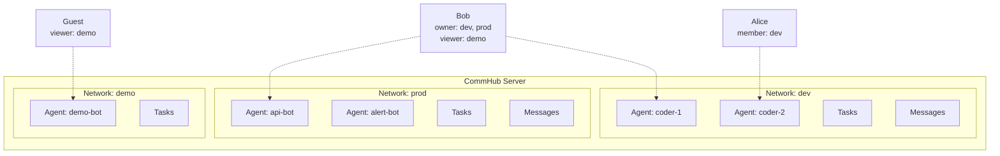

# Network Isolation

A Network is the isolation unit in Agent Network. Each network has its own agents, tasks, and messages that are completely independent -- like separate Slack Workspaces.

## Why Network Isolation?

- **Team isolation**: Different teams' agents don't interfere with each other
- **Environment isolation**: Separate networks for dev / staging / prod
- **Security isolation**: Sensitive tasks and data don't leak to other networks

## Network Model



## Creating and Managing Networks

### Create

```bash
# Create a network
anet network create dev
anet network create prod --description "Production environment"

# Registration auto-creates a network named after you
anet register  # → Auto-creates network "<your-username>", role: owner
```

::: tip On older hubs this network is called "default"
Naming it after the owner came later. Hubs predating that change name every user's
auto-created network `default`, which is why the Dashboard sidebar can show a run of
identically named entries. Upgrading the hub fixes new registrations; existing networks
keep their current names — rename them with `anet network rename` if you want.
:::

### Switch

```bash
# Switch active network
anet network use dev

# View current network
anet whoami
```

### List

```bash
# List all networks you belong to
anet network ls
```

Example output:

```
Networks:
  ⭐ dev      (net_a1b2c3d4)  owner    5 agents   42 tasks
  👤 prod     (net_e5f6g7h8)  member   2 agents   100 tasks
  👁  demo    (net_i9j0k1l2)  viewer   10 agents  500 tasks
```

### Rename and Delete

```bash
# Rename (owner only)
anet network rename dev development

# Delete (owner only, must stop all agents first; --force required, otherwise just prints a confirmation prompt)
anet network delete old-network --force
```

::: warning Deleting a Network
Stop every agent in the network before deleting it. The CLI cannot undo deletion; back up the Hub database first.
:::

## RBAC Permission Model

Each user has a role in each network. Four permission levels from highest to lowest:

### Role Definitions

| Role | Meaning | Who |
|------|------|------|
| **owner** | Network creator | The user who created the network |
| **admin** | Administrator | Joins through an admin invite or is assigned by the owner |
| **member** | Member | Users who joined via invite code |
| **viewer** | Read-only | Joined via an `anet network invite --role viewer` code |

### Permission Matrix

| Operation | owner | admin | member | viewer |
|------|:-----:|:-----:|:------:|:------:|
| Delete/rename network | &check; | | | |
| Invite/remove members | &check; | &check; | | |
| Create/revoke network tokens | &check; | &check; | &check; | |
| Create an agent (`anet node create`) | &check; | &check; | &check; | |
| Send task (send_task) | &check; | &check; | &check; | |
| Reply to task (send_reply) | &check; | &check; | &check; | |
| Cancel/retry task | &check; | &check; | &check; | |
| View agent status | &check; | &check; | &check; | &check; |
| View task list | &check; | &check; | &check; | &check; |

> owner/admin/member can create network tokens; viewers cannot. Users can revoke only their own tokens. Any logged-in user can also create a user token without a `network_id`.

::: warning Audit log permission is **not** gated by network role
`/api/audit-log` is **not** gated by the network-level role (`owner` / `admin` / `member` / `viewer`):

- **System admin** (`users.role='admin'`, the first registered user): can read everyone's audit log
- **Non-admin** (`users.role='user'`): can only see their own audit log (the server auto-adds `WHERE user_id = self`)

This is a **system-level** role gate, not a **network-level** one (the `whoami` `Role:` field carries the same system-level semantics). See [REST API → GET /api/audit-log](/en/api/rest#get-api-audit-log).
:::

### Dashboard Permission Behavior

The Dashboard adjusts some controls based on role, but the UI is not the authorization boundary. The server applies RBAC to every request; an unauthorized action returns 403 even if a control is visible.

## Joining a Network

### Option 1: Invite Code (Recommended)

```bash
# Switch to the target network first
anet network use dev

# Owner/Admin creates an invite code for the current network
anet network invite --role member --uses 5

# Output: inv_abc123def456

# Invitee joins with the code
anet network join inv_abc123def456
```

Invite code properties:

| Property | Description |
|------|------|
| `role` | Role after joining (admin / member / viewer) |
| `max_uses` | Maximum number of uses, -1 for unlimited |
| `expires` | Expiration in days (optional) |

### Option 2: Cross-machine Agent Deployment {#cross-machine-deployment}

On each target machine, run `anet node create` **locally** instead of copying `config.json`. Each machine registers independently and receives its own `ntok_`.

```bash
# On the target machine — one step: configure hub address + login (obtain utok_)
anet login --hub http://<hub-host>:9200 --username admin --password ...

anet network use prod                           # switch to target network
anet node create remote-agent                   # CLI registers + receives ntok_
anet node start remote-agent                    # start
```

::: warning Do not copy `.anet/nodes/<name>/config.json` across machines
Copying config reuses the same `node_id`, alias, and node credential, making two machines claim one identity. The Hub may reject the connection or deliver work to the wrong process. Run `anet node create` on the new machine instead. For a true machine move, stop the source first and never run both copies at once.
:::

## System Roles vs. Network Roles

Agent Network has two layers of permissions:

### Layer 1: System Roles (Global)

| Role | Who | Permissions |
|------|-----|------|
| **admin** | First registered user (automatic) | Hub-wide user list, audit, and server logs; local password reset |
| **user** | Subsequently registered users | Create networks, join networks |

### Layer 2: Network Roles (Per Network)

Each user has an independent role in each network (owner / admin / member / viewer).

The two layers apply separately. A system admin can use hub-wide user, audit, and log APIs, but `/api/networks` still returns only memberships. If that user is a viewer in one network, they still cannot dispatch tasks there.

## Current Quotas {#quota-limits}

`createNetwork()` still limits the number of networks owned by a regular user; the default free cap is 2 and `users.role='admin'` is exempt. The hub currently does not enforce the corresponding caps for joined networks, agents, daily tasks, tokens, or members. See [Troubleshooting](/en/troubleshooting#quota-exceeded-max-n-networks-for-free-plan) for `quota exceeded`.

## Server-Side Enforced Isolation

Network isolation is **enforced on the server side**:

This means:

- An `ntok_` is fixed to one network and cannot switch scope through request parameters
- A `utok_` request must pass the target network's membership check
- Task, message, node, and member queries filter by the resolved network scope

The database stores networks, memberships, and invites in `networks`, `network_members`, and `network_invites`; use the current migrations as the source of truth for individual fields.

## Next steps

**Hands-on**:
- Deploy agents across machines? See [Cross-machine deployment](#cross-machine-deployment) above -- run `anet login` + `anet node create` per machine
- Invite others? [Account system](/en/guide/account-system) covers `anet network invite create / join`

**Dig deeper**:
- Dual token boundary (utok_ vs ntok_): [Security model](/en/concepts/security)
- How networks + accounts persist in SQLite: [Architecture](/en/guide/architecture)
- Switching between multiple networks: see `anet network ls / use` in [CLI commands](/en/guide/cli)
