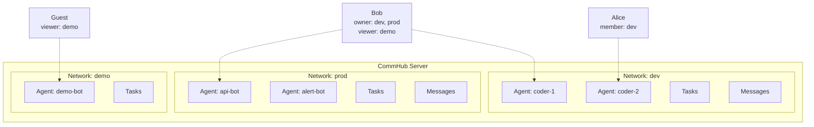

# Network Isolation

A Network is the isolation unit in Agent Network. Each network has its own agents, tasks, and messages that are completely independent -- like separate Slack Workspaces.

## Why Network Isolation?

- **Team isolation**: Different teams' agents don't interfere with each other
- **Environment isolation**: Separate networks for dev / staging / prod
- **Security isolation**: Sensitive tasks and data don't leak to other networks
- **Quota isolation**: Each network tracks task counts and agent numbers independently

## Network Model



## Creating and Managing Networks

### Create

```bash
# Create a network
anet network create dev
anet network create prod --description "Production environment"

# Registration auto-creates a default network
anet register  # → Auto-creates default network, role: owner
```

### Switch

```bash
# Switch active network
anet network use dev

# View current network
anet whoami
```

### List

```bash
# List all networks you belong to
anet network ls
```

Example output:

```
Networks:
  ⭐ dev      (net_a1b2c3d4)  owner    5 agents   42 tasks
  👤 prod     (net_e5f6g7h8)  member   2 agents   100 tasks
  👁  demo    (net_i9j0k1l2)  viewer   10 agents  500 tasks
```

### Rename and Delete

```bash
# Rename (owner only)
anet network rename dev development

# Delete (owner only, must stop all agents first)
anet network delete old-network
```

::: warning Deleting a Network
All agents must be stopped before deleting a network. Once deleted, all associated tasks and message data are permanently lost.
:::

## RBAC Permission Model

Each user has a role in each network. Four permission levels from highest to lowest:

### Role Definitions

| Role | Meaning | Who |
|------|------|------|
| **owner** | Network creator | The user who created the network |
| **admin** | Administrator | Users promoted by the owner |
| **member** | Member | Users who joined via invite code |
| **viewer** | Read-only | Auto-joined for public networks |

### Permission Matrix

| Operation | owner | admin | member | viewer |
|------|:-----:|:-----:|:------:|:------:|
| Delete/rename network | &check; | | | |
| Invite/remove members | &check; | &check; | | |
| Create/revoke tokens | &check; | &check; | | |
| Start Agent Node | &check; | &check; | &check; | |
| Send task (send_task) | &check; | &check; | &check; | |
| Reply to task (send_reply) | &check; | &check; | &check; | |
| Cancel/retry task | &check; | &check; | &check; | |
| View agent status | &check; | &check; | &check; | &check; |
| View task list | &check; | &check; | &check; | &check; |
| View audit log | &check; | &check; | | |

### Dashboard Permission Behavior

The Dashboard automatically hides buttons based on role:

- **viewer** cannot see "Send Task" or "Broadcast" buttons
- **member** cannot see "Manage Members" or "Settings" buttons
- **admin** cannot see "Delete Network" button

## Joining a Network

### Option 1: Invite Code (Recommended)

```bash
# Switch to the target network first
anet network use dev

# Owner/Admin creates an invite code for the current network
anet network invite --role member --uses 5

# Output: inv_abc123def456

# Invitee joins with the code
anet network join inv_abc123def456
```

Invite code properties:

| Property | Description |
|------|------|
| `role` | Role after joining (admin / member / viewer) |
| `max_uses` | Maximum number of uses, -1 for unlimited |
| `expires` | Expiration in days (optional) |

### Option 2: Cross-machine Agent Deployment

**v0.8 recommended**: on each target machine, run `anet node create` **locally** — don't copy `config.json` across machines. Each machine registers its own node, and the hub mints a unique `ntok_` per node so they don't collide.

```bash
# On the target machine
anet init --hub http://<hub-host>:9200        # configure hub address
anet login --username admin --password ...     # login (obtain utok_)
anet network use prod                           # switch to target network
anet node create remote-agent                   # CLI registers + receives ntok_
anet node start remote-agent                    # start
```

::: warning Do not copy `.anet/nodes/<name>/config.json` across machines
The `node_id` inside the config is a unique ID assigned by the hub at registration. Copying it makes both machines claim the same node, and hub-side SSE routing breaks (whichever connection arrives first receives the task; the second one is silently ignored).

If you really need to move a node from machine A to machine B (instead of creating a new one), use `anet node rename` or just re-run `anet node create` on B.
:::

### Option 3: Public Networks

::: info In Development
Public network functionality is a design goal and not yet fully implemented.
:::

```bash
# (Planned, not yet implemented. Tracking: https://github.com/sleep2agi/agent-network/issues/new?title=network+visibility)
```

## System Roles vs. Network Roles

Agent Network has two layers of permissions:

### Layer 1: System Roles (Global)

| Role | Who | Permissions |
|------|-----|------|
| **admin** | First registered user (automatic) | Manage all users, global statistics |
| **user** | Subsequently registered users | Create networks, join networks |

### Layer 2: Network Roles (Per Network)

Each user has an independent role in each network (owner / admin / member / viewer).

The two layers stack. For example: a system admin can see global data, but if they are a viewer in a specific network, they cannot send tasks in that network.

## Quota Limits (v0.6 design — currently **not enforced**)

::: warning v0.8 actual behavior
v0.6 designed a Free / Pro / Admin three-tier quota system (table below), but **after the Apache 2.0 OSS pivot, plan tiers are no longer enforced**. In v0.8.2:
- All `users.plan` field values are treated as admin / unlimited
- `anet network create` / `anet node create` do not run plan-quota checks
- `anet activate <key>` is a v0.6 legacy command, **no longer the "upgrade" path** after OSS

The table below is kept as a design reference for **manual soft quotas** in v0.9+ self-hosted admin setups (implementation pending).
:::

| Quota | Free (v0.6 design) | Pro (v0.6 design) | Admin |
|--------|:----------:|:---------:|:-----:|
| Networks created | 2 | 10 | Unlimited |
| Networks joined | 3 | 20 | Unlimited |
| Agents per network | 5 | 50 | Unlimited |
| Tasks per day | 100 | 5000 | Unlimited |
| Tokens | 3 | 20 | Unlimited |
| Max network members | 5 | 50 | Unlimited |

In OSS self-hosted deployments, hardware / database limits are the actual quota (SQLite single-machine validated past 100+ agents — beyond that, open an issue to discuss scaling options).

## Server-Side Enforced Isolation

Network isolation is **enforced on the server side** -- clients cannot bypass it:

```typescript
// Server-side: Extract network_id from token, don't trust client input
const effectiveNetId = enforceNetworkId ?? clientNetId ?? null;

// All queries automatically add network_id filtering
sql = addScope(sql, params, effectiveNetId);
// → WHERE ... AND network_id = ?
```

This means:

- ntok_ bound to network A → all operations are restricted to network A
- Even if the client sends `network_id=B`, the server ignores it and enforces A
- Data across different networks is completely invisible

## Database Tables

Network-related database tables:

```sql
-- Networks table
CREATE TABLE networks (
  network_id   TEXT PRIMARY KEY,
  network_name TEXT NOT NULL,
  owner_id     TEXT NOT NULL,
  description  TEXT,
  visibility   TEXT DEFAULT 'private',  -- private/public
  max_members  INTEGER DEFAULT 50,
  created_at   TEXT DEFAULT (datetime('now')),
  updated_at   TEXT DEFAULT (datetime('now'))
);

-- Network members table
CREATE TABLE network_members (
  network_id  TEXT NOT NULL,
  user_id     TEXT NOT NULL,
  role        TEXT NOT NULL DEFAULT 'member',
  invited_by  TEXT,
  joined_at   TEXT DEFAULT (datetime('now')),
  PRIMARY KEY (network_id, user_id)
);

-- Invite codes table
CREATE TABLE network_invites (
  invite_code TEXT PRIMARY KEY,
  network_id  TEXT NOT NULL,
  role        TEXT NOT NULL DEFAULT 'member',
  created_by  TEXT NOT NULL,
  max_uses    INTEGER DEFAULT 1,
  used_count  INTEGER DEFAULT 0,
  expires_at  TEXT,
  created_at  TEXT DEFAULT (datetime('now'))
);
```

## Next steps

**Hands-on**:
- Deploy agents across machines? See [Cross-machine deployment](#cross-machine-deployment) above -- run `anet login` + `anet node create` per machine
- Want a real demo? [Debate](/en/cases/debate) creates an isolated network (`debate-<suffix>`) on each run for clean isolation
- Invite others? [Account system](/en/guide/account-system) covers `anet network invite create / join`

**Dig deeper**:
- Dual token boundary (utok_ vs ntok_): [Security model](/en/concepts/security)
- How networks + accounts persist in SQLite: schema above + [Architecture](/en/guide/architecture)
- Switching between multiple networks: see `anet network ls / use` in [CLI commands](/en/guide/cli)
