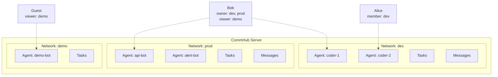

# Network Isolation

A Network is the isolation unit in Agent Network. Each network has its own agents, tasks, and messages that are completely independent -- like separate Slack Workspaces.

## Why Network Isolation?

- **Team isolation**: Different teams' agents don't interfere with each other
- **Environment isolation**: Separate networks for dev / staging / prod
- **Security isolation**: Sensitive tasks and data don't leak to other networks

## Network Model



## Creating and Managing Networks

### Create

```bash
# Create a network
anet network create dev
anet network create prod --description "Production environment"

# Registration auto-creates a default network
anet register  # → Auto-creates default network, role: owner
```

### Switch

```bash
# Switch active network
anet network use dev

# View current network
anet whoami
```

### List

```bash
# List all networks you belong to
anet network ls
```

Example output:

```
Networks:
  ⭐ dev      (net_a1b2c3d4)  owner    5 agents   42 tasks
  👤 prod     (net_e5f6g7h8)  member   2 agents   100 tasks
  👁  demo    (net_i9j0k1l2)  viewer   10 agents  500 tasks
```

### Rename and Delete

```bash
# Rename (owner only)
anet network rename dev development

# Delete (owner only, must stop all agents first; --force required, otherwise just prints a confirmation prompt)
anet network delete old-network --force
```

::: warning Deleting a Network
All agents must be stopped before deleting a network. Once deleted, all associated tasks and message data are permanently lost.
:::

## RBAC Permission Model

Each user has a role in each network. Four permission levels from highest to lowest:

### Role Definitions

| Role | Meaning | Who |
|------|------|------|
| **owner** | Network creator | The user who created the network |
| **admin** | Administrator | Users promoted by the owner |
| **member** | Member | Users who joined via invite code |
| **viewer** | Read-only | Joined via `anet network invite --role viewer`; auto-join for public networks is a design goal ([Option 3](#option-3-public-networks) not implemented yet) |

### Permission Matrix

| Operation | owner | admin | member | viewer |
|------|:-----:|:-----:|:------:|:------:|
| Delete/rename network | &check; | | | |
| Invite/remove members | &check; | &check; | | |
| Create/revoke network tokens | &check; | &check; | &check; | |
| Start Agent Node | &check; | &check; | &check; | |
| Send task (send_task) | &check; | &check; | &check; | |
| Reply to task (send_reply) | &check; | &check; | &check; | |
| Cancel/retry task | &check; | &check; | &check; | |
| View agent status | &check; | &check; | &check; | &check; |
| View task list | &check; | &check; | &check; | &check; |

> R308 calibration: "Create/revoke network tokens" was previously marked member ❌. In fact [`auth.ts:236-242 createToken`](https://github.com/sleep2agi/agent-network/blob/main/server/src/auth.ts#L236) only blocks **viewer** (`viewer cannot create full-access network tokens`) — owner / admin / member can all create them. Revoking goes through [`auth.ts revokeToken`](https://github.com/sleep2agi/agent-network/blob/main/server/src/auth.ts) `WHERE token_id = ? AND user_id = ?` — any user can revoke **their own** tokens, also not network-role-gated. Pure user tokens (`utok_`, no `network_id`) can be created by any logged-in user.

::: warning Audit log permission is **not** gated by network role
The matrix used to list "View audit log" — but `/api/audit-log` is **not** gated by the network-level role (`owner` / `admin` / `member` / `viewer`). Verified at [`server/src/index.ts:1086-1089`](https://github.com/sleep2agi/agent-network/blob/main/server/src/index.ts#L1086):

- **System admin** (`users.role='admin'`, the first registered user): can read everyone's audit log
- **Non-admin** (`users.role='user'`): can only see their own audit log (the server auto-adds `WHERE user_id = self`)

This is a **system-level** role gate, not a **network-level** one (aligned with the R227/R236/R237 chain calibrating the `whoami` `Role:` field semantics). See [REST API → GET /api/audit-log](/en/api/rest#get-api-audit-log).
:::

### Dashboard Permission Behavior

The Dashboard adjusts button visibility / interactivity based on role (design goal):

- **viewer** cannot see "Send Task" or "Broadcast" buttons
- **member** cannot see "Manage Members" or "Settings" buttons
- **admin** cannot see "Delete Network" button

::: info Dashboard 0.4.6 actual behavior (v0.9.2 stable)
The role → button-visibility UI binding is **partially implemented**. Even if a button is still displayed, the **server side returns 403** (`canWrite()` enforces RBAC), so permissions cannot be bypassed. Full button hiding **was not addressed in the v0.9.x scope** (Recovery & Observability took priority); queued for v0.10+ / unscheduled Dashboard rework.
:::

## Joining a Network

### Option 1: Invite Code (Recommended)

```bash
# Switch to the target network first
anet network use dev

# Owner/Admin creates an invite code for the current network
anet network invite --role member --uses 5

# Output: inv_abc123def456

# Invitee joins with the code
anet network join inv_abc123def456
```

Invite code properties:

| Property | Description |
|------|------|
| `role` | Role after joining (admin / member / viewer) |
| `max_uses` | Maximum number of uses, -1 for unlimited |
| `expires` | Expiration in days (optional) |

### Option 2: Cross-machine Agent Deployment {#cross-machine-deployment}

**v0.8 recommended**: on each target machine, run `anet node create` **locally** — don't copy `config.json` across machines. Each machine registers its own node, and the hub mints a unique `ntok_` per node so they don't collide.

```bash
# On the target machine — one step: configure hub address + login (obtain utok_)
anet login --hub http://<hub-host>:9200 --username admin --password ...

anet network use prod                           # switch to target network
anet node create remote-agent                   # CLI registers + receives ntok_
anet node start remote-agent                    # start
```

::: warning Do not copy `.anet/nodes/<name>/config.json` across machines
The `node_id` inside the config is a stable ID generated **locally** by `anet node create` (`generateNodeId()`; the CommHub `resume_id` is `sdk-${node_id}`). Copying it makes both machines use the same `node_id` → the same `resume_id`, and hub-side SSE routing breaks (whichever connection arrives first receives the task; the second one is silently ignored).

If you really need to move a node from machine A to machine B (instead of creating a new one), use `anet node rename` or just re-run `anet node create` on B.

> ⚠ Known gap with `anet node rename` ([#110](https://github.com/sleep2agi/agent-network/issues/110)): the node must have been started **at least once** with `anet node start` (otherwise there is no sessions row on the commhub server and `prepareRename` fails). After copying the config to B, run `anet node start` once so the server registers it, then rename. Fail-safe (PHASE 1 rollback leaves the old node intact).
:::

### Option 3: Public Networks

::: info In Development
Public network functionality is a design goal and not yet fully implemented.
:::

```bash
# (Planned, not yet implemented. Tracking: https://github.com/sleep2agi/agent-network/issues/new?title=network+visibility)
```

## System Roles vs. Network Roles

Agent Network has two layers of permissions:

### Layer 1: System Roles (Global)

| Role | Who | Permissions |
|------|-----|------|
| **admin** | First registered user (automatic) | Manage all users, global statistics |
| **user** | Subsequently registered users | Create networks, join networks |

### Layer 2: Network Roles (Per Network)

Each user has an independent role in each network (owner / admin / member / viewer).

The two layers stack. For example: a system admin can see global data, but if they are a viewer in a specific network, they cannot send tasks in that network.

## Quota Limits (v0.6 design — partially enforced in v0.8) {#quota-limits}

::: warning R226 calibration (aligned with R208/R224 chain)
v0.6 designed a Free / Pro / Admin three-tier quota system (table below). After the Apache 2.0 OSS pivot **most items are shelved**, but **`createNetwork` still enforces one of them**:

| Quota | v0.8 actual behavior |
|--------|---------------|
| **Networks created** (`max_networks_owned`) | ✅ **Still enforced** — [`auth.ts:184-189 createNetwork`](https://github.com/sleep2agi/agent-network/blob/main/server/src/auth.ts#L184) reads `users.plan || "free"` and checks the `QUOTAS` cap; free defaults to **2**. Only `users.role='admin'` is exempt. |
| Networks joined | ❌ Hub does not run quota checks on the join path |
| Agents per network | ❌ |
| Tasks per day | ❌ |
| Tokens | ❌ |
| Max network members | ❌ The `networks.max_members` column is dormant (R178 chain) |

- `anet activate <key>` is a v0.6 legacy command, **no longer the "upgrade" path** after OSS
- Only `users.role = 'admin'` (auto-granted to the first registered user) can break through the free quota — see [troubleshooting → quota_exceeded fix](/en/troubleshooting#quota-exceeded-max-n-networks-for-free-plan)

The table below is kept as a design reference for **manual soft quotas** in self-hosted admin setups (not implemented in v0.9.x — Recovery & Observability took priority; queued for v0.10+ / unscheduled).
:::

| Quota | Free (v0.6 design) | Pro (v0.6 design) | Admin |
|--------|:----------:|:---------:|:-----:|
| Networks created | 2 | 10 | Unlimited |
| Networks joined | 3 | 20 | Unlimited |
| Agents per network | 5 | 50 | Unlimited |
| Tasks per day | 100 | 5000 | Unlimited |
| Tokens | 3 | 20 | Unlimited |
| Max network members | 5 | 50 | Unlimited |

In OSS self-hosted deployments, hardware / database limits are the actual quota (SQLite single-machine validated past 100+ agents — beyond that, open an issue to discuss scaling options).

## Server-Side Enforced Isolation

Network isolation is **enforced on the server side** -- clients cannot bypass it:

```typescript
// Server-side: Extract network_id from token, don't trust client input
const effectiveNetId = enforceNetworkId ?? clientNetId ?? null;

// All queries automatically add network_id filtering
sql = addScope(sql, params, effectiveNetId);
// → WHERE ... AND network_id = ?
```

This means:

- ntok_ bound to network A → all operations are restricted to network A
- Even if the client sends `network_id=B`, the server ignores it and enforces A
- Data across different networks is completely invisible

## Database Tables

Network-related database tables:

```sql
-- Networks table
CREATE TABLE networks (
  -- Base schema (db.ts:168-177)
  network_id   TEXT PRIMARY KEY,
  network_name TEXT NOT NULL,
  owner_id     TEXT NOT NULL,
  description  TEXT,
  settings     TEXT,                     -- network-level config JSON (reserved field)
  created_at   TEXT NOT NULL DEFAULT (datetime('now')),
  updated_at   TEXT NOT NULL DEFAULT (datetime('now')),
  UNIQUE(owner_id, network_name),         -- network name unique per owner
  -- Columns added by the V3.13 ALTER TABLE migration (db.ts:299-301)
  visibility   TEXT DEFAULT 'private',  -- private/public (**field exists but currently inert** — see [Quota limits — v0.6 design / partially enforced in v0.8](#quota-limits))
  max_members  INTEGER DEFAULT 50        -- **field exists, server-side enforcement is OFF**: addNetworkMember + joinByInvite have no max_members gate. Reserved for the v0.6 quota system. See the quota-limits section below.
);

-- Network members table
CREATE TABLE network_members (
  network_id  TEXT NOT NULL,
  user_id     TEXT NOT NULL,
  role        TEXT NOT NULL DEFAULT 'member',
  invited_by  TEXT,
  joined_at   TEXT NOT NULL DEFAULT (datetime('now')),
  PRIMARY KEY (network_id, user_id)
);

-- Invite codes table
CREATE TABLE network_invites (
  invite_code TEXT PRIMARY KEY,
  network_id  TEXT NOT NULL,
  role        TEXT NOT NULL DEFAULT 'member',
  created_by  TEXT NOT NULL,
  max_uses    INTEGER DEFAULT 1,
  used_count  INTEGER DEFAULT 0,
  expires_at  TEXT,
  created_at  TEXT NOT NULL DEFAULT (datetime('now'))
);
```

## Next steps

**Hands-on**:
- Deploy agents across machines? See [Cross-machine deployment](#cross-machine-deployment) above -- run `anet login` + `anet node create` per machine
- Want a real demo? [Debate](/en/cases/debate) creates an isolated network (`debate-<suffix>`) on each run for clean isolation
- Invite others? [Account system](/en/guide/account-system) covers `anet network invite create / join`

**Dig deeper**:
- Dual token boundary (utok_ vs ntok_): [Security model](/en/concepts/security)
- How networks + accounts persist in SQLite: schema above + [Architecture](/en/guide/architecture)
- Switching between multiple networks: see `anet network ls / use` in [CLI commands](/en/guide/cli)
