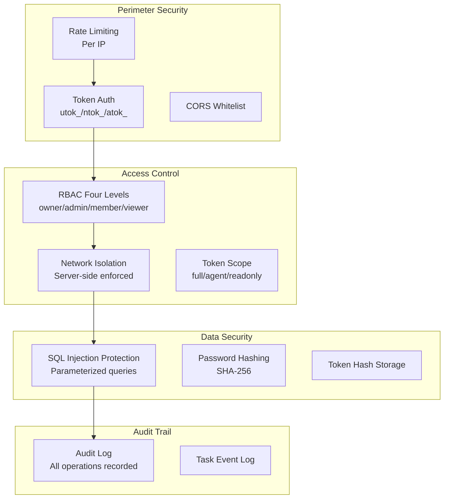
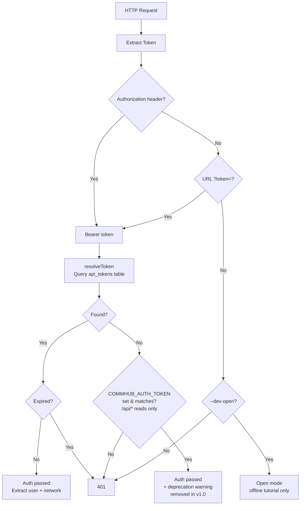

# Security Design

Agent Network's security architecture spans four layers: authentication, authorization, data isolation, and auditing.

## Security Architecture Overview



::: info Actually shipped vs design goal (v0.10.8)
The diagram above represents the **design goal**. Current v0.10.8 reality:

- ✅ **Shipped**: Rate limiting / token auth (utok_/ntok_/atok_) / CORS / 4-tier RBAC / network isolation (server-enforced) / SQL-injection guards / SHA-256 password hashing / audit log / task event log
- ⏳ **Not fully enforced**: Token Scope (`api_tokens.scope` column exists and [`auth.ts:73-137`](https://github.com/sleep2agi/agent-network/blob/main/server/src/auth.ts#L73) `createToken` writes different scope values per token type, but [`auth.ts:143-165 resolveToken`](https://github.com/sleep2agi/agent-network/blob/main/server/src/auth.ts#L143) **does not return `scope` in its result** — RBAC decisions don't consume the written scope; security report **R12** was not addressed in v0.9.x or any v0.10.x scope (Recovery & Observability / Direct Runtime + Observability Foundations / Hero A+D / subsequent UX-fix chain themes took priority), queued for v0.11+ / unscheduled — see [security audit](https://github.com/sleep2agi/agent-network/blob/main/docs/open-source-security-risk-report.md))
- ⏳ **Planned upgrade**: SHA-256 → Argon2id password hashing (verify [`db.ts:503-505 hashPassword`](https://github.com/sleep2agi/agent-network/blob/main/server/src/db.ts#L503) still uses `Bun.CryptoHasher("sha256")`; security report **R9** was not addressed in v0.9.x or v0.10.x, queued for v0.11+ / unscheduled)
:::

## Authentication

### Token System

v0.8 uses a **dual-token system**:

| Token | Prefix | Binding | Purpose |
|-------|------|------|------|
| User Token | `utok_` | User | CLI / Dashboard login |
| Network Token | `ntok_` | User + Network | Agent connection |

`atok_` (the V2-era API token) has been superseded by `utok_` + `ntok_` — the code still keeps a prefix-compatibility check (it won't error), but **new users never need to touch it**; `anet token create / ls / revoke` all operate on `utok_` / `ntok_` underneath. See [Token System](/en/concepts/tokens) for details.

### Token Storage

Tokens are **not stored in plaintext** in the database -- they are stored as SHA-256 hashes:

```typescript
// Generate token
const token = generateUserToken();  // utok_xxxxxxxx

// Store in database (hash only)
const hash = hashToken(token);  // SHA-256 hash
db.run("INSERT INTO api_tokens ... VALUES (?, ?)", [tokenId, hash]);

// Verification
const inputHash = hashToken(inputToken);
const row = db.get("SELECT * FROM api_tokens WHERE token_hash = ?", inputHash);
```

### Vendor Credential Storage (envRef mode, v0.9.0+)

When an agent node runs the `claude-agent-sdk` runtime it needs vendor API keys (`ANTHROPIC_AUTH_TOKEN` / `OPENAI_API_KEY` / `MINIMAX_KEY` …). Where they live matters a lot. Since [#125](https://github.com/sleep2agi/agent-network/issues/125) (v0.9.0 promote gate #2), the agent-node `config.json` env map **accepts two value shapes** (tagged union):

```jsonc
// Legacy shape (still works, deprecated) — plain token persisted to config.json
{
  "env": {
    "ANTHROPIC_AUTH_TOKEN": "sk-abc...xyz"        // ❌ High risk
  }
}

// New envRef shape — only the env-var NAME is stored; the value stays in process.env
{
  "env": {
    "ANTHROPIC_AUTH_TOKEN": { "_envRef": "ANTHROPIC_AUTH_TOKEN" }   // ✅ Recommended
  }
}
```

**Why envRef**: a plain token written into `config.json` leaks into git history, dashboard payloads, `anet ls` output, error envelopes, log lines, and more. Keeping the secret in `process.env` instead means it never touches disk.

**agent-node accepts both shapes**:
- A bare `string` → still used as plain, prints a one-shot deprecation banner pointing at `anet node migrate-token-to-envref <alias>`
- A `{ _envRef: "<NAME>" }` → reads `process.env[NAME]`; if the var is unset the agent **fatally exits at startup** (refuses to start silently broken) and prints an `export NAME='...'` remediation hint

**`anet node create` automatically uses envRef**: after [#125](https://github.com/sleep2agi/agent-network/issues/125), `saveCreatedNode` runs `rewritePlainSecretsToEnvRef()` before writing config.json — new nodes **never persist plain secrets**; the original value is dropped into the current shell's `process.env` (so the immediate spawn works) and `export NAME='value'` lines are printed for the user to persist into `~/.bashrc` or a secrets manager.

**Migrating existing nodes**:

```bash
anet node migrate-token-to-envref <alias>
# 1. Backs up the original to config.json.bak-<ts>
# 2. Rewrites secret-shaped env values to { _envRef: ... }
# 3. Prints the export lines the user needs to persist
# Idempotent: non-secret values and already-migrated values are left alone
```

`anet doctor` also enumerates plain-secret nodes and prints a migration suggestion (passive scan; does not auto-migrate).

**Secret detection heuristic** (shared across agent-node / `anet node create` / `anet doctor`): env key suffix matches `/_TOKEN|_KEY|_SECRET|AUTH$/`, or value prefix matches `/sk-|utok_|ntok_|atok_|ak-|gsk_|key-|Bearer/` — either match flags the value as a secret.

### Token Verification Flow (v0.8)



::: warning Key changes in v0.8
- The v0.5-era path where unset `COMMHUB_AUTH_TOKEN` triggered open mode is **deleted**. The hub now refuses to start without `--dev-open` unless a valid utok_/ntok_ exists.
- The master-token compat path **only allows `/api/*` read requests**; all writes are rejected.
- This legacy path is fully removed in v1.0 ([RFC-001 Phase 3](https://github.com/sleep2agi/agent-network/blob/main/docs/rfcs/RFC-001-deprecate-commhub-auth-token.md); tracking issue: [open issues: COMMHUB_AUTH_TOKEN](https://github.com/sleep2agi/agent-network/issues?q=is%3Aissue+COMMHUB_AUTH_TOKEN)).
:::

### Password Security

- Passwords are stored as SHA-256 hashes with a static prefix salt `anet:` — verified at [`server/src/db.ts:427-429 hashPassword`](https://github.com/sleep2agi/agent-network/blob/main/server/src/db.ts#L427):
  ```ts
  export function hashPassword(password: string): string {
    return new Bun.CryptoHasher("sha256").update(`anet:${password}`).digest("hex");
  }
  ```
  The `anet:` prefix defeats generic cross-project rainbow tables, but it is **not a per-user salt** — the same password produces the same hash across different accounts. Argon2id migration plan is in the ::: info below.

- **Password strength** — verified at [`server/src/auth.ts:24-50 validatePasswordStrength`](https://github.com/sleep2agi/agent-network/blob/main/server/src/auth.ts#L24):
  - User-chosen passwords (register / `anet passwd`): **≥ 8 chars** + rejected against [`password-dict.ts WEAK_PASSWORDS`](https://github.com/sleep2agi/agent-network/blob/main/server/src/password-dict.ts)
  - Bootstrap admin **register exception**: ≥ 4 chars (so the quick-start `admin / anethub` default works) — [`auth.ts:43-44`](https://github.com/sleep2agi/agent-network/blob/main/server/src/auth.ts#L43) only requires length ≥ 4 for the very first registered user; **`anet passwd` / `reset-user` have no such exemption**, always enforcing ≥ 8 + not in the weak-password dictionary
  - Public deployments must rotate the password **immediately** via `anet passwd` (aligned with the R193 chain)

- Usernames support letters, numbers, underscores, and Chinese characters
- Login failures don't reveal whether the username or password was wrong ([`auth.ts:99-100`](https://github.com/sleep2agi/agent-network/blob/main/server/src/auth.ts#L99) intentionally merges both errors into the same message to prevent username enumeration; aligned with the R169 chain)

::: info Planned (v0.11+ / unscheduled)
SHA-256 → Argon2id upgrade ([security report R9](https://github.com/sleep2agi/agent-network/blob/main/docs/open-source-security-risk-report.md)) for stronger brute-force resistance and per-user salt (to prevent identical-hash collisions for the same password). **Neither the v0.9.x nor any v0.10.0-8 scope addressed this**; the security uplift is queued for a dedicated v0.11+ security cycle (the warning block at the bottom of this same page has the full scope-chain enumeration across all 9 patch ships consistent with this). Token hashes (`hashToken` uses bare SHA-256 without a salt) do not need Argon2id — tokens are 128-bit random strings, so rainbow tables don't apply.
:::

## Authorization

### RBAC Permission Checks

Every MCP tool call goes through a permission check ([`server/src/tools.ts:24-30 canWrite`](https://github.com/sleep2agi/agent-network/blob/main/server/src/tools.ts#L24)):

```typescript
const canWrite = (effectiveNetworkId?: string | null): boolean => {
  if (!enforceUserId) return true; // legacy global-token mode (dev-open / atok_ only)
  // ntok_: enforceNetworkId is locked by the token; utok_: use effectiveNetworkId from the MCP call
  const netId = enforceNetworkId ?? effectiveNetworkId ?? null;
  if (!netId) return false;        // no resolvable network → deny
  const role = getUserNetworkRole(enforceUserId, netId);
  return !!role && role !== "viewer"; // owner/admin/member can write
};
```

**Key points**:
- `ntok_` → `enforceNetworkId` is locked by the token; the server **does not honor** any client-supplied network_id (prevents cross-network writes).
- `utok_` → `enforceNetworkId` is empty, so the server **accepts** the `effectiveNetworkId` passed in the MCP call and checks `network_members.role`.
- Regardless of token type, a `viewer` role is denied on writes.

### Server-Side Network Enforcement

This is the core of the security design -- the network ID is **never trusted from the client**:

```typescript
// Server extracts network_id from token, ignores client-provided value
const getNetworkId = (clientNetId) => enforceNetworkId ?? clientNetId ?? null;
```

Even if the client sends `network_id=other_network`, the server ignores it and enforces the token-bound network.

### REST API Permissions

REST API automatically scopes based on token type:

| Token Type | REST API Scope |
|-----------|-------------|
| `ntok_` | Only bound network data |
| `utok_` | All networks the user belongs to |
| `atok_` (full) | All networks the user belongs to |
| Global Token | All data |
| System admin | All data |

## Rate Limiting

### Per-IP Limits

| Endpoint | Limit | Description |
|------|------|------|
| `POST /api/auth/register` | 30/min | Prevent registration attacks |
| `POST /api/auth/login` | 10/min | Prevent brute force |

::: info Only register + login have IP rate limiting in v0.8
Verify [`server/src/index.ts:430`](https://github.com/sleep2agi/agent-network/blob/main/server/src/index.ts#L430) (register, 30/min) + [L444](https://github.com/sleep2agi/agent-network/blob/main/server/src/index.ts#L445) (login, 10/min) — these are the only two call sites for `checkRateLimit()`. The function's `maxPerMinute = 60` default is reserved for future expansion; **no other endpoint currently rate-limits per IP**. If you're worried about write abuse, layer rate limiting at a reverse proxy (nginx / Cloudflare / etc.) in front.
:::

### Implementation

```typescript
// In-memory store, per IP (verify server/src/index.ts:55-67)
const rateLimits = new Map<string, { count: number; resetAt: number }>();

function checkRateLimit(ip: string, maxPerMinute = 60): boolean {
  // localhost / internal / unknown exempt (dev/testing)
  if (!ip || ip === "unknown" || ip === "127.0.0.1" || ip === "::1") return true;

  const now = Date.now();
  const entry = rateLimits.get(ip);
  if (!entry || now > entry.resetAt) {
    rateLimits.set(ip, { count: 1, resetAt: now + 60000 });
    return true;
  }
  if (entry.count >= maxPerMinute) return false;  // at limit, no further ++
  entry.count++;
  return true;
}
```

When the limit is exceeded the server returns HTTP 429 with a body like:

```json
{ "ok": false, "error": "too many requests, try again later" }
```

(`/login` returns `"too many attempts, try again later"`; on a `/login` hit the server also writes audit `action='login_rate_limited'` with the client IP. Verify [`server/src/index.ts:445-446`](https://github.com/sleep2agi/agent-network/blob/main/server/src/index.ts#L445). **No `retry_after_seconds` field or `Retry-After` header is set** — the window is a fixed 60 seconds, just wait.)

### Localhost Exemption

localhost (`127.0.0.1` / `::1`), plus requests whose IP resolves to empty / `"unknown"`, are exempt from rate limiting for convenient development and testing ([`index.ts:58`](https://github.com/sleep2agi/agent-network/blob/main/server/src/index.ts#L58)).

## CORS Configuration

```bash
# No CLI flag — use the env var
COMMHUB_CORS_ORIGINS="https://dashboard.example.com,http://localhost:3000" anet hub start

# Or a single origin
COMMHUB_CORS_ORIGINS="https://dashboard.example.com" anet hub start
```

::: warning R295 calibration: the default is **not** `*`
Verify [`server/src/index.ts:256-258`](https://github.com/sleep2agi/agent-network/blob/main/server/src/index.ts#L256): when `COMMHUB_CORS_ORIGINS` is unset the default allowlist is `["http://localhost:3000", "http://localhost:3001"]` (**localhost dev origins only**), **not** `*`. Setting `COMMHUB_CORS_ORIGINS` (comma-separated) **fully replaces** that default.

`Access-Control-Allow-Origin` echoes the request `Origin` only when it's in the allowlist, otherwise it returns an empty string (the browser then blocks the cross-origin request). No author-specific domains are hardcoded — production deployments serving the Dashboard cross-origin must set `COMMHUB_CORS_ORIGINS` explicitly.
:::

## Audit Logging

All key operations are recorded in the `audit_log` table (verify [`server/src/db.ts:201-212`](https://github.com/sleep2agi/agent-network/blob/main/server/src/db.ts#L201)):

```sql
CREATE TABLE audit_log (
  id            INTEGER PRIMARY KEY AUTOINCREMENT,
  user_id       TEXT,
  username      TEXT,
  action        TEXT NOT NULL,
  target_type   TEXT,           -- 'user' / 'network' / 'token' / 'auth' / ...
  target_id     TEXT,           -- linked user_id / network_id / token_id
  detail        TEXT,           -- e.g. '<user_id> as <role>' / '<old> → <new>'
  ip            TEXT,           -- client IP (rate-limited paths set this)
  network_id    TEXT,           -- the network the operation happened in
  created_at    TEXT NOT NULL DEFAULT (datetime('now'))
);
```

Recorded `action` values (**19 total**; verify `grep logAudit server/src/*.ts + auth.ts:294 + cli.ts:2346` — 18 go through the [`logAudit()` helper](https://github.com/sleep2agi/agent-network/blob/main/server/src/db.ts#L447), `password_reset_by_admin` is a direct INSERT at [`auth.ts:294`](https://github.com/sleep2agi/agent-network/blob/main/server/src/auth.ts#L294); R283 → R485 chain calibration):

| Operation | Trigger |
|------|---------|
| `register` | User registration ([`index.ts:436`](https://github.com/sleep2agi/agent-network/blob/main/server/src/index.ts#L436)) |
| `login` | Successful login |
| `login_failed` | Login failure (wrong password / unknown username) |
| `login_rate_limited` | Login hit the IP rate limit (10/min) |
| `password_changed` | `anet passwd` ([`index.ts:504`](https://github.com/sleep2agi/agent-network/blob/main/server/src/index.ts#L504)) |
| `password_reset_by_admin` | hub admin force-reset via `anet hub admin reset-user` ([`auth.ts:294`](https://github.com/sleep2agi/agent-network/blob/main/server/src/auth.ts#L294) + [`cli.ts:2346`](https://github.com/sleep2agi/agent-network/blob/main/agent-network/bin/cli.ts#L2346)) |
| `network_renamed` / `network_deleted` / `network_joined` | Network rename / delete / join |
| `member_added` / `member_role_changed` / `member_removed` | Network membership changes (`detail` records `<user_id> as <role>` / `<user_id> → <role>`) |
| `token_created` / `token_revoked` | API-token lifecycle |
| `node_token_created` | `anet node create` auto-mints an `ntok_` |
| `node_rename_prepared` / `node_rename_committed` / `node_rename_aborted` | RFC-010 node-rename two-phase transaction (one audit row each for PREPARE / COMMIT / ABORT) |
| `invite_created` | Network invite code creation |

::: info `create_network` / `network_created` is NOT audited
Today's POST `/api/networks` handler ([`index.ts:635`](https://github.com/sleep2agi/agent-network/blob/main/server/src/index.ts#L635)) does not call `logAudit`, so new networks leave no audit row. Only rename / delete / join write audit entries.
:::

### Querying Audit Logs

```bash
# Via REST API (no dedicated CLI command for audit log yet)
UTOK=$(jq -r .token ~/.anet/config.json)
curl -H "Authorization: Bearer $UTOK" "$HUB/api/audit-log?limit=50"
```

## SQL Injection Protection

All database operations use parameterized queries:

```typescript
// Correct: Parameterized query
db.run("SELECT * FROM sessions WHERE alias = ?1", [alias]);

// Wrong: String concatenation (not used)
db.run(`SELECT * FROM sessions WHERE alias = '${alias}'`);
```

All `db.run()` / `db.get()` / `db.all()` calls ([currently 150+ across `server/src/*.ts`](https://github.com/sleep2agi/agent-network/tree/main/server/src)) use parameterized binding. R252 calibration: the older "85+" figure was a v0.5-era estimate; the server codebase has roughly doubled since.

## Database Security

### SQLite WAL Mode

```sql
PRAGMA journal_mode = WAL;
PRAGMA busy_timeout = 5000;
```

- **WAL mode**: Supports concurrent reads and writes, prevents lock conflicts
- **busy_timeout**: Waits 5 seconds before erroring, handles concurrent requests

### Database File Permissions

```bash
# Recommended database file permissions
chmod 600 ~/.commhub/commhub.db
```

### Sensitive Data

| Data | Storage method | Details |
|------|---------|------|
| Passwords | SHA-256 hash + static prefix salt `anet:` | [db.ts:427-429](https://github.com/sleep2agi/agent-network/blob/main/server/src/db.ts#L427); not a per-user salt — Argon2id migration plan in the [::: info above](#password-security) (R248 chain) |
| Tokens | SHA-256 hash (no salt) | Tokens are `crypto.randomUUID()` 128-bit random values; rainbow tables do not apply |
| API keys | Not stored (only `process.env` / `config.env`) | Agent-node reads `ANTHROPIC_API_KEY` / `OPENAI_API_KEY` from env; the hub's DB does not store them |
| Task content | Plaintext | The `tasks.content` column; on a shared hub, admins can read everything. R195 chain: `audit_log` does not contain task bodies |
| Audit logs | Plaintext | `audit_log` has 10 columns including `user_id` / `username` / `action` / `detail` / `ip` / `network_id` (R195 chain) |

## Communication Security

### Recommended Configuration

```bash
# 1. Use TLS (reverse proxy)
# nginx.conf
server {
    listen 443 ssl;
    ssl_certificate /path/to/cert.pem;
    ssl_certificate_key /path/to/key.pem;

    location / {
        proxy_pass http://127.0.0.1:9200;
    }
}

# 2. Firewall rules
# Only allow specific IPs to access port 9200
ufw allow from 10.0.0.0/8 to any port 9200

# 3. Configure CORS
COMMHUB_CORS_ORIGINS="https://dashboard.example.com"
```

### SSE Connection Security

SSE connections use the same authentication mechanism as the REST API (Bearer Token / URL token parameter). **From v0.8.1, agent-node auto-reloads its token and reconnects when SSE returns 401**, so an expired ntok_ no longer leaves the agent silently offline.

### Dashboard auth (v0.8 thin cookie-proxy)

From v0.8.0, the Dashboard (`@sleep2agi/agent-network-dashboard@0.4.2+`) runs as a **thin cookie-proxy**:

- Browser logs into the Dashboard with username / password → Next.js backend obtains a `utok_` and writes it to an HttpOnly cookie
- The Dashboard frontend **no longer holds any long-lived service token** (the v0.7-era `COMMHUB_AUTH_TOKEN` / `DASHBOARD_PASSWORD` env vars are gone)
- The backend forwards requests to the Hub with the current session's `utok_` Bearer header
- Session cookie expires / user logs out → cookie cleared → next request returns 401, forcing re-login

This is the Dashboard side of RFC-001 Phase 2 landing. **Combined with `admin-utok.json` local recovery, the project ships with 0-token-config quick-start**. Full design: [RFC-001](https://github.com/sleep2agi/agent-network/blob/main/docs/rfcs/RFC-001-deprecate-commhub-auth-token.md).

## Agent Runtime Security

### Isolation Strategy

Each Agent Node is fully isolated and does not read host machine config — claude-agent-sdk passes `settingSources: []` to `query()` (the SDK entry point is the `query()` function, not a `new Agent({...})` class):

```typescript
const options = {
  settingSources: [],  // No global config read
  // model / permissionMode / mcpServers / env ...
};
for await (const message of query({ prompt, options })) { /* ... */ }
```

### Tool Permissions (default = Claude Code preset, user responsibility)

Since [#101](https://github.com/sleep2agi/agent-network/issues/101) Option B (agent-node v2.3.7-preview+), the `claude-agent-sdk` runtime's **default toolset is the full Claude Code preset** — not an empty set. Every new node, right after spawn, can:

- Filesystem: `Read` / `Write` / `Edit` / `Glob` / `Grep`
- Shell: `Bash` (subject to `dangerouslySkipPermissions=true` on by default — no per-call confirmation)
- Network: `WebFetch` / `WebSearch`
- Subtasks: `Task` / `NotebookEdit` / ...

Plus the 17 MCP tools on the hub side (`commhub_send_task` / `commhub_reply` / ...).

**Why the default changed to preset**: [#101 root cause](https://github.com/sleep2agi/agent-network/issues/101) — when `config.json` had no `tools` field, agent-node set the SDK's `options.tools = undefined`, which the SDK reads as "zero built-in tools". Agents could only call MCP tools and hallucinated "network restricted" when asked for `WebFetch` / `Bash` / `Read`. Option B forces the fallback to the SDK `{ type: 'preset', preset: 'claude_code' }` sentinel — per the SDK type definitions this is the right way to say "give me the full Claude Code toolset".

**Granularity**:

```bash
# Default (no --tools) → full Claude Code preset
anet node create my-agent

# Explicit "all" → same preset (single source-of-truth, not the old hardcoded 8-tool list)
anet node create my-agent --tools all

# Explicit allowlist (read-only agent) — bypasses the preset, takes a string array
anet node create my-agent --tools Read,Glob,Grep

# See what's actually in effect
anet info my-agent           # prints tools: + flags: lines
```

After a successful `anet node create`, agent-node prints a **behavior-disclosure banner**: the built-in tools (list or `"all (Claude Code preset)"`) + MCP tools + current flags (`dangerouslySkipPermissions=true` / `teammateMode=true`) + the sentence "The agent can read/write files, run shell commands, and access the network". Vincent [4927](https://github.com/sleep2agi/agent-network/issues/101) pushed for this banner so **users actually see what they signed up for and take ownership of sandboxing**.

> ⚠ **User responsibility**: the default preset + default `dangerouslySkipPermissions=true` means the agent can **edit files, run shell commands, and access the network without confirmation prompts**. Please:
> 1. **Do NOT run agents from `$HOME` directly** — use a disposable working directory (`mkdir agent-work && cd agent-work && anet node create ...`); see [SECURITY.md](https://github.com/sleep2agi/agent-network/blob/main/SECURITY.md)
> 2. For strict sandboxing, set `--tools Read,Glob,Grep` to grant read-only permissions
> 3. Turn off yolo mode with `anet node create --no-skip-permissions` (note: every tool call will then prompt for confirmation, which hurts long-task UX)
> 4. Cap per-task spend: `--max-budget 0.1` (see [Budget Control](#budget-control) below)

### Budget Control

`--max-budget` is an **agent-node runtime flag** (not an `anet node create` flag), and **only takes effect for the `claude-agent-sdk` runtime**:

```bash
# Limit per-task spend (USD), passed to the agent-node process
npx @sleep2agi/agent-node --alias my-agent --max-budget 0.1
```

Or persist it via `flags.maxBudgetUsd` in `config.json`.

## Security Checklist

### Production Deployment

- [ ] Run `anet passwd` **immediately** after `anet hub start` to change the strong password (the `admin/anethub` default is for local quick-start only)
- [ ] **Do NOT** set `COMMHUB_AUTH_TOKEN` env (soft-deprecated v0.8 / removed v1.0; new deployments go through admin `utok_` bootstrap)
- [ ] Use TLS (HTTPS); Caddy auto-cert recommended
- [ ] Configure firewall rules (only open 80/443)
- [ ] Configure CORS whitelist via `COMMHUB_CORS_ORIGINS`
- [ ] Agent nodes use `ntok_` (one per agent, hub enforces network binding)
- [ ] Set `~/.anet/server/admin-utok.json` permissions to 600 (v0.8 bootstrap does this automatically)
- [ ] Regular `~/.commhub/commhub.db` backups
- [ ] Monitor audit log (`/api/audit-log`)

### Agent Nodes

- [ ] Restrict tool permissions (avoid `--tools all`)
- [ ] Set budget caps
- [ ] Use Docker for isolation
- [ ] Don't hardcode secrets in environment variables
- [ ] Add `.anet/` to `.gitignore`

## Next steps

**Dig into the implementation**:
- [RFC-001 — `COMMHUB_AUTH_TOKEN` deprecation roadmap](https://github.com/sleep2agi/agent-network/blob/main/docs/rfcs/RFC-001-deprecate-commhub-auth-token.md) — three-phase master-token soft-deprecation
- [Architecture — Security section](/en/guide/architecture#security-architecture) — token flow and the corresponding DB tables
- [Account system](/en/guide/account-system) — relationship between utok_ / ntok_ / password

**Hands-on**:
- Upgrade to the v0.8 admin model: [Upgrade guide — v0.7 → v0.8](/en/guide/upgrade#v0-7-v0-8-upgrade-notes-latest)
- Forgot password: run `anet hub admin reset-user <username>` on the Hub machine
- Repair expired tokens: `anet doctor --fix` auto-probes and reissues ntok_
- Change password: `anet passwd` interactive

**Production deployment checklist**:
- [Production deployment](/en/deploy/production) — full TLS / firewall / CORS / backup checklist
- [Docker deployment](/en/deploy/docker) — containerization best practices

::: warning Current state
v0.10.8 stable password hashing is still SHA-256 (verify [`db.ts:503-505 hashPassword`](https://github.com/sleep2agi/agent-network/blob/main/server/src/db.ts#L503)). **Argon2id migration was not addressed in v0.9.x or any v0.10.0-8 release** (v0.9.x prioritized Recovery & Observability; v0.10.0 prioritized Direct Runtime + Observability Foundations — codex stdio + per-server daemon endpoints + process telemetry; v0.10.1 was the PINNED chain-bump hotfix; v0.10.2 Hero A disk + Hero D dashboard UX; v0.10.3 codex preset; v0.10.4 dashboard orphan-band + `anet upgrade` UX warning; v0.10.5 batch wizard workdir + codex/claude skip API key; v0.10.6 `anet upgrade` Option B detached + wizard silent-exit; v0.10.7 codex-sdk batch yolo parity; v0.10.8 Servers UI copy fix — none of these themes touched password hashing). Security report **R9** is queued for v0.11+ / unscheduled (search [open issues: Argon2id](https://github.com/sleep2agi/agent-network/issues?q=is%3Aissue+Argon2id); if no tracking issue yet, please open one). Production environments must pair this with: strong passwords + TLS + firewall + regular backups.
:::
