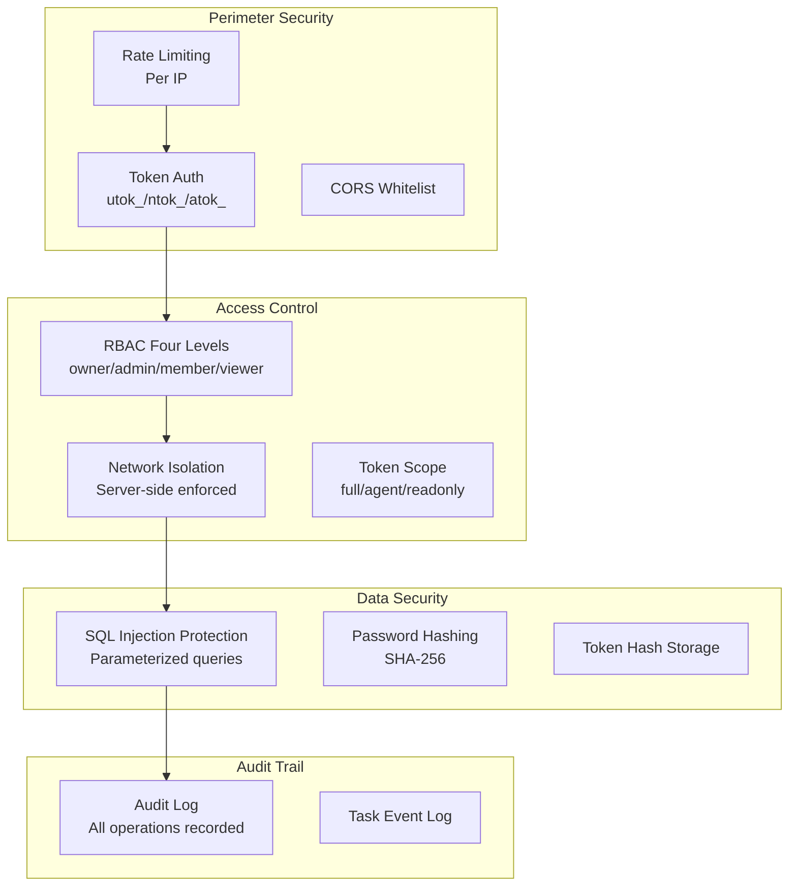
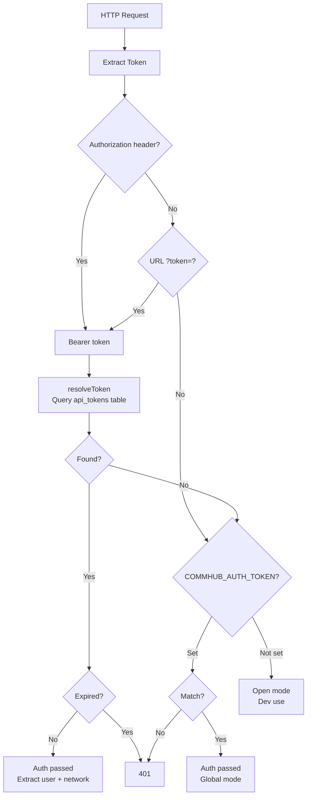

# Security Design

Agent Network's security architecture spans four layers: authentication, authorization, data isolation, and auditing.

## Security Architecture Overview



## Authentication

### Token System

Three token types serve different scenarios:

| Token | Prefix | Binding | Purpose |
|-------|------|------|------|
| User Token | `utok_` | User | CLI / Dashboard login |
| Network Token | `ntok_` | User + Network | Agent connection |
| API Token | `atok_` | User + Optional network | General API |

See [Token System](/en/concepts/tokens) for details.

### Token Storage

Tokens are **not stored in plaintext** in the database -- they are stored as SHA-256 hashes:

```typescript
// Generate token
const token = generateUserToken();  // utok_xxxxxxxx

// Store in database (hash only)
const hash = hashToken(token);  // SHA-256 hash
db.run("INSERT INTO api_tokens ... VALUES (?, ?)", [tokenId, hash]);

// Verification
const inputHash = hashToken(inputToken);
const row = db.get("SELECT * FROM api_tokens WHERE token_hash = ?", inputHash);
```

### Token Verification Flow



### Password Security

- Passwords stored using SHA-256 hashing
- Minimum 6 characters
- Usernames support letters, numbers, underscores, and Chinese characters
- Login failures don't reveal whether the username or password was wrong (prevents enumeration)

::: info Improvement Planned
Currently using SHA-256 hashing; planned upgrade to bcrypt for stronger brute-force resistance.
:::

## Authorization

### RBAC Permission Checks

Every MCP tool call undergoes permission checking:

```typescript
const canWrite = (): boolean => {
  if (!enforceUserId) return true;      // Global token mode
  if (!enforceNetworkId) return false;  // utok_ has no network → can't write
  const role = getUserNetworkRole(enforceUserId, enforceNetworkId);
  return !!role && role !== "viewer";   // owner/admin/member can write
};
```

### Server-Side Network Enforcement

This is the core of the security design -- the network ID is **never trusted from the client**:

```typescript
// Server extracts network_id from token, ignores client-provided value
const getNetworkId = (clientNetId) => enforceNetworkId ?? clientNetId ?? null;
```

Even if the client sends `network_id=other_network`, the server ignores it and enforces the token-bound network.

### REST API Permissions

REST API automatically scopes based on token type:

| Token Type | REST API Scope |
|-----------|-------------|
| `ntok_` | Only bound network data |
| `utok_` | All networks the user belongs to |
| `atok_` (full) | All networks the user belongs to |
| Global Token | All data |
| System admin | All data |

## Rate Limiting

### Per-IP Limits

| Endpoint | Limit | Description |
|------|------|------|
| `POST /api/auth/register` | 30/min | Prevent registration attacks |
| `POST /api/auth/login` | 10/min | Prevent brute force |
| Other API | 60/min | General limit |

### Implementation

```typescript
// In-memory store, per IP
const rateLimits = new Map<string, { count: number; resetAt: number }>();

function checkRateLimit(ip: string, maxPerMinute: number): boolean {
  // localhost exempt (dev/testing)
  if (!ip || ip === "127.0.0.1" || ip === "::1") return true;

  const now = Date.now();
  const entry = rateLimits.get(ip);
  if (!entry || now > entry.resetAt) {
    rateLimits.set(ip, { count: 1, resetAt: now + 60000 });
    return true;
  }
  return entry.count++ < maxPerMinute;
}
```

When the limit is exceeded, HTTP 429 is returned:

```json
{
  "error": "rate_limit_exceeded",
  "retry_after_seconds": 60
}
```

### Localhost Exemption

localhost (127.0.0.1 / ::1) is exempt from rate limiting for convenient development and testing.

## CORS Configuration

```bash
# Specify allowed origins
anet hub start --cors "https://dashboard.example.com,http://localhost:3000"

# Or via environment variable
COMMHUB_CORS_ORIGINS="https://dashboard.example.com" anet hub start
```

Default CORS is `*` (allow all origins). In production, configure a whitelist.

## Audit Logging

All key operations are recorded in the `audit_log` table:

```sql
CREATE TABLE audit_log (
  id         INTEGER PRIMARY KEY AUTOINCREMENT,
  user_id    TEXT,
  username   TEXT,
  action     TEXT NOT NULL,
  detail     TEXT,
  ip         TEXT,
  created_at TEXT DEFAULT (datetime('now'))
);
```

Recorded operations include:

| Operation | Description |
|------|------|
| `register` | User registration |
| `login` | User login |
| `create_network` | Network creation |
| `delete_network` | Network deletion |
| `create_token` | Token creation |
| `revoke_token` | Token revocation |
| `change_password` | Password change |
| `add_member` | Network member addition |
| `remove_member` | Network member removal |

### Querying Audit Logs

```bash
# CLI
anet audit --limit 50

# REST API
GET /api/audit-log?limit=50
```

## SQL Injection Protection

All database operations use parameterized queries:

```typescript
// Correct: Parameterized query
db.run("SELECT * FROM sessions WHERE alias = ?1", [alias]);

// Wrong: String concatenation (not used)
db.run(`SELECT * FROM sessions WHERE alias = '${alias}'`);
```

All 85+ `db.query()` calls have been migrated to parameterized approach.

## Database Security

### SQLite WAL Mode

```sql
PRAGMA journal_mode = WAL;
PRAGMA busy_timeout = 5000;
```

- **WAL mode**: Supports concurrent reads and writes, prevents lock conflicts
- **busy_timeout**: Waits 5 seconds before erroring, handles concurrent requests

### Database File Permissions

```bash
# Recommended database file permissions
chmod 600 ~/.commhub/commhub.db
```

### Sensitive Data

| Data | Storage Method |
|------|---------|
| Passwords | SHA-256 hash |
| Tokens | SHA-256 hash |
| API Keys | Not stored (environment variables) |
| Task content | Plaintext (encryptable) |
| Audit logs | Plaintext |

## Communication Security

### Recommended Configuration

```bash
# 1. Use TLS (reverse proxy)
# nginx.conf
server {
    listen 443 ssl;
    ssl_certificate /path/to/cert.pem;
    ssl_certificate_key /path/to/key.pem;

    location / {
        proxy_pass http://127.0.0.1:9200;
    }
}

# 2. Firewall rules
# Only allow specific IPs to access port 9200
ufw allow from 10.0.0.0/8 to any port 9200

# 3. Configure CORS
COMMHUB_CORS_ORIGINS="https://dashboard.example.com"
```

### SSE Connection Security

SSE connections use the same authentication mechanism as the REST API (Bearer Token / URL token parameter).

## Agent Runtime Security

### Isolation Strategy

Each Agent Node is fully isolated and does not read host machine config:

```typescript
const agent = new Agent({
  settingSources: [],  // No global config read
});
```

### Tool Permissions

Control which tools an agent can use via `--tools`:

```bash
# Read-only, no write
anet node create my-agent --tools Read,Glob,Grep

# All tools (use with caution)
anet node create my-agent --tools all
```

### Budget Control

```bash
# Limit per-task spend
anet node create my-agent --max-budget 0.1
```

## Security Checklist

### Production Deployment

- [ ] Set `COMMHUB_AUTH_TOKEN` (don't run in open mode)
- [ ] Use TLS (HTTPS)
- [ ] Configure firewall rules
- [ ] Configure CORS whitelist
- [ ] Use ntok_ instead of global tokens
- [ ] Set database file permissions to 600
- [ ] Regular database backups
- [ ] Monitor audit logs

### Agent Nodes

- [ ] Restrict tool permissions (avoid `--tools all`)
- [ ] Set budget caps
- [ ] Use Docker for isolation
- [ ] Don't hardcode secrets in environment variables
- [ ] Add `.anet/` to `.gitignore`
