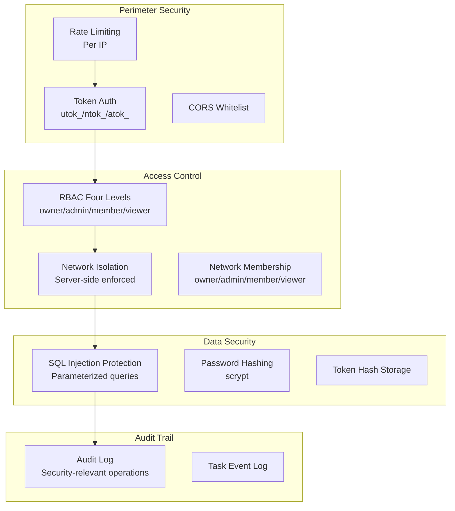

# Security Design

Agent Network's security architecture spans four layers: authentication, authorization, data isolation, and auditing.

## Security Architecture Overview



::: info Current boundary
The server enforces network binding and membership. `api_tokens.scope` is recorded, but current authorization primarily relies on the token's user/network binding and `network_members`; do not treat the `scope` string alone as proof of permission.
:::


## 🔴 Known: the `latest` channel's `/health` discloses live agents to anonymous callers

::: danger Do not run `bunx @sleep2agi/commhub-server` without a version
Without a version this resolves to the npm `latest` dist-tag, and **`latest` is currently `0.8.8` (published 2026-06-24)**.

On `0.8.8` an anonymous `GET /health` **returns the `{networkId}:{alias}` of every live SSE connection** — no token required.
The redaction fix is [`7bacb729`](https://github.com/sleep2agi/agent-network/commit/7bacb729) (`security(#473)`, **2026-07-29**),
**35 days after** `0.8.8` shipped, so `0.8.8` does not contain it.

**Pin a version, or use the preview channel:**

```bash
bunx --bun @sleep2agi/commhub-server@preview      # contains the redaction fix
```

Or use the supported path, `anet hub start`, which pulls the version in `PINNED_SERVER_VERSION` rather than `latest`.

Self-check: `curl -sS http://<host>:9200/health | jq 'has("sse_sessions")'` — `true` means you are on an affected build.
:::

The regression test lives at `server/src/health-redaction.test.ts` (on `main`).
This section describes the state of a **release channel**, not of the code — the code was fixed on 2026-07-29.

## Authentication

### Token System

The current system uses three token types:

| Token | Prefix | Binding | Purpose |
|-------|------|------|------|
| User Token | `utok_` | User | CLI / Dashboard login |
| Network Token | `ntok_` | User + Network | Agent connection |
| API Token | `atok_` | User, optionally network-bound | Long-lived API credential created by `anet token create` |

See [Token System](/en/concepts/tokens) for details.

### Token Storage

Tokens are **not stored in plaintext** in the database -- they are stored as SHA-256 hashes:

```typescript
// Generate token
const token = generateUserToken();  // utok_xxxxxxxx

// Store in database (hash only)
const hash = hashToken(token);  // SHA-256 hash
db.run("INSERT INTO api_tokens ... VALUES (?, ?)", [tokenId, hash]);

// Verification
const inputHash = hashToken(inputToken);
const row = db.get("SELECT * FROM api_tokens WHERE token_hash = ?", inputHash);
```

### Vendor Credential Storage (envRef mode) {#vendor-credential-storage-envref-mode-v0-9-0}

When an agent node runs `claude-agent-sdk`, it needs vendor API keys such as `ANTHROPIC_AUTH_TOKEN`, `OPENAI_API_KEY`, or `MINIMAX_KEY`. The `config.json` env map accepts two value shapes:

```jsonc
// Legacy shape (still works, deprecated) — plain token persisted to config.json
{
  "env": {
    "ANTHROPIC_AUTH_TOKEN": "sk-abc...xyz"        // ❌ High risk
  }
}

// New envRef shape — only the env-var NAME is stored; the value stays in process.env
{
  "env": {
    "ANTHROPIC_AUTH_TOKEN": { "_envRef": "ANTHROPIC_AUTH_TOKEN" }   // ✅ Recommended
  }
}
```

**Why envRef**: it keeps plaintext tokens out of `config.json`, reducing exposure through git, configuration displays, and logs. The launcher can read the actual value from the process environment or a mode-0600 `.env` file in the node directory; envRef is not a “never touches disk” promise.

**agent-node accepts both shapes**:
- A bare `string` → still used as plain, prints a one-shot deprecation banner pointing at `anet node migrate-token-to-envref <alias>`
- A `{ _envRef: "<NAME>" }` → reads `process.env[NAME]`; if the var is unset the agent **fatally exits at startup** (refuses to start silently broken) and prints an `export NAME='...'` remediation hint

**`anet node create` uses envRef automatically**: `config.json` stores only the variable name. The actual API key is written to `.anet/nodes/<alias>/.env` (mode 0600 and ignored through `.anet/.gitignore`) and loaded at startup. Cross-machine deployment still requires securely transferring that secret; see [`anet node create`](/en/guide/cli#anet-node-create).

**Migrating existing nodes**:

```bash
anet node migrate-token-to-envref <alias>
# 1. Backs up the original to config.json.bak-<ts>
# 2. Rewrites secret-shaped env values to { _envRef: ... }
# 3. Prints the export lines the user needs to persist
# Idempotent: non-secret values and already-migrated values are left alone
```

`anet doctor` also enumerates plain-secret nodes and prints a migration suggestion (passive scan; does not auto-migrate).

**Secret detection heuristic** (shared across agent-node / `anet node create` / `anet doctor`): env key suffix matches `/_TOKEN|_KEY|_SECRET|AUTH$/`, or value prefix matches `/sk-|utok_|ntok_|atok_|ak-|gsk_|key-|Bearer/` — either match flags the value as a secret.

### Token Verification Flow

The Hub parses credentials from the Bearer header (a few SSE/compatibility routes also accept a query token), checks whether the token exists, is expired, or is revoked, then applies user identity, network binding, and membership. Use `--dev-open` only for isolated local demos.

::: warning Legacy master token
`COMMHUB_AUTH_TOKEN` remains a backward-compatible master path with broad privileges. Do not enable it in new deployments. Migrate older deployments to `utok_` / `ntok_`, but do not assume the compatibility path has already been removed from the code.
:::

### Password Security

- Passwords are stored with **salted scrypt** (Node built-in `crypto.scryptSync`, not SHA-256):
  ```ts
  export function hashPassword(plain: string): string {
    const N = getScryptN();               // default 14 → 2^14≈16384 iter (~50ms), tunable via COMMHUB_SCRYPT_N
    const salt = randomBytes(16);         // fresh random salt per password
    const hash = scryptSync(plain, salt, 64, { N: 1 << N, r: 8, p: 1, maxmem: 128 * 1024 * 1024 });
    return `scrypt$${N}$${salt.toString("base64")}$${hash.toString("base64")}`;
  }
  ```
  **Each password gets its own 16-byte random salt** (stored inside the hash string), so the same password yields a different hash across accounts. Legacy bare SHA-256 hashes are lazily migrated to scrypt after a successful login.

- **Password strength** is handled by the shared `validatePasswordStrength()` check:
  - User-chosen passwords (register / `anet passwd`): **≥ 8 chars** + rejected against [`password-dict.ts WEAK_PASSWORDS`](https://github.com/sleep2agi/agent-network/blob/main/server/src/password-dict.ts)
  - The bootstrap admin's register path has a 4-character minimum. **`anet passwd` / `reset-user` do not have this exemption**: they require at least 8 characters and reject the weak-password dictionary.
  - Public deployments must rotate the password **immediately** via `anet passwd`

- Usernames support letters, numbers, underscores, and Chinese characters
- Login failures do not reveal whether the username or password was wrong, preventing username enumeration

::: info Passwords and tokens use different hash strategies
Passwords use scrypt with a fresh salt; legacy SHA-256 password hashes are lazily migrated after a successful login. Tokens are high-entropy random values, and the database stores only their SHA-256 hashes.
:::

## Authorization

### RBAC Permission Checks

MCP write tools use a shared `canWrite` check against membership in the target network:

**Key points**:
- `ntok_` → `enforceNetworkId` is locked by the token; the server **does not honor** any client-supplied network_id (prevents cross-network writes).
- `utok_` → the server resolves a target network and checks `network_members.role`.
- Regardless of token type, a `viewer` role is denied on writes.

### Server-Side Network Enforcement

An `ntok_` has a token-bound network that client parameters cannot override. A `utok_` may select a target network, but the server verifies that the user is a member; it does not trust an arbitrary client-supplied network ID.

### REST API Permissions

REST API automatically scopes based on token type:

| Token Type | REST API Scope |
|-----------|-------------|
| `ntok_` | Only bound network data |
| `utok_` | All networks the user belongs to |
| `atok_` | Bound network only when scoped; otherwise the user's memberships |
| Legacy master token | Generic REST scope; not a substitute for endpoints requiring a concrete user membership |
| System admin | Hub-wide admin and cross-network query routes; membership management still checks the caller's role in that network |

## Rate Limiting

### Per-IP Limits

| Endpoint | Limit | Description |
|------|------|------|
| `POST /api/auth/register` | 30/min | Prevent registration attacks |
| `POST /api/auth/login` | 10/min | Prevent brute force |

::: info register and login use different mechanisms
- **register**: the generic `checkRateLimit()` (30/min).
- **login**: a dedicated `LoginIpRateLimiter` (10 requests per 60-second window, per IP) **plus** progressive account lockout after ≥ 5 consecutive failures (30 seconds initially, exponential backoff to 15 minutes).
- **No other endpoint rate-limits per IP** — if you're worried about write abuse, layer rate limiting at a reverse proxy (nginx / Cloudflare / etc.) in front.
:::

### 429 responses

```json
{ "ok": false, "error": "too many requests, try again later" }
```

That is the register response. Login returns `rate_limited` for the IP limit or `login_locked` for account lockout; both include `Retry-After` and `retry_after_ms`.

### Localhost Exemption

The generic register limiter exempts localhost and `"unknown"`. The dedicated login limiter **does not**. In production, use a trusted reverse proxy to supply the client IP and add a gateway-level rate limit.

## CORS Configuration

```bash
# No CLI flag — use the env var
COMMHUB_CORS_ORIGINS="https://dashboard.example.com,http://localhost:3000" anet hub start

# Or a single origin
COMMHUB_CORS_ORIGINS="https://dashboard.example.com" anet hub start
```

::: warning CORS default is **not** `*`
When `COMMHUB_CORS_ORIGINS` is unset, the allowlist is `http://localhost:3000` and `http://localhost:3001`, **not** `*`. Setting the variable fully replaces the defaults.

`Access-Control-Allow-Origin` echoes the request `Origin` only when it's in the allowlist, otherwise it returns an empty string (the browser then blocks the cross-origin request). No author-specific domains are hardcoded — production deployments serving the Dashboard cross-origin must set `COMMHUB_CORS_ORIGINS` explicitly.
:::

## Audit Logging

Important operations are written to `audit_log` with the caller, action, target, details, IP, network, and timestamp. Actions grow with product capabilities, so this page does not pin a count.

Common action groups:

- Login and password: `register`, `login`, `login_failed`, `login_rate_limited`, `login_locked`, `password_changed`
- Networks and members: `network_renamed`, `network_deleted`, `network_joined`, `member_*`, `invite_created`
- Tokens and nodes: `token_*`, `node_token_created`, `node_rename_*`, `node_attrs_updated`

::: info Network creation is not currently audited
POST `/api/networks` does not write `create_network` or `network_created`. Do not depend on those nonexistent actions.
:::

### Querying Audit Logs

```bash
# Via REST API (no dedicated CLI command for audit log yet)
UTOK=$(jq -r .token ~/.anet/config.json)
curl -H "Authorization: Bearer $UTOK" "$HUB/api/audit-log?limit=50"
```

## SQL Injection Protection

Database queries bind parameters instead of concatenating user input:

```typescript
// Correct: Parameterized query
db.run("SELECT * FROM sessions WHERE alias = ?1", [alias]);

// Wrong: String concatenation (not used)
db.run(`SELECT * FROM sessions WHERE alias = '${alias}'`);
```

## Database Security

::: tip The backend is SQLite — the integrity guarantees are SQLite-based too
anet runs on **SQLite** in production (`~/.commhub/commhub.db`). The integrity and isolation guarantees in this section (and in authorization / audit) rest on SQLite's transaction / constraint semantics. The code has a `DATABASE_URL` PostgreSQL entry point, but it is **not end-to-end verified and not recommended for production** (see [FAQ — PostgreSQL support?](/en/faq#_20-what-about-postgresql-support)).
:::

### SQLite WAL Mode

```sql
PRAGMA journal_mode = WAL;
PRAGMA busy_timeout = 5000;
```

- **WAL mode**: Supports concurrent reads and writes, prevents lock conflicts
- **busy_timeout**: Waits 5 seconds before erroring, handles concurrent requests

### Database File Permissions

```bash
# Recommended database file permissions
chmod 600 ~/.commhub/commhub.db
```

### Sensitive Data

| Data | Storage method | Details |
|------|---------|------|
| Passwords | salted scrypt (`scrypt$N$salt$hash`) | fresh random salt per password, legacy SHA-256 lazily migrated on login |
| Tokens | SHA-256 hash (no salt) | Tokens come from `crypto.randomUUID()`; plaintext is not stored in the database |
| API keys | Not stored in the Hub database | agent-node reads process environment or a node `.env`; envRef keeps only the variable name in `config.json` |
| Task content | Plaintext | The `tasks.content` column; on a shared hub, admins can read everything. `audit_log` does not contain task bodies |
| Audit logs | Plaintext | `audit_log` has 10 columns including `user_id` / `username` / `action` / `detail` / `ip` / `network_id` |

## Communication Security

### Recommended Configuration

```bash
# 1. Use TLS (reverse proxy)
# nginx.conf
server {
    listen 443 ssl;
    ssl_certificate /path/to/cert.pem;
    ssl_certificate_key /path/to/key.pem;

    location / {
        proxy_pass http://127.0.0.1:9200;
    }
}

# 2. Firewall rules
# Only allow specific IPs to access port 9200
ufw allow from 10.0.0.0/8 to any port 9200

# 3. Configure CORS
COMMHUB_CORS_ORIGINS="https://dashboard.example.com"
```

### SSE Connection Security

SSE connections use the same authentication mechanism as the REST API (Bearer Token / URL token parameter). agent-node reloads its token and reconnects after an SSE 401.

### Dashboard auth

The Dashboard runs as a thin cookie-proxy:

- Browser logs into the Dashboard with username / password → Next.js backend obtains a `utok_` and writes it to an HttpOnly cookie
- The Dashboard frontend does not hold a long-lived service token
- The backend forwards requests to the Hub with the current session's `utok_` Bearer header
- Session cookie expires / user logs out → cookie cleared → next request returns 401, forcing re-login

## Agent Runtime Security

### Isolation Strategy

`claude-agent-sdk` defaults to `settingSources: []`, so it does not automatically load host Claude configuration:

```typescript
const options = {
  settingSources: [],  // No global config read
  // model / permissionMode / mcpServers / env ...
};
for await (const message of query({ prompt, options })) { /* ... */ }
```

This is not operating-system isolation. Filesystem, shell, and network tools still act on the host environment. Use a container or a dedicated low-privilege account when stronger isolation is required.

### Tool Permissions (default = Claude Code preset, user responsibility)

The `claude-agent-sdk` runtime defaults to the full Claude Code preset. A newly started node can:

- Filesystem: `Read` / `Write` / `Edit` / `Glob` / `Grep`
- Shell: `Bash` (subject to `dangerouslySkipPermissions=true` on by default — no per-call confirmation)
- Network: `WebFetch` / `WebSearch`
- Subtasks: `Task` / `NotebookEdit` / ...

Plus the ~40 MCP tools on the hub side (`commhub_send_task` / `commhub_reply` / ...).

**Granularity**:

```bash
# Default (no --tools) → full Claude Code preset
anet node create my-agent

# Explicit "all" → same preset (single source-of-truth, not the old hardcoded 8-tool list)
anet node create my-agent --tools all

# Explicit allowlist (read-only agent) — bypasses the preset, takes a string array
anet node create my-agent --tools Read,Glob,Grep

# See what's actually in effect
anet info my-agent           # prints tools: + flags: lines
```

After `anet node create`, the CLI prints the effective tools and permission flags. You still need to choose isolation appropriate to the working directory and data sensitivity.

> ⚠ **User responsibility**: the default preset + default `dangerouslySkipPermissions=true` means the agent can **edit files, run shell commands, and access the network without confirmation prompts**. Please:
> 1. **Do NOT run agents from `$HOME` directly** — use a disposable working directory (`mkdir agent-work && cd agent-work && anet node create ...`); see [SECURITY.md](https://github.com/sleep2agi/agent-network/blob/main/SECURITY.md)
> 2. For strict sandboxing, set `--tools Read,Glob,Grep` to grant read-only permissions
> 3. Turn off auto-approval (yolo): for codex-sdk nodes use `anet node create --no-yolo`; for claude runtimes (claude-code-cli / claude-agent-sdk) set `dangerouslySkipPermissions` to `false` in the node's `config.json` (**there is no `--no-skip-permissions` flag**). Note: every tool call will then prompt for confirmation, which hurts long-task UX.
> 4. Cap per-task spend: `--max-budget 0.1` (see [Budget Control](#budget-control) below)

### Budget Control

`--max-budget` is an **agent-node runtime flag** (not an `anet node create` flag), and **only takes effect for the `claude-agent-sdk` runtime**:

```bash
# Limit per-task spend (USD), passed to the agent-node process
npx @sleep2agi/agent-node --alias my-agent --max-budget 0.1
```

Or persist it via `flags.maxBudgetUsd` in `config.json`.

## Security Checklist

### Production Deployment

- [ ] Run `anet passwd` **immediately** after `anet hub start`
- [ ] Do not set legacy `COMMHUB_AUTH_TOKEN` in new deployments; use `utok_` / `ntok_`
- [ ] Use TLS (HTTPS); Caddy auto-cert recommended
- [ ] Configure firewall rules (only open 80/443)
- [ ] Configure CORS whitelist via `COMMHUB_CORS_ORIGINS`
- [ ] Agent nodes use `ntok_` (one per agent, hub enforces network binding)
- [ ] Confirm `~/.anet/server/admin-utok.json` has mode 600
- [ ] Regular `~/.commhub/commhub.db` backups
- [ ] Monitor audit log (`/api/audit-log`)

### Agent Nodes

- [ ] Restrict tool permissions (avoid `--tools all`)
- [ ] Set budget caps
- [ ] Use Docker for isolation
- [ ] Do not store plaintext secrets in `config.json`; use envRef, a protected `.env`, or a secrets manager
- [ ] Add `.anet/` to `.gitignore`

## Next steps

**Dig into the implementation**:
- [Architecture — Security section](/en/guide/architecture#security-architecture) — token flow and the corresponding DB tables
- [Account system](/en/guide/account-system) — relationship between utok_ / ntok_ / password

**Hands-on**:
- Forgot password: run `anet hub admin reset-user <username>` on the Hub machine
- Repair expired tokens: `anet doctor --fix` auto-probes and reissues ntok_
- Change password: `anet passwd` interactive

**Production deployment checklist**:
- [Production deployment](/en/deploy/production) — full TLS / firewall / CORS / backup checklist
- [Docker deployment](/en/deploy/docker) — containerization best practices
