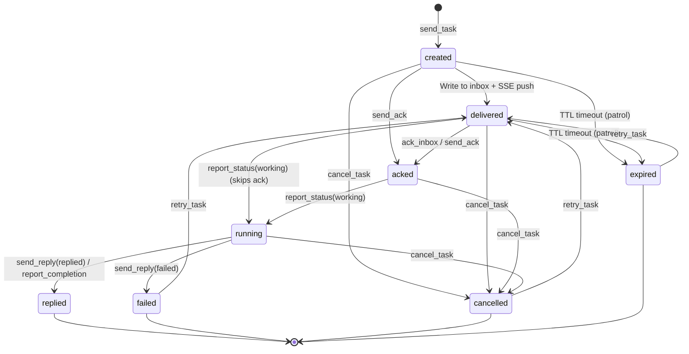
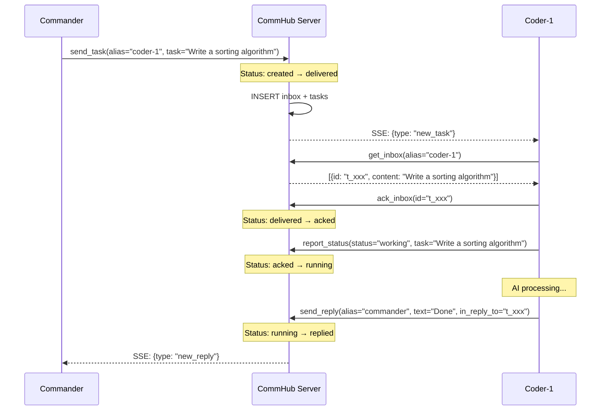
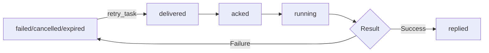
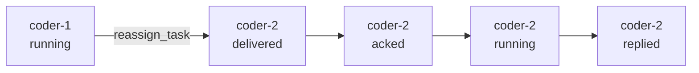
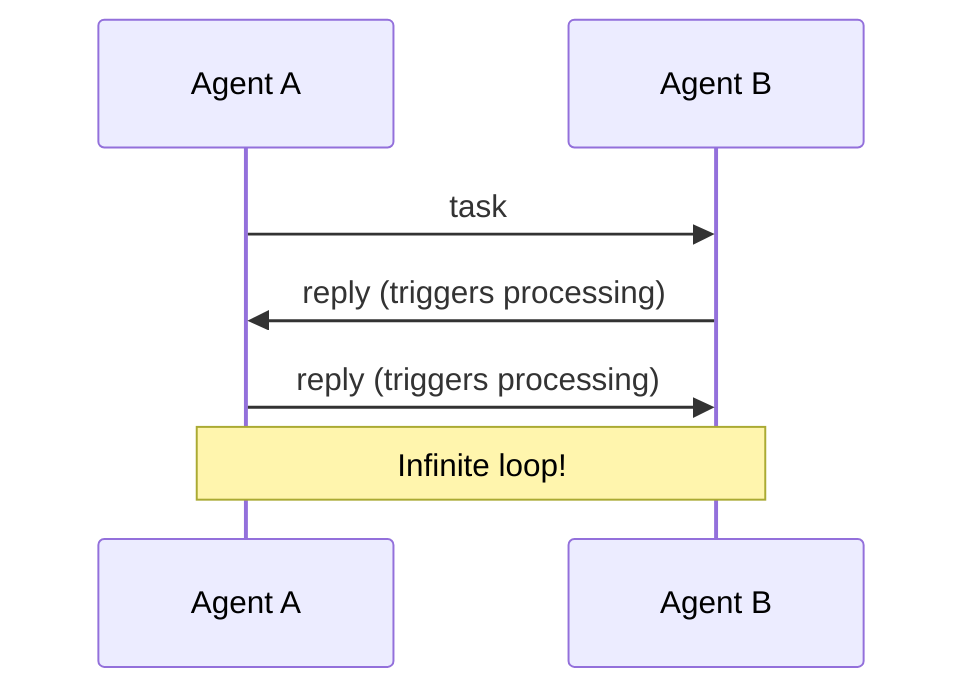

# Task Lifecycle

A Task is the core data unit in Agent Network. Every task has a complete lifecycle, from creation to closure.

## State Machine



::: warning `created` is essentially invisible on the production path
The diagram's `[*] → created → delivered` reflects the **schema default** ([`server/src/db.ts:151`](https://github.com/sleep2agi/agent-network/blob/main/server/src/db.ts#L151) `status TEXT NOT NULL DEFAULT 'created'`), but **no code path UPDATEs `created` to `delivered`**: [`server/src/tools.ts:637-639`](https://github.com/sleep2agi/agent-network/blob/main/server/src/tools.ts#L637) `send_task` inserts with `VALUES (..., 'delivered', ...)` directly, bypassing the default. So through normal API flows you'll **never observe** a task in `created` state.

`created` still appears in three WHERE clauses defensively:

| Operation | Accepted source states | Source |
|------|------------------------|------|
| `cancel_task` | `created` / `delivered` / `acked` / `running` | [tools.ts:946](https://github.com/sleep2agi/agent-network/blob/main/server/src/tools.ts#L946) |
| `send_ack` (Hub tool) | `created` / `delivered` | [tools.ts:808](https://github.com/sleep2agi/agent-network/blob/main/server/src/tools.ts#L808) |
| Expiration patrol | `created` / `delivered` | [index.ts:390-392](https://github.com/sleep2agi/agent-network/blob/main/server/src/index.ts#L390) |
| `ack_inbox` (Agent tool) | `delivered` (**only 1**) | [tools.ts:480](https://github.com/sleep2agi/agent-network/blob/main/server/src/tools.ts#L480) |

`ack_inbox` and `send_ack` have different WHERE clauses — `ack_inbox` (agent-side tool, L354) accepts only `delivered`, while `send_ack` (hub-side tool, L679) accepts `created` / `delivered`. The "4 cancellable states" are exactly the `cancel_task` row. The state diagram above doesn't draw `created`'s outgoing edges for simplicity; SQL allows them, but the only way a row enters the `created` state is a direct DB INSERT that omits the status column — no REST/MCP entry point does that.
:::

## Status Reference

| Status | Meaning | Triggered By | Next Step |
|------|------|---------|--------|
| `created` | Schema default (DB column DEFAULT) | Only appears if `send_task` is bypassed via direct INSERT | Not on normal API path |
| `delivered` | Delivered to inbox | Write to inbox + SSE push | Wait for agent to ack |
| `acked` | Agent confirmed receipt | `ack_inbox` / `send_ack` | Wait for agent to start processing |
| `running` | Agent is processing | `report_status(working)` | Wait for completion |
| `replied` | Result returned | `send_reply` / `report_completion` | Terminal state |
| `failed` | Processing failed | `send_reply(status=failed)` | Can be retried |
| `cancelled` | Cancelled | `cancel_task` | Can be retried |
| `expired` | TTL timeout | Auto-detected | Can be retried |

### Terminal States

The following states are terminal and cannot change (except via retry):

- `replied` -- Task completed successfully
- `failed` -- Task failed
- `cancelled` -- Task was cancelled
- `expired` -- Task expired

## Complete Lifecycle Flow



## Dual-Write Mechanism

Each task is written to two tables simultaneously:

| Table | Purpose | Lifecycle |
|-----|------|---------|
| `inbox` | Message delivery queue | Marked as processed after ACK |
| `tasks` | Task status tracking | Full lifecycle |

```sql
-- Dual write on send_task
INSERT INTO inbox (id, session_name, type, content, ...) VALUES (...);
INSERT INTO tasks (task_id, from_name, to_name, status, content, ...) VALUES (...);
```

`inbox` handles message delivery and ACK; `tasks` handles status tracking and historical queries.

## TTL and Expiration

Each task has a TTL (Time To Live), defaulting to 1 hour:

```bash
# Set TTL
commhub_send_task(alias="coder-1", task="...", ttl_seconds=7200)  # 2 hours
```

| Parameter | Default | Range |
|------|--------|------|
| `ttl_seconds` | 3600 (1 hour) | 1 ~ 86400 (1 day) |

Expired tasks can be redelivered via `retry_task`.

```sql
-- Expiration stored in the tasks table
expires_at = datetime('now', '+3600 seconds')
```

::: warning The expiry patrol only covers `created` / `delivered`
Verify [`server/src/index.ts:286-303`](https://github.com/sleep2agi/agent-network/blob/main/server/src/index.ts#L286): expiration is not real-time — a **patrol that runs every 5 minutes** UPDATEs tasks with `expires_at < now` **and `status IN ('created', 'delivered')`** to `expired`.

Implications:
- The actual status flip can lag `expires_at` by up to ~5 minutes
- **A task that's already `acked` or `running` is never auto-expired** — the agent has picked it up, so the patrol leaves it alone even past its TTL (that's why the state diagram has no `acked → expired` edge). To kill a stuck `running` task, use [`cancel_task`](/en/api/mcp-tools#cancel_task)
:::

## Retry Mechanism

Failed, cancelled, and expired tasks can all be retried:

::: tip
The following calls go via REST `POST /mcp` rather than the Claude Code agent's stdio channel wrapper. The channel wrapper ([`channel/commhub-channel.ts:138-196`](https://github.com/sleep2agi/agent-network/blob/main/channel/commhub-channel.ts#L138)) exposes 5 `commhub_*` tools (`commhub_reply` / `commhub_report_status` / `commhub_send_task` / `commhub_send_message` / `commhub_get_all_status`); `cancel_task` / `retry_task` / `reassign_task` / `get_inbox` are admin / dashboard ops and not exposed to agent self-service.
:::

```bash
# Retry a task (POST /mcp, tool=retry_task)
retry_task(task_id="t_xxx")
```

Retry flow:

1. Verify task status is `failed` / `cancelled` / `expired`
2. Reset task status to `delivered`
3. Clear result, completed_at, started_at
4. Reset expires_at (+1 hour)
5. Create a new inbox entry
6. SSE push new_task



## Cancelling Tasks

You can cancel tasks that haven't completed yet:

```bash
# POST /mcp, tool=cancel_task
cancel_task(task_id="t_xxx", reason="No longer needed")
```

Cancellation will:

1. Update task status to `cancelled`
2. Mark the inbox entry as ACKed (prevents agent from continuing)
3. Record the cancellation reason in the result field
4. Log a task_event

Cancellable statuses: `created` / `delivered` / `acked` / `running` (4 statuses — verified at [`server/src/tools.ts:817`](https://github.com/sleep2agi/agent-network/blob/main/server/src/tools.ts#L817) `WHERE status IN ('created', 'delivered', 'acked', 'running')`. The tool's own description string only mentions 3 (missing `created`); the SQL is the source of truth with 4. Terminal states `replied` / `failed` / `cancelled` / `expired` cannot be cancelled directly — retry first, then cancel.)

## Reassigning Tasks

Transfer a task from one agent to another:

```bash
# POST /mcp, tool=reassign_task
reassign_task(task_id="t_xxx", new_alias="coder-2")
```

Reassignment flow:

1. Mark the original agent's inbox entry as ACKed
2. Update tasks.to_name to the new agent
3. Reset status to `delivered`
4. Create a new inbox entry for the new agent
5. SSE push new_task to the new agent



## Message Types

Agent Network distinguishes five message types. Only `task` and `broadcast` trigger AI processing:

| Type | Semantics | Triggers AI | Into Inbox | SSE Event |
|------|------|:-------:|:--------:|---------|
| `task` | Formal task | &check; | &check; | `new_task` |
| `reply` | Task reply | | &check; | `new_reply` |
| `message` | Chat message | | &check; | `new_message` |
| `ack` | Pure acknowledgement | | | (not pushed) |
| `broadcast` | Broadcast | &check; | &check; | `broadcast` |

### Why Distinguish Message Types?

Without message type distinction, infinite loops would occur:



By distinguishing types, only `task` and `broadcast` trigger processing, while `reply` and `message` are displayed but not processed.

## Task Event Log

Every status change is recorded in the `task_events` table (verified at [`server/src/db.ts:134-147`](https://github.com/sleep2agi/agent-network/blob/main/server/src/db.ts#L134)):

```sql
CREATE TABLE task_events (
  id            INTEGER PRIMARY KEY AUTOINCREMENT,
  task_id       TEXT NOT NULL,
  from_status   TEXT,                                    -- column is from_status, not from_state
  to_status     TEXT NOT NULL,                           -- column is to_status, not to_state
  actor         TEXT NOT NULL DEFAULT 'system',          -- NOT NULL with default 'system'
  detail        TEXT,
  created_at    TEXT NOT NULL DEFAULT (datetime('now'))
);
```

Query task events:

```bash
# REST API (no CLI shortcut — `anet tasks` only supports status (positional or --status) / --limit filters; --detail does not exist)
curl "http://localhost:9200/api/task_events?task_id=t_xxx" \
  -H "Authorization: Bearer ntok_xxx"
```

The original doc's `anet tasks --detail t_xxx` CLI command does not exist ([`cli.ts:3059-3094 tasksCommand`](https://github.com/sleep2agi/agent-network/blob/main/agent-network/bin/cli.ts#L3059) only parses status (positional or `--status`) and `--limit` — `--detail` is silently ignored and prints `?` placeholders).

Example output:

```
Task t_a1b2c3d4 events:
  10:00:01  → delivered  by commander  (→ coder-1)
  10:00:03  delivered → acked  by coder-1
  10:00:03  acked → running  by coder-1
  10:00:15  running → replied  by coder-1  (Sorting algorithm completed)
```

## Priority

Tasks support three priority levels:

| Priority | Meaning | Inbox Ordering |
|--------|------|-----------|
| `high` | Urgent task | Sorted first |
| `normal` | Standard task | Default |
| `low` | Low priority | Sorted last |

```bash
# Send a high-priority task
commhub_send_task(alias="coder-1", task="Critical fix needed", priority="high")
```

When agents fetch their inbox, items are automatically sorted by priority:

```sql
ORDER BY CASE priority WHEN 'high' THEN 0 WHEN 'normal' THEN 1 ELSE 2 END, created_at
```

## Database Table Schema

Below is the schema as it actually exists in v0.8 (after all ALTER TABLE migrations). The original CREATE TABLE and migrations live in [`server/src/db.ts:88-111`](https://github.com/sleep2agi/agent-network/blob/main/server/src/db.ts#L88) (tasks, 17 original columns), [`db.ts:326-328`](https://github.com/sleep2agi/agent-network/blob/main/server/src/db.ts#L326) (V3 adds `network_id` to `tasks` and 5 other tables), and [`db.ts:415`](https://github.com/sleep2agi/agent-network/blob/main/server/src/db.ts#L415) (adds `parent_task_id`).

```sql
-- Effective tasks schema: 19 columns (17 original + 2 migrations)
CREATE TABLE tasks (
  task_id           TEXT PRIMARY KEY,
  from_node_id      TEXT,
  from_name         TEXT NOT NULL DEFAULT 'hub',
  to_node_id        TEXT,
  to_name           TEXT NOT NULL,
  priority          TEXT NOT NULL DEFAULT 'normal',
  status            TEXT NOT NULL DEFAULT 'created',
  content           TEXT NOT NULL,
  result            TEXT,
  in_reply_to       TEXT,
  requires_response TEXT DEFAULT 'reply',
  scope             TEXT DEFAULT 'single',
  created_at        TEXT NOT NULL DEFAULT (datetime('now')),
  delivered_at      TEXT,
  started_at        TEXT,
  completed_at      TEXT,
  expires_at        TEXT,
  network_id        TEXT,           -- ALTER (V3)
  parent_task_id    TEXT            -- ALTER (sub-task chain)
);

-- Effective inbox schema (9 original + 5 migrations)
CREATE TABLE inbox (
  id                TEXT PRIMARY KEY,
  session_name      TEXT NOT NULL,
  type              TEXT DEFAULT 'task',
  priority          TEXT DEFAULT 'normal',
  content           TEXT NOT NULL,
  context           TEXT,
  from_session      TEXT DEFAULT 'hub',
  acked             INTEGER DEFAULT 0,
  created_at        TEXT NOT NULL DEFAULT (datetime('now')),
  in_reply_to       TEXT,           -- ALTER
  requires_response TEXT DEFAULT 'reply',  -- ALTER
  expires_at        TEXT,           -- ALTER
  scope             TEXT DEFAULT 'single', -- ALTER
  network_id        TEXT            -- ALTER (V3)
);
```

::: info `from_node_id` / `to_node_id` vs `from_name` / `to_name`
`*_node_id` is the **persistent node ID** (joins against the `nodes` table — useful for looking up metadata even after the agent is deleted). `*_name` is the **alias as a string at the time of writing** (human-readable, used in table renders). Both exist because aliases can be renamed or reused, while `node_id` is permanently unique. `from_name` defaults to `'hub'` for tasks dispatched by the hub itself (not by an agent).
:::

## Next steps

**Hands-on**:
- 5 ways to send a task: [CLI](/en/guide/cli) `anet task send` / `commhub_send_task` MCP tool / Dashboard ChatPanel / REST `/api/tasks` / SSE push
- View the task flow: [Dashboard — Tasks panel](/en/guide/dashboard#tasks)
- Retry / cancel failed tasks: click the buttons in the Dashboard

**Dig deeper**:
- Why task and message are separate concepts: top of this page ("Task vs message")
- Multi-agent collaboration chain: [Debate case](/en/cases/debate) — a single run walks through all 9 steps
- How `network_id` is used: [Networks](/en/concepts/networks)
