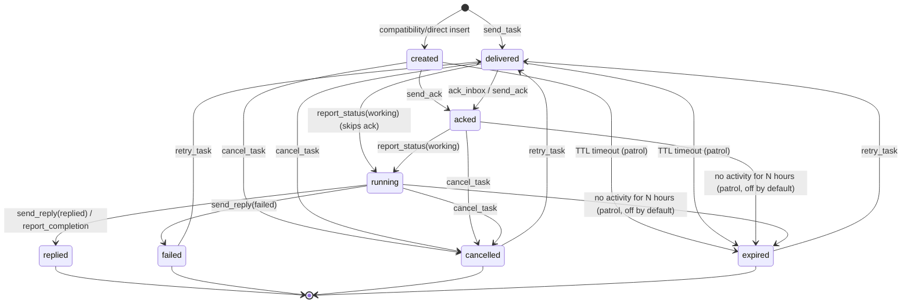
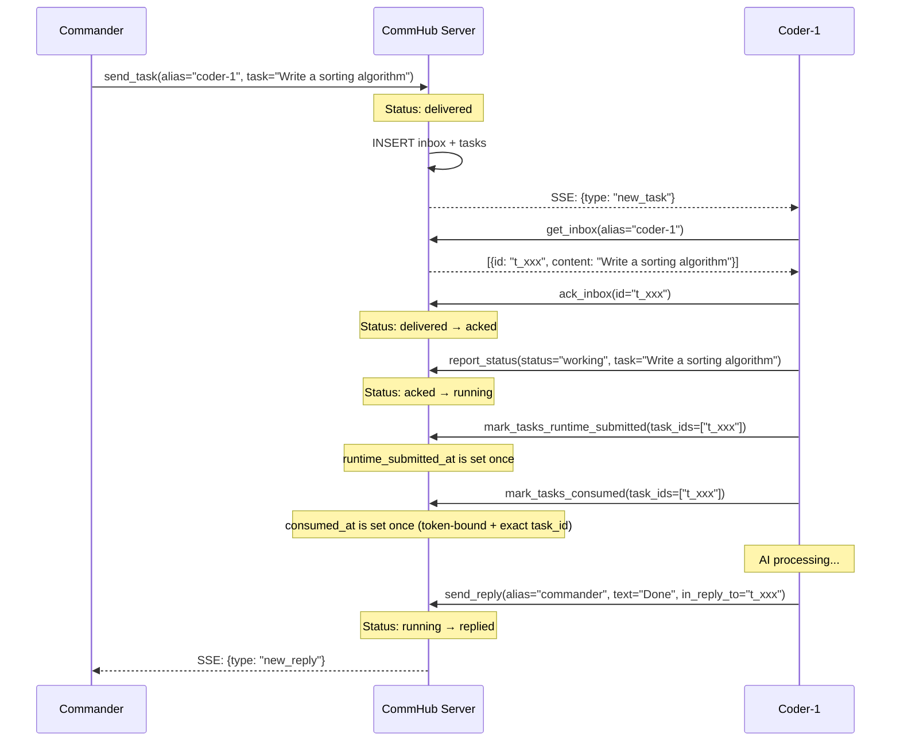
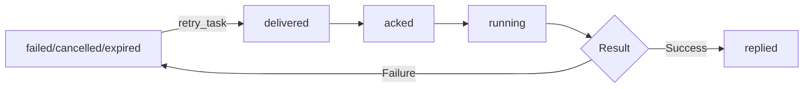
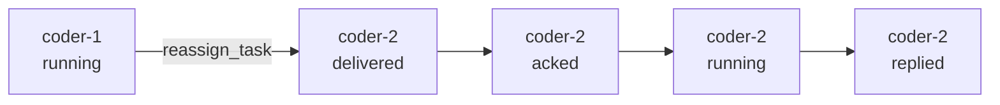
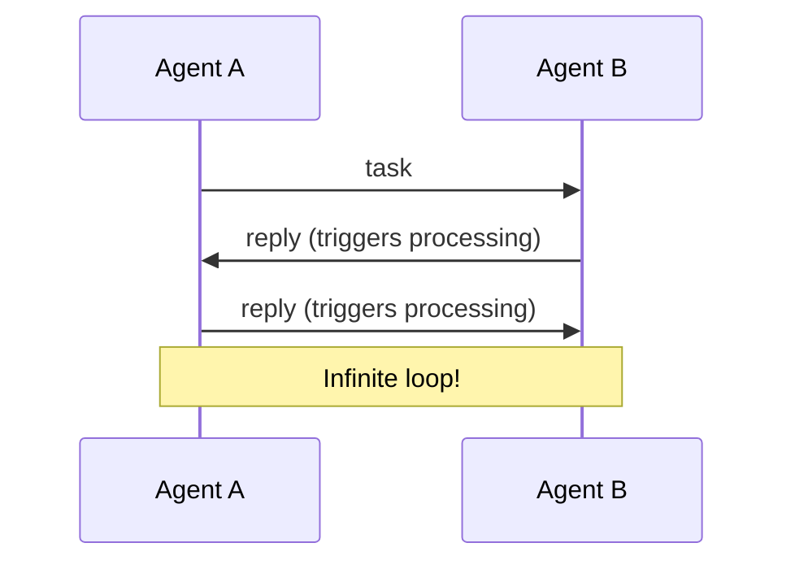

# Task Lifecycle

A Task is the core data unit in Agent Network. Every task has a complete lifecycle, from creation to closure.

## State Machine


```mermaid
stateDiagram-v2
    [*] --> delivered: send_task
    [*] --> created: compatibility/direct insert

    created --> cancelled: cancel_task
    created --> acked: send_ack
    created --> expired: TTL timeout (patrol)

    delivered --> acked: ack_inbox / send_ack
    delivered --> running: report_status(working) (skips ack)
    delivered --> cancelled: cancel_task
    delivered --> expired: TTL timeout (patrol)

    acked --> running: report_status(working)
    acked --> cancelled: cancel_task
    acked --> expired: no activity for N hours (patrol, off by default)

    running --> replied: send_reply(replied) / report_completion
    running --> failed: send_reply(failed)
    running --> cancelled: cancel_task
    running --> expired: no activity for N hours (patrol, off by default)

    replied --> [*]
    failed --> delivered: retry_task
    cancelled --> delivered: retry_task
    expired --> delivered: retry_task

    failed --> [*]
    cancelled --> [*]
    expired --> [*]
```

::: warning `created` is essentially invisible on the production path
`created` is the database default, but normal REST/MCP dispatch writes `delivered` directly. It remains a compatibility state accepted by `cancel_task`, `send_ack`, and the expiration patrol; `ack_inbox` accepts only `delivered`. Normal callers therefore rarely observe `created`.
:::

## Status Reference

| Status | Meaning | Triggered By | Next Step |
|------|------|---------|--------|
| `created` | Schema default (DB column DEFAULT) | Only appears if `send_task` is bypassed via direct INSERT | Not on normal API path |
| `delivered` | Delivered to inbox | Write to inbox + SSE push | Wait for agent to ack |
| `acked` | Agent confirmed receipt | `ack_inbox` / `send_ack` | Wait for agent to start processing |
| `running` | Agent is processing | `report_status(working)` | Wait for completion |
| `replied` | Result returned | `send_reply` / `report_completion` | Terminal state |
| `failed` | Processing failed | `send_reply(status=failed)` | Can be retried |
| `cancelled` | Cancelled | `cancel_task` | Can be retried |
| `expired` | TTL timeout | Auto-detected | Can be retried |

### `runtime_submitted_at` and `consumed_at`: two runtime evidence levels

Lifecycle status and consumption evidence are separate axes. `delivered_at` proves only that Hub wrote the task to the delivery queue, while `acked` proves only that the long-running agent-node process fetched the inbox row. Neither proves that a model turn began. `started_at` is maintained by the compatibility `report_status(working)` path and may precede the vendor runtime actually accepting the task, so it is not authoritative evidence that the model was awakened.

`runtime_submitted_at` means agent-node handed the body to the vendor runtime (for example, issued a prompt/turn request or wrote it into the controlled copresence session), but it does not claim that model inference began. `consumed_at` is the stronger, write-once signal: agent-node reports it with its token-bound identity only after the current `task_id` can be attributed to a vendor turn-start or first activity event. Both remain `null` while a task is queued inside agent-node, merely acknowledged, or held by an online process that has not submitted the body. After submission but before authoritative activity, only `runtime_submitted_at` is populated. Both are monotonic for the logical task lifetime; retry and reassignment preserve existing values. A fresh inbox delivery row keeps the original logical `task_id`, so delayed callbacks cannot be mistaken for another task or erase a fact that already occurred.

On Codex app-server nodes, that same authoritative consumed signal also carries `thread_id` and `turn_id`. The pair is constrained by the node token, immutable node identity, and exact `task_started` event, and becomes the BTW source boundary. If either value is absent, the client must fail closed instead of falling back to ordinary send, priority delivery, or steer. Old Hubs and nodes remain compatible for ordinary tasks but cannot provide a BTW boundary for that task.

The earliest reliable signal differs by runtime. For example, Codex app-server uses exact `task_started`, Grok copresence uses the `network_user` event matching the active network task, and OpenCode copresence—whose wire protocol lacks an attributable start event—waits for the exact linked assistant response. The last signal is later, but it never reports “model consumed” merely because the task entered a queue.

::: warning Do not use `sessions.task` as model-consumption evidence
The compatibility `sessions.task` field is written both by dispatch (with the sender's task text) and by the node's `report_status(task=...)`, and it may retain historical text. It is a legacy display field, not the identity of the current model turn or a delivery acknowledgement. Use `tasks.runtime_submitted_at` / `tasks.consumed_at` for per-task diagnosis and heartbeat fields only for process liveness.
:::

### Terminal States

The following states are terminal and cannot change (except via retry):

- `replied` -- Task completed successfully
- `failed` -- Task failed
- `cancelled` -- Task was cancelled
- `expired` -- Task expired

## Complete Lifecycle Flow


```mermaid
sequenceDiagram
    participant H as Commander
    participant S as CommHub Server
    participant A as Coder-1

    H->>S: send_task(alias="coder-1", task="Write a sorting algorithm")
    Note over S: Status: delivered
    S->>S: INSERT inbox + tasks
    S-->>A: SSE: {type: "new_task"}

    A->>S: get_inbox(alias="coder-1")
    S-->>A: [{id: "t_xxx", content: "Write a sorting algorithm"}]

    A->>S: ack_inbox(id="t_xxx")
    Note over S: Status: delivered → acked

    A->>S: report_status(status="working", task="Write a sorting algorithm")
    Note over S: Status: acked → running

    A->>S: mark_tasks_runtime_submitted(task_ids=["t_xxx"])
    Note over S: runtime_submitted_at is set once
    A->>S: mark_tasks_consumed(task_ids=["t_xxx"])
    Note over S: consumed_at is set once (token-bound + exact task_id)

    Note over A: AI processing...

    A->>S: send_reply(alias="commander", text="Done", in_reply_to="t_xxx")
    Note over S: Status: running → replied

    S-->>H: SSE: {type: "new_reply"}
```

## Dual-Write Mechanism

Each task is written to two tables simultaneously:

| Table | Purpose | Lifecycle |
|-----|------|---------|
| `inbox` | Message delivery queue | Marked as processed after ACK |
| `tasks` | Task status tracking | Full lifecycle |

```sql
-- Dual write on send_task
INSERT INTO inbox (id, session_name, type, content, ...) VALUES (...);
INSERT INTO tasks (task_id, from_name, to_name, status, content, ...) VALUES (...);
```

`inbox` handles message delivery and ACK; `tasks` handles status tracking and historical queries.

## TTL and Expiration

Each task has a TTL (Time To Live), defaulting to 1 hour:

```text
# Set TTL
commhub_send_task(alias="coder-1", task="...", ttl_seconds=7200)  # 2 hours
```

| Parameter | Default | Range |
|------|--------|------|
| `ttl_seconds` | 3600 (1 hour) | 1 ~ 86400 (1 day) |

Expired tasks can be redelivered via `retry_task`.

```sql
-- Expiration stored in the tasks table
expires_at = datetime('now', '+3600 seconds')
```

::: warning The expiry patrol only covers `created` / `delivered`
Expiry is not real-time. By default, a patrol runs every five minutes and marks tasks whose `expires_at` has passed and whose status is `created` or `delivered` as `expired`. `COMMHUB_TASK_PATROL_MS` can override the interval.

Implications:
- The actual status flip can lag `expires_at` by up to ~5 minutes
- **A task that's already `acked` or `running` does not expire by TTL** — the agent has picked it up, so the patrol leaves it alone even past its TTL. To kill a stuck `running` task, use [`cancel_task`](/en/api/mcp-tools#cancel-task). The exception is the [stale started tasks](#stale-started-tasks) rule below, which is off by default
- **A task the node already took is not expired either** (#500): if the status is still `delivered` but `consumed_at` is earlier than `expires_at` (the runtime already started a turn on it), the patrol leaves it for the node to finish. A `consumed_at` stamped after the deadline (a late receipt) does not count
:::

### The sender is told when a task expires

After the patrol commits the `expired` status, the Hub tells **whoever dispatched the task**, on the path that sender normally receives replies on:

| Sender | What it gets |
|---|---|
| Agent node | One inbox row with `type=reply`, `from_session=hub`, `requires_response=none`, `in_reply_to=<expired task>`, plus an SSE `new_reply` (`status: "expired"`). Same shape as `send_reply`, so agent-node and the claude-code channel both wake on it and pull their inbox. agent-node hands it to the model as a terminal result and **does not reply to it**; the claude-code channel injects it into the session like any other reply |
| Person (Dashboard / App) | One Hub notice with `kind=task_expired` (`user_inbox` + `desktop_message` on `/events/users/me`). `from_session` is the target node, so it appears **in the conversation with that node**, with an unread badge and a notification |
| `scheduler` | Nothing: the schedule's run record already says `expired` |
| `hub` / `api` / an unrecognized sender | Nothing |

- The text names the target node, how many minutes the task waited, its TTL, and how many older unfinished tasks the target still had at expiry. It also gives guidance: send it to an idle node instead (`reassign_task` does not accept expired tasks), or `retry_task` later; **do not blindly resend a new task**, which only makes the queue longer.
- Rate limit: within one patrol pass, one (sender, target) pair gets **one** notice. Several expiries are merged into one summary that lists every task id.
- Child tasks: when a child task expires, the parent task's sender gets one "sub-task expired" notice. **The parent's status and `result` are not changed**, because its assignee may still be working. This differs from a child **reply**, which `chainReplyToParent` uses to move the parent to a terminal status.
- Each notice writes one `task_events` row with `event_type=task.expiry_notice` (no extra `task.expired` row).
- "Older unfinished tasks on the target" counts only tasks dispatched **within the last 24 hours** (the same rule as `queue_ahead` in the dispatch response). Older rows that are still open are almost all abandoned and are not a queue.

### Stale started tasks

Once a task is acked, it ends only when its assignee sends a terminal result with that task_id (`send_reply` / `report_completion` / `cancel_task`). When the assignee never closes it (for example it answered the peer with `send_task` but never called `commhub_reply` on the original, or the runtime restarted mid-turn), the task stays `acked` / `running` forever and shows under "running" in the App as "N days".

Set `COMMHUB_STALE_OPEN_TASK_HOURS=<N>` (**default `0` = off**, recommended `72`) and every patrol pass also does this:

- A task in `acked` or `running` whose **latest activity** is older than N hours becomes `expired`. `completed_at` is set to now and `result` (when empty) to `stale: no activity for <N>h (was <old status>) — closed by hub patrol (#519)`.
- "Latest activity" is the latest of `created_at`, `delivered_at`, `started_at`, `consumed_at`, `runtime_submitted_at` and the task's newest `task_events` row. A task that is still moving (the runtime just took it, or an event was just recorded) is left alone.
- At most **500** tasks per pass, oldest first. A backlog drains over several passes (one every 5 minutes).
- `task_events` gets one row with `event_type=task.stale_expired` (`from_status` is the old status), and no extra `task.expired` row. The task's inbox rows are marked acknowledged.
- **The sender is not notified** and the parent task is not touched. In most cases the sender already got its answer through another message, and a notice days later is only noise.
- A later `send_reply` to the task is rejected like any reply to a terminal task: `reply_task_terminal`. Use `retry_task` to deliver it again.

::: warning Estimate the backlog before turning it on
The first pass after you turn it on closes every historical `acked` / `running` row older than N hours (500 per pass). On a shared Hub, count how many rows that is on a **copy** of the database before deciding.
:::

## Retry Mechanism

Failed, cancelled, and expired tasks can all be retried:

::: tip
The management calls below go through REST `POST /mcp`. The Claude Code channel wrapper exposes communication and status tools, not `cancel_task`, `retry_task`, `reassign_task`, or `get_inbox`.
:::

```text
# Retry a task (POST /mcp, tool=retry_task)
retry_task(task_id="t_xxx")
```

Retry flow:

1. Verify task status is `failed` / `cancelled` / `expired`
2. Reset task status to `delivered`
3. Clear result, completed_at, and started_at; preserve task-lifetime runtime_submitted_at and consumed_at
4. Reset expires_at (+1 hour)
5. Create a new inbox entry linked to the original logical task_id
6. SSE push new_task


```mermaid
flowchart LR
    A[failed/cancelled/expired] -->|retry_task| B[delivered]
    B --> C[acked]
    C --> D[running]
    D --> E{Result}
    E -->|Success| F[replied]
    E -->|Failure| A
```

## Cancelling Tasks

You can cancel tasks that haven't completed yet:

```text
# POST /mcp, tool=cancel_task
cancel_task(task_id="t_xxx", reason="No longer needed")
```

Cancellation will:

1. Update task status to `cancelled`
2. Mark the inbox entry as ACKed (prevents agent from continuing)
3. Record the cancellation reason in the result field
4. Log a task_event

Cancellable statuses are `created`, `delivered`, `acked`, and `running`. Terminal states (`replied`, `failed`, `cancelled`, `expired`) cannot be cancelled directly.

## Reassigning Tasks

Transfer a task from one agent to another:

```text
# POST /mcp, tool=reassign_task
reassign_task(task_id="t_xxx", new_alias="coder-2")
```

Reassignment flow:

1. Mark the original agent's inbox entry as ACKed
2. Update tasks.to_name to the new agent
3. Reset status to `delivered`
4. Create a new inbox entry for the new agent
5. SSE push new_task to the new agent


```mermaid
flowchart LR
    A[coder-1<br/>running] -->|reassign_task| B[coder-2<br/>delivered]
    B --> C[coder-2<br/>acked]
    C --> D[coder-2<br/>running]
    D --> E[coder-2<br/>replied]
```

## Message Types

Agent Network distinguishes five message types. Only `task` and `broadcast` trigger AI processing:

| Type | Semantics | Triggers AI | Into Inbox | SSE Event |
|------|------|:-------:|:--------:|---------|
| `task` | Formal task | &check; | &check; | `new_task` |
| `reply` | Task reply | | &check; | `new_reply` |
| `message` | Chat message | | &check; | `new_message` |
| `ack` | Pure acknowledgement | | | (not pushed) |
| `broadcast` | Broadcast | &check; | &check; | `broadcast` |

### Why Distinguish Message Types?

Without message type distinction, infinite loops would occur:


```mermaid
sequenceDiagram
    Agent A->>Agent B: task
    Agent B->>Agent A: reply (triggers processing)
    Agent A->>Agent B: reply (triggers processing)
    Note over Agent A,Agent B: Infinite loop!
```

By distinguishing types, only `task` and `broadcast` trigger processing, while `reply` and `message` are displayed but not processed.

## Task Event Log

Every status change is recorded in the `task_events` table:

```sql
CREATE TABLE task_events (
  id            INTEGER PRIMARY KEY AUTOINCREMENT,
  task_id       TEXT NOT NULL,
  from_status   TEXT,                                    -- column is from_status, not from_state
  to_status     TEXT NOT NULL,                           -- column is to_status, not to_state
  actor         TEXT NOT NULL DEFAULT 'system',          -- NOT NULL with default 'system'
  detail        TEXT,
  created_at    TEXT NOT NULL DEFAULT (datetime('now'))
);
```

Query task events:

```bash
# REST API (no CLI shortcut — `anet tasks` only supports status (positional or --status) / --limit filters; --detail does not exist)
curl "http://localhost:9200/api/task_events?task_id=t_xxx" \
  -H "Authorization: Bearer ntok_xxx"
```

Example output:

```
Task t_a1b2c3d4 events:
  10:00:01  → delivered  by commander  (→ coder-1)
  10:00:03  delivered → acked  by coder-1
  10:00:03  acked → running  by coder-1
  10:00:15  running → replied  by coder-1  (Sorting algorithm completed)
```

## Priority

Tasks support three priority levels:

| Priority | Meaning | Inbox Ordering |
|--------|------|-----------|
| `high` | Urgent task | Sorted first |
| `normal` | Standard task | Default |
| `low` | Low priority | Sorted last |

```text
# Send a high-priority task
commhub_send_task(alias="coder-1", task="Critical fix needed", priority="high")
```

When agents fetch their inbox, items are automatically sorted by priority:

```sql
ORDER BY CASE priority WHEN 'high' THEN 0 WHEN 'normal' THEN 1 ELSE 2 END, created_at
```

## Persisted fields

`tasks` stores sender, recipient, status, priority, content, result, expiry, `network_id`, and an optional `parent_task_id`. `inbox` stores delivery records for individual sessions. Columns evolve through migrations; integrations should rely on the REST/MCP contracts rather than a fixed column count.

::: info `from_node_id` / `to_node_id` vs `from_name` / `to_name`
`*_node_id` is the persistent node ID, while `*_name` is the human-readable alias captured when the task was created. Keeping both preserves stable linkage after an alias is renamed. Non-agent-originated tasks may use `from_name='hub'`.
:::

## Next steps

**Hands-on**:
- Send tasks through `commhub_send_task`, the Dashboard ChatPanel, or REST `/api/tasks`; the Hub then notifies online recipients over SSE
- View the task flow: [Dashboard — Tasks panel](/en/guide/dashboard#tasks)
- Retry / cancel failed tasks: click the buttons in the Dashboard

**Dig deeper**:
- Why task and message are separate concepts: top of this page ("Task vs message")
- How `network_id` is used: [Networks](/en/concepts/networks)
