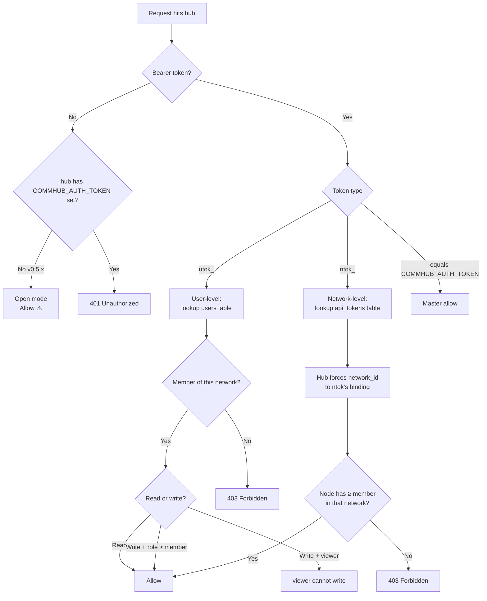

# Token System

::: tip One line
**Day-to-day you have 2 tokens: `utok_` (yours) and `ntok_` (one per agent).** Both are CLI-managed; you never type them. 95% of this page is about these two.
:::

## The absolute simplest picture

```
You (human)        ──── utok_ ────►   hub
                                         │
                                         │ Verifies, then issues ntok_ for each agent
                                         ▼
Your agent node ──── ntok_ ────►   hub
```

That's it. **Your token mental model is exactly these two.**

---

## 1. `utok_` — your token (for humans)

### How you get it

```bash
anet login --username admin --password anethub
```

The hub verifies your credentials and issues a `utok_xxxxxxxx...` to you.

### Where it lives

```bash
~/.anet/config.json
```

Contains:
```json
{
  "hub": "http://hub:9200",
  "token": "utok_xxxxxxxxxxxxxxxx",
  "user": { "username": "admin", ... }
}
```

### What it does

The CLI automatically attaches it on every hub call:
- `anet status`, `anet tasks`, `anet network ls` — all use it
- Browser dashboard login exchanges it for a cookie

**You never type it.** After one `anet login`, you don't touch it again.

### What it can't do

- ❌ Cannot be used by agents to connect to the hub (agents must use `ntok_`)

---

## 2. `ntok_` — agent's token (one per agent)

### How you get it

```bash
anet node create translator --runtime claude-agent-sdk ...
```

Behind the scenes: the CLI takes your `utok_`, asks the hub for a fresh `ntok_xxxxxxxx...` for "translator", and saves it.

### Where it lives

```bash
.anet/nodes/translator/config.json
```

Contains:
```json
{
  "node_name": "translator",
  "token": "ntok_xxxxxxxxxxxxxxxx",
  "network_id": "net_xxx",
  ...
}
```

### What it does

```bash
anet node start translator
```

Agent process reads its `ntok_` to open the SSE connection to the hub. **You never type it either.**

### Why one per agent

Each `ntok_` is bound to a specific `(agent, network)` pair, and the hub **forces** that binding — agents cannot cross networks. This is the core isolation mechanism.

---

## That's it. Just these two.

Recap: **Day-to-day, the CLI handles both tokens for you**:

| You do | CLI manages |
|---|---|
| `anet login` | Writes `utok_` to `~/.anet/config.json` |
| `anet node create X` | Uses `utok_` to fetch an `ntok_` from hub, saves to `.anet/nodes/X/config.json` |
| `anet node start X` | Loads X's `ntok_` and connects to hub SSE |
| Any other `anet ...` command | Uses `utok_` automatically |

You **don't need to**:
- ❌ Copy/paste token strings
- ❌ Remember any token value
- ❌ Know what tokens look like

---

# Advanced — for hub operators only

::: warning Skip this if you only use anet to connect to someone else's hub
Below is for people deploying their own hub. End users stop reading here.
:::

---

## `COMMHUB_AUTH_TOKEN` — the hub's own startup secret

### What it is

The hub server's master key — used internally by the hub to gate admin endpoints.

### Who touches it

- **Person deploying the hub** (sets it once at startup)
- **Dashboard backend** (reads it automatically when co-located with hub)
- **Hub admins running curl** against admin endpoints (audit log, wipe-db, etc.)

### Regular users don't touch it

- Adding an agent on another machine via anet CLI → **not needed**
- Logging into the dashboard via browser → **not needed**
- Using the SDK to talk to the hub → **not needed**

Analogy: you don't need the building's main breaker password to live in your apartment — only facility management touches it.

### How to use

When deploying the hub (**one time**):

```bash
# On the hub server
COMMHUB_AUTH_TOKEN=$(openssl rand -hex 32)
echo "Save this: $COMMHUB_AUTH_TOKEN"
anet hub start --host 0.0.0.0 --token $COMMHUB_AUTH_TOKEN
```

After setup, you never touch it. The CLI persists it to `~/.anet/server/config.json` for hub restarts.

::: tip v0.7.0+ makes this even simpler
`anet hub start` without `--token` will **auto-generate** a random one to `~/.anet/server/config.json`. You don't manage it at all.
:::

### What if not set

- **v0.5.x (old)**: optional. If unset, hub runs open mode — anyone hitting your hub anonymously can call MCP / REST (R3 vulnerability).
- **v0.7.0+ (new)**: required. Hub refuses to start unless you set it (or pass `--dev-open` to explicitly opt into open mode).

### Dashboard on a different machine

If the dashboard is on a separate machine from the hub, pass the hub's token when starting it:

```bash
COMMHUB_AUTH_TOKEN=<hub's token> anet hub dashboard
```

Co-located: not needed; CLI auto-reads from the local hub config.

---

## For audit / security reviewers

### Token lifecycle

| Event | utok_ | ntok_ | COMMHUB_AUTH_TOKEN |
|---|---|---|---|
| Deploy hub | - | - | Set manually at startup / auto-generated |
| Register | One created | One created bound to default network | - |
| Login | New one each login (old not auto-revoked) | Unchanged | - |
| Create node | Unchanged | One created bound to that node + network | - |
| Delete node | Unchanged | Revoked on hub | - |
| Delete user | All revoked | Same | - |
| Manual revoke | `anet token revoke <id>` | Same | Edit hub config + restart |
| Expiry | None (TTL planned for v0.7.0+) | None | Permanent until you change it |

### Permission decision (hub side)



### Best practices

```bash
# 1. chmod 600 on config files (CLI v0.7.0+ does this automatically)
chmod 600 ~/.anet/config.json ~/.anet/server/config.json

# 2. .anet/ should not be in git
echo ".anet/" >> .gitignore

# 3. Use strong random for COMMHUB_AUTH_TOKEN
anet hub start --token "$(openssl rand -hex 32)"   # ✅
anet hub start --token "anethub"                    # ❌ short / guessable

# 4. Rotate login tokens periodically
anet token ls                  # List current utok_
anet token revoke tok_xxx      # Revoke old
anet login                     # Log in again to get a new utok_
```

---

## Legacy (don't worry about it)

### `atok_`

V2 had `atok_` (api token). V3 replaced it with `utok_` + `ntok_`.

The codebase still tolerates the `atok_` prefix for backward compat (no errors), but **new users don't need it**. `anet token create / ls / revoke` operate on `utok_` / `ntok_` under the hood.

---

## FAQ

**Q: How many tokens do I type per day?**
A: **Zero**. The CLI handles both for you. You `anet login` once, then `anet node create` per agent — tokens get written to files automatically.

**Q: Is `admin / anethub` a token?**
A: No, that's a username + password. After `anet login` succeeds, the hub issues a `utok_` to you in exchange.

**Q: Adding an agent on another server — do I need `COMMHUB_AUTH_TOKEN`?**
A: **No**. Just run:
1. `anet init --hub http://hub:9200`
2. `anet login --username admin --password ...`
3. `anet node create xxx ...`
4. `anet node start xxx`

The whole flow never touches `COMMHUB_AUTH_TOKEN`.

**Q: Real difference between `utok_` and `ntok_`?**
A: `utok_` is **your** identity — can act across the networks you're a member of. `ntok_` is **one agent's identity in one network** — the hub locks it there, no crossing.

**Q: What if I don't set `COMMHUB_AUTH_TOKEN` on v0.5.x?**
A: Open mode by default — anonymous requests pass. R3 security risk; public deployment = naked.

**Q: After upgrading hub to 0.7.0+, do existing `ntok_` still work?**
A: Yes. Schema migration keeps old `ntok_` valid. But the hub itself won't start without `COMMHUB_AUTH_TOKEN` now.
