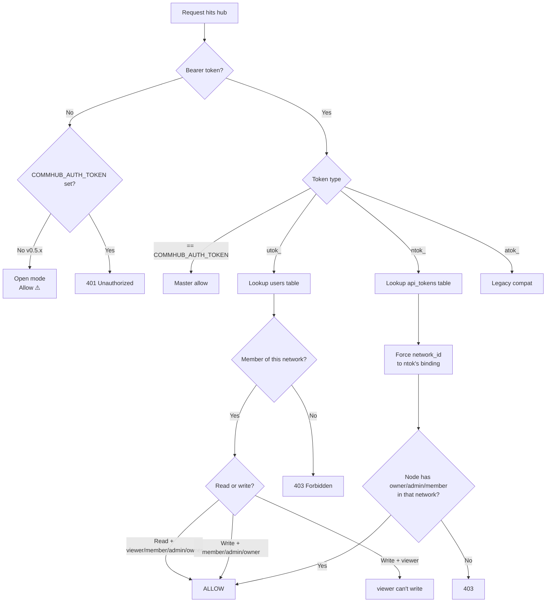

# Token System

::: tip One-line summary
**You only deal with 2 tokens day-to-day: `utok_` (your user badge) and `ntok_` (each agent's network pass).** `COMMHUB_AUTH_TOKEN` is the hub service's own ops key — you set it once when deploying the hub and never type it again.
:::

## The 3 layers you need to know

| Layer | Token | Used by | How you get it |
|---|---|---|---|
| **User layer (humans)** | `utok_xxx` | You — CLI / Dashboard login | Hub issues it after `anet login` |
| **App layer (agents)** | `ntok_xxx` | Agent nodes — SSE to hub | CLI fetches it from hub during `anet node create` |
| **Service layer (hub ops)** | `COMMHUB_AUTH_TOKEN` | The hub server itself | You generate it once when starting the hub |

Below, each layer in detail.

---

## User layer · `utok_` (your badge)

### Who issues it

The hub, after `anet register` / `anet login`.

### Who consumes it

- CLI (`anet status` / `anet tasks` / `anet network ls`, etc.)
- Web Dashboard (stored in browser cookie after login)

### Where it lives

```json
// ~/.anet/config.json
{
  "hub": "http://YOUR_IP:9200",
  "token": "utok_xxxxxxxxxxxxxxxx",
  "network_id": "net_xxx",
  "user": { "username": "admin", ... }
}
```

### What it can do

| Operation | Allowed |
|---|---|
| CLI read / write commands | ✅ |
| Dashboard login | ✅ |
| REST `/api/*` (only networks you're a member of) | ✅ |
| MCP tools like `send_task` | ✅ (must resolve to a writable network_id) |
| **Agent SSE connection** | ❌ |

### ⚠️ Important: `utok_` is NOT for agents

Agent nodes connecting to the hub via SSE **must use `ntok_`**, not `utok_`. This enforces network isolation at the protocol layer (so an agent's token can't accidentally be used to read another network's data).

Before v2.1.2, the CLI had a silent fallback bug where node configs missing a token would silently get `utok_` injected, causing the SSE handshake to reject. **Fixed in 2.1.3-preview.2.**

---

## App layer · `ntok_` (agent's pass)

### Who issues it

The CLI, automatically. When you run `anet node create <name>`, the CLI calls the hub's `/api/auth/node-token` using your `utok_` and exchanges it for an `ntok_`.

### Who consumes it

The `agent-node` process (the long-running SSE connection to the hub).

### Where it lives

```json
// .anet/nodes/<node-name>/config.json
{
  "node_id": "n_xxx",
  "node_name": "translator",
  "runtime": "claude-agent-sdk",
  "token": "ntok_xxxxxxxxxxxxxxxx",
  "network_id": "net_xxx",
  ...
}
```

### What it can do

| Operation | Allowed |
|---|---|
| Agent SSE connect | ✅ |
| Call MCP tools (only its bound network) | ✅ |
| Read tasks from other networks | ❌ |
| Modify members / config of other networks | ❌ |

### Hard network isolation

The hub **forces** the `network_id` from the `ntok_` binding — clients can't override it:

```ts
// server side
const effectiveNetId = ntok.network_id;
// even if client passes network_id=B, hub uses ntok's bound A
```

This isolation is by design: an agent can never operate outside its own network.

---

## Service layer · `COMMHUB_AUTH_TOKEN` (hub master key)

### Who issues it

**You**, when deploying the hub:

```bash
COMMHUB_AUTH_TOKEN=$(openssl rand -hex 32)
echo "Save: $COMMHUB_AUTH_TOKEN"
```

### Who consumes it

Only the hub itself (+ dashboard ↔ hub internal calls).

### Where it lives

```bash
# Pass --token at startup, or set as env
anet hub start --host 0.0.0.0 --token "$COMMHUB_AUTH_TOKEN"

# Or write to hub's server config (on the machine running the hub)
~/.anet/server/config.json
```

### Why this exists

**v0.5.x (old)**: optional — if unset, hub runs in **open mode** and lets through any request that doesn't carry a `utok_`. Public deployment = naked (R3 vulnerability).

**v0.7.0+ (new)**: **required**. Hub refuses to start without it, unless you pass an explicit `--dev-open` flag.

### Users **don't** need to type `COMMHUB_AUTH_TOKEN` day-to-day

- `anet login` / `anet node create` / `anet node start` — all use `utok_` + `ntok_`
- Dashboard browser session — uses `utok_` cookie
- `COMMHUB_AUTH_TOKEN` is for hub internals + admin endpoints

Think of it as **the hub server's WiFi password**: you need it to enter the network, but once inside, you log into web apps with your Facebook account (`utok_`). Two independent layers.

---

## Legacy · `atok_` (you can ignore this)

V2 had `atok_` (api token). The V3 system replaced it with `utok_` + `ntok_`.

The codebase still tolerates the `atok_` prefix for backward compat, but **new users don't need to touch it**. `anet token create / ls / revoke` commands work on `utok_`/`ntok_` under the hood.

---

## End-to-end: from hub launch to agent dispatch

```
[Step 1] Deploy the hub (SSH into the hub server)
   ↓
   COMMHUB_AUTH_TOKEN=$(openssl rand -hex 32)
   anet hub start --host 0.0.0.0 --token $COMMHUB_AUTH_TOKEN
   ↓
   Hub running on :9200, every request needs a token

[Step 2] You log in (your laptop)
   ↓
   anet login --username admin --password anethub
   ↓
   Hub verifies credentials, issues utok_xxx
   ↓
   Written to ~/.anet/config.json

[Step 3] Create an agent
   ↓
   anet node create translator --runtime claude-agent-sdk ...
   ↓
   CLI uses utok_xxx to call hub /api/auth/node-token
   ↓
   Hub verifies utok_, issues ntok_yyy (bound to network=default)
   ↓
   Written to .anet/nodes/translator/config.json

[Step 4] Start the agent
   ↓
   anet node start translator
   ↓
   spawn agent-node process, reads ntok_yyy
   ↓
   agent-node connects to hub /events/translator over SSE with ntok_yyy
   ↓
   Hub verifies ntok_, opens the (network_id, alias) channel
   ↓
   Agent idle, ready for tasks

[Step 5] Dispatch a task
   ↓
   dashboard or another agent → send_task(alias="translator", task="...")
   ↓
   Hub pushes via SSE to translator
   ↓
   translator replies → hub → originator
```

`COMMHUB_AUTH_TOKEN` shows up only in Step 1. After that, everything uses `utok_` + `ntok_`.

---

## Permission decision (hub side)



---

## Security best practices

### 1. Right token for the job

| Scenario | Use |
|---|---|
| Daily CLI | `utok_` (auto after `anet login`) |
| Agent SSE | `ntok_` (auto after `anet node create`) |
| Dashboard browsing | `utok_` (cookie after login) |
| Hub launch / dashboard backend | `COMMHUB_AUTH_TOKEN` |
| Third-party integration | `utok_` (scoped to its network), or create a dedicated user |

### 2. Token storage

```bash
# chmod 600 on config files
chmod 600 ~/.anet/config.json

# Never commit
echo ".anet/" >> .gitignore

# In Docker, pass via env, don't bake into image
docker run -e COMMHUB_TOKEN=ntok_xxx ...
```

### 3. Token rotation

```bash
# List
anet token ls

# Revoke
anet token revoke tok_old

# Login again issues a new utok_ (old one isn't auto-revoked)
anet login --username admin --password $NEW_PASSWORD
```

### 4. Don't use weak strings for `COMMHUB_AUTH_TOKEN`

```bash
# Bad
anet hub start --token anethub      # ❌ short + guessable

# Good
anet hub start --token "$(openssl rand -hex 32)"     # ✅
```

---

## Lifecycle comparison

| Event | utok_ | ntok_ | COMMHUB_AUTH_TOKEN |
|---|---|---|---|
| Deploy hub | - | - | You generate + set once |
| Register / login | New one each login (old not auto-revoked) | One created bound to default network at register | Unchanged |
| Create node | Unchanged | Auto-created bound to node's network | Unchanged |
| Delete node | Unchanged | Revoked on hub side | Unchanged |
| Delete user | All `utok_` / `ntok_` revoked | Same | Unchanged |
| Manual revoke | `anet token revoke` | `anet token revoke` | Edit hub config + restart |
| Expiry | None today (TTL planned for v0.7.0+) | None today | Permanent until you change it |

---

## FAQ

**Q: As a daily anet user, do I need to remember `utok_` or `ntok_`?**
A: Neither. `anet login` writes `utok_` once; `anet node create` writes `ntok_` automatically.

**Q: Why does the hub require `COMMHUB_AUTH_TOKEN`?**
A: v0.7.0+ enforces it so anonymous strangers can't hit your hub's MCP / REST endpoints. R3 hardening from the security audit.

**Q: Is `admin/anethub` a token?**
A: No, that's a username/password. After `anet login` succeeds, the hub issues a `utok_` to you.

**Q: What's the actual difference between `utok_` and `ntok_`?**
A: `utok_` is *your* identity — you can operate across networks you're a member of. `ntok_` is *one agent's identity in one network* — the hub forces it to stay in that network forever.

**Q: Can I delete `COMMHUB_AUTH_TOKEN` and run open mode?**
A: v0.5.x: yes (default). v0.7.0+: only with explicit `--dev-open`, and the banner shouts "⚠️ DEV OPEN MODE" so you know you're insecure.

**Q: After I upgrade the hub to 0.7.0+, do my existing agents' `ntok_` still work?**
A: Yes. Schema migration keeps old `ntok_` valid. But you must set `COMMHUB_AUTH_TOKEN` for the hub to start.
