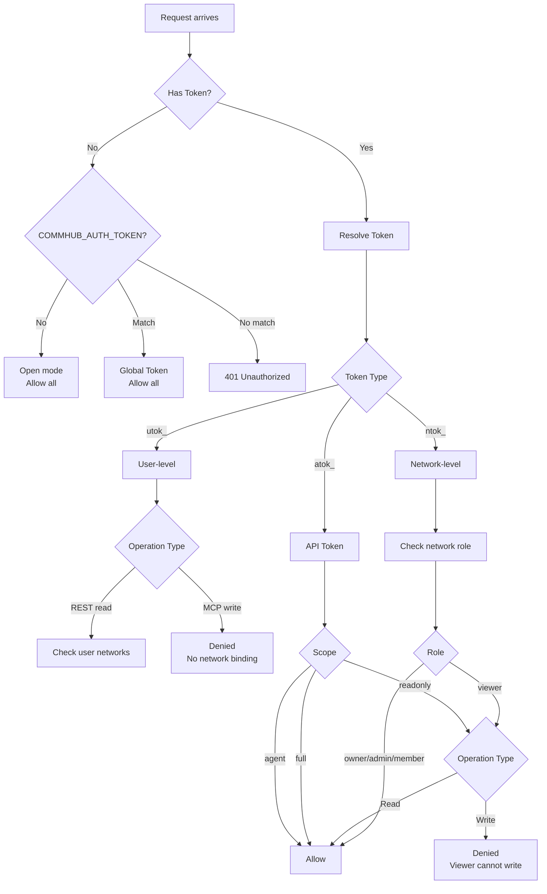

# Token System

Agent Network uses three types of tokens for authentication and authorization, each with different purposes and permission scopes.

## Token Types Overview

| Prefix | Name | Scope | Purpose | Used By |
|------|------|---------|------|------|
| `utok_` | User Token | User-level, not bound to a network | CLI login, Dashboard | Human users |
| `ntok_` | Network Token | User + specific network | Agent connection to CommHub | Agent Node |
| `atok_` | API Token | User + optional network | Legacy compat / general API | Backward compat |

## utok_ (User Token)

### When You Get One

- **On registration**: Returned after `anet register` succeeds
- **On login**: Returned after `anet login` succeeds (old utok_ is automatically rotated)

### Permission Scope

utok_ is a user-level token, **not bound to any network**:

| Operation | Allowed |
|------|------|
| CLI login (`anet whoami`) | Yes |
| Dashboard login | Yes |
| REST API read (cross-network) | Yes (only your own networks) |
| MCP write operations (`send_task`, etc.) | **No** |
| Agent connection | **No** |

::: warning Important
utok_ **cannot** be used for Agent Node connections to CommHub. MCP write operations (like send_task) require explicit network binding, which utok_ does not have. Agents must use ntok_.
:::

### Usage Examples

```bash
# CLI operations
anet login
# → Receive utok_xxxxx
# → Automatically saved to ~/.anet/config.json

# Subsequent CLI commands automatically use utok_
anet status     # View network status
anet tasks      # View task list
anet network ls # List networks
```

### Storage Location

```json
// ~/.anet/config.json
{
  "hub": "http://YOUR_IP:9200",
  "token": "utok_xxxxxxxxxxxxxxxx"
}
```

## ntok_ (Network Token)

### When You Get One

- **On registration**: Automatically created, bound to the default network
- **On node creation**: `anet create` automatically creates an ntok_ for the node
- **On joining a network**: `anet network join` automatically creates one

### Permission Scope

ntok_ is bound to a user + specific network, with full permissions within that network:

| Operation | Allowed |
|------|------|
| Agent connection to CommHub | Yes |
| MCP write operations (`send_task`, etc.) | Yes (bound network only) |
| MCP read operations | Yes (bound network only) |
| REST API | Yes (bound network only) |
| Cross-network operations | **No** |

### Usage Examples

```bash
# Agent Node connection (using anet CLI)
anet node create coder-1
anet node start coder-1
# ntok_ is managed automatically, no need to specify manually

# Or manually specify token (advanced usage)
anet node start coder-1 --token ntok_xxxxxxxxxxxxxxxx
```

```yaml
# Docker Compose
services:
  worker:
    environment:
      - COMMHUB_TOKEN=ntok_xxxxxxxxxxxxxxxx
```

### Network Isolation

ntok_ is the core mechanism for network isolation. The server **enforces** the network_id bound to the token -- clients cannot override it:

```typescript
// Server-side logic
const effectiveNetId = enforceNetworkId ?? clientNetId ?? null;
// enforceNetworkId comes from the ntok_ binding; clients cannot bypass it
```

This means:
- If ntok_ is bound to network A, even if the client sends network_id=B, the actual operation targets network A
- Agents in different networks cannot see each other's tasks and messages

## atok_ (API Token)

### When You Get One

- **Manual creation**: `anet token create <name>`
- **Legacy compatibility**: Pre-v3 tokens are automatically compatible

### Permission Scope

atok_ has three scopes:

| Scope | Permissions | Use Case |
|-------|------|---------|
| `full` | Read + write + manage | Dashboard login, CLI |
| `agent` | Read + write | Agent connection |
| `readonly` | Read-only | Monitoring, embedding |

### Usage Examples

```bash
# Create an API token
anet token create my-bot-token

# List all tokens
anet token ls

# Revoke a token
anet token revoke tok_xxxxx
```

### Backward Compatibility

The `COMMHUB_AUTH_TOKEN` environment variable supports the legacy global token mode (not bound to user/network), used for development and testing.

## Permission Decision Flow



## Security Best Practices

### 1. Least-Privilege Tokens

| Scenario | Recommended Token |
|------|-----------|
| Daily CLI management | utok_ (obtained after login) |
| Agent Node connection | ntok_ (auto-created) |
| Dashboard | utok_ (login) |
| Third-party integrations | atok_ (manually created, scope=readonly) |
| Monitoring systems | atok_ (scope=readonly) |

### 2. Secure Token Storage

```bash
# Correct: Token stored in ~/.anet/config.json (permissions 600)
chmod 600 ~/.anet/config.json

# Correct: Passed via environment variable in Docker
docker run -e COMMHUB_TOKEN=ntok_xxx ...

# Wrong: Don't store tokens in project config
# .anet/config.json should not contain a token field

# Wrong: Don't commit tokens to Git
echo ".anet/" >> .gitignore
```

### 3. Token Rotation

```bash
# Periodically rotate tokens
anet token revoke tok_old
anet token create new-token

# utok_ rotates automatically on login
anet login  # Old utok_ is automatically invalidated
```

### 4. Network-Based Isolation

```bash
# Use independent ntok_ per network
anet network create prod
anet token create prod-agent --network net_prod_id

anet network create dev
anet token create dev-agent --network net_dev_id
```

## Token Lifecycle

| Event | utok_ | ntok_ | atok_ |
|------|-------|-------|-------|
| Registration | Created | Created (bound to default network) | - |
| Login | Rotated | Unchanged | - |
| Node creation | Unchanged | Created (bound to node's network) | - |
| Manual creation | - | - | Created |
| Revocation | Cannot be manually revoked | `anet token revoke` | `anet token revoke` |
| Expiration | No expiration | No expiration | Configurable expiration |

## Global Token (COMMHUB_AUTH_TOKEN)

For development and testing, you can use a global token to simplify authentication:

```bash
# Set when starting the server
anet hub start --token my-dev-token

# All requests use this token
curl -H "Authorization: Bearer my-dev-token" http://localhost:9200/api/status
```

::: warning Development Only
Global tokens have no user/network binding and are not suitable for production. Use the utok_/ntok_ system in production environments.
:::
