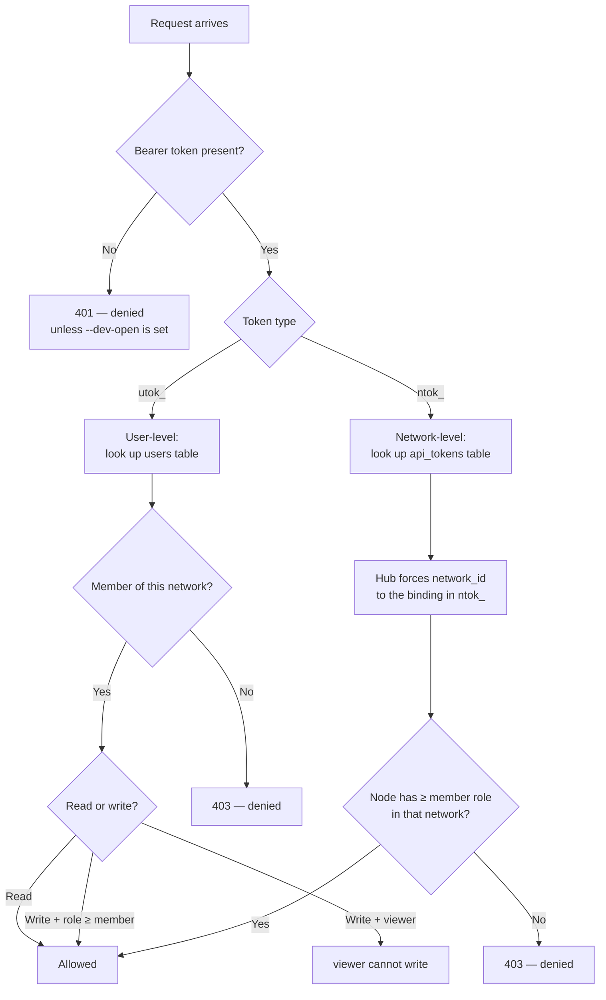

# Token System

::: tip One line
**Zero manual token typing in daily use.** The CLI auto-manages two tokens: `utok_` (yours) and `ntok_` (one per agent).
:::

## Simplest picture

```
You (human)         ──── utok_ ────►   hub
                                          │
                                          │ Verifies, then issues ntok_ for each agent
                                          ▼
Your agent node  ──── ntok_ ────►   hub
```

That's it. **The only two tokens you need to know**, both CLI-managed.

---

## 1. `utok_` — your token

### How

```bash
anet login --username admin --password anethub
```

Hub verifies your credentials and issues `utok_xxxxxxxx...` to you.

### Where it lives

```bash
~/.anet/config.json
```

```json
{
  "hub": "http://hub:9200",
  "token": "utok_xxxxxxxxxxxxxxxx",
  "user": { "username": "admin", ... }
}
```

### What it does

Every `anet ...` command attaches it automatically:
- `anet status`, `anet tasks`, `anet network ls`, …
- Dashboard browser login exchanges it for a cookie

**You never type it.** After one `anet login`, the CLI handles everything.

### What it cannot do

❌ Agents cannot use `utok_` to connect to the hub directly — they need `ntok_`.

---

## 2. `ntok_` — one per agent

### How

```bash
anet node create translator --runtime claude-agent-sdk ...
```

Behind the scenes: the CLI uses your `utok_` to fetch an `ntok_xxxxxxxx...` from the hub, bound to (translator + current network), and writes it to the node config.

### Where it lives

```bash
.anet/nodes/translator/config.json
```

```json
{
  "node_name": "translator",
  "token": "ntok_xxxxxxxxxxxxxxxx",
  "network_id": "net_xxx",
  ...
}
```

### What it does

```bash
anet node start translator
```

Agent uses its `ntok_` to open the SSE connection to the hub. **You never type this one either.**

### Why one per agent

`ntok_` is bound to (agent, network), and the hub **forces** that binding — an agent can never act outside its own network. Core isolation mechanism.

---

## That's both of them.

The CLI manages both automatically:

| You run | CLI handles |
|---|---|
| `anet login` | Writes `utok_` to `~/.anet/config.json` |
| `anet node create X` | Uses `utok_` to fetch `ntok_`, writes to `.anet/nodes/X/config.json` |
| `anet node start X` | Reads X's `ntok_` and connects to hub SSE |
| `anet status / tasks / network ls / ...` | Uses `utok_` automatically |

You **never have to**:
- ❌ Copy/paste token strings
- ❌ Remember any token value
- ❌ Set env vars

---

## FAQ

**Q: Is `admin / anethub` a token?**
A: No, that's a username + password. `anet login` exchanges those for a `utok_`.

**Q: Real difference between `utok_` and `ntok_`?**
A: `utok_` is **your** identity — operates across networks you belong to. `ntok_` is **one agent's identity in one network** — locked by the hub.

**Q: I'm adding an agent on another server, which token do I set?**
A: None. Flow:
1. `anet init --hub http://hub:9200`
2. `anet login --username admin --password ...` ← gets `utok_` automatically
3. `anet node create xxx ...` ← gets `ntok_` automatically
4. `anet node start xxx` ← uses `ntok_` automatically

Whole flow: **zero manual token entry**.

**Q: Does the hub server itself have a token?**
A: Since v0.8, the hub bootstraps an admin `utok_` to `~/.anet/server/admin-utok.json` for local recovery/admin commands. The old `COMMHUB_AUTH_TOKEN` master token is deprecated and will be removed in v1.0.

**Q: Does the dashboard need a token to start?**
A: Users log into Dashboard with username/password. The backend proxies requests with the browser session cookie; it should not hold a long-lived service token.

**Q: Do tokens expire?**
A: Not today. TTL + revoke-all is on the v0.9 roadmap. `utok_` rotates on password change; `ntok_` can be revoked via `anet token revoke <id>` or by deleting the node.

---

## For auditors / security teams

### Token lifecycle matrix

| Event | `utok_` | `ntok_` |
|---|---|---|
| Deploy hub | Admin `utok_` auto-bootstrapped to `admin-utok.json` (v0.8) | — |
| Register account | One created | One created bound to the default network |
| Log in | A new one is issued (old one stays valid until revoked) | Unchanged |
| Change password | Current device gets a new `utok_`; other devices' `utok_` are invalidated | Unchanged |
| Create node | Unchanged | One created, bound to the node × network |
| Delete node | Unchanged | Hub revokes it |
| Manual revoke | `anet token revoke <id>` | Same |

### Authorization decision (how the hub decides)



### Security practices

```bash
# 1. chmod 600 (CLI does this automatically; v0.8 bootstrap also writes admin-utok.json at 600)
chmod 600 ~/.anet/config.json ~/.anet/server/admin-utok.json

# 2. Don't commit .anet/
echo ".anet/" >> .gitignore

# 3. Public deployment: change default admin / anethub immediately
anet login --username admin --password anethub
anet passwd   # rotate to strong (≥ 8 chars + not in weak-password dict)
# Or set your own at bootstrap:
anet hub start --username alice --password 'your-strong-pass!'

# 4. Rotate login tokens periodically
anet token ls                  # list current utok_
anet token revoke tok_xxx      # revoke old ones
anet login                     # log in again to get a fresh utok_
```

---

## Legacy (don't worry about it)

V2 had `atok_` (api token). V3 replaced it with `utok_` + `ntok_`. The codebase still tolerates the `atok_` prefix for backward compat, but **new users don't need to touch it**.

## Next steps

- **CLI usage**: [CLI commands — token section](/en/guide/cli) (`anet token ls/create/revoke`)
- **Architecture mapping**: [Architecture — Security](/en/guide/architecture#security-architecture)
- **Full security model**: [Security design](/en/concepts/security)
- **Upgrade**: from v0.7 master-token mode to v0.8 utok_/ntok_: [Upgrade guide](/en/guide/upgrade#v0-7-v0-8-upgrade-notes-latest)
- **RFC**: [RFC-001 — `COMMHUB_AUTH_TOKEN` deprecation roadmap](https://github.com/sleep2agi/agent-network/blob/main/docs/rfcs/RFC-001-deprecate-commhub-auth-token.md)
