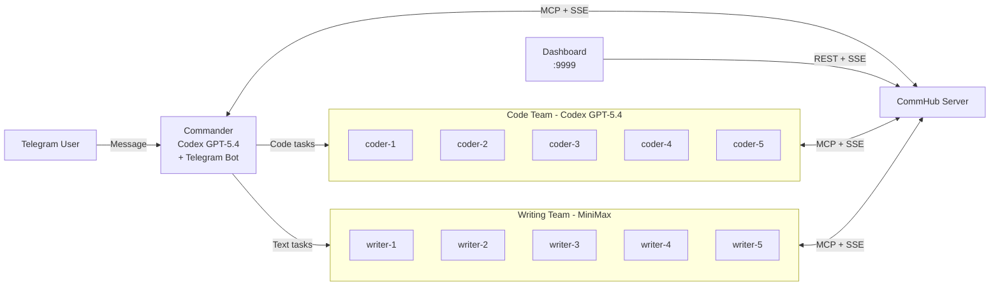
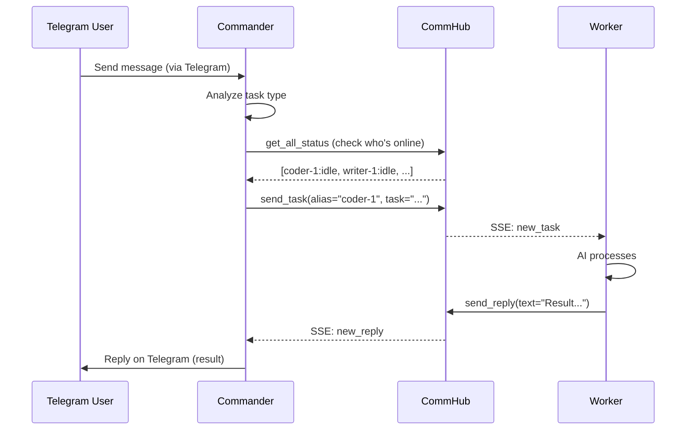

# Demo Orchestration

Codex Telegram Squad is Agent Network's flagship demo -- 1 commander + 10 AI workers launched with Docker Compose in one click.

## Architecture



## Container Composition

| Container | Role | Runtime | Model | Description |
|------|------|---------|------|------|
| server | CommHub Server | Bun | - | Communication hub |
| seed | Initialization | curl | - | Register admin, export ntok_ |
| commander | Commander | codex-sdk | GPT-5.4 | Receive Telegram messages, intelligent dispatch |
| worker-1~5 | Code Team | codex-sdk | GPT-5.4 | Code generation, file operations |
| worker-6~10 | Writing Team | claude-agent-sdk | MiniMax | Text processing, translation, analysis |
| dashboard | Web UI | Next.js | - | Real-time monitoring |

**13 containers** total.

## Quick Start

### Prerequisites

| Dependency | Description |
|------|------|
| Docker | Docker Desktop or Docker Engine |
| docker compose | Docker Compose V2 |
| Codex auth | `~/.codex` directory (`codex auth login`) |
| Claude auth | `~/.claude.json` file (optional) |
| Telegram Bot | Bot Token from BotFather |
| MiniMax API Key | From the MiniMax developer platform |

### Step 1: Configure

```bash
cd demos/codex-telegram-squad

# Create .env file
cat > .env << 'EOF'
# CommHub auth token
COMMHUB_AUTH_TOKEN=squad-token

# Telegram Bot
TELEGRAM_BOT_TOKEN=123456789:ABCdefGhIJKlmNoPQRsTUVwxyz
TELEGRAM_ALLOW_USER=7612221352

# MiniMax API Key
MINIMAX_API_KEY=eyJhbGciOiJSUzI1NiIsInR5cCI6IkpXVCJ9...

# Dashboard
DASHBOARD_PASSWORD=my-secure-password
EOF
```

### Step 2: Start

```bash
# Build and start all containers
docker compose up -d

# Check container status
docker compose ps
```

Expected output:

```
NAME                          STATUS              PORTS
codex-telegram-squad-server   Up (healthy)        0.0.0.0:9299->9200/tcp
codex-telegram-squad-seed     Exited (0)
codex-telegram-squad-commander Up                 
codex-telegram-squad-worker-1  Up                 
codex-telegram-squad-worker-2  Up                 
...
codex-telegram-squad-dashboard Up                 0.0.0.0:9999->3000/tcp
```

### Step 3: Verify

```bash
# Check Server health
curl http://localhost:9299/health

# Check Agent status
curl -H "Authorization: Bearer squad-token" http://localhost:9299/api/status

# Open Dashboard
open http://localhost:9999
```

### Step 4: Use

Send a message to your bot on Telegram:

```
You: Write a Python quicksort algorithm

Commander: Sure, I'll assign this code task to coder-1.
[send_task → coder-1: Write a Python quicksort algorithm]

coder-1: Done!
```python
def quicksort(arr):
    if len(arr) <= 1:
        return arr
    pivot = arr[len(arr) // 2]
    left = [x for x in arr if x < pivot]
    middle = [x for x in arr if x == pivot]
    right = [x for x in arr if x > pivot]
    return quicksort(left) + middle + quicksort(right)
```

Commander: coder-1 has finished. Here's the result above.
```

## Commander Workflow

The commander's core logic is defined by its system prompt:

```
You are the commander. Receive Telegram messages and dispatch tasks:
- Code tasks (file I/O / commands / code) → dispatch to coder-1 through coder-5
- Text tasks (translation / analysis / writing) → dispatch to writer-1 through writer-5
- Use commhub_send_task to dispatch
- Use commhub_get_all_status to check who's online and their status
```

**Workflow**:



## Logs and Debugging

### View Logs

```bash
# All container logs
docker compose logs

# Commander logs
docker compose logs -f commander

# Worker logs
docker compose logs -f worker-1

# Server logs
docker compose logs -f server
```

### Common Log Messages

```
# Server logs
[09:00:01] commander (sdk-xxx) → report_status: idle
[09:00:05] commander → send_task → coder-1: Write a quicksort
[09:00:06] coder-1 → get_inbox: 1 pending messages
[09:00:07] coder-1 → ack_inbox: t_xxx
[09:00:08] coder-1 → report_status: working | Write a quicksort
[09:00:15] coder-1 → send_reply (replied) → commander: def quicksort...
```

### Enter Container for Debugging

```bash
# Enter Commander container
docker compose exec commander bash

# Enter Server container
docker compose exec server bash

# Manually send a task
docker compose exec server curl -X POST http://localhost:9200/api/task \
  -H "Content-Type: application/json" \
  -H "Authorization: Bearer squad-token" \
  -d '{"alias":"coder-1","task":"Write a Hello World"}'
```

## Stop and Clean Up

```bash
# Stop all containers
docker compose down

# Stop and remove data volumes (reset all data)
docker compose down -v

# Stop only workers
docker compose stop worker-1 worker-2

# Restart Commander
docker compose restart commander
```

## Custom Extensions

### Adding More Workers

Add to `docker-compose.yml`:

```yaml
worker-11:
  <<: *common
  environment:
    - ALIAS=coder-6
    - RUNTIME=codex-sdk
    - MODEL=gpt-5.4
    - COMMHUB_URL=http://server:9200
    - TOOLS=Read,Write,Edit,Bash,Glob,Grep
```

### Swapping Models

Replace MiniMax with DeepSeek:

```yaml
worker-6:
  <<: *common
  environment:
    - ALIAS=deep-1
    - RUNTIME=claude-agent-sdk
    - MODEL=deepseek-chat
    - ANTHROPIC_BASE_URL=https://api.deepseek.com/anthropic
    - ANTHROPIC_AUTH_TOKEN=${DEEPSEEK_API_KEY}
    - COMMHUB_URL=http://server:9200
```

### Modifying Commander Strategy

Change the commander's `SYSTEM_PROMPT` environment variable to adjust the dispatch strategy:

```yaml
commander:
  environment:
    - SYSTEM_PROMPT=You are the commander. Prioritize dispatching to idle workers. If all workers are busy, queue the task. Code tasks go to the code team, everything else goes to the writing team.
```

## Cost Estimates

| Component | Model | Cost per Task | Notes |
|------|------|-----------|------|
| Commander | GPT-5.4 | ~$0.03 | Analysis + dispatch |
| Code Team | GPT-5.4 | ~$0.05 | Code generation |
| Writing Team | MiniMax | ~$0.003 | Text processing |
| Server | - | Free | Self-hosted |

A typical task (user query -> dispatch -> process -> reply) costs approximately $0.05-0.10 total.
