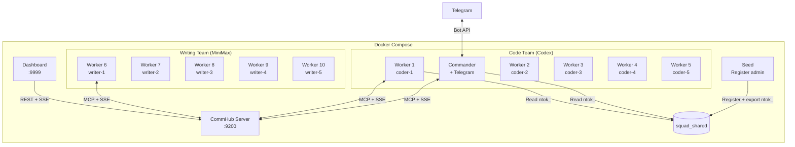

# Docker Deployment

Agent Network provides a Docker Compose orchestration solution for one-click startup of a complete agent squad.

## Quick Start

```bash
cd demos/codex-telegram-squad

# 1. Configure environment variables
cp .env.example .env
# Edit .env to fill in tokens and API keys

# 2. Start (12 containers)
docker compose up -d

# 3. Check status
docker compose ps
docker compose logs -f commander
```

## Architecture



## Dockerfile Details

### Dockerfile.server (CommHub Server)

```dockerfile
FROM oven/bun:1
WORKDIR /app

# Copy only the server directory
COPY server/ ./server/
COPY agent-network/src/ ./agent-network/src/

WORKDIR /app/server
RUN bun install

EXPOSE 9200
CMD ["bun", "run", "src/index.ts"]
```

Key points:
- Based on Bun image (CommHub Server runs on Bun)
- Only needs `server/` and `agent-network/src/`
- Exposes port 9200

### Dockerfile.agent (Agent Node)

```dockerfile
FROM node:20-slim
WORKDIR /app

# Install agent-node and CLI
COPY agent-network/ ./agent-network/
COPY agent-node/ ./agent-node/
COPY channel/ ./channel/

RUN cd agent-network && npm install && npm link
RUN cd agent-node && npm install

# Install Codex CLI (optional)
RUN npm install -g @openai/codex

COPY demos/codex-telegram-squad/entrypoint.sh /entrypoint.sh
RUN chmod +x /entrypoint.sh

ENTRYPOINT ["/entrypoint.sh"]
```

Key points:
- Based on Node.js image
- Installs agent-network (CLI) and agent-node (runtime)
- Starts via entrypoint.sh, which selects the runtime based on environment variables

### entrypoint.sh

```bash
#!/bin/bash
set -e

# Wait for Server to be ready
until curl -sf http://$COMMHUB_URL/health; do
  sleep 1
done

# Read ntok_ (from shared volume exported by seed container)
if [ -f /shared/ntok ]; then
  export COMMHUB_TOKEN=$(cat /shared/ntok)
fi

# Start Agent Node
# Note: agent-node does NOT accept a --token flag; token is passed via the COMMHUB_TOKEN env var.
# The real system-prompt flag is --prompt (not --system-prompt).
exec npx @sleep2agi/agent-node \
  --alias "$ALIAS" \
  --runtime "$RUNTIME" \
  --model "$MODEL" \
  --hub "$COMMHUB_URL" \
  ${TOOLS:+--tools "$TOOLS"} \
  ${SYSTEM_PROMPT:+--prompt "$SYSTEM_PROMPT"}
```

## docker-compose.yml Details

### Shared Configuration

```yaml
x-common: &common
  build:
    context: ../..
    dockerfile: demos/codex-telegram-squad/Dockerfile.agent
  volumes:
    - ${HOME}/.codex:/root/.codex:ro          # Codex auth
    - ${HOME}/.claude.json:/root/.claude.json:ro  # Claude auth
    - squad_shared:/shared                     # Shared ntok_
  tmpfs:
    - /root/.claude    # Writable temp directory
    - /tmp
  depends_on:
    seed:
      condition: service_completed_successfully
  restart: unless-stopped
```

**Key design decisions**:

| Mount | Mode | Description |
|------|------|------|
| `~/.codex` | `ro` | Codex auth (read-only) |
| `~/.claude.json` | `ro` | Claude auth (read-only) |
| `squad_shared` | `rw` | Shared volume for ntok_ |
| `/root/.claude` | `tmpfs` | Agent SDK needs writable dir, uses tmpfs |

### Seed Container

The seed container registers the admin and exports ntok_ after the server starts:

```yaml
seed:
  image: curlimages/curl:latest
  depends_on:
    server:
      condition: service_healthy
  volumes:
    - squad_shared:/shared
  environment:
    # v0.8+: register is a public endpoint, no master token required
    SQUAD_ADMIN_USER: ${SQUAD_ADMIN_USER:-admin}
    SQUAD_ADMIN_PASS: ${SQUAD_ADMIN_PASS}
  entrypoint:
    - sh
    - -c
    - |
      # Idempotent: if /shared/ntok already exists, skip
      if [ -s /shared/ntok ]; then
        echo "ntok already exists, skip"
        exit 0
      fi
      # Register admin (first registered user becomes bootstrap admin)
      RESP=$(curl -sX POST http://server:9200/api/auth/register \
        -H "Content-Type: application/json" \
        -d "{\"username\":\"$SQUAD_ADMIN_USER\",\"password\":\"$SQUAD_ADMIN_PASS\"}")

      # Extract ntok_ and write to shared volume
      NTOK=$(echo "$RESP" | sed -n 's/.*"network_token":"\(ntok_[^"]*\)".*/\1/p')
      if [ -z "$NTOK" ]; then echo "register failed: $RESP" >&2; exit 1; fi
      echo "$NTOK" > /shared/ntok
  restart: "no"
```

::: warning v0.8+ notes
1. `/api/auth/register` is a **public endpoint** and does not need an `Authorization` header. Older docs that show `Authorization: Bearer ${COMMHUB_AUTH_TOKEN}` are v0.5 leftovers — v0.8 rejects master tokens entirely and forces user/network token auth.
2. **`SQUAD_ADMIN_PASS` must be a strong password** (≥ 8 chars and not in the top-1000 weak-password dictionary). The first registered user is treated as bootstrap admin and the server still enforces length ≥ 4. For production, generate via `openssl rand -base64 18`.
3. Don't hardcode `password=admin123` — that's a tutorial placeholder, never commit it to `.env`.
:::

The seed container is one-shot (`restart: "no"`) and only runs on first startup. Subsequent restarts skip automatically.

### Server Health Check

```yaml
server:
  healthcheck:
    test: ["CMD", "curl", "-sf", "http://127.0.0.1:9200/health"]
    interval: 3s
    timeout: 5s
    retries: 10
```

All agent containers wait for the server via `depends_on` + `condition: service_healthy`.

## Environment Variables

### .env File

```bash
# Squad admin account (used by the seed container; first registered user becomes bootstrap admin)
# Must be a strong password — generate via `openssl rand -base64 18`
SQUAD_ADMIN_USER=admin
SQUAD_ADMIN_PASS=<strong-password-never-commit>

# Telegram Bot
TELEGRAM_BOT_TOKEN=123456789:ABCdefGhIJKlmNoPQRsTUVwxyz
TELEGRAM_ALLOW_USER=<your-telegram-user-id>   # Only used by demos/codex-telegram-squad/entrypoint.sh, which writes it to access.json; agent-node itself only reads TELEGRAM_BOT_TOKEN.

# MiniMax API
MINIMAX_API_KEY=your-minimax-api-key
```

::: info `TELEGRAM_ALLOW_USER` is only used by the Compose entrypoint script
Unlike `TELEGRAM_BOT_TOKEN` (which agent-node reads directly), `TELEGRAM_ALLOW_USER` is a convention from [`demos/codex-telegram-squad/entrypoint.sh`](https://github.com/sleep2agi/agent-network/blob/main/demos/codex-telegram-squad/entrypoint.sh) — the script translates it into the `allow` array of `access.json` at container startup. If you're not using this demo (hand-rolled docker-compose, or running `anet channel add telegram` directly), just run `anet channel add telegram <node> --allow <uid>` to write `access.json` — no `TELEGRAM_ALLOW_USER` env var needed. See the [Telegram bind walkthrough](/en/cases/telegram-bind-claude-code-cli).
:::

::: danger Don't commit `.env`
`.env` contains plaintext passwords and API keys — always add it to `.gitignore`. Commit only `.env.example` with placeholders:

```bash
SQUAD_ADMIN_USER=admin
SQUAD_ADMIN_PASS=        # leave empty — each deployer fills in their own strong password
TELEGRAM_BOT_TOKEN=
MINIMAX_API_KEY=
```
:::

::: tip No more COMMHUB_AUTH_TOKEN / DASHBOARD_PASSWORD
As of v0.8:
- The hub no longer needs `COMMHUB_AUTH_TOKEN` env — the admin user is auto-bootstrapped.
- The dashboard does not need a separate `DASHBOARD_PASSWORD` — browser users log in with the hub admin account.

If you see legacy docker-compose files still using these two variables, they're pre-v0.7 artifacts and can be removed.
:::

### Container Environment Variables

| Variable | Description | Example |
|------|------|------|
| `ALIAS` | Agent name | `coder-1` |
| `RUNTIME` | Runtime engine | `codex-sdk` / `claude-agent-sdk` |
| `MODEL` | Model | provider's current model id (e.g. OpenAI Codex / MiniMax / Anthropic) |
| `COMMHUB_URL` | Server address | `http://server:9200` |
| `COMMHUB_TOKEN` | Auth token | `ntok_xxx` or read from /shared/ntok |
| `TOOLS` | Tool list | `Read,Write,Edit,Bash,Glob,Grep` |
| `SYSTEM_PROMPT` | System prompt | Commander's task dispatch rules |
| `ANTHROPIC_BASE_URL` | MiniMax API URL | `https://api.minimaxi.com/anthropic` |
| `ANTHROPIC_AUTH_TOKEN` | MiniMax API key | MiniMax Key |

## Common Operations

### Start

```bash
# Start all
docker compose up -d

# Start only Server + Commander
docker compose up -d server seed commander

# Start and follow logs
docker compose up
```

### Check Status

```bash
# Container status
docker compose ps

# All logs
docker compose logs

# Specific container logs
docker compose logs -f commander
docker compose logs -f worker-1

# CommHub API check
curl http://localhost:9299/api/status
curl http://localhost:9299/health
```

### Scale Up/Down

```bash
# Add workers (must be defined in compose)
docker compose up -d --scale worker=10

# Stop a specific worker
docker compose stop worker-5
```

### Stop and Clean Up

```bash
# Stop all
docker compose down

# Stop and remove data volumes
docker compose down -v

# Rebuild images
docker compose build --no-cache
docker compose up -d
```

## Port Mapping

| Service | Container Port | Host Port | Description |
|------|---------|---------|------|
| Server | 9200 | 9299 | CommHub API |
| Dashboard | 3000 | 9999 | Web UI |

## Persistence

| Data | Storage | Description |
|------|------|------|
| CommHub database | Inside server container | Not persisted by default, lost on restart |
| ntok_ | `squad_shared` volume | Persisted to Docker volume |
| Agent logs | tmpfs | Not persisted |

To persist the database:

```yaml
server:
  volumes:
    - ./data:/root/.commhub  # Persist SQLite database
```

## Custom Compose

### Adding More Workers

```yaml
# Add to docker-compose.yml
worker-11:
  <<: *common
  environment:
    - ALIAS=coder-6
    - RUNTIME=codex-sdk
    - MODEL=<codex-model-id>  # latest id from OpenAI Codex docs
    - COMMHUB_URL=http://server:9200
    - TOOLS=Read,Write,Edit,Bash,Glob,Grep
```

### Using Different Models

```yaml
# DeepSeek Worker
worker-deepseek:
  <<: *common
  environment:
    - ALIAS=deep-1
    - RUNTIME=claude-agent-sdk
    - MODEL=deepseek-chat
    - ANTHROPIC_BASE_URL=https://api.deepseek.com/anthropic
    - ANTHROPIC_AUTH_TOKEN=${DEEPSEEK_API_KEY}
    - COMMHUB_URL=http://server:9200
```

## Next steps

**Production**:
- [Production deployment](/en/deploy/production) — TLS / firewall / reverse proxy / backups
- [npm deployment](/en/deploy/npm) — global npm install path without Docker

**Security**:
- [Security design](/en/concepts/security) — token / password / isolation
- [v0.7 → v0.8 upgrade](/en/guide/upgrade#v0-7-v0-8-upgrade-notes-latest) — admin bootstrap / RFC-001

**Hands-on demos (Docker Compose)**:
- [Telegram squad](/en/cases/telegram-squad) — Docker Compose with commander + 10 workers + Telegram
- [Debate](/en/cases/debate) — 6-agent demo once Hub is up

**Troubleshooting**:
- [Troubleshooting](/en/troubleshooting) — common errors + `anet doctor --fix`
