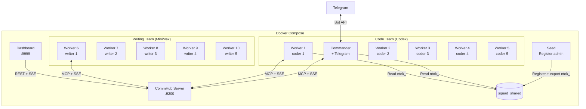

# Docker Deployment

Agent Network provides a Docker Compose orchestration solution for one-click startup of a complete agent squad.

## Quick Start

```bash
cd demos/codex-telegram-squad

# 1. Configure environment variables
cp .env.example .env
# Edit .env to fill in tokens and API keys

# 2. Start (14 services: server + commander + worker-1..10 + seed + dashboard;
#    seed exits after running, so 13 long-running containers at steady state)
docker compose up -d

# 3. Check status
docker compose ps
docker compose logs -f commander
```

## Architecture



## Dockerfile Details

### Dockerfile.server (CommHub Server)

```dockerfile
# Matches demos/codex-telegram-squad/Dockerfile.server
FROM oven/bun:1
WORKDIR /app
RUN apt-get update && apt-get install -y curl && rm -rf /var/lib/apt/lists/*
COPY server/ server/
RUN cd server && bun install
EXPOSE 9200
CMD ["bun", "run", "server/src/index.ts"]
```

Key points:
- Based on the Bun image (CommHub Server runs on Bun)
- `apt-get install curl` — the docker-compose healthcheck (`curl -sf .../health`) needs it; the `oven/bun:1` base image doesn't ship curl
- Only needs the `server/` directory (the server is self-contained, no `agent-network/src/` dependency)
- Exposes port 9200

### Dockerfile.agent (Agent Node)

```dockerfile
# Matches demos/codex-telegram-squad/Dockerfile.agent
FROM oven/bun:1
WORKDIR /app
RUN apt-get update && apt-get install -y curl python3 nodejs npm && rm -rf /var/lib/apt/lists/*

# Install agent-node from source + runtime SDKs
COPY agent-node/ agent-node/
RUN cd agent-node && npm install 2>/dev/null || true
RUN cd agent-node && npm install @openai/codex-sdk @openai/codex @anthropic-ai/claude-agent-sdk 2>/dev/null || true

# Install codex + claude CLI globally
RUN npm i -g @openai/codex @anthropic-ai/claude-code 2>/dev/null || true

COPY demos/codex-telegram-squad/entrypoint.sh /app/entrypoint.sh
RUN chmod +x /app/entrypoint.sh

# Claude CLI refuses --dangerously-skip-permissions as root without this
ENV IS_SANDBOX=1

CMD ["/app/entrypoint.sh"]
```

Key points:
- **Based on the `oven/bun:1` image** (not `node:*`) — entrypoint.sh runs agent-node via `bun /app/agent-node/src/cli.ts`, so the base image must have `bun`
- `apt-get install curl python3 nodejs npm` — curl for the entrypoint health check, npm for installing the runtime SDKs
- Starts via entrypoint.sh, which selects the runtime based on environment variables (`ENV IS_SANDBOX=1` lets the Claude CLI run inside a root container)

### entrypoint.sh

```bash
#!/bin/bash
set -e

# Wait for Server to be ready
# Note: COMMHUB_URL already includes the http:// scheme (e.g. http://server:9200) — don't prefix it again
until curl -sf "$COMMHUB_URL/health"; do
  sleep 1
done

# Read ntok_ (from shared volume exported by seed container)
if [ -f /shared/ntok ]; then
  export COMMHUB_TOKEN=$(cat /shared/ntok)
fi

# Start Agent Node — the real demo entrypoint.sh runs the in-container source via `bun` (source is mounted under /app), not via npx
# Note: agent-node does NOT accept a --token flag; token is passed via the COMMHUB_TOKEN env var.
# The real system-prompt flag is --prompt (not --system-prompt); the demo uses --url for the hub address (--hub also works).
CMD=(bun /app/agent-node/src/cli.ts --alias "$ALIAS" --runtime "$RUNTIME" --url "$COMMHUB_URL")
[ -n "$MODEL" ] && CMD+=(--model "$MODEL")
[ -n "$TOOLS" ] && CMD+=(--tools "$TOOLS")
[ -n "$SYSTEM_PROMPT" ] && CMD+=(--prompt "$SYSTEM_PROMPT")
exec "${CMD[@]}"
```

> This is the trimmed-down version. The full demo `entrypoint.sh` also injects the network roster, sets up the Telegram channel, and isolates Codex's `CODEX_HOME` — see [`demos/codex-telegram-squad/entrypoint.sh`](https://github.com/sleep2agi/agent-network/blob/main/demos/codex-telegram-squad/entrypoint.sh).

## docker-compose.yml Details

### Shared Configuration

```yaml
x-common: &common
  build:
    context: ../..
    dockerfile: demos/codex-telegram-squad/Dockerfile.agent
  volumes:
    - ${HOME}/.codex:/root/.codex:ro          # Codex auth
    - ${HOME}/.claude.json:/root/.claude.json:ro  # Claude auth
    - squad_shared:/shared                     # Shared ntok_
  tmpfs:
    - /root/.claude    # Writable temp directory
    - /tmp
  depends_on:
    seed:
      condition: service_completed_successfully
  restart: unless-stopped
```

**Key design decisions**:

| Mount | Mode | Description |
|------|------|------|
| `~/.codex` | `ro` | Codex auth (read-only) |
| `~/.claude.json` | `ro` | Claude auth (read-only) |
| `squad_shared` | `rw` | Shared volume for ntok_ |
| `/root/.claude` | `tmpfs` | Agent SDK needs writable dir, uses tmpfs |

### Seed Container

The seed container registers the admin and exports ntok_ after the server starts:

```yaml
seed:
  image: curlimages/curl:latest
  depends_on:
    server:
      condition: service_healthy
  volumes:
    - squad_shared:/shared
  environment:
    # v0.8+: register is a public endpoint, no master token required
    SQUAD_ADMIN_USER: ${SQUAD_ADMIN_USER:-admin}
    SQUAD_ADMIN_PASS: ${SQUAD_ADMIN_PASS}
  entrypoint:
    - sh
    - -c
    - |
      # Idempotent: if /shared/ntok already exists, skip
      if [ -s /shared/ntok ]; then
        echo "ntok already exists, skip"
        exit 0
      fi
      # Register admin (first registered user becomes bootstrap admin)
      RESP=$(curl -sX POST http://server:9200/api/auth/register \
        -H "Content-Type: application/json" \
        -d "{\"username\":\"$SQUAD_ADMIN_USER\",\"password\":\"$SQUAD_ADMIN_PASS\"}")

      # Extract ntok_ and write to shared volume
      NTOK=$(echo "$RESP" | sed -n 's/.*"network_token":"\(ntok_[^"]*\)".*/\1/p')
      if [ -z "$NTOK" ]; then echo "register failed: $RESP" >&2; exit 1; fi
      echo "$NTOK" > /shared/ntok
  restart: "no"
```

::: warning v0.8+ notes
1. `/api/auth/register` is a **public endpoint** and does not need an `Authorization` header. Older docs that show `Authorization: Bearer ${COMMHUB_AUTH_TOKEN}` are v0.5 leftovers — v0.8 rejects master tokens entirely and forces user/network token auth.
2. **`SQUAD_ADMIN_PASS` must be a strong password** (≥ 8 chars and not in the top-1000 weak-password dictionary). The first registered user is treated as bootstrap admin and the server still enforces length ≥ 4. For production, generate via `openssl rand -base64 18`.
3. Don't hardcode `password=admin123` — that's a tutorial placeholder, never commit it to `.env`.
4. ⚠ The block above is the **recommended v0.8 form**. The currently shipped [`demos/codex-telegram-squad/docker-compose.yml`](https://github.com/sleep2agi/agent-network/blob/main/demos/codex-telegram-squad/docker-compose.yml) seed container is **still the legacy form** (carries an `Authorization: Bearer` header + hardcoded `admin123`) — the demo is pending an update to match this section; for your own deployment, follow the v0.8 form here.
:::

The seed container is one-shot (`restart: "no"`) and only runs on first startup. Subsequent restarts skip automatically.

### Server Health Check

```yaml
server:
  healthcheck:
    test: ["CMD", "curl", "-sf", "http://127.0.0.1:9200/health"]
    interval: 3s
    timeout: 5s
    retries: 10
```

All agent containers wait for the server via `depends_on` + `condition: service_healthy`.

## Environment Variables

### .env File

```bash
# Squad admin account (used by the seed container; first registered user becomes bootstrap admin)
# Must be a strong password — generate via `openssl rand -base64 18`
SQUAD_ADMIN_USER=admin
SQUAD_ADMIN_PASS=<strong-password-never-commit>

# Telegram Bot
TELEGRAM_BOT_TOKEN=123456789:ABCdefGhIJKlmNoPQRsTUVwxyz
TELEGRAM_ALLOW_USER=<your-telegram-user-id>   # Only used by demos/codex-telegram-squad/entrypoint.sh, which writes it to access.json; agent-node itself only reads TELEGRAM_BOT_TOKEN.

# MiniMax API
MINIMAX_API_KEY=your-minimax-api-key
```

::: info `TELEGRAM_ALLOW_USER` is only used by the Compose entrypoint script
agent-node only reads `TELEGRAM_BOT_TOKEN` env — **there is no `TELEGRAM_ALLOW_USER` env var**. The allowlist lives in `access.json`: run `anet channel add telegram <node> --allow <uid>` to write it directly. See [Channel Integration — Telegram](/en/guide/channels#telegram-channel).
:::

::: danger Don't commit `.env`
`.env` contains plaintext passwords and API keys — always add it to `.gitignore`. Commit only `.env.example` with placeholders — the actual [`demos/codex-telegram-squad/.env.example`](https://github.com/sleep2agi/agent-network/blob/main/demos/codex-telegram-squad/.env.example):

```bash
# Copy to .env and fill in:

# Legacy v0.5/v0.6 hub master token, soft-deprecated in v0.8 / removed in v1.0.
# This demo's docker-compose.yml still uses it as the worker COMMHUB_TOKEN seed (fallback "squad-token"),
# kept for demo compat; new deployments don't need this line — anet hub start auto-bootstraps the admin utok_.
COMMHUB_AUTH_TOKEN=squad-token

TELEGRAM_BOT_TOKEN=your-telegram-bot-token
TELEGRAM_ALLOW_USER=your-telegram-user-id
MINIMAX_API_KEY=your-minimax-api-key
```

> Note: the current demo's seed container does `curl register` with a hardcoded `admin/admin123` ([docker-compose.yml seed entrypoint](https://github.com/sleep2agi/agent-network/blob/main/demos/codex-telegram-squad/docker-compose.yml)). The `SQUAD_ADMIN_USER` / `SQUAD_ADMIN_PASS` strong-password variables shown in the ".env file" section above are a **recommended practice** (rewrite the seed to read a strong password from env for self-hosted production), not fields that exist in the demo's current `.env.example`.
:::

::: tip No more COMMHUB_AUTH_TOKEN / DASHBOARD_PASSWORD
As of v0.8:
- The hub no longer needs `COMMHUB_AUTH_TOKEN` env — the admin user is auto-bootstrapped.
- The dashboard does not need a separate `DASHBOARD_PASSWORD` — browser users log in with the hub admin account.

If you see legacy docker-compose files still using these two variables, they're pre-v0.7 artifacts and can be removed.
:::

### Container Environment Variables

| Variable | Description | Example | Who reads it |
|------|------|------|------|
| `ALIAS` | Agent name | `coder-1` | agent-node directly (`COMMHUB_ALIAS` / `ALIAS` both accepted) |
| `RUNTIME` | Runtime engine | `codex-sdk` / `claude-agent-sdk` | agent-node directly |
| `MODEL` | Model | provider's current model id (e.g. OpenAI Codex / MiniMax / Anthropic) | agent-node directly |
| `COMMHUB_URL` | Server address | `http://server:9200` | agent-node directly |
| `COMMHUB_TOKEN` | Auth token | `ntok_xxx` or read from `/shared/ntok` | agent-node directly |
| `TOOLS` | Tool list | `Read,Write,Edit,Bash,Glob,Grep` | ⚠ **entrypoint.sh only** — translated to `--tools` CLI flag (agent-node itself does **not** read `TOOLS` env) |
| `SYSTEM_PROMPT` | System prompt | Commander's task dispatch rules | ⚠ **entrypoint.sh only** — translated to `--prompt` CLI flag (agent-node itself does **not** read `SYSTEM_PROMPT` env) |
| `ANTHROPIC_BASE_URL` | Third-party provider API URL | `https://api.minimaxi.com/anthropic` | agent-node directly (read inside claude-agent-sdk) |
| `ANTHROPIC_AUTH_TOKEN` | Third-party provider API key | Provider's key | agent-node directly |

::: info `TOOLS` / `SYSTEM_PROMPT` are Compose-entrypoint conventions
Verified at [`demos/codex-telegram-squad/entrypoint.sh`](https://github.com/sleep2agi/agent-network/blob/main/demos/codex-telegram-squad/entrypoint.sh): L9 `TOOLS_ARG="${TOOLS:-}"` + L10 `PROMPT="${SYSTEM_PROMPT:-}"` capture the env vars into shell variables, then L26 `[ -n "$TOOLS_ARG" ] && CMD+=(--tools "$TOOLS_ARG")` / L51 `CMD+=(--prompt "$FULL_PROMPT")` append them to the agent-node command array — these env vars are **shell variables inside entrypoint.sh**, translated to agent-node's `--tools` / `--prompt` CLI flags. **The agent-node binary itself does not read these env vars** (see [agent-node — Environment Variables](/en/guide/agent-node)). When running outside docker-compose / entrypoint.sh (e.g., `npx @sleep2agi/agent-node`), use the `--tools` / `--prompt` CLI flags or the `tools` / `systemPrompt` fields in `config.json`.

`--tools` only affects the `claude-agent-sdk` runtime (the `codex-sdk` runtime's built-in toolset does not honor `--tools`).
:::

## Common Operations

### Start

```bash
# Start all
docker compose up -d

# Start only Server + Commander
docker compose up -d server seed commander

# Start and follow logs
docker compose up
```

### Check Status

```bash
# Container status
docker compose ps

# All logs
docker compose logs

# Specific container logs
docker compose logs -f commander
docker compose logs -f worker-1

# CommHub API check
curl http://localhost:9299/api/status
curl http://localhost:9299/health
```

### Scale Up/Down

```bash
# Add workers (must be defined in compose)
docker compose up -d --scale worker=10

# Stop a specific worker
docker compose stop worker-5
```

### Stop and Clean Up

```bash
# Stop all
docker compose down

# Stop and remove data volumes
docker compose down -v

# Rebuild images
docker compose build --no-cache
docker compose up -d
```

## Port Mapping

| Service | Container Port | Host Port | Description |
|------|---------|---------|------|
| Server | 9200 | 9299 | CommHub API |
| Dashboard | 3000 | 9999 | Web UI |

## Persistence

| Data | Storage | Description |
|------|------|------|
| CommHub database | Inside server container | Not persisted by default, lost on restart |
| ntok_ | `squad_shared` volume | Persisted to Docker volume |
| Agent logs | tmpfs | Not persisted |

To persist the database:

```yaml
server:
  volumes:
    - ./data:/root/.commhub  # Persist SQLite database
```

## Custom Compose

### Adding More Workers

```yaml
# Add to docker-compose.yml
worker-11:
  <<: *common
  environment:
    - ALIAS=coder-6
    - RUNTIME=codex-sdk
    - MODEL=<codex-model-id>  # latest id from OpenAI Codex docs
    - COMMHUB_URL=http://server:9200
    # Note: codex-sdk does not honor --tools. TOOLS env is expanded by
    # entrypoint.sh into the --tools CLI flag, but codex-sdk silently
    # ignores it. Only claude-agent-sdk
    # actually applies it:
    # - TOOLS=Read,Glob,Grep  # only effective when RUNTIME=claude-agent-sdk
```

::: tip Restrict tools on a claude-agent-sdk worker
```yaml
worker-readonly:
  <<: *common
  environment:
    - ALIAS=readonly-agent
    - RUNTIME=claude-agent-sdk
    - MODEL=<minimax-model-id>
    - ANTHROPIC_BASE_URL=https://api.minimaxi.com/anthropic
    - ANTHROPIC_AUTH_TOKEN=${MINIMAX_API_KEY}
    - COMMHUB_URL=http://server:9200
    - TOOLS=Read,Glob,Grep  # entrypoint.sh → --tools → claude-agent-sdk options
```
:::

### Using Different Models

```yaml
# DeepSeek Worker
worker-deepseek:
  <<: *common
  environment:
    - ALIAS=deep-1
    - RUNTIME=claude-agent-sdk
    - MODEL=deepseek-chat
    - ANTHROPIC_BASE_URL=https://api.deepseek.com/anthropic
    - ANTHROPIC_AUTH_TOKEN=${DEEPSEEK_API_KEY}
    - COMMHUB_URL=http://server:9200
```

## Next steps

**Production**:
- [Production deployment](/en/deploy/production) — TLS / firewall / reverse proxy / backups
- [npm deployment](/en/deploy/npm) — global npm install path without Docker

**Security**:
- [Security design](/en/concepts/security) — token / password / isolation
- [v0.7 → v0.8 upgrade](/en/guide/upgrade#v0-7-v0-8-upgrade-notes-latest) — admin bootstrap / RFC-001


**Troubleshooting**:
- [Troubleshooting](/en/troubleshooting) — common errors + `anet doctor --fix`
