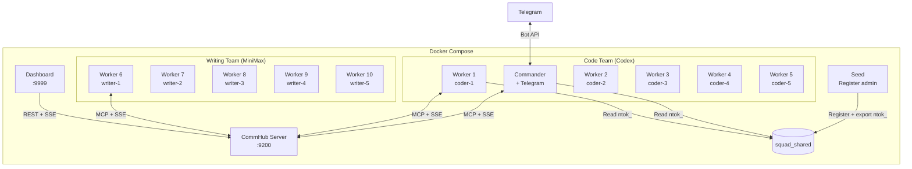

# Docker Deployment

Agent Network provides a Docker Compose orchestration solution for one-click startup of a complete agent squad.

## Quick Start

```bash
cd demos/codex-telegram-squad

# 1. Configure environment variables
cp .env.example .env
# Edit .env to fill in tokens and API keys

# 2. Start (12 containers)
docker compose up -d

# 3. Check status
docker compose ps
docker compose logs -f commander
```

## Architecture



## Dockerfile Details

### Dockerfile.server (CommHub Server)

```dockerfile
FROM oven/bun:1
WORKDIR /app

# Copy only the server directory
COPY server/ ./server/
COPY agent-network/src/ ./agent-network/src/

WORKDIR /app/server
RUN bun install

EXPOSE 9200
CMD ["bun", "run", "src/index.ts"]
```

Key points:
- Based on Bun image (CommHub Server runs on Bun)
- Only needs `server/` and `agent-network/src/`
- Exposes port 9200

### Dockerfile.agent (Agent Node)

```dockerfile
FROM node:20-slim
WORKDIR /app

# Install agent-node and CLI
COPY agent-network/ ./agent-network/
COPY agent-node/ ./agent-node/
COPY channel/ ./channel/

RUN cd agent-network && npm install && npm link
RUN cd agent-node && npm install

# Install Codex CLI (optional)
RUN npm install -g @openai/codex

COPY demos/codex-telegram-squad/entrypoint.sh /entrypoint.sh
RUN chmod +x /entrypoint.sh

ENTRYPOINT ["/entrypoint.sh"]
```

Key points:
- Based on Node.js image
- Installs agent-network (CLI) and agent-node (runtime)
- Starts via entrypoint.sh, which selects the runtime based on environment variables

### entrypoint.sh

```bash
#!/bin/bash
set -e

# Wait for Server to be ready
until curl -sf http://$COMMHUB_URL/health; do
  sleep 1
done

# Read ntok_ (from shared volume exported by seed container)
if [ -f /shared/ntok ]; then
  export COMMHUB_TOKEN=$(cat /shared/ntok)
fi

# Start Agent Node
exec npx @sleep2agi/agent-node \
  --alias "$ALIAS" \
  --runtime "$RUNTIME" \
  --model "$MODEL" \
  --hub "$COMMHUB_URL" \
  --token "$COMMHUB_TOKEN" \
  ${TOOLS:+--tools "$TOOLS"} \
  ${SYSTEM_PROMPT:+--system-prompt "$SYSTEM_PROMPT"}
```

## docker-compose.yml Details

### Shared Configuration

```yaml
x-common: &common
  build:
    context: ../..
    dockerfile: demos/codex-telegram-squad/Dockerfile.agent
  volumes:
    - ${HOME}/.codex:/root/.codex:ro          # Codex auth
    - ${HOME}/.claude.json:/root/.claude.json:ro  # Claude auth
    - squad_shared:/shared                     # Shared ntok_
  tmpfs:
    - /root/.claude    # Writable temp directory
    - /tmp
  depends_on:
    seed:
      condition: service_completed_successfully
  restart: unless-stopped
```

**Key design decisions**:

| Mount | Mode | Description |
|------|------|------|
| `~/.codex` | `ro` | Codex auth (read-only) |
| `~/.claude.json` | `ro` | Claude auth (read-only) |
| `squad_shared` | `rw` | Shared volume for ntok_ |
| `/root/.claude` | `tmpfs` | Agent SDK needs writable dir, uses tmpfs |

### Seed Container

The seed container registers the admin and exports ntok_ after the server starts:

```yaml
seed:
  image: curlimages/curl:latest
  depends_on:
    server:
      condition: service_healthy
  volumes:
    - squad_shared:/shared
  entrypoint:
    - sh
    - -c
    - |
      # Register admin
      RESP=$(curl -sX POST http://server:9200/api/auth/register \
        -H "Content-Type: application/json" \
        -H "Authorization: Bearer ${COMMHUB_AUTH_TOKEN}" \
        -d '{"username":"admin","password":"admin123"}')

      # Extract ntok_ and write to shared volume
      NTOK=$(echo "$RESP" | sed -n 's/.*"network_token":"\(ntok_[^"]*\)".*/\1/p')
      echo "$NTOK" > /shared/ntok
  restart: "no"
```

The seed container is one-shot (`restart: "no"`) and only runs on first startup. Subsequent restarts skip if `/shared/ntok` already exists.

### Server Health Check

```yaml
server:
  healthcheck:
    test: ["CMD", "curl", "-sf", "http://127.0.0.1:9200/health"]
    interval: 3s
    timeout: 5s
    retries: 10
```

All agent containers wait for the server via `depends_on` + `condition: service_healthy`.

## Environment Variables

### .env File

```bash
# CommHub auth
COMMHUB_AUTH_TOKEN=squad-token

# Telegram Bot
TELEGRAM_BOT_TOKEN=123456789:ABCdefGhIJKlmNoPQRsTUVwxyz
TELEGRAM_ALLOW_USER=7612221352

# MiniMax API
MINIMAX_API_KEY=your-minimax-api-key

# Dashboard password
DASHBOARD_PASSWORD=squad-dash
```

### Container Environment Variables

| Variable | Description | Example |
|------|------|------|
| `ALIAS` | Agent name | `coder-1` |
| `RUNTIME` | Runtime engine | `codex-sdk` / `claude-agent-sdk` |
| `MODEL` | Model | `gpt-5.5` / `claude-3-5-haiku-20241022` |
| `COMMHUB_URL` | Server address | `http://server:9200` |
| `COMMHUB_TOKEN` | Auth token | `ntok_xxx` or read from /shared/ntok |
| `TOOLS` | Tool list | `Read,Write,Edit,Bash,Glob,Grep` |
| `SYSTEM_PROMPT` | System prompt | Commander's task dispatch rules |
| `ANTHROPIC_BASE_URL` | MiniMax API URL | `https://api.minimaxi.com/anthropic` |
| `ANTHROPIC_AUTH_TOKEN` | MiniMax API key | MiniMax Key |

## Common Operations

### Start

```bash
# Start all
docker compose up -d

# Start only Server + Commander
docker compose up -d server seed commander

# Start and follow logs
docker compose up
```

### Check Status

```bash
# Container status
docker compose ps

# All logs
docker compose logs

# Specific container logs
docker compose logs -f commander
docker compose logs -f worker-1

# CommHub API check
curl http://localhost:9299/api/status
curl http://localhost:9299/health
```

### Scale Up/Down

```bash
# Add workers (must be defined in compose)
docker compose up -d --scale worker=10

# Stop a specific worker
docker compose stop worker-5
```

### Stop and Clean Up

```bash
# Stop all
docker compose down

# Stop and remove data volumes
docker compose down -v

# Rebuild images
docker compose build --no-cache
docker compose up -d
```

## Port Mapping

| Service | Container Port | Host Port | Description |
|------|---------|---------|------|
| Server | 9200 | 9299 | CommHub API |
| Dashboard | 3000 | 9999 | Web UI |

## Persistence

| Data | Storage | Description |
|------|------|------|
| CommHub database | Inside server container | Not persisted by default, lost on restart |
| ntok_ | `squad_shared` volume | Persisted to Docker volume |
| Agent logs | tmpfs | Not persisted |

To persist the database:

```yaml
server:
  volumes:
    - ./data:/root/.commhub  # Persist SQLite database
```

## Custom Compose

### Adding More Workers

```yaml
# Add to docker-compose.yml
worker-11:
  <<: *common
  environment:
    - ALIAS=coder-6
    - RUNTIME=codex-sdk
    - MODEL=gpt-5.5
    - COMMHUB_URL=http://server:9200
    - TOOLS=Read,Write,Edit,Bash,Glob,Grep
```

### Using Different Models

```yaml
# DeepSeek Worker
worker-deepseek:
  <<: *common
  environment:
    - ALIAS=deep-1
    - RUNTIME=claude-agent-sdk
    - MODEL=deepseek-chat
    - ANTHROPIC_BASE_URL=https://api.deepseek.com/anthropic
    - ANTHROPIC_AUTH_TOKEN=${DEEPSEEK_API_KEY}
    - COMMHUB_URL=http://server:9200
```
