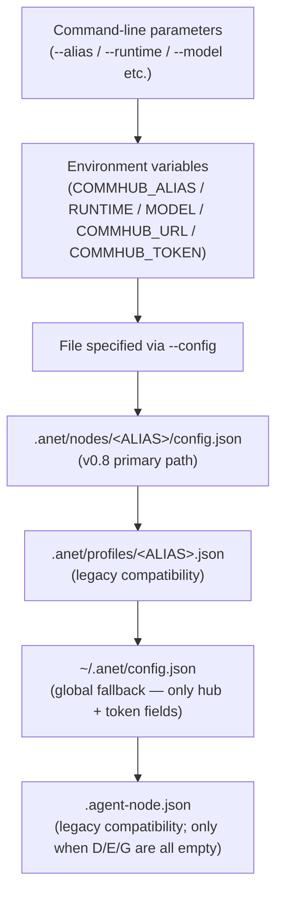
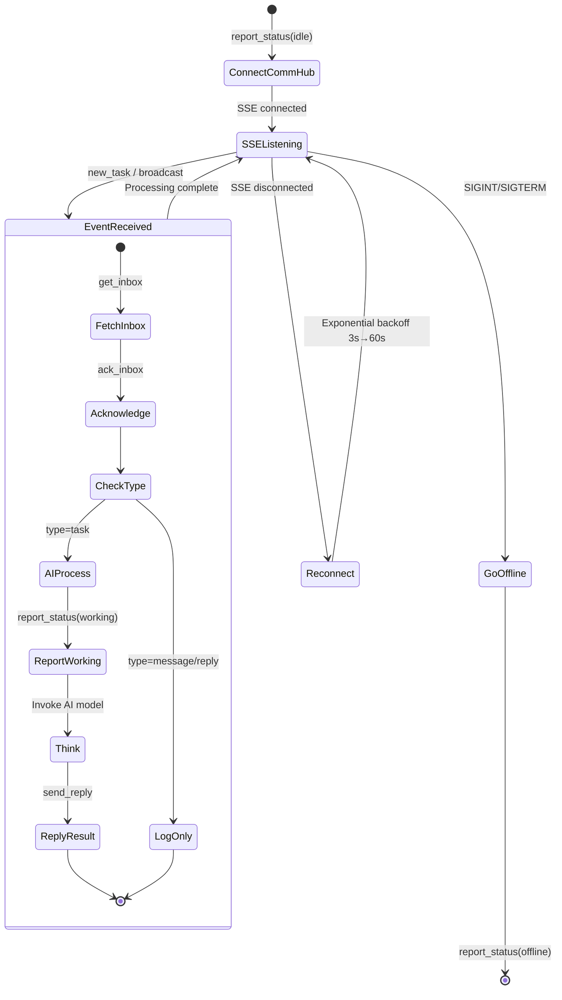

# Agent Node

Agent Node is the working unit in Agent Network -- it receives tasks, invokes an AI model to process them, and reports results.

::: tip Not sure which Runtime to pick?
- Not sure? Start with `claude-agent-sdk` (recommended for newcomers). `anet node create` is interactive and **picks the vendor first**: the built-in `VENDORS` list = InternLM / MiniMax / Xiaomi MiMo / Anthropic Claude / Codex / Claude Code CLI / Custom — every built-in vendor is verified-with-real-call. **DeepSeek / GLM / Kimi / OpenRouter / vLLM / SiliconFlow / Qwen and other Anthropic-compatible providers not in the built-in list go through "Custom"** + `ANTHROPIC_BASE_URL` env ([full provider table in multi-model.md](/en/guide/multi-model)).
- Want AI to **write code / run commands** --> `codex-sdk`
- Want AI to **write copy / translate / analyze** (programmatic API) --> `claude-agent-sdk`
- Want AI to **work like Claude in your terminal** --> `claude-code-cli`
- Want to use **domestic Chinese models (MiniMax / DeepSeek / GLM / Kimi / InternLM / Xiaomi MiMo / OpenRouter, etc.)** --> `claude-agent-sdk` + `ANTHROPIC_BASE_URL` ([full provider table](/en/guide/multi-model))
:::

## Installation

```bash
# Global install
npm install -g @sleep2agi/agent-node

# Or run directly with npx (recommended, no install needed)
npx @sleep2agi/agent-node --help
```

## Runtimes

Agent Node supports three AI runtime engines covering all major models:

### claude-agent-sdk

Based on the [Anthropic Claude Agent SDK](https://www.npmjs.com/package/@anthropic-ai/claude-agent-sdk).

| Property | Description |
|------|------|
| **Models** | Latest Claude Sonnet / Opus / Haiku (specific IDs at [Anthropic Models](https://docs.anthropic.com/claude/docs/models-overview)) |
| **Prerequisites** | Anthropic API Key, or any Anthropic-compatible API key (MiniMax / DeepSeek / GLM / Kimi / InternLM / Xiaomi MiMo / OpenRouter, etc. — full list in [multi-model](/en/guide/multi-model)) |
| **Strengths** | Programmatic Anthropic-compatible API calls for stable background agents |
| **Isolation** | `settingSources: []` fully isolates host config |

```bash
npx @sleep2agi/agent-node \
  --alias reasoning-master \
  --runtime claude-agent-sdk \
  --model claude-sonnet-4-6 \
  --hub http://YOUR_IP:9200
```

::: details Prerequisites checklist
- [ ] Anthropic API Key or MiniMax API Key (paid)
- [ ] CommHub Server is running
:::

::: info Verify
After starting, you should see `SSE connected, waiting for tasks...`. If you get an `auth` / `401` / `invalid x-api-key` error: check that `ANTHROPIC_API_KEY` (for api.anthropic.com) or `ANTHROPIC_AUTH_TOKEN` + `ANTHROPIC_BASE_URL` (for a third-party Anthropic-compatible endpoint) is set correctly — see [runtimes — common pitfalls](/en/guide/runtimes#claude-agent-sdk). `claude auth login` is for the `claude-code-cli` runtime and has no effect on the SDK path.
:::

### claude-code-cli

Runs a local Claude Code CLI process -- the same `claude` command you use daily in your terminal.

| Property | Description |
|------|------|
| **Models** | Latest Claude Sonnet / Opus / Haiku (specific IDs at [Anthropic Models](https://docs.anthropic.com/claude/docs/models-overview)) |
| **Prerequisites** | Claude Code installed (`npm i -g @anthropic-ai/claude-code`) |
| **Strengths** | Spawns a `claude` child process with full terminal capabilities |
| **Difference** | vs `claude-agent-sdk`: CLI mode = spawns `claude` process; SDK mode = programmatic API calls |

```bash
npx @sleep2agi/agent-node \
  --alias terminal-assistant \
  --runtime claude-code-cli \
  --model claude-sonnet-4-6 \
  --hub http://YOUR_IP:9200
```

::: details Prerequisites checklist
- [ ] Install Claude Code: `npm install -g @anthropic-ai/claude-code`
- [ ] Verify `claude --version` outputs correctly
- [ ] Run `claude auth login` so your local Claude subscription is active (claude-code-cli reuses the local login state)
- [ ] CommHub Server is running
:::

::: info Verify
After starting, you should see `SSE connected, waiting for tasks...`.
- If you get `claude: command not found`, make sure Claude Code is installed globally
- If you get `auth` / 401, re-run `claude auth login` to refresh the subscription session
:::

::: info claude-code-cli vs claude-agent-sdk
- **claude-code-cli**: Spawns a `claude` child process, just like typing commands in your terminal. Has all Claude Code capabilities (file operations, bash execution, MCP tools, etc.).
- **claude-agent-sdk**: Calls Claude through the programmatic SDK API. Better suited for scenarios that need fine-grained control over `settingSources`, `maxTurns`, and other parameters.
:::

### codex-sdk

Based on the [OpenAI Codex SDK](https://www.npmjs.com/package/@openai/codex-sdk).

| Property | Description |
|------|------|
| **Models** | Codex SDK model (set with `--model`; see OpenAI Codex docs for the current model id) |
| **Prerequisites** | `codex auth login` |
| **Strengths** | Strong code generation, flexible tool use |
| **Tools** | Codex CLI ships with Read / Write / Edit / Bash / Glob / Grep / WebSearch baked in (**does not honor `--tools`** — aligned with R243 chain) |

```bash
npx @sleep2agi/agent-node \
  --alias code-assistant \
  --runtime codex-sdk \
  --model <codex-model-id> \
  --hub http://YOUR_IP:9200
# Note: codex-sdk silently ignores --tools. The toolset is baked into the codex CLI binary.
```

::: details Prerequisites checklist
- [ ] Install codex CLI: `npm install -g @openai/codex` (`@openai/codex-sdk` lives in `@sleep2agi/agent-node`'s optional `peerDependencies`; npm 7+ pulls it in automatically with agent-node, but the SDK shells out to the `codex` binary — see [runtimes / codex-sdk prereqs](/en/guide/runtimes#codex-sdk))
- [ ] Run `codex auth login` to authenticate with OpenAI (or `export OPENAI_API_KEY=sk-xxx`)
- [ ] CommHub Server is running
:::

::: info Verify
After starting, you should see `SSE connected, waiting for tasks...`.
- If you get `Error: spawn codex ENOENT`, the `codex` binary isn't on PATH — run `npm install -g @openai/codex` + check `which codex`
- If you get a `codex auth` error, run `codex auth login` (or check the `OPENAI_API_KEY` env)
:::

### claude-agent-sdk + Domestic Models

Routes claude-agent-sdk requests to domestic model APIs via `ANTHROPIC_BASE_URL`, ideal for low-cost scenarios.

| Property | Description |
|------|------|
| **Models** | MiniMax, DeepSeek, GLM, Kimi, InternLM, Xiaomi MiMo, OpenRouter — any Anthropic-compatible endpoint (full provider table: [Multi-model setup](/en/guide/multi-model)) |
| **Prerequisites** | API key for the target model |
| **Strengths** | Low cost, high throughput, direct access in China |
| **Mechanism** | Routes requests to compatible APIs via `ANTHROPIC_BASE_URL` |

```bash
# MiniMax
ANTHROPIC_BASE_URL=https://api.minimaxi.com/anthropic \
ANTHROPIC_AUTH_TOKEN=your-minimax-key \
npx @sleep2agi/agent-node \
  --alias minimax-bot \
  --runtime claude-agent-sdk \
  --model <minimax-model-id> \
  --hub http://YOUR_IP:9200

# InternLM (note: bare hostname, no /anthropic suffix)
ANTHROPIC_BASE_URL=https://chat.intern-ai.org.cn \
ANTHROPIC_AUTH_TOKEN=your-intern-key \
npx @sleep2agi/agent-node \
  --alias intern \
  --runtime claude-agent-sdk \
  --model intern-s1-pro \
  --hub http://YOUR_IP:9200
```

::: details Prerequisites checklist
- [ ] API key for the target model (e.g. MiniMax API Key)
- [ ] Set environment variables `ANTHROPIC_BASE_URL` and `ANTHROPIC_AUTH_TOKEN`
- [ ] CommHub Server is running
:::

::: info Verify
After starting, you should see `SSE connected, waiting for tasks...`. If you get a `401` or `auth` error, double-check your API key.
:::

## Command-Line Parameters

```bash
npx @sleep2agi/agent-node [options]
```

| Parameter | Default | Description |
|------|--------|------|
| `--alias` | (required) | Agent name (display name in CommHub) |
| `--hub` | http://127.0.0.1:9200 | CommHub Server address |
| `--runtime` | claude-agent-sdk | Runtime engine (`claude-agent-sdk` / `codex-sdk` / `claude-code-cli`) |
| `--model` | (per runtime default) | AI model name |
| `--tools` | (none) | Available tools, comma-separated |
| `--max-budget` | 0 | Per-task budget cap (USD; 0 means disabled) |
| `--session` | (new) | Resume a specific session |
| `--config` | (auto-detect) | Config file path |

::: info Where token / network come from
The auth token is supplied via the `token` field in `.anet/nodes/<name>/config.json` or the `COMMHUB_TOKEN` env var — **the CLI does not accept a `--token` flag**. The network ID is inferred from the `ntok_` token claim; no manual flag is needed. The agent-node CLI also **does not parse** single-letter short flags (`-a / -h / -r / -m / -t / -s / -c`) — only the long-form flags in the table above are accepted.
:::

## Configuration Files

Agent Node supports multiple configuration methods, from highest to lowest priority (verified at [`agent-node/src/cli.ts:100-128`](https://github.com/sleep2agi/agent-network/blob/main/agent-node/src/cli.ts#L100)):



::: tip Global `~/.anet/config.json` fallback
After the project config is loaded, [`cli.ts:123-125`](https://github.com/sleep2agi/agent-network/blob/main/agent-node/src/cli.ts#L123) fills in the missing `hub` and `token` fields from the global `~/.anet/config.json`. **Only these two fields fall back across projects** — `runtime` / `model` / `tools` / `env` must be set via project `config.json` / CLI / env; global config does not cover them. Aligned with the [feedback_config_priority] memory ("project config overrides global at the field level; missing fields fall back to global").
:::

### Full config.json Fields

```json
{
  "anet_version": "0.1.0",
  "node_id": "n_a1b2c3d4",
  "node_name": "code-assistant",
  "token": "ntok_...",
  "runtime": "claude-agent-sdk",
  "model": "<model-id>",
  "session": "",
  "channels": ["server:commhub"],
  "tools": ["Read", "Write", "Edit", "Bash", "Glob", "Grep"],
  "logLevel": "info",
  "env": {
    "ANTHROPIC_BASE_URL": "https://api.minimaxi.com/anthropic"
  },
  "flags": {
    "dangerouslySkipPermissions": true,
    "teammateMode": "in-process",
    "maxTurns": 20
  }
}
```

| Field | Type | Description |
|------|------|------|
| `anet_version` | string | Config version |
| `node_id` | string | Stable unique identifier (n_ prefix + 8-char hex) |
| `node_name` | string | Display name, can be renamed |
| `alias` | string | Node alias (the `.anet/nodes/<alias>/` directory name + the display identifier on CommHub; equals `node_name` when not set separately) |
| `runtime` | string | Runtime: `claude-agent-sdk` / `codex-sdk` / `claude-code-cli` |
| `model` | string | AI model name |
| `session` | string | session/thread ID. For the `claude-code-cli` runtime, `anet node create` pre-generates a UUID (first `start` binds it via `--session-id <uuid>`, restarts auto-`--resume <uuid>` to continue the conversation; v0.8.2 fixed a prior default session-loss bug). For other runtimes, this is the previous session ID for resume |
| `channels` | string[] | Connected channels list |
| `tools` | string[] | Allowed tools list. **`claude-agent-sdk` only**; `codex-sdk` silently ignores it (toolset is baked into the codex binary — see the L109 note above + [runtimes#codex-sdk](/en/guide/runtimes#codex-sdk)) |
| `env` | object | Environment variable overrides |
| `flags` | object | Runtime flags |
| `hub` | string | CommHub Server address override (falls back to the global `~/.anet/config.json` `hub` when unset) |
| `token` | string | Auth token override (falls back to the global config `token` when unset) |
| `network_id` | string | Network ID (usually inferred from `ntok_`, no need to set manually) |
| `systemPrompt` | string | System prompt, prepended to every task (can also use the `--prompt` flag; the `SYSTEM_PROMPT` env var is **not read** — see the R242 note above) |

## Task Processing Flow

After starting, Agent Node automatically enters a task listening loop:



### Message Type Filtering

Agent Node only triggers AI processing for `task` type messages:

| Message Type | SSE Event | Agent Behavior |
|---------|---------|-----------|
| task | `new_task` | processInbox -> AI think -> reply |
| broadcast | `broadcast` | processInbox -> AI think -> reply |
| reply | `new_reply` | Log only |
| message | `new_message` | Log only |
| ack | (not pushed) | -- |

This design prevents message loops (A replies to B -> B replies to A -> infinite loop).

## Tool Configuration

### Available Tools

R243 calibration: the `--tools` flag only affects the `claude-agent-sdk` runtime. The `codex-sdk` runtime's toolset (Read/Write/Edit/Bash/Grep/Glob/WebSearch) is baked into the codex CLI binary and **does not honor** `--tools`. The `claude-code-cli` runtime shares the host's Claude Code toolset and also does not use this flag.

| Tool | Description | Applicable Runtime |
|------|------|-------------|
| `Read` | Read files | `claude-agent-sdk` |
| `Write` | Write files | `claude-agent-sdk` |
| `Edit` | Edit files | `claude-agent-sdk` |
| `Bash` | Execute commands | `claude-agent-sdk` |
| `Glob` | File search | `claude-agent-sdk` |
| `Grep` | Content search | `claude-agent-sdk` |
| `WebSearch` | Web search | `claude-agent-sdk` |
| `WebFetch` | Fetch URL contents | `claude-agent-sdk` |

Verified at [`agent-node/src/cli.ts:160`](https://github.com/sleep2agi/agent-network/blob/main/agent-node/src/cli.ts#L160):
```ts
const ALL_TOOLS = ["Read", "Write", "Edit", "Bash", "Glob", "Grep", "WebSearch", "WebFetch"];
// ... cli.ts:560: tools: TOOLS.length ? TOOLS : undefined  ← passed to claude-agent-sdk query options
```

```bash
# Specify tools (only effective for the claude-agent-sdk runtime)
npx @sleep2agi/agent-node --alias coder --tools Read,Write,Edit,Bash,Glob,Grep

# All tools
npx @sleep2agi/agent-node --alias coder --tools all

# codex-sdk runtime silently ignores --tools
npx @sleep2agi/agent-node --alias coder --runtime codex-sdk
# Codex has Read/Write/Edit/Bash/Grep/Glob/WebSearch baked in — you cannot detach individual tools.
```

::: warning Security Note
`--tools all` gives the agent full filesystem and command execution permissions. In production, explicitly specify only the tools needed (e.g., a read-only agent gets just `Read,Glob,Grep`).
:::

## Budget Control

The `--max-budget` parameter caps the maximum spend per task (in USD) — **only effective for the `claude-agent-sdk` runtime**:

```bash
# Max $0.10 per task (claude-agent-sdk)
npx @sleep2agi/agent-node --alias coder --max-budget 0.1

# Max $1.00 per task (complex tasks)
npx @sleep2agi/agent-node --alias reasoner --max-budget 1.0
```

Verified at [`agent-node/src/cli.ts:580`](https://github.com/sleep2agi/agent-network/blob/main/agent-node/src/cli.ts#L580):
```ts
if (MAX_BUDGET > 0) options.maxBudgetUsd = MAX_BUDGET;  // passed to claude-agent-sdk query options
```

When `SDKResultMessage.total_cost_usd` reaches `maxBudgetUsd`, claude-agent-sdk automatically ends the turn and the task moves to `error_max_budget`.

::: warning codex-sdk / claude-code-cli runtime do not support a USD budget cap
- The `codex-sdk` path ([`cli.ts:669-755 processWithCodex`](https://github.com/sleep2agi/agent-network/blob/main/agent-node/src/cli.ts#L669)) does not read `MAX_BUDGET`; **`--max-budget` is silently ignored**. Codex-sdk only reports token counts (`TurnCompletedEvent.usage`), not USD — you have to derive cost from your own model→price table (aligned with the R215 sdk-deep-dive chain).
- `claude-code-cli` runs against your local Claude Code subscription, counted against subscription quota rather than USD.
- **Cross-runtime budget control**: put a reverse proxy in front (nginx / Cloudflare / litellm proxy) and throttle by model-API call count.
:::

## Lifecycle

The complete Agent Node lifecycle:

| Phase | CommHub Status | Description |
|------|-------------|------|
| Created | (not in CommHub) | `anet node create` generates config.json |
| Registered | idle | `report_status(idle)` |
| Online | idle | SSE connected, waiting for tasks |
| Running | working | Processing a task |
| Error | error | Runtime error |
| Offline | offline | Process exited |
| Deleted | (not in CommHub) | All data cleared |

### Heartbeat

- Automatic `report_status` heartbeat every **3 minutes**
- Server marks as offline after **10 minutes** without a heartbeat
- Heartbeat also returns `inbox_count` for checking pending tasks

### Reconnection

SSE auto-reconnects on disconnect using exponential backoff:

```
Retry interval: 3s → 6s → 12s → 24s → 48s → 60s (cap)
```

Online status is automatically restored after successful reconnection.

### Graceful Shutdown

On SIGINT (Ctrl+C) or SIGTERM:

1. Report `report_status(offline)`
2. Close SSE connection
3. Exit process

If the process crashes (no time to report), CommHub detects via heartbeat timeout and marks the agent offline after **10 minutes** (verified at [`server/src/index.ts:762-767`](https://github.com/sleep2agi/agent-network/blob/main/server/src/index.ts#L762) `Date.now() - 10 * 60 * 1000` cutoff, lazily triggered on `/api/status` calls; aligned with the R219 chain).

## Environment Variables

Only the env vars that agent-node actually reads from `process.env` (verified at [`agent-node/src/cli.ts:100-260`](https://github.com/sleep2agi/agent-network/blob/main/agent-node/src/cli.ts#L100)):

| Variable | Equivalent CLI flag / config field | Description |
|------|------------------------------|------|
| `COMMHUB_URL` | `--hub` / `--url` / `config.hub` | CommHub Server address (cli.ts:158) |
| `COMMHUB_TOKEN` | `config.token` / `globalConfig.token` | Auth token (cli.ts:186; **no CLI flag accepted**) |
| `COMMHUB_ALIAS` / `ALIAS` | `--alias` / `config.alias` | Agent alias — both env var names work (cli.ts:109) |
| `RUNTIME` | `--runtime` / `config.runtime` | Runtime engine, defaults to `claude-agent-sdk` |
| `MODEL` | `--model` / `config.model` | AI model |
| `LOG_LEVEL` | `--log-level` / `config.logLevel` (**top-level**, not under `flags`) | `debug` / `info` / `warn` / `error` — aligned with R211 chain |
| `ANET_NETWORK_ID` | `config.network_id` / `globalConfig.network_id` | Network ID fallback (typically inferred from `ntok_`; cli.ts:356) |
| `CLAUDE_TIMEOUT_MS` | `--claude-timeout-ms` / `config.flags.claudeTimeoutMs` / `config.claudeTimeoutMs` | Per-query timeout (ms) for the `claude-agent-sdk` runtime, default `120000` (120s); on timeout it aborts and returns an error suggesting you check `ANTHROPIC_BASE_URL` reachability |
| `ANTHROPIC_BASE_URL` | `config.env.ANTHROPIC_BASE_URL` | Model API URL (required when targeting a third-party Anthropic-compatible endpoint) |
| `ANTHROPIC_AUTH_TOKEN` | `config.env.ANTHROPIC_AUTH_TOKEN` | Model API key — **for third-party Anthropic-compatible endpoints** (MiniMax / DeepSeek / GLM / Kimi / InternLM / Xiaomi MiMo / OpenRouter / vLLM, etc.) |
| `ANTHROPIC_API_KEY` | `config.env.ANTHROPIC_API_KEY` | Model API key — **only for direct api.anthropic.com**; don't reuse it for third-party endpoint keys (see [runtimes — claude-agent-sdk pitfalls](/en/guide/runtimes#claude-agent-sdk)) |

::: warning `TOOLS` / `SYSTEM_PROMPT` env vars do not exist
R242 calibration: the previously listed `TOOLS` and `SYSTEM_PROMPT` env vars are **not read** by agent-node (verified: cli.ts:161 `toolsRaw = opts.tools || fileConfig.tools` has no `process.env.TOOLS`; cli.ts:180 `SYSTEM_PROMPT = opts.prompt || fileConfig.systemPrompt` has no env reading). To set tools, use the `--tools` CLI flag or `config.json`'s `tools` field; for the system prompt, use the `--prompt` flag or `config.json`'s `systemPrompt` field.
:::

::: tip Docker Usage
When running in Docker, environment variables are the most convenient configuration method. See [Docker Deployment](/en/deploy/docker).
:::

## Next steps

**Get started**:
- [One-shot install](/en/guide/one-shot-install) — first agent in 5 minutes after install
- [Hello World](/en/cases/hello-world) — 6-step walkthrough for your first agent cluster

**Configure deeper**:
- [Runtimes](/en/guide/runtimes) — picking between claude-agent-sdk / codex-sdk / claude-code-cli
- [Multi-model](/en/guide/multi-model) — use DeepSeek / MiniMax / Kimi / Claude
- [Channel plugins](/en/guide/channels) — wire agents to Telegram / WeChat / Feishu

**Production**:
- [Docker deployment](/en/deploy/docker) — containerized agents
- [Production deployment](/en/deploy/production) — multi-machine, TLS, backups
- [Dashboard](/en/guide/dashboard) — monitor agent status, tasks, message flow

**Troubleshooting**:
- [Troubleshooting](/en/troubleshooting) — common issues
- `anet doctor --fix` — auto-detects expired ntok_ and other issues
