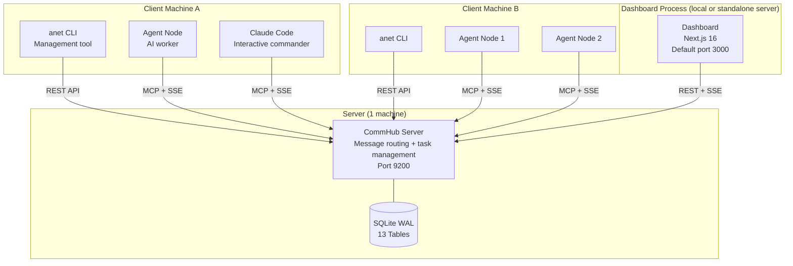
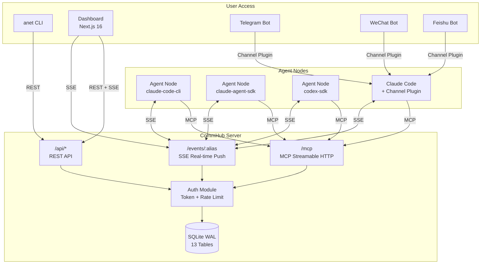
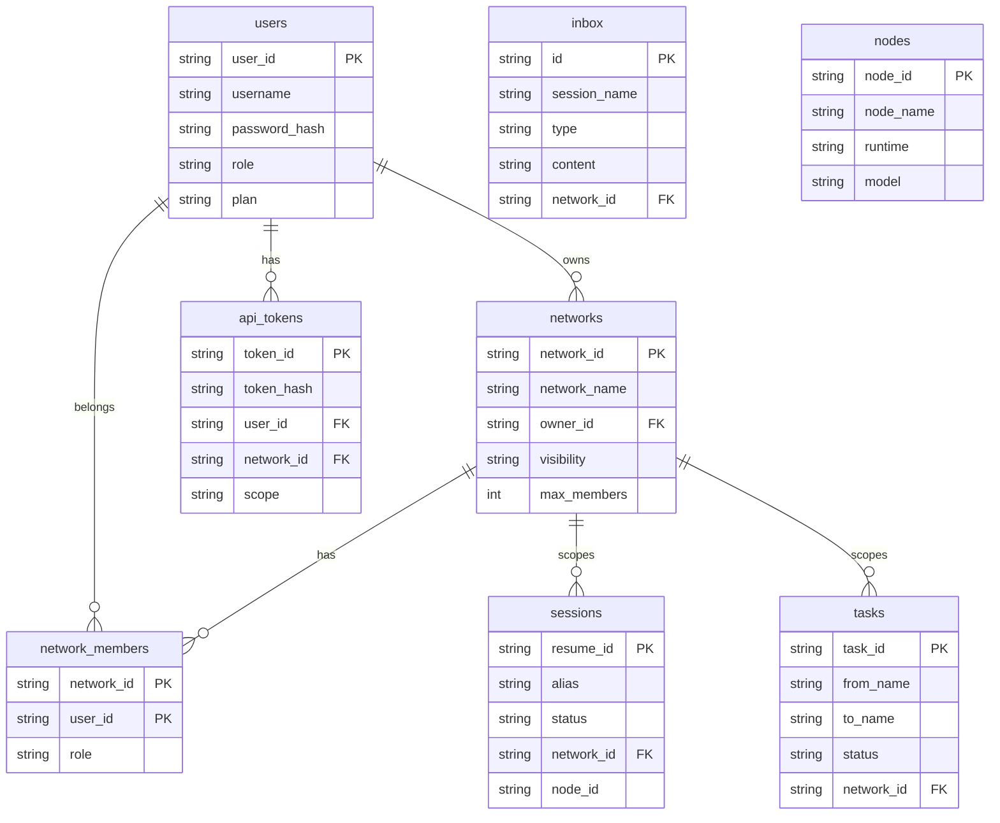
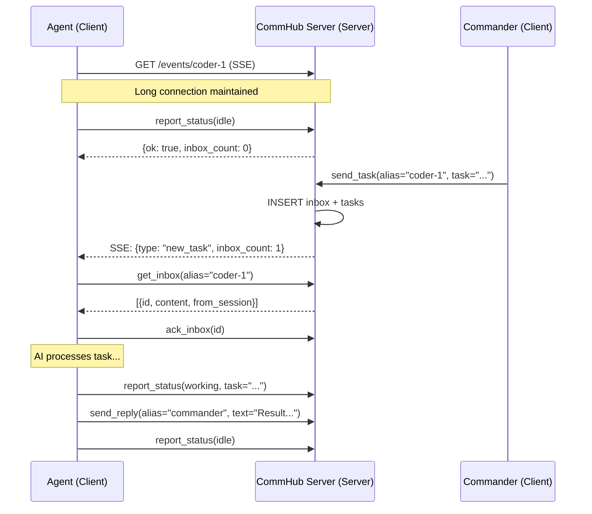
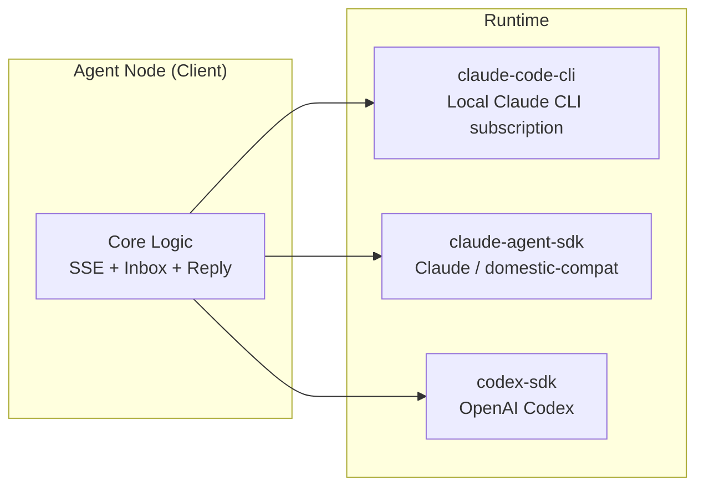
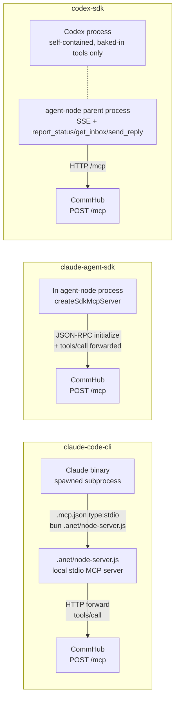
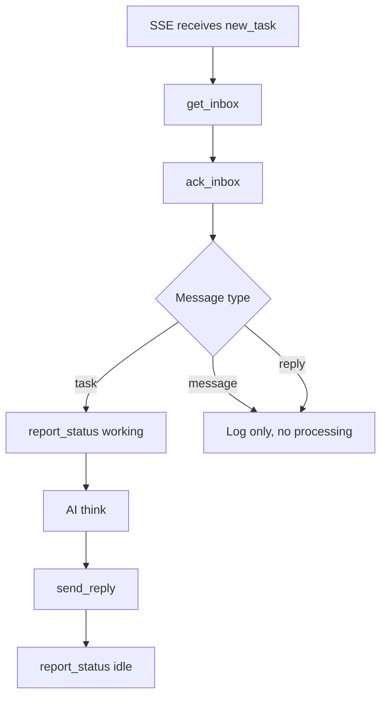
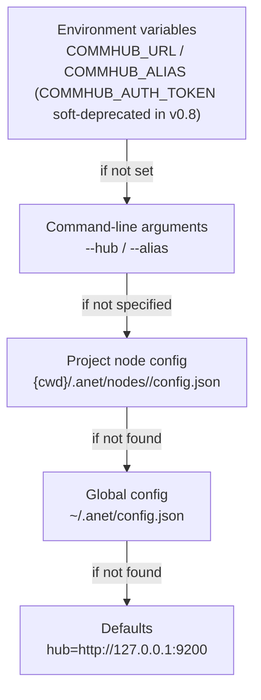

# Architecture Overview

## Deployment Perspective: What Runs Where?

Before diving into technical details, let's clarify where each component runs. Agent Network uses a **Server-Client architecture** -- one central Server connects to multiple distributed Agent clients.

### Deployment Topology



### Component Deployment Quick Reference

| Component | Runs On | Port | Purpose | npm Package |
|-----------|---------|------|---------|-------------|
| **CommHub Server** | Server (1 machine) | `9200` | Message routing, task management, auth, database | `@sleep2agi/commhub-server` |
| **Dashboard** | Local or standalone server | `3000` default | Web UI (Overview / Nodes / Tasks / Messages / Chat / Admin / Settings — see the [Dashboard doc](/en/guide/dashboard#page-overview) for per-page detail) | `@sleep2agi/agent-network-dashboard` |
| **anet CLI** | Each client machine | -- | Command-line management tool (full command list: [CLI reference](/en/guide/cli)) | `@sleep2agi/agent-network` |
| **Agent Node** | Each client machine | -- | AI worker (receives tasks, calls AI, reports results) | `@sleep2agi/agent-node` |
| **Claude Code** | Client machine | -- | Interactive AI development (joins network via MCP) | Anthropic official |
| **Channel Plugins** | Client machine | -- | Telegram (v0.8 stable); WeChat / Feishu via external MCP plugins ([see channels.md](/en/guide/channels)) | `channel/` |

### Port Reference

| Port | Component | Protocol | Description |
|------|-----------|----------|-------------|
| **9200** | CommHub Server | HTTP | MCP (`POST /mcp`), SSE (`GET /events/:alias`), REST (`/api/*`) |
| **3000** | Dashboard | HTTP | Default port for `anet hub dashboard` |

### Local vs Production

| | Local Development | Production Deployment |
|---|---------|---------|
| CommHub Server | Local `localhost:9200` | Server `YOUR_IP:9200` |
| Agent Node | Local, `--hub localhost:9200` | Client machine, `--hub YOUR_IP:9200` |
| Dashboard | `localhost:3000` | `YOUR_IP:3000` or standalone deploy |
| Database | Local SQLite file | Server SQLite file |
| Communication | All via localhost | Via internal network / public IP |

---

## System Architecture

Agent Network uses a centralized message routing architecture where all agents communicate through the CommHub Server.



## CommHub Server

CommHub Server is the core of the entire system, responsible for message routing, state management, and task tracking.

**Runs on**: Server (1 machine). All client Agents connect to it.

### Triple Protocol

| Protocol | Endpoint | Purpose | Auth |
|------|------|------|------|
| **MCP Streamable HTTP** | `POST /mcp` | Agent tool calls (send_task, report_status, etc.) | Bearer Token |
| **SSE** | `GET /events/:alias` | Real-time push of tasks/messages to agents | Bearer Token |
| **REST** | `GET/POST /api/*` | Dashboard / CLI / external integrations | Bearer Token |

::: tip v0.10.0 new — per-server daemon observability endpoint family ([#99](https://github.com/sleep2agi/agent-network/issues/99) Phase 1 scaffold, `commhub-server@0.8.2`)
Two new REST endpoints expose **single-host health + per-agent list**, used by the dashboard ServersDrawer and any monitoring / external observability integration:

- `GET /api/server/:host/health` — current health snapshot for a single host (CPU / mem / disk + 24h bucketed history `5m` / `1h` / `24h`) plus `alert_level`
- `GET /api/server/:host/agents` — agents on a single host + per-agent `process_telemetry` (`rss` / `cpu_pct` / `uptime_seconds` / `in_flight_count`, [#142](https://github.com/sleep2agi/agent-network/issues/142) T2.1 shipped in `agent-node@2.4.0` + T2.2 server schema aligned in `commhub-server@0.8.2`)

The control layer (kill / restart / redeploy) is deferred to v0.11.0. Details: [REST API — server endpoint family](/en/api/rest#get-api-server-host-health).
:::

### MCP Tool Groups

CommHub provides 17 MCP Tools in two groups:

**Agent-side tools (4)** -- agents report status and fetch tasks:

| Tool | Description |
|------|------|
| `report_status` | Heartbeat + status reporting (idle/working/error) |
| `report_completion` | Task completion report + results |
| `get_inbox` | Fetch pending messages |
| `ack_inbox` | Acknowledge message receipt |

**Hub-side tools (13)** -- command center / Dashboard manages tasks:

| Tool | Description |
|------|------|
| `send_task` | Dispatch a task (with lifecycle) |
| `send_message` | Send a message (no processing triggered) |
| `send_reply` | Reply to a task |
| `send_ack` | Acknowledge task receipt |
| `retry_task` | Retry a failed task |
| `cancel_task` | Cancel a pending task |
| `reassign_task` | Reassign a task to another agent |
| `get_task` | Query task details |
| `list_tasks` | Query task list |
| `get_all_status` | Get all session statuses |
| `get_session_status` | Get single session details |
| `broadcast` | Broadcast a message to all agents |
| `get_completions` | Query completion records |

### Database Design

SQLite with WAL mode, 14 tables:



Additional tables: `completions` (completion records), `task_events` (task event log), `audit_log` (audit trail), `licenses` (licensing), `network_invites` (invite codes), `rename_txn` (RFC-010 node-rename two-phase transaction state: `prepared` / `committed` / `aborted`).

### SSE Push Mechanism

Agents receive tasks in real time via SSE long connections, eliminating the need for polling:



### Heartbeat and Timeout

- Agents send heartbeats (`report_status`) every **3 minutes**
- Server updates `last_seen_at` on every request
- After **10 minutes** without a heartbeat, agents are automatically marked `offline`
- SSE auto-reconnects on disconnect (exponential backoff 3s -> 60s)

## Agent Node

Agent Node is the working unit in the network, responsible for receiving tasks, invoking the AI model, and reporting results.

**Runs on**: Client machines (can be multiple). Connects to CommHub Server over the network.

### Three Runtimes



| Runtime | AI Engine | Use Case | Models |
|---------|---------|---------|------|
| `claude-code-cli` | spawn local `claude` process | Reuse Claude subscription / interactive tool use | Claude Sonnet/Opus (subscription) |
| `claude-agent-sdk` | Anthropic Claude Agent SDK | Programmatic access to any Anthropic-compatible API | Anthropic / MiniMax / DeepSeek / GLM / Kimi / InternLM / Xiaomi MiMo / OpenRouter (see [Multi-model](/en/guide/multi-model)) |
| `codex-sdk` | OpenAI Codex SDK (v0.10.0+ can opt-in to a direct stdio path — see below) | Code generation, tool use | OpenAI Codex |

::: tip v0.10.0 new — `codex-direct-stdio` opt-in path ([#141](https://github.com/sleep2agi/agent-network/issues/141))
Set `ANET_CODEX_STDIO_DIRECT=1` to make agent-node switch the codex runtime from the `@openai/codex-sdk` wrapper to **`spawn('codex', ['app-server'])` + a ~155 LOC direct stdio JSON-RPC client**, getting the full 67-method v2 protocol surface (thread / turn / item / realtime) and **bypassing** the wrapper's `--mcp-config` HTTP-transport bug family ([#102](https://github.com/sleep2agi/agent-network/issues/102) hang root cause). **v0.10.0 still defaults to the wrapper**; v0.11.0 plans to flip the default and rename the toggle to `ANET_CODEX_LEGACY_SDK=1` opt-out. The LLM-side tool surface is **unchanged** (the codex thread still uses only its baked-in tools; the commhub roundtrip is still handled by the agent-node parent process) — what changes is purely the **transport protocol** between agent-node and the codex process. Details: [runtimes — codex-sdk § codex-direct-stdio](/en/guide/runtimes#codex-sdk) + [agent-node — env vars § ANET_CODEX_STDIO_DIRECT](/en/guide/agent-node#environment-variables) + [release notes](/en/preview/v0.10.0#new-runtime-path-codex-direct-stdio).
:::

### MCP integration paths (per runtime, v0.9.0+)

The three runtimes expose commhub tools to the LLM via **different** paths — this affects the tool names the LLM sees and how you debug routing problems:



**`claude-agent-sdk` uses in-process SDK MCP** ([#102](https://github.com/sleep2agi/agent-network/issues/102) Option A, agent-node `2.3.5-preview.0+`):

- agent-node creates an **in-process `McpServer`** via `createSdkMcpServer({ name: "commhub" })` and registers the 7 agent-facing tools (`send_task` / `send_message` / `send_reply` / `get_all_status` / `get_session_status` / `get_task` / `list_tasks`)
- Each tool handler **forwards** the call from inside agent-node to CommHub's `POST /mcp` via the JSON-RPC `initialize → tools/call` chain
- The LLM sees the SDK-namespaced tool name **`mcp__commhub__send_task`** (single `commhub` prefix) — not `mcp__commhub__commhub__send_task` or other double-prefix variants
- Verify [`agent-node/src/commhub-mcp.ts`](https://github.com/sleep2agi/agent-network/blob/main/agent-node/src/commhub-mcp.ts) `createCommhubSdkMcpServer()`

**Why doesn't `claude-agent-sdk` use HTTP MCP directly?** Claude Agent SDK 0.2.x forwards `mcpServers={commhub:{type:"http", url:.../mcp}}` verbatim to the claude binary's `--mcp-config`, but the binary's HTTP MCP path **does not issue** `initialize` / `tools/list` against the endpoint — commhub never sees the binary subprocess's requests, so the tool list is empty for the LLM ([#102 root cause](https://github.com/sleep2agi/agent-network/issues/102)). Option A hosts the MCP server inside agent-node's own process to bypass this SDK limitation.

**`claude-code-cli` uses stdio + local `.anet/node-server.js` proxy**: the anet CLI writes a `.mcp.json` in the project cwd that registers commhub as `{ "type": "stdio", "command": "bun", "args": [".anet/node-server.js"] }` ([`agent-network/bin/cli.ts:1898 ensureMcpJson`](https://github.com/sleep2agi/agent-network/blob/main/agent-network/bin/cli.ts#L1898)). The claude binary spawns that local bun script as a stdio MCP server, and `node-server.ts` forwards tool calls to CommHub's `/mcp` over HTTP internally ([`agent-network/src/node-server.ts`](https://github.com/sleep2agi/agent-network/blob/main/agent-network/src/node-server.ts) `StdioServerTransport`). Tool names live in the `node-server.ts` namespace.

**`codex-sdk` does not expose commhub tools to the LLM**: `codexOpts` does not pass `mcpServers` ([`agent-node/src/cli.ts:797`](https://github.com/sleep2agi/agent-network/blob/main/agent-node/src/cli.ts#L797)). The codex thread only sees its baked-in tools (Read / Write / Edit / Bash / Glob / Grep / WebSearch). **Multi-agent dispatch happens outside the LLM in agent-node's parent process**: agent-node maintains the SSE connection plus `report_status` / `get_inbox` / `send_reply` calls back to CommHub, feeds the task text into the codex thread, and posts the codex reply back via CommHub. The codex thread itself **does not know** commhub exists — it is just an LLM worker.

> ⚠ Debug tip: if the LLM can't call a commhub tool, check the runtime first — for `claude-agent-sdk` nodes, confirm `commhub-mcp.ts` is in dist (agent-node ≥ 2.3.5-preview.0); for `claude-code-cli` nodes, check the `.mcp.json` has `type: stdio` and the `.anet/node-server.js` path is correct; for `codex-sdk` nodes, **look at the agent-node parent process logs** (the codex thread never calls commhub).

### Task Processing Flow



**Key rule**: Only `task` type messages trigger AI processing (think). `message` and `reply` are logged but not processed, preventing infinite loops.

### Isolation Strategy

Each Agent Node instance is fully isolated and does not read host machine global config — it passes `settingSources: []` to claude-agent-sdk's `query()` (the SDK entry point is the `query()` function, not a `new Agent({...})` class):

```typescript
const options = {
  model: MODEL || undefined,
  settingSources: [],  // Fully isolated — does not read ~/.claude/ etc.
  // permissionMode / mcpServers / env ...
};
for await (const message of query({ prompt, options })) { /* ... */ }
```

## anet CLI

anet CLI is the management tool for Agent Network, covering Hub / account / network / node / monitoring / demo operations (full command list: [CLI reference](/en/guide/cli)).

**Runs on**: Each client machine. Points to CommHub Server via `--hub` parameter or config file.

### Configuration Priority



### Configuration Files

**Global config** `~/.anet/config.json`:

```json
{
  "hub": "http://YOUR_IP:9200",
  "token": "utok_xxxxx"
}
```

**Project node config** `{cwd}/.anet/nodes/<alias>/config.json` (v0.8 per-node subdirectory schema; the old `.anet/config.json` `{alias, type}` 2-field format was the early V2 layout — see [Agent Node](/en/guide/agent-node) for the full field list):

```json
{
  "anet_version": "0.1.0",
  "node_id": "n_a1b2c3d4",
  "node_name": "commander",
  "alias": "commander",
  "runtime": "claude-code-cli",
  "network_id": "net_a1b2c3d4",
  "channels": ["server:commhub"],
  "env": {},
  "flags": { "dangerouslySkipPermissions": true, "teammateMode": "in-process" },
  "session": "550e8400-e29b-41d4-a716-446655440000"
}
```

## Dashboard

Dashboard is a separate Web process that talks to CommHub over REST:

| Type | Tech Stack | Runs On | Port | Features |
|------|--------|---------|------|------|
| Dashboard | Next.js 16 | Local, Vercel, or standalone server | `3000` default | Chat, Nodes, Tasks, Messages, Networks, Logs, Admin |

## Channel Plugins

Channel plugins enable agents to integrate with external communication platforms.

- **Telegram** -- via Bot API (v0.8 stable, `anet channel add telegram`)
- **WeChat / Feishu** -- via **external** MCP plugins (not part of `@sleep2agi/commhub-server`); see [Channel plugin docs](/en/guide/channels)

**Runs on**: Client machines, mounted as MCP Servers on Claude Code.

Channel message format:

```xml
<channel source="telegram" chat_id="123" user="alice">
  User's message
</channel>
```

## Code Structure

```
agent-network/        # repo root (github.com/sleep2agi/agent-network) — monorepo
├── server/            # CommHub Server (Bun + SQLite) → runs on Server
│   └── src/
│       ├── index.ts          # HTTP routing + MCP + SSE
│       ├── tools.ts          # 17 MCP Tools
│       ├── auth.ts           # Auth + permissions + network management
│       ├── db.ts             # Database + table definitions
│       ├── db-adapter.ts     # DB adapter layer (SQLite + abstract interface)
│       ├── push.ts           # SSE push management
│       └── password-dict.ts  # Weak password dictionary (v0.8 admin bootstrap)
├── agent-network/     # anet CLI + CommHub SDK → runs on Client
│   ├── bin/cli.ts            # CLI entry (full command list: [CLI docs](/en/guide/cli))
│   └── src/
│       ├── index.ts          # default export
│       ├── client.ts         # CommHub SDK client
│       ├── server.ts         # Server programmatic entry
│       └── node-server.ts    # Agent Node long-running server entry
├── agent-node/        # Agent runtime → runs on Client
│   └── src/cli.ts     # Three engines + task processing
├── channel/           # Claude Code Channel plugins → runs on Client
│   └── commhub-channel.ts
├── demos/             # Demo orchestrations
│   └── codex-telegram-squad/
└── docs/              # Design docs
```

## Security Architecture

See [Security Design](/en/concepts/security) for details. Key security measures:

- **Dual token authentication**: utok_ (user-level) + ntok_ (network-level)
- **Network isolation**: Server-side enforced network_id, clients cannot cross networks
- **RBAC with four permission levels**: owner / admin / member / viewer
- **SQL injection protection**: All queries are parameterized
- **Rate limiting**: Registration 30/min, login 10/min per IP
- **Audit logging**: All operations recorded
- **v0.8 RFC-001 Phase 2**: `COMMHUB_AUTH_TOKEN` master token soft-deprecated (only `/api/*` read + deprecation warning); first `anet hub start` auto-bootstraps admin utok_ (`~/.anet/server/admin-utok.json` chmod 600) with default account `admin / anethub`; password strength ≥ 8 + weak-password dictionary; `anet passwd` / `anet hub admin reset-user` tools; `anet doctor --fix` probes and reissues expired `ntok_`. See [RFC-001](https://github.com/sleep2agi/agent-network/blob/main/docs/rfcs/RFC-001-deprecate-commhub-auth-token.md).
