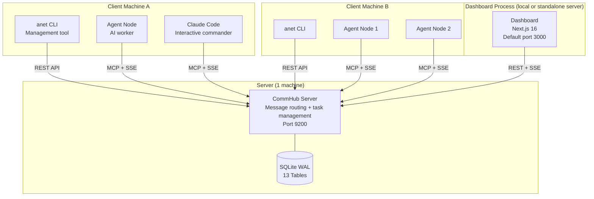
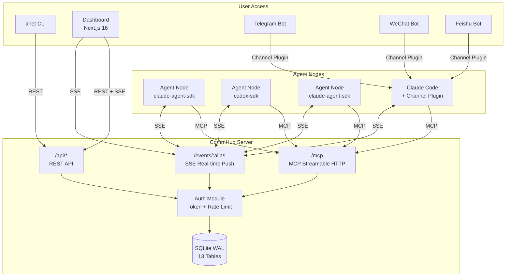
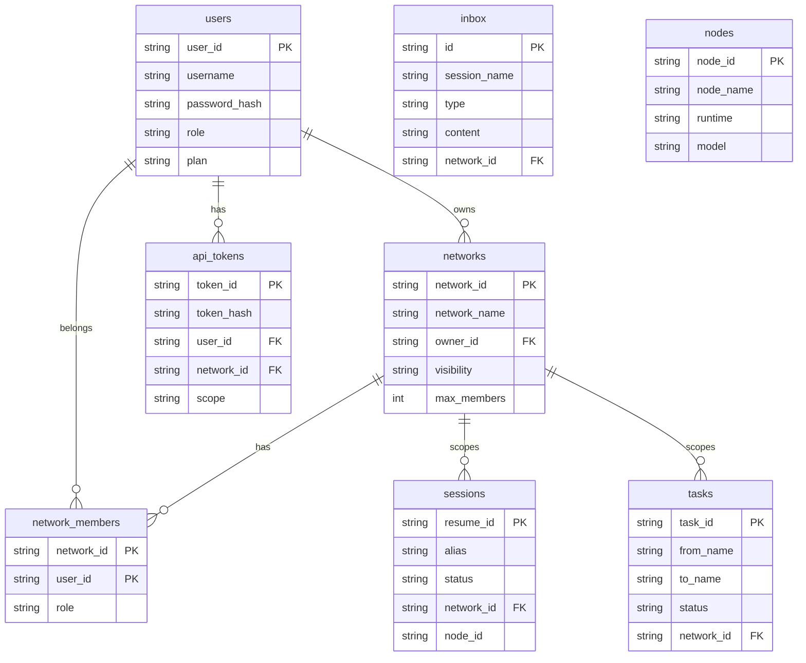
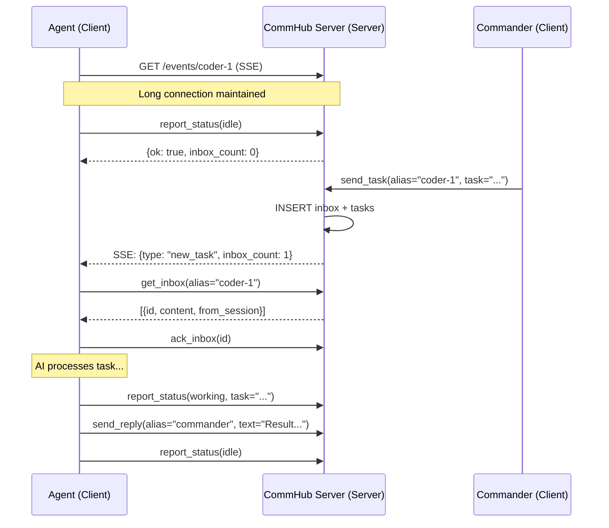
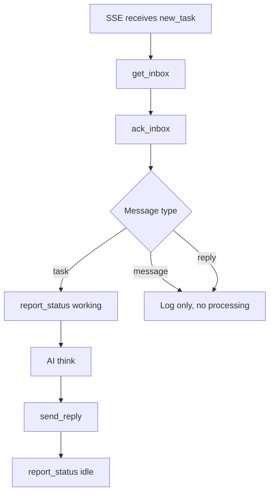
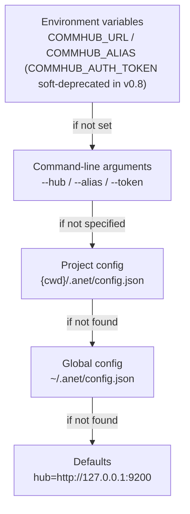

# Architecture Overview

## Deployment Perspective: What Runs Where?

Before diving into technical details, let's clarify where each component runs. Agent Network uses a **Server-Client architecture** -- one central Server connects to multiple distributed Agent clients.

### Deployment Topology



### Component Deployment Quick Reference

| Component | Runs On | Port | Purpose | npm Package |
|-----------|---------|------|---------|-------------|
| **CommHub Server** | Server (1 machine) | `9200` | Message routing, task management, auth, database | `@sleep2agi/commhub-server` |
| **Dashboard** | Local or standalone server | `3000` default | Web UI (Chat / Nodes / Tasks / Messages / Networks / Logs / Admin) | `@sleep2agi/agent-network-dashboard` |
| **anet CLI** | Each client machine | -- | Command-line management tool (39 commands) | `@sleep2agi/agent-network` |
| **Agent Node** | Each client machine | -- | AI worker (receives tasks, calls AI, reports results) | `@sleep2agi/agent-node` |
| **Claude Code** | Client machine | -- | Interactive AI development (joins network via MCP) | Anthropic official |
| **Channel Plugins** | Client machine | -- | Integrate Telegram/WeChat/Feishu | `channel/` |

### Port Reference

| Port | Component | Protocol | Description |
|------|-----------|----------|-------------|
| **9200** | CommHub Server | HTTP | MCP (`POST /mcp`), SSE (`GET /events/:alias`), REST (`/api/*`) |
| **3000** | Dashboard | HTTP | Default port for `anet hub dashboard` |

### Local vs Production

| | Local Development | Production Deployment |
|---|---------|---------|
| CommHub Server | Local `localhost:9200` | Server `YOUR_IP:9200` |
| Agent Node | Local, `--hub localhost:9200` | Client machine, `--hub YOUR_IP:9200` |
| Dashboard | `localhost:3000` | `YOUR_IP:3000` or standalone deploy |
| Database | Local SQLite file | Server SQLite file |
| Communication | All via localhost | Via internal network / public IP |

---

## System Architecture

Agent Network uses a centralized message routing architecture where all agents communicate through the CommHub Server.



## CommHub Server

CommHub Server is the core of the entire system, responsible for message routing, state management, and task tracking.

**Runs on**: Server (1 machine). All client Agents connect to it.

### Triple Protocol

| Protocol | Endpoint | Purpose | Auth |
|------|------|------|------|
| **MCP Streamable HTTP** | `POST /mcp` | Agent tool calls (send_task, report_status, etc.) | Bearer Token |
| **SSE** | `GET /events/:alias` | Real-time push of tasks/messages to agents | Bearer Token |
| **REST** | `GET/POST /api/*` | Dashboard / CLI / external integrations | Bearer Token |

### MCP Tool Groups

CommHub provides 17 MCP Tools in two groups:

**Agent-side tools (4)** -- agents report status and fetch tasks:

| Tool | Description |
|------|------|
| `report_status` | Heartbeat + status reporting (idle/working/error) |
| `report_completion` | Task completion report + results |
| `get_inbox` | Fetch pending messages |
| `ack_inbox` | Acknowledge message receipt |

**Hub-side tools (14)** -- command center / Dashboard manages tasks:

| Tool | Description |
|------|------|
| `send_task` | Dispatch a task (with lifecycle) |
| `send_message` | Send a message (no processing triggered) |
| `send_reply` | Reply to a task |
| `send_ack` | Acknowledge task receipt |
| `retry_task` | Retry a failed task |
| `cancel_task` | Cancel a pending task |
| `reassign_task` | Reassign a task to another agent |
| `get_task` | Query task details |
| `list_tasks` | Query task list |
| `get_all_status` | Get all session statuses |
| `get_session_status` | Get single session details |
| `broadcast` | Broadcast a message to all agents |
| `get_completions` | Query completion records |

### Database Design

SQLite with WAL mode, 13 tables:



Additional tables: `completions` (completion records), `task_events` (task event log), `audit_log` (audit trail), `licenses` (licensing), `network_invites` (invite codes).

### SSE Push Mechanism

Agents receive tasks in real time via SSE long connections, eliminating the need for polling:



### Heartbeat and Timeout

- Agents send heartbeats (`report_status`) every **3 minutes**
- Server updates `last_seen_at` on every request
- After **10 minutes** without a heartbeat, agents are automatically marked `offline`
- SSE auto-reconnects on disconnect (exponential backoff 3s -> 60s)

## Agent Node

Agent Node is the working unit in the network, responsible for receiving tasks, invoking the AI model, and reporting results.

**Runs on**: Client machines (can be multiple). Connects to CommHub Server over the network.

### Three Runtimes

```mermaid
graph LR
    subgraph "Agent Node (Client)"
        CORE[Core Logic<br/>SSE + Inbox + Reply]
    end

    subgraph "Runtime"
        R1[claude-agent-sdk<br/>Claude Sonnet/Opus]
        R2[codex-sdk<br/>Codex (codex-sdk)]
        R3[claude-agent-sdk<br/>MiniMax/DeepSeek/...]
    end

    CORE --> R1
    CORE --> R2
    CORE --> R3
```

| Runtime | AI Engine | Use Case | Models |
|---------|---------|---------|------|
| `claude-agent-sdk` | Anthropic Claude Agent SDK | Complex reasoning, long-document analysis | Claude Sonnet/Opus |
| `codex-sdk` | OpenAI Codex SDK | Code generation, tool use | Codex (codex-sdk) |
| `claude-agent-sdk` | Anthropic-compatible API (via ANTHROPIC_BASE_URL) | Low-cost batch tasks | MiniMax, DeepSeek, InternLM |

### Task Processing Flow



**Key rule**: Only `task` type messages trigger AI processing (think). `message` and `reply` are logged but not processed, preventing infinite loops.

### Isolation Strategy

Each Agent Node instance is fully isolated and does not read host machine global config:

```typescript
const agent = new Agent({
  model: profile.model,
  settingSources: [],  // Fully isolated
});
```

## anet CLI

anet CLI is the management tool for Agent Network, providing 39 commands.

**Runs on**: Each client machine. Points to CommHub Server via `--hub` parameter or config file.

### Configuration Priority



### Configuration Files

**Global config** `~/.anet/config.json`:

```json
{
  "hub": "http://YOUR_IP:9200",
  "token": "utok_xxxxx"
}
```

**Project config** `{cwd}/.anet/config.json`:

```json
{
  "alias": "commander",
  "type": "claude-code"
}
```

## Dashboard

Dashboard is a separate Web process that talks to CommHub over REST:

| Type | Tech Stack | Runs On | Port | Features |
|------|--------|---------|------|------|
| Dashboard | Next.js 16 | Local, Vercel, or standalone server | `3000` default | Chat, Nodes, Tasks, Messages, Networks, Logs, Admin |

## Channel Plugins

Channel plugins enable agents to integrate with external communication platforms. Currently supported:

- **Telegram** -- via Bot API
- **WeChat** -- via ClawBot
- **Feishu** -- via Feishu Open Platform

**Runs on**: Client machines, mounted as MCP Servers on Claude Code.

Channel message format:

```xml
<channel source="telegram" chat_id="123" user="alice">
  User's message
</channel>
```

## Code Structure

```
agent-orchestra/
├── server/            # CommHub Server (Bun + SQLite) → runs on Server
│   └── src/
│       ├── index.ts          # HTTP routing + MCP + SSE
│       ├── tools.ts          # 17 MCP Tools
│       ├── auth.ts           # Auth + permissions + network management
│       ├── db.ts             # Database + table definitions
│       ├── db-adapter.ts     # DB adapter layer (SQLite + abstract interface)
│       ├── push.ts           # SSE push management
│       └── password-dict.ts  # Weak password dictionary (v0.8 admin bootstrap)
├── agent-network/     # anet CLI + CommHub SDK → runs on Client
│   ├── bin/cli.ts            # CLI entry (full command list: [CLI docs](/en/guide/cli))
│   └── src/
│       ├── index.ts          # default export
│       ├── client.ts         # CommHub SDK client
│       ├── server.ts         # Server programmatic entry
│       └── node-server.ts    # Agent Node long-running server entry
├── agent-node/        # Agent runtime → runs on Client
│   └── src/cli.ts     # Three engines + task processing
├── channel/           # Claude Code Channel plugins → runs on Client
│   └── commhub-channel.ts
├── demos/             # Demo orchestrations
│   └── codex-telegram-squad/
└── docs/              # Design docs
```

## Security Architecture

See [Security Design](/en/concepts/security) for details. Key security measures:

- **Dual token authentication**: utok_ (user-level) + ntok_ (network-level)
- **Network isolation**: Server-side enforced network_id, clients cannot cross networks
- **RBAC with four permission levels**: owner / admin / member / viewer
- **SQL injection protection**: All queries are parameterized
- **Rate limiting**: Registration 30/min, login 10/min per IP
- **Audit logging**: All operations recorded
- **v0.8 RFC-001 Phase 2**: `COMMHUB_AUTH_TOKEN` master token soft-deprecated (only `/api/*` read + deprecation warning); first `anet hub start` auto-bootstraps admin utok_ (`~/.anet/server/admin-utok.json` chmod 600) with default account `admin / anethub`; password strength ≥ 8 + weak-password dictionary; `anet passwd` / `anet hub admin reset-user` tools; `anet doctor --fix` probes and reissues expired `ntok_`. See [RFC-001](https://github.com/sleep2agi/agent-network/blob/main/docs/rfcs/RFC-001-deprecate-commhub-auth-token.md).
