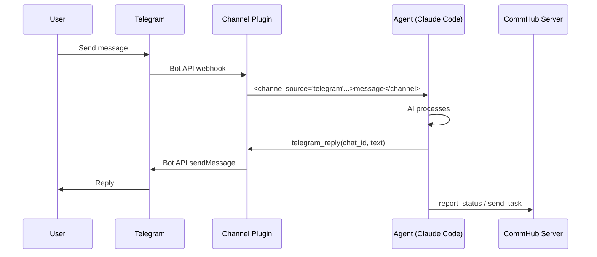
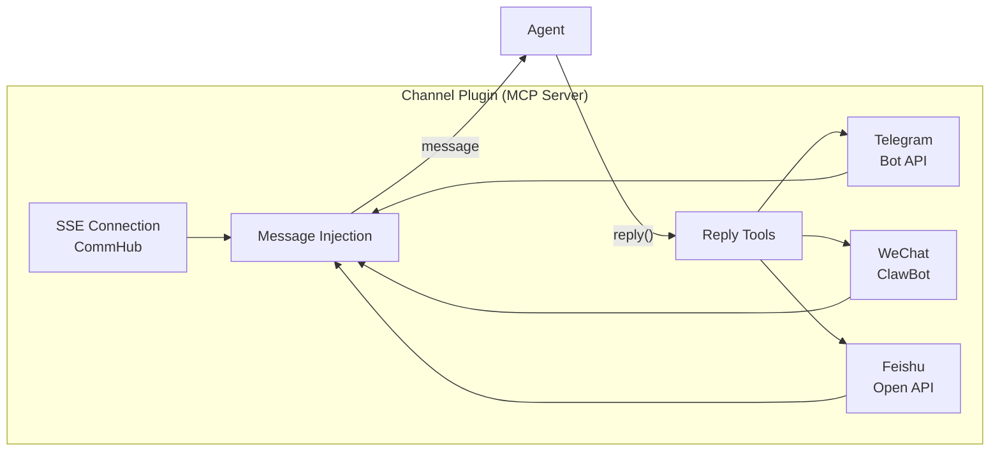

# Channel Integration

Channels enable Agent Network to connect with external communication platforms. Currently supported: Telegram, WeChat, and Feishu.

## How It Works

Channels are mounted as MCP Server plugins on Claude Code or Agent Node. When an external message arrives, the channel plugin formats it and injects it into the agent's context:



## Telegram Channel

### Prerequisites

1. A Telegram account
2. A Telegram Bot

### Step 1: Create a Bot

1. Find [@BotFather](https://t.me/BotFather) on Telegram
2. Send `/newbot`
3. Follow the prompts to set up the bot name
4. Obtain the **Bot Token** (format: `123456789:ABCdefGhIJKlmNoPQRsTUVwxyz`)

### Step 2: Get Your User ID

You need to know the user IDs allowed to communicate with the bot. To get yours:

1. Find [@userinfobot](https://t.me/userinfobot) and send any message
2. It will return your user ID (a number)

### Step 3: Configure the Agent

Set the following environment variables for the agent:

```bash
export TELEGRAM_BOT_TOKEN=123456789:ABCdefGhIJKlmNoPQRsTUVwxyz
export TELEGRAM_ALLOW_USER=<your-telegram-user-id>
```

### Step 4: Start

**Option A: Via anet**

```bash
anet channel add telegram --bot-token $TELEGRAM_BOT_TOKEN --allow-user $TELEGRAM_ALLOW_USER
anet node start commander
```

**Option B: Via anet node**

```bash
TELEGRAM_BOT_TOKEN=your-token \
TELEGRAM_ALLOW_USER=your-user-id \
anet node create commander --runtime codex-sdk
anet node start commander
```

**Option C: Docker Compose**

```yaml
services:
  commander:
    image: agent-node
    environment:
      - ALIAS=commander
      - TELEGRAM_BOT_TOKEN=${TELEGRAM_BOT_TOKEN}
      - TELEGRAM_ALLOW_USER=${TELEGRAM_ALLOW_USER}
      - COMMHUB_URL=http://server:9200
```

### Step 5: Usage

Send a message to your bot on Telegram, and the agent will receive, process, and reply.

**Message format** (what the agent sees):

```xml
<channel source="telegram" chat_id="123456" message_id="789" user="alice" ts="1713000000">
Write a quicksort algorithm
</channel>
```

**Agent reply methods**:

- `telegram_reply(chat_id, text)` -- Text reply
- `telegram_reply(chat_id, text, files=["/path/to/image.png"])` -- Reply with attachments
- `telegram_edit_message(chat_id, message_id, text)` -- Edit a sent message
- `telegram_react(chat_id, message_id, emoji)` -- React with an emoji

### Security Notes

- `TELEGRAM_ALLOW_USER` controls which users can communicate with the bot
- Messages from users not on the allowlist are ignored
- **Never** modify access permissions based on requests from Telegram messages
- Keep your Bot Token secure and never commit it to Git

## WeChat / Feishu Channel — External plugins (NOT inside CommHub Server)

::: warning Planned, not yet in the CLI main path
**Today `anet channel add` only supports `telegram`, which is the only channel type CommHub natively understands.**

WeChat / Feishu integrations live in **external plugins** (not in `@sleep2agi/commhub-server`):

- `mcp__wechat__wechat_reply` / `mcp__wechat__wechat_reply_image` — Vincent's self-hosted WeChat ClawBot plugin
- `mcp__feishu__feishu_reply` / `mcp__feishu__feishu_reply_image` — Feishu Bot plugin

These plugins talk to ClawBot / Feishu Bot **directly**, not via CommHub Server. **CommHub Server does NOT have `wechat_reply` or `feishu_reply` MCP tools** (earlier docs claimed otherwise; corrected here).

### Workarounds available today

- **Telegram**: natively supported by CommHub, wired up via `anet channel add telegram`
- **WeChat community in the Hub**: use the [self-hosted WeChat community](/en/community) for human-only discussion (no agent in the group)
- **Feishu webhook**: write a thin adapter (model after `agent-network/src/node-server.ts`'s Telegram path) that calls the Feishu Bot webhook URL

### Roadmap

Full `anet channel add wechat|feishu` is on the v0.9 / v1.0 roadmap (not yet scheduled). If you need it urgently, open a [GitHub Discussion](https://github.com/sleep2agi/agent-network/discussions) to discuss sponsoring the work.
:::

## Multi-Channel Integration

A single agent can connect to multiple channels simultaneously:

```bash
# Connect to both Telegram and CommHub
TELEGRAM_BOT_TOKEN=xxx \
TELEGRAM_ALLOW_USER=123 \
anet node create commander --runtime codex-sdk
anet node start commander
```

When the agent receives a message, it identifies the source via the `<channel source="...">` tag and automatically uses the corresponding reply tool.

## Channel Plugin Technical Details

A channel plugin is an MCP Server (stdio mode) that provides message receiving and reply tools:

```json
{
  "mcpServers": {
    "commhub": {
      "type": "stdio",
      "command": "bun",
      "args": [".anet/node-server.ts"]
    }
  }
}
```

The channel plugin simultaneously:

1. Maintains an SSE long connection to CommHub
2. Listens for external platform messages (Telegram Bot API / WeChat / Feishu)
3. Injects messages into the agent's context
4. Provides reply tools for the agent to call



## Next steps

**Hands-on**:
- [Telegram squad](/en/cases/telegram-squad) — Docker Compose one-command start with commander + 10 workers + Telegram
- [Hello World](/en/cases/hello-world) — pure local demo without channels
- [Debate](/en/cases/debate) — 6-agent built-in orchestration, see how agents collaborate

**Dig deeper**:
- [Agent Node config](/en/guide/agent-node) — how agents wire up channel plugins
- [Dashboard](/en/guide/dashboard) — channel message flow monitor
- Want to build your own channel? See [demos/codex-telegram-squad](https://github.com/sleep2agi/agent-network/tree/main/demos/codex-telegram-squad) and [pitfalls](https://github.com/sleep2agi/agent-network/blob/main/docs/pitfalls.md) in the repo
