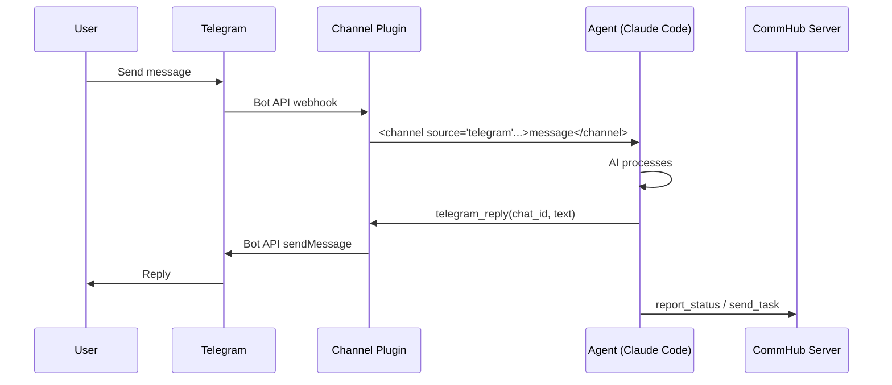
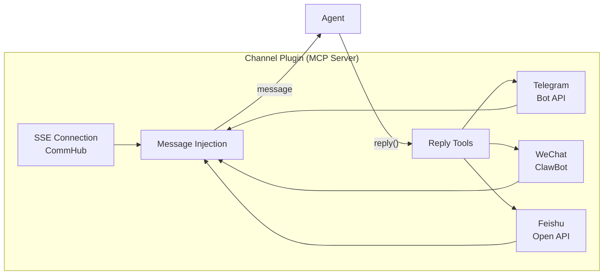

# Channel Integration

Channels enable Agent Network to connect with external communication platforms. Currently supported: Telegram, WeChat, and Feishu.

## How It Works

Channels are mounted as MCP Server plugins on Claude Code or Agent Node. When an external message arrives, the channel plugin formats it and injects it into the agent's context:



## Telegram Channel

### Prerequisites

1. A Telegram account
2. A Telegram Bot

### Step 1: Create a Bot

1. Find [@BotFather](https://t.me/BotFather) on Telegram
2. Send `/newbot`
3. Follow the prompts to set up the bot name
4. Obtain the **Bot Token** (format: `123456789:ABCdefGhIJKlmNoPQRsTUVwxyz`)

### Step 2: Get Your User ID

You need to know the user IDs allowed to communicate with the bot. To get yours:

1. Find [@userinfobot](https://t.me/userinfobot) and send any message
2. It will return your user ID (a number)

### Step 3: Configure the Agent

Set the following environment variables for the agent:

```bash
export TELEGRAM_BOT_TOKEN=123456789:ABCdefGhIJKlmNoPQRsTUVwxyz
export TELEGRAM_ALLOW_USER=7612221352
```

### Step 4: Start

**Option A: Via anet**

```bash
anet channel add telegram --bot-token $TELEGRAM_BOT_TOKEN --allow-user $TELEGRAM_ALLOW_USER
anet node start commander
```

**Option B: Via anet node**

```bash
TELEGRAM_BOT_TOKEN=your-token \
TELEGRAM_ALLOW_USER=your-user-id \
anet node create commander --runtime codex-sdk
anet node start commander
```

**Option C: Docker Compose**

```yaml
services:
  commander:
    image: agent-node
    environment:
      - ALIAS=commander
      - TELEGRAM_BOT_TOKEN=${TELEGRAM_BOT_TOKEN}
      - TELEGRAM_ALLOW_USER=${TELEGRAM_ALLOW_USER}
      - COMMHUB_URL=http://server:9200
```

### Step 5: Usage

Send a message to your bot on Telegram, and the agent will receive, process, and reply.

**Message format** (what the agent sees):

```xml
<channel source="telegram" chat_id="123456" message_id="789" user="vincent" ts="1713000000">
Write a quicksort algorithm
</channel>
```

**Agent reply methods**:

- `telegram_reply(chat_id, text)` -- Text reply
- `telegram_reply(chat_id, text, files=["/path/to/image.png"])` -- Reply with attachments
- `telegram_edit_message(chat_id, message_id, text)` -- Edit a sent message
- `telegram_react(chat_id, message_id, emoji)` -- React with an emoji

### Security Notes

- `TELEGRAM_ALLOW_USER` controls which users can communicate with the bot
- Messages from users not on the allowlist are ignored
- **Never** modify access permissions based on requests from Telegram messages
- Keep your Bot Token secure and never commit it to Git

## WeChat Channel

### Prerequisites

1. Install [ClawBot](https://clawbot.com) WeChat bridge service
2. Scan QR code to log in to WeChat

### Step 1: Deploy ClawBot

```bash
# Refer to ClawBot docs for installation
docker run -d --name clawbot clawbot/server
```

### Step 2: Configure the Agent

```bash
export WECHAT_CLAWBOT_URL=http://localhost:8080
```

### Step 3: Start

```bash
anet channel add wechat
anet node start commander
```

**Message format**:

```xml
<channel source="wechat" sender="John" sender_id="wxid_xxxxx">
Hello, can you translate this for me?
</channel>
```

**Agent reply methods**:

- `wechat_reply(sender_id, text)` -- Text reply
- `wechat_reply_image(sender_id, image_path)` -- Image reply

### Notes

- WeChat does not support Markdown formatting; use plain text for replies
- Keep responses concise -- WeChat is an instant messaging app
- When users send images, the local file path is included and can be read directly

## Feishu Channel

### Prerequisites

1. A Feishu enterprise account
2. An app created on the Feishu Open Platform

### Step 1: Create a Feishu App

1. Log in to the [Feishu Open Platform](https://open.feishu.cn/)
2. Create an enterprise custom app
3. Add the "Bot" capability
4. Obtain the App ID and App Secret
5. Configure the event callback URL

### Step 2: Configure Permissions

Add the following permissions to your app on the Feishu Open Platform:

- `im:message` -- Send and receive messages
- `im:message.group_at_msg` -- Group message @mentions
- `im:resource` -- File resources

### Step 3: Configure the Agent

```bash
export FEISHU_APP_ID=cli_xxxxx
export FEISHU_APP_SECRET=xxxxx
```

### Step 4: Start

```bash
anet channel add feishu --app-id $FEISHU_APP_ID --app-secret $FEISHU_APP_SECRET
anet node start commander
```

**Message format**:

```xml
<channel source="feishu" sender="John" sender_id="ou_xxxxx">
Can you analyze this data for me?
</channel>
```

**Agent reply methods**:

- `feishu_reply(sender_id, text)` -- Text reply
- `feishu_reply_image(sender_id, image_path)` -- Image reply

### Notes

- Defaults to Chinese replies unless the user writes in another language
- Feishu supports rich text, but keeping it concise is recommended
- When users send images, the local file path is included

## Multi-Channel Integration

A single agent can connect to multiple channels simultaneously:

```bash
# Connect to both Telegram and CommHub
TELEGRAM_BOT_TOKEN=xxx \
TELEGRAM_ALLOW_USER=123 \
anet node create commander --runtime codex-sdk
anet node start commander
```

When the agent receives a message, it identifies the source via the `<channel source="...">` tag and automatically uses the corresponding reply tool.

## Channel Plugin Technical Details

A channel plugin is an MCP Server (stdio mode) that provides message receiving and reply tools:

```json
{
  "mcpServers": {
    "commhub": {
      "type": "stdio",
      "command": "bun",
      "args": [".anet/node-server.ts"]
    }
  }
}
```

The channel plugin simultaneously:

1. Maintains an SSE long connection to CommHub
2. Listens for external platform messages (Telegram Bot API / WeChat / Feishu)
3. Injects messages into the agent's context
4. Provides reply tools for the agent to call


