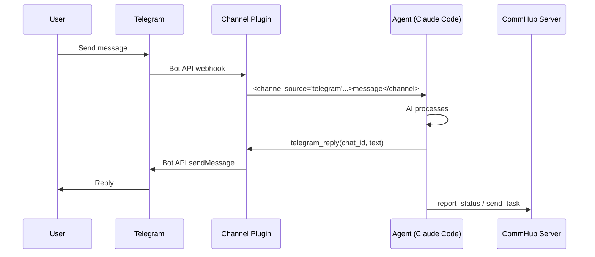
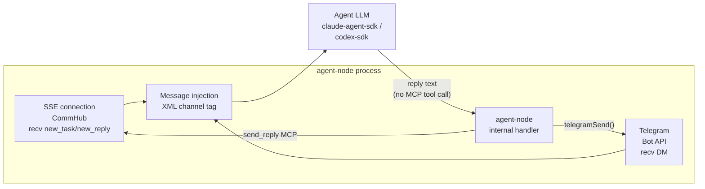

# Channel Integration

Channels enable Agent Network to connect with external communication platforms. Currently supported: Telegram, WeChat, and Feishu.

## How It Works

Channels are mounted as MCP Server plugins on Claude Code or Agent Node. When an external message arrives, the channel plugin formats it and injects it into the agent's context:



## Telegram Channel

### Prerequisites

1. A Telegram account
2. A Telegram Bot

### Step 1: Create a Bot

1. Find [@BotFather](https://t.me/BotFather) on Telegram
2. Send `/newbot`
3. Follow the prompts to set up the bot name
4. Obtain the **Bot Token** (format: `123456789:ABCdefGhIJKlmNoPQRsTUVwxyz`)

### Step 2: Get Your User ID

You need to know the user IDs allowed to communicate with the bot. To get yours:

1. Find [@userinfobot](https://t.me/userinfobot) and send any message
2. It will return your user ID (a number)

### Step 3: Bind the channel to an existing node

Run `anet channel add telegram <node-name>` once to bind the bot + allowlist (verify [`cli.ts:2683 channelCommand`](https://github.com/sleep2agi/agent-network/blob/main/agent-network/bin/cli.ts#L2683)):

```bash
# Assumes you already have a claude-code-cli node 'commander'
# (if not: anet node create commander --runtime claude-code-cli)
anet channel add telegram commander \
  --bot-token 123456789:ABCdefGhIJKlmNoPQRsTUVwxyz \
  --allow 123456789

# Interactive (omit flags and the CLI prompts for them)
anet channel add telegram commander
```

::: warning The flag is `--allow`, not `--allow-user`
Verify [`cli.ts:2700-2701`](https://github.com/sleep2agi/agent-network/blob/main/agent-network/bin/cli.ts#L2700): `--bot-token <token>` + `--allow <user-id>`. The command writes `.anet/nodes/<node-name>/channels/telegram/access.json` with `allowFrom: ["<user-id>"]` (multi-user allowlist: see [Telegram bind walkthrough — Multi-user allowlist](/en/cases/telegram-bind-claude-code-cli#b-multi-user-allowlist)). **There is no `TELEGRAM_ALLOW_USER` env var** — agent-node only reads `TELEGRAM_BOT_TOKEN` ([`agent-node/src/cli.ts:244`](https://github.com/sleep2agi/agent-network/blob/main/agent-node/src/cli.ts#L244)); the allowlist lives in `access.json`.
:::

### Step 4: Start

```bash
anet node start commander
```

Once running, agent-node auto-loads the `channels/telegram/` config + `access.json` allowlist. For a full step-by-step with expected output and troubleshooting, see the [Telegram bind walkthrough](/en/cases/telegram-bind-claude-code-cli).

### Step 5: Usage

Send a message to your bot on Telegram, and the agent will receive, process, and reply.

**Message format** (what the agent sees):

```xml
<channel source="telegram" chat_id="123456" message_id="789" user="alice" ts="1713000000">
Write a quicksort algorithm
</channel>
```

**Agent reply methods**:

The agent does not call any `telegram_*` MCP tool — **no such tool exists**. The agent-node telegram handler automatically forwards the LLM's output back to the Telegram chat:

1. Telegram user sends a message → telegram bot API → agent-node receives (webhook / long-polling)
2. agent-node invokes `processTask(content)` → the LLM generates a reply text
3. agent-node's internal [`telegramSend(tg, chatId, text)`](https://github.com/sleep2agi/agent-network/blob/main/agent-node/src/cli.ts#L948) helper sends the reply back via `sendMessage` (auto-splits at 4096 chars and sets `reply_to_message_id` on the first chunk)

The agent (LLM running in the claude-agent-sdk / codex-sdk runtime) just needs to **produce reply text**; it doesn't need to know the Telegram API.

::: warning R258 calibration: fictional `telegram_*` tool list removed
Older docs listed `telegram_reply` / `telegram_edit_message` / `telegram_react` as MCP tools — **a full source grep returns 0 hits** (no `telegram_*` `server.tool` registrations in cli.ts / commhub-channel.ts / node-server.ts). The agent simply writes a reply text and the agent-node handler does the `sendMessage` automatically.
:::

### Security Notes

- The `allowFrom` array in `.anet/nodes/<node>/channels/telegram/access.json` controls which Telegram user IDs can DM the bot (written by `anet channel add telegram --allow <uid>`; multi-user via direct edit — see [walkthrough §B](/en/cases/telegram-bind-claude-code-cli#b-multi-user-allowlist))
- Messages from users not on the allowlist are ignored
- **Never** modify access permissions based on requests from Telegram messages
- Keep your Bot Token secure and never commit it to Git

## WeChat / Feishu Channel — External plugins (NOT inside CommHub Server)

::: warning Planned, not yet in the CLI main path
**Today `anet channel add` only supports `telegram`, which is the only channel type CommHub natively understands.**

WeChat / Feishu integrations live in **external plugins** (not in `@sleep2agi/commhub-server`):

- `mcp__wechat__wechat_reply` / `mcp__wechat__wechat_reply_image` — maintainer's self-hosted WeChat ClawBot plugin
- `mcp__feishu__feishu_reply` / `mcp__feishu__feishu_reply_image` — Feishu Bot plugin

These plugins talk to ClawBot / Feishu Bot **directly**, not via CommHub Server. **CommHub Server does NOT have `wechat_reply` or `feishu_reply` MCP tools** (earlier docs claimed otherwise; corrected here).

### Workarounds available today

- **Telegram**: natively supported by CommHub, wired up via `anet channel add telegram`
- **WeChat community in the Hub**: use the [self-hosted WeChat community](/en/community) for human-only discussion (no agent in the group)
- **Feishu webhook**: write a thin adapter (model after `agent-network/src/node-server.ts`'s Telegram path) that calls the Feishu Bot webhook URL

### Roadmap

Full `anet channel add wechat|feishu` is on the v0.9 / v1.0 roadmap (not yet scheduled). If you need it urgently, open a [GitHub Discussion](https://github.com/sleep2agi/agent-network/discussions) to discuss sponsoring the work.
:::

## Multi-Channel Integration

A single agent can connect to multiple channels simultaneously: CommHub is wired up automatically by `anet node create`; Telegram is layered on top with `anet channel add telegram <node>` (which writes a `channels/telegram/` subdirectory + `access.json`).

```bash
# Step 1: create the agent (CommHub channel is wired up by default)
anet node create commander --runtime claude-code-cli

# Step 2: add the Telegram channel (writes channels/telegram/access.json)
anet channel add telegram commander --bot-token <tok> --allow <user-id>

# Step 3: start the agent (runs the CommHub SSE listener + Telegram polling in one process)
anet node start commander
```

When the agent receives a message, it identifies the source via the `<channel source="...">` tag (`commhub` / `telegram` / etc.). **The agent just produces a reply text** — the agent-node's internal handler routes it to the right platform based on `source` (telegram replies go through `telegramSend(tg, chatId, text)`, commhub replies go through SSE `send_reply`). The agent doesn't need to know Telegram API details or the commhub MCP `send_reply` call (aligned with the R258 chain).

## Channel Plugin Technical Details

A channel plugin is an MCP Server (stdio mode) that provides message receiving and reply tools:

```json
{
  "mcpServers": {
    "commhub": {
      "type": "stdio",
      "command": "bun",
      "args": [".anet/node-server.js"]
    }
  }
}
```

::: tip The filename is `.js`, not `.ts`
The file installed in your project is `.anet/node-server.js` ([`cli.ts:1492 ensureMcpJson`](https://github.com/sleep2agi/agent-network/blob/main/agent-network/bin/cli.ts#L1492) copies from the npm package — preferring `dist/src/node-server.js`, falling back to `src/node-server.ts` — but the on-disk filename is always `.js`). Aligned with R216/R221 chain.
:::

What the channel plugin actually does (v0.8 capabilities):

1. Maintains an SSE long connection to CommHub (receives new_task / new_message / new_reply / broadcast events)
2. Listens to the Telegram Bot API (webhook / long-polling) — Telegram is the only natively supported external channel in v0.8
3. Injects messages into the agent's context (XML `<channel source="...">` tag)
4. **The agent-node's internal handler automatically forwards** the agent's reply to the right platform (commhub via the `send_reply` MCP tool; telegram via the [`telegramSend`](https://github.com/sleep2agi/agent-network/blob/main/agent-node/src/cli.ts#L948) helper)

::: warning R258 chain calibration
The original mermaid showed `AGENT → reply() → TOOLS → TG/WX/FS` — but there's no agent-facing `reply()` / `telegram_reply()` MCP tool for the agent to call. The agent only produces reply text; agent-node's handler routes it to the platform based on `source`.
:::



## Next steps

**Hands-on**:
- [Telegram squad](/en/cases/telegram-squad) — Docker Compose one-command start with commander + 10 workers + Telegram
- [Hello World](/en/cases/hello-world) — pure local demo without channels
- [Debate](/en/cases/debate) — 6-agent built-in orchestration, see how agents collaborate

**Dig deeper**:
- [Agent Node config](/en/guide/agent-node) — how agents wire up channel plugins
- [Dashboard](/en/guide/dashboard) — channel message flow monitor
- Want to build your own channel? See [demos/codex-telegram-squad](https://github.com/sleep2agi/agent-network/tree/main/demos/codex-telegram-squad) and [pitfalls](https://github.com/sleep2agi/agent-network/blob/main/docs/pitfalls.md) in the repo
