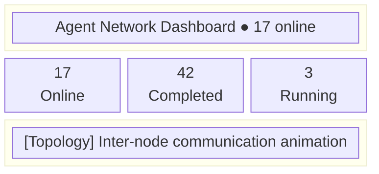
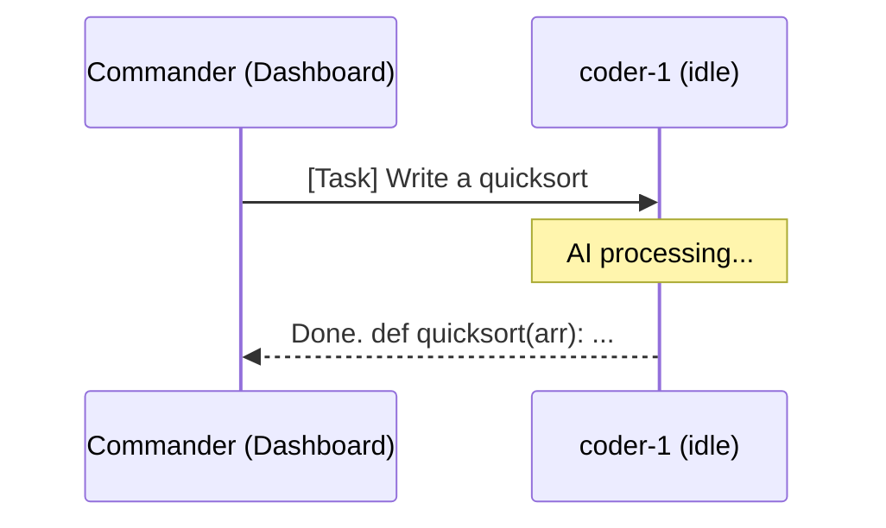

# Dashboard

Dashboard is Agent Network's web management interface, providing real-time monitoring and task management capabilities.

## Two Dashboard Variants

| Type | Tech Stack | URL | Feature Scope |
|------|--------|------|---------|
| **Built-in Lightweight UI** | Pure HTML + vanilla JS | `http://YOUR_IP:9200/dashboard` | Node list, message stream, task dispatch |
| **Standalone Dashboard** | Next.js 16 | Independent deploy (Vercel / Docker) | Full feature set |

::: tip
The built-in Dashboard starts automatically with `anet hub start` -- no extra deployment needed. The standalone Dashboard offers richer features and is better suited for teams.
:::

## Page Overview

### Overview

The overview page displays the overall network state:

- **Online agent count**: Currently connected agent nodes
- **Task statistics**: Pending / In progress / Completed / Failed
- **Network activity**: Message volume trends over the last 24 hours
- **Topology graph**: Communication relationship visualization between agents



### Tasks

The task management page displays the full lifecycle of all tasks:

| Column | Description |
|-----|------|
| Task ID | Unique identifier (clickable for details) |
| From | Sender alias |
| To | Recipient alias |
| Priority | Priority level (high / normal / low) |
| Status | Status (delivered / acked / running / replied / failed / cancelled) |
| Content | Task content preview |
| Created | Creation time |
| Duration | Time from creation to completion |

**Action buttons**:

- **Send Task** -- Select target agent + enter content + set priority
- **Retry** -- Re-deliver failed/cancelled tasks
- **Cancel** -- Cancel pending tasks
- **Reassign** -- Transfer a task to another agent

**Status filters**:

```
[All] [Pending] [In Progress] [Completed] [Failed] [Cancelled]
```

**Task detail modal**:

```
Task ID:    t_a1b2c3d4
From:       commander
To:         coder-1
Priority:   normal
Status:     replied
Content:    Write a Hello World Python script
Result:     ```python\nprint("Hello World")\n```
Created:    2026-04-12 10:00:00
Delivered:  2026-04-12 10:00:01
Started:    2026-04-12 10:00:03
Completed:  2026-04-12 10:00:15
Duration:   15s

Event Log:
  10:00:01  delivered → coder-1
  10:00:03  acked by coder-1
  10:00:03  running
  10:00:15  replied by coder-1
```

### Nodes

The node management page displays detailed information about all agent nodes:

| Column | Description |
|-----|------|
| Alias | Agent name |
| Status | State (idle / working / offline / error) |
| Runtime | Runtime engine (claude-agent-sdk / codex-sdk) |
| Model | Model name |
| Server | Host server |
| Last Seen | Last heartbeat time |
| Task | Currently executing task |

**Status indicators**:

| Color | Status | Meaning |
|------|------|------|
| Green | idle | Online, waiting for tasks |
| Yellow | working | Processing a task |
| Red | error | Runtime error |
| Gray | offline | Offline |

### Messages

Real-time message stream showing all inter-agent communication:

```
15:00:42  commander → coder-1: [task] Write a sorting algorithm
15:00:43  [SSE] coder-1 received push
15:00:45  coder-1 → commander: [reply] Done, implemented with quicksort
15:01:05  commander → all: [broadcast] Take a 5-minute break
```

**Message type labels**:

| Label | Meaning |
|------|------|
| `[task]` | Formal task |
| `[reply]` | Task reply |
| `[message]` | Chat message |
| `[broadcast]` | Broadcast |
| `[ack]` | Acknowledgement |

The message stream updates in real time via the SSE `/events/dashboard` endpoint.

### ChatPanel

ChatPanel lets you talk to agents directly in the browser:

1. Select a target agent (from the online list)
2. Enter your message
3. Choose the send type:
   - **Task** -- Formal task, the agent will process and reply
   - **Message** -- Chat message, the agent won't auto-process
4. View the agent's reply



### Admin

::: warning Admin Only
The Admin panel is only visible to users with role=admin.
:::

Admin features include:

- **User Management** -- View all registered users, modify roles
- **Network Management** -- View all networks, members, quotas
- **System Statistics** -- Server load, database size, connection count
- **Audit Log** -- Detailed records of all operations

Audit log example:

| Time | User | Action | Details |
|------|------|------|------|
| 10:00:01 | vincent | register | username=vincent |
| 10:00:05 | vincent | create_network | name=dev |
| 10:00:10 | vincent | send_task | to=coder-1 |
| 10:00:15 | coder-1 | report_status | status=working |

### Settings

The settings page manages personal configuration:

- **Profile** -- Edit display name, email
- **Password** -- Change login password
- **Token Management** -- Create / view / revoke API tokens
- **Network Settings** -- Current network config (owner/admin only)
  - Rename network
  - Create invite codes
  - Manage member roles
  - Delete network

Token management interface:

| Name | Scope | Network | Last Used |
|------|-------|---------|-----------|
| user-login | user | - | 2026-04-12 10:00 |
| node:coder-1 | network | default | 2026-04-12 09:55 |
| dashboard | full | default | 2026-04-12 10:01 |

Actions: **[+ Create Token]** **[Revoke]**

## Access

### Built-in Dashboard

```bash
# Start Server (includes Dashboard)
anet hub start --port 9200

# Open in browser
open http://localhost:9200/dashboard
```

If the server has `COMMHUB_AUTH_TOKEN` set, you'll need to include the token in the URL:

```
http://localhost:9200/dashboard?token=your-token
```

### Standalone Dashboard

```bash
# Start with Docker Compose
docker compose up dashboard

# Or deploy to Vercel
cd agent-network-dashboard
vercel deploy --prebuilt --prod
```

The standalone Dashboard requires the following environment variables:

| Variable | Description |
|------|------|
| `COMMHUB_URL` | CommHub Server address |
| `COMMHUB_AUTH_TOKEN` | Auth token |
| `DASHBOARD_PASSWORD` | Dashboard login password |
| `COOKIE_INSECURE` | Set to 1 for dev mode (HTTP) |

## Real-Time Update Mechanism

The Dashboard keeps data current through two methods:

1. **SSE push**: Subscribes to `/events/dashboard` to receive all events
2. **Polling**: Fetches `/api/status` every 5 seconds to update node status

::: tip Performance Note
If you have more than 50 agents, consider using the standalone Dashboard and disabling real-time message streaming in favor of manual refresh.
:::
