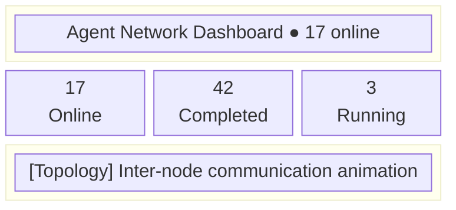
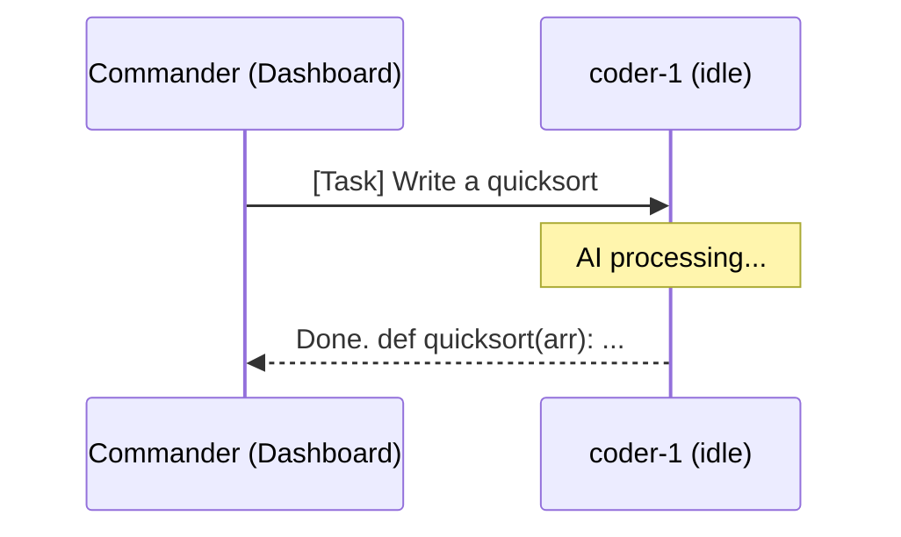

# Dashboard

Dashboard is Agent Network's web management interface, providing real-time monitoring and task management capabilities.

## Current Dashboard

| Start Mode | Tech Stack | Default URL | Notes |
|------|--------|------|------|
| `anet hub dashboard` | Next.js 16 | `http://localhost:3000` | CLI starts `@sleep2agi/agent-network-dashboard@${tag}` via npx; `tag` comes from [`dashboardReleaseTag()` (cli.ts)](https://github.com/sleep2agi/agent-network/blob/main/agent-network/bin/cli.ts): defaults to `@preview`, overridable via the `ANET_DASHBOARD_VERSION` env var (no hardcoded version pin — see [Preview channel](#preview-channel-next-stable-wip) below). Thin cookie-proxy mode (no service token) |
| Standalone deploy | Next.js 16 | Custom | Configure it with the CommHub URL |

::: tip
`anet hub start` starts only CommHub Server. Start the Web UI in another terminal with `anet hub dashboard`.
:::

::: info v0.10.0 / dashboard `0.5.0` new — Hero 3 network/node front-end 8/8 surfaces ✅
Shipped with [v0.10.0 release Phase 2](/en/changelog#v0-10-0-—-direct-runtime-observability-foundations-2026-05-16-✅-stable-phase-1-3-package-promote): all 8 surfaces complete (§3.A prefix-group fix / §3.B sweep retire / §3.C recent-panel hide / §3.D grid default view / §3.E hover detail card / §3.F server-health ring tint wired to [#99](https://github.com/sleep2agi/agent-network/issues/99) endpoint / §3.G fullscreen mode / §3.I canvas brand mark; §3.H dropped per RFC Q2 review) plus 19+ rounds of typography + corner-radius cascade polish. The server-health ring tint reads from [`GET /api/server/:host/health`](/en/api/rest#get-api-server-host-health); the agent hover card renders per-agent `process_telemetry` (`rss` / `cpu_pct` / `uptime_seconds` / `in_flight_count`, [#142](https://github.com/sleep2agi/agent-network/issues/142) shipped in `agent-node@2.4.0` + server schema aligned in `commhub-server@0.8.2`).

**§3.E / §3.F data sources require** `agent-network ≥ 2.2.1` on the default `anet hub start` path ([v0.10.1 hotfix](/en/changelog#v0-10-1-—-hotfix-pinned-server-version-chain-bump-after-the-v0-10-0-ship-2026-05-17-✅-stable) bumped `PINNED_SERVER_VERSION` from 0.8.0 to 0.8.2). Older versions still launch `commhub-server@0.8.0`, where the #99 endpoint does not exist — the ring-tint data source fails and the hover card's `process_telemetry` is all `null`.

::: info v0.10.2 Hero D — dashboard `0.5.1` topology prefix label Option C + disk render
Shipped alongside the [v0.10.2 release](/en/changelog):
- **Hero D topology node prefix labels — Option C implementation** ([#147](https://github.com/sleep2agi/agent-network/issues/147) acked 5/16 + Option C design pass) — node → group edge label distinguishability finally lands
- **Disk telemetry hover-card rendering** (`disk_total_gb` / `disk_used_gb` / `disk_avail_gb` wired to the [`GET /api/server/:host/health`](/en/api/rest#get-api-server-host-health) response; source is agent-node `≥ 2.4.1` host-telemetry's `df -k` sampling; older agents and Windows render `—` rather than a misleading `0`)
- **100+ rounds of typography + corner-radius cascade polish**
:::

::: info v0.10.8 dashboard `0.5.3` — Servers panel UI copy fix + TopoGraph density tier
Shipped alongside the [v0.10.8 release](/en/changelog) ([#157](https://github.com/sleep2agi/agent-network/issues/157) Fix #1, caught by Vincent):

- **Servers panel "not reported" copy made accurate**: the early placeholder strings `agent rollup pending hub ≥ 0.8.2-preview` / `disk metric pending hub ≥ 0.8.2-preview` were buried during the 0.8.2 upgrade window. After every hub already became ≥ 0.8.2, they still rendered (**misleading users into thinking their hub version was too old**). Now `agent rollup not reported by hub` / `disk metric not reported by hub` — accurately conveying "this hub didn't report it right now".
- **`data-server-{agents,disk}-missing="true"` Playwright hooks**: new since dashboard 0.5.3, available for e2e validation of hub-side telemetry coverage.
- **TopoGraph density-tier polish** (purely additive, no UX change): the canvas state attribute `data-topo-fleet-density-tier` ∈ `{empty, sparse, normal, dense, very-dense}` exposes a 12th observable testing surface. Tier boundaries (sparse 1-3 / normal 4-15 / dense 16-30 / very-dense 31+) line up with the dense-layout collapse gate.

::: warning Root causes #2 + #3 located, deferred
- **#2** (v0.10.9 candidate): missing dedupe when one hostname appears multiple times can double-count servers
- **#3** (v0.11.0 candidate): `status=offline` vs telemetry mismatch (telemetry still reports but the SSE `last_seen` has timed out) — needs system-level status reconciliation
:::
:::
:::

## Page Overview

### Overview

The overview page displays the overall network state:

- **Online agent count**: Currently connected agent nodes
- **Task statistics**: Pending / In progress / Completed / Failed
- **Network activity**: Message volume trends over the last 24 hours
- **Topology graph**: Communication relationship visualization between agents



### Tasks

The task management page displays the full lifecycle of all tasks:

| Column | Description |
|-----|------|
| Task ID | Unique identifier (clickable for details) |
| From | Sender alias |
| To | Recipient alias |
| Priority | Priority level (high / normal / low) |
| Status | Status (`created` / `delivered` / `acked` / `running` / `replied` / `failed` / `cancelled` / `expired` — **8 states total**; verified at [`server/src/db.ts:94`](https://github.com/sleep2agi/agent-network/blob/main/server/src/db.ts#L94) `status TEXT NOT NULL DEFAULT 'created'`; `cancel_task` covers 4 cancellable states including `created`; full state machine: [Task lifecycle](/en/concepts/task-lifecycle)) |
| Content | Task content preview |
| Created | Creation time |
| Duration | Time from creation to completion |

**Action buttons**:

- **Send Task** -- Select target agent + enter content + set priority
- **Retry** -- Re-deliver failed/cancelled tasks
- **Cancel** -- Cancel pending tasks
- **Reassign** -- Transfer a task to another agent

**Status filters**:

```
[All] [Pending] [In Progress] [Completed] [Failed] [Cancelled] [Expired]
```

**Task detail modal**:

```
Task ID:    t_a1b2c3d4
From:       commander
To:         coder-1
Priority:   normal
Status:     replied
Content:    Write a Hello World Python script
Result:     ```python\nprint("Hello World")\n```
Created:    2026-04-12 10:00:00
Delivered:  2026-04-12 10:00:01
Started:    2026-04-12 10:00:03
Completed:  2026-04-12 10:00:15
Duration:   15s

Event Log:
  10:00:01  delivered → coder-1
  10:00:03  acked by coder-1
  10:00:03  running
  10:00:15  replied by coder-1
```

### Nodes

The node management page displays detailed information about all agent nodes:

| Column | Description |
|-----|------|
| Alias | Agent name |
| Status | State (idle / working / offline / error) |
| Runtime | Runtime engine (claude-agent-sdk / codex-sdk / claude-code-cli) |
| Model | Model name |
| Server | Host server |
| Last Seen | Last heartbeat time |
| Task | Currently executing task |

**Status indicators**:

| Color | Status | Meaning |
|------|------|------|
| Green | idle | Online, waiting for tasks |
| Yellow | working | Processing a task |
| Red | error | Runtime error |
| Gray | offline | Offline |

### Messages

Real-time message stream showing all inter-agent communication:

```
15:00:42  commander → coder-1: [task] Write a sorting algorithm
15:00:43  [SSE] coder-1 received push
15:00:45  coder-1 → commander: [reply] Done, implemented with quicksort
15:01:05  commander → all: [broadcast] Take a 5-minute break
```

**Message type labels**:

| Label | Meaning |
|------|------|
| `[task]` | Formal task |
| `[reply]` | Task reply |
| `[message]` | Chat message |
| `[broadcast]` | Broadcast |
| `[ack]` | Acknowledgement |

Message data comes from CommHub REST APIs. Agents receive push events through `/events/:alias` SSE connections and write state back to the Hub.

### ChatPanel

ChatPanel lets you talk to agents directly in the browser:

1. Select a target agent (from the online list)
2. Enter your message
3. Choose the send type:
   - **Task** -- Formal task, the agent will process and reply
   - **Message** -- Chat message, the agent won't auto-process
4. View the agent's reply



### Admin

::: warning Only **system-level** admins
The Admin panel is visible to users with `users.role='admin'` — that's a **system-level** role (granted automatically to the first registered user), **not** a `network_members.role='admin'` (per-network role). A network-level admin can only see their own `/api/audit-log` rows like any other role; reading all rows requires the system-level admin.
:::

Admin features include:

- **User Management** -- View all registered users (`/api/users` — system-level admin only); role changes currently go through REST `PUT /api/networks/:id/members/:user_id` (owner only — see [API — PUT members](/en/api/rest#put-api-networks-id-members-user-id)). CLI has no `promote` / `demote` sub-command yet (queued for v0.9+).
- **Network Management** -- View all networks, members (plan-quota is **partially enforced** in v0.8: `createNetwork` still enforces `max_networks_owned`; other quota items are dormant — see [networks — quota limits](/en/concepts/networks#quota-limits))
- **System Statistics** -- Server load, database size, connection count
- **Audit Log** -- Detailed records of all operations (`/api/audit-log` endpoint + Dashboard Audit Log page; system-level admin sees everything, other roles only see their own rows)

Audit log example (actual **19** actions):

| Time | User | Action | Details |
|------|------|------|------|
| 10:00:01 | alice | `register` | username=alice |
| 10:00:05 | alice | `password_changed` | (via `anet passwd`) |
| 10:00:10 | alice | `network_renamed` | dev → development |
| 10:00:15 | alice | `member_added` | u_bob_xxx as member |

The older example listed `create_network` as an audit action — **it does not exist**. [`security.md` audit log](/en/concepts/security#audit-logging) already documents this: [`POST /api/networks` (index.ts:635-647)](https://github.com/sleep2agi/agent-network/blob/main/server/src/index.ts#L635) does **not** call `logAudit`, so the `audit_log` table never contains `create_network` or `network_created` rows. The actual **19** actions are (RFC-010 node-rename added 3 `node_rename_*` actions; 18 go through the [`logAudit()` helper](https://github.com/sleep2agi/agent-network/blob/main/server/src/db.ts#L447) + 1 (`password_reset_by_admin`) goes via direct INSERT at [`auth.ts:294`](https://github.com/sleep2agi/agent-network/blob/main/server/src/auth.ts#L294)): `register / login / login_failed / login_rate_limited / password_changed / password_reset_by_admin / network_renamed / network_deleted / network_joined / member_added / member_role_changed / member_removed / token_created / token_revoked / node_token_created / node_rename_prepared / node_rename_committed / node_rename_aborted / invite_created`.

### Settings

The settings page manages personal configuration:

- **Profile** -- Edit display name, email
- **Password** -- Change login password (current stable Dashboard `0.5.6` UI not yet shipped; use CLI `anet passwd` — see [account-system / Change Password](/en/guide/account-system#change-password))
- **Token Management** -- Create / view / revoke API tokens
- **Network Settings** -- Current network config (owner/admin only)
  - Rename network
  - Create invite codes
  - Manage member roles (current stable Dashboard `0.5.6` partial; CLI has `anet network invite` but **no** `promote` / `demote` sub-commands — role changes currently go through REST [`PUT /api/networks/:id/members/:user_id`](/en/api/rest#put-api-networks-id-members-user-id). CLI sub-commands queued for v0.11+ / unscheduled.)
  - Delete network

Token management interface:

| Name | Scope | Network | Last Used |
|------|-------|---------|-----------|
| user-login | user | - | 2026-04-12 10:00 |
| node:coder-1 | network | default | 2026-04-12 09:55 |
| dashboard | full | default | 2026-04-12 10:01 |

Actions: **[+ Create Token]** **[Revoke]**

## Access

### Local Dashboard

```bash
# Terminal 1: start Server
anet hub start --port 9200

# Terminal 2: start Dashboard
anet hub dashboard

# Open in browser
open http://localhost:3000
```

### Standalone Dashboard

```bash
# Start with Docker Compose
docker compose up dashboard

# Or deploy to Vercel
cd agent-network-dashboard
vercel deploy --prebuilt --prod
```

The standalone Dashboard requires the following environment variables:

| Variable | Description |
|------|------|
| `COMMHUB_URL` | CommHub Server address |
| `COMMHUB_AUTH_TOKEN` | Legacy global auth token; soft-deprecated in v0.8, removed in v1.0. v0.4.2 Dashboard runs as a thin cookie proxy and no longer needs it. |
| `COOKIE_INSECURE` | Set to 1 for dev mode (HTTP) |

## Real-Time Update Mechanism

The Dashboard keeps data current through three data surfaces:

1. **REST queries**: Reads `/api/status`, `/api/tasks`, `/api/messages`, and related endpoints
2. **Dashboard's own SSE**: The Dashboard subscribes to the `/events/<username>` user channel using the logged-in username, receiving server-pushed events directly (e.g. RFC-010's `node.renamed`, the #84 SSE channel fix — see [REST API SSE endpoint](/api/rest#sse-endpoint))
3. **Agent SSE**: Agents subscribe to `/events/<alias>` with their own node alias; when tasks arrive, agents update Hub state that the Dashboard reads

::: tip Performance Note
If you have more than 50 agents, consider using the standalone Dashboard and disabling real-time message streaming in favor of manual refresh.
:::

## Preview channel (next stable WIP)

`@sleep2agi/agent-network-dashboard@preview` carries the next-gen UI under active polish. Current preview pin auto-syncs with the CLI preview tag `@sleep2agi/agent-network@preview`; the actual version is whatever's on the [npm preview tag](https://www.npmjs.com/package/@sleep2agi/agent-network-dashboard?activeTab=versions) (frequent iteration, this doc doesn't pin a specific number).

New capabilities (vs the current stable — the stable dashboard also keeps iterating; if any item below has already landed in stable, the npm package page's dist-tags are authoritative):

- **Cmd / Ctrl + K command palette**: keyboard-driven navigation, search, command invocation
- **? keyboard shortcut overlay**: all hotkeys at a glance
- **Global health banner**: red / amber / green tri-color + CTA + dismiss
- **KPI card hover popover**: working / idle / offline breakdown
- **EmptyState — 7 variants**: tailored illustrations for post-login, empty network, zero tasks, etc.
- **Topology redo + 38+ rounds of polish** ([#112](https://github.com/sleep2agi/agent-network-dashboard/issues/112) + [#116](https://github.com/sleep2agi/agent-network-dashboard/issues/116)):
  - **Dual layouts**: grid (rows-by-group) + ring (orbiting the central hub); bottom-right `G` / `R` toggle
  - **Node interactions**: mount fade-in (nodes phase in on join) + hover ring focus (halo on hover) + click ripple + label scale on zoom (counter-scales so text stays readable)
  - **Edge tiers**: arrow tier (message frequency drives arrow thickness / opacity) + offline dim (edges to offline nodes fade)
  - **Grouping**: group-box hover (hovering a group title highlights every member) + dashed separators between groups
  - **Side controls**: minimap (bottom-left thumbnail with draggable viewport box) + cwd tooltip (hover a node to see its `project_dir`) + S/M/L size toggle
  - **Light mode**: 24px pulse on the central hub (fixes stable's "invisible on light mode" P0)
- **ServersDrawer** ([#119](https://github.com/sleep2agi/agent-network/issues/119)): a right-hand drawer that aggregates agents by physical machine (`hostname` + `ip`) with live CPU load / memory bars and an agent count. Backed by [`GET /api/servers`](/en/api/rest#get-api-servers) (10-min stale-mark side effect + bare JSON array response, [server/src/index.ts:845](https://github.com/sleep2agi/agent-network/blob/main/server/src/index.ts#L845)). Multiple agents on the same host collapse into one row; older agents without host telemetry are bucketed under an `unknown` host group.
- **Tasks status tabs**: color-coded dots + mobile horizontal scroll
- **Mobile audit fixes**: banner yields to hamburger / UserBar iconified
- **Sidebar "Quick search ⌘K" chip**: mobile launcher entry
- **LoadingSkeleton redo**: mirrors Overview layout + brand-pulse rhythm
- **P0 light-mode contrast sweep**: `text-{color}-300/400 → -700`

Try it:

```bash
# Upgrade CLI to preview
npm i -g @sleep2agi/agent-network@preview
anet -v                                    # should show 2.3.0-preview.N (current preview channel; latest stable is 2.2.x)
anet hub dashboard                          # npx auto-pulls the current preview version
```

Or bypass the CLI entirely:

```bash
npx -y @sleep2agi/agent-network-dashboard@preview --ip 0.0.0.0
```

::: warning Preview is not backward-compatible
The preview channel iterates continuously and is not auto-promoted to latest. Stick with stable (`@sleep2agi/agent-network@latest`) for production.
:::
