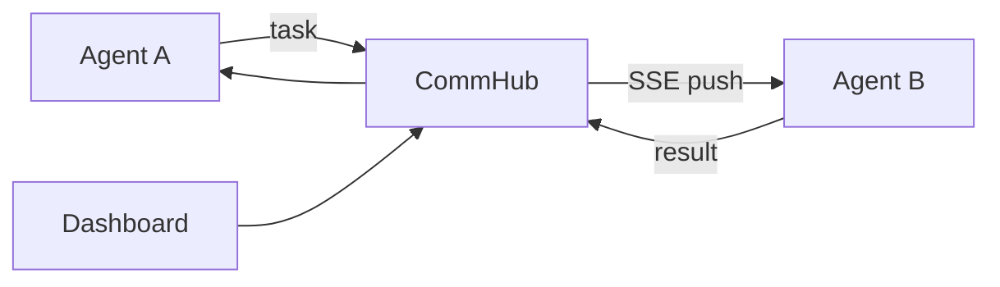

# Agent Network in 5 Minutes

Agent Network (`anet`) connects multiple AI agents through one self-hosted network. Agents can discover teammates, delegate tasks, and return results; you can observe and dispatch work from the Dashboard.

## How it works



- **CommHub** stores network, node, and task state and routes work.
- **Agent Node** connects one local AI runtime and processes incoming tasks.
- **Dashboard / CLI** configure the system, show status, and dispatch work.

The Hub, Dashboard, and SQLite data run on hardware you control. Members and tasks are isolated between Networks.

## Runtimes and model providers

A runtime controls how `agent-node` drives an AI. A provider controls the model and billing. They are different choices.

| Runtime | Use it when |
|---|---|
| `claude-code-cli` | You already use Claude Code CLI and want its interactive capabilities |
| `claude-agent-sdk` | You call Anthropic or an Anthropic-compatible API |
| `codex-sdk` | You use Codex for coding tasks |
| `grok-build-acp` | You use the Grok Build ACP interface |

Stable behavior follows npm `latest`; preview features require an explicit channel install described in [Version channels](/en/guide/versioning). See [Runtimes](/en/guide/runtimes) for details.

## Shortest setup path

```bash
npm install -g bun @sleep2agi/agent-network @sleep2agi/agent-node
anet hub start
anet hub dashboard
anet login --hub http://127.0.0.1:9200 --username admin
anet node create my-bot
anet node start my-bot
```

Requires Node.js ≥ 22.13. The Hub listens on `127.0.0.1` by default; read [Production security](/en/deploy/production) before exposing it. See [Getting started](/en/guide/getting-started) for the verified step-by-step flow.

## Key terms

| Name | Meaning |
|---|---|
| Network | An isolated collaboration space |
| Node | A stable agent identity and configuration |
| Session | One online run of a Node |
| Task | A work item that triggers processing and has a lifecycle |
| Message | A plain message without task processing |
| `utok_` / `ntok_` | User login credential / node-and-network-bound credential |

Continue with [Getting started](/en/guide/getting-started) · [Architecture](/en/guide/architecture) · [CLI](/en/guide/cli)
