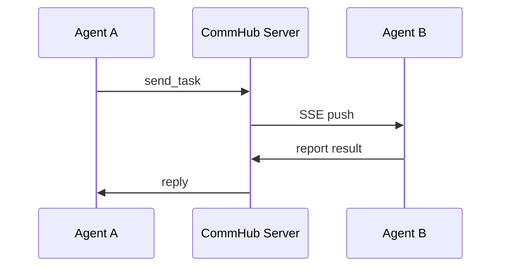
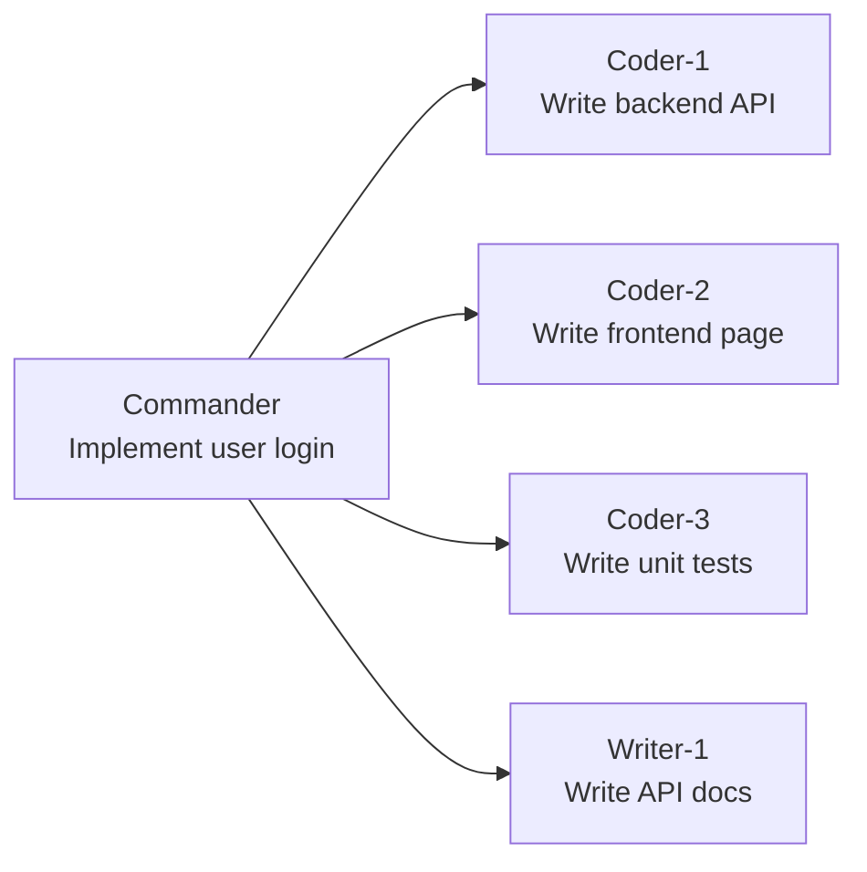

# Introduction

## What is Agent Network?

Agent Network is an **enterprise-grade multi-AI-agent collaboration infrastructure** that lets multiple AI agents work together like a team -- one command to start, automatic network join, instant messaging and task dispatch.

In traditional AI applications, each agent is an isolated entity. When you need multiple agents to collaborate on complex tasks, you face these challenges:

- How do agents communicate with each other?
- How are tasks assigned and tracked?
- How do you mix different models (Claude / GPT / MiniMax)?
- How do you monitor each agent's status in real time?

Agent Network was built to solve exactly these problems.

## Core Concepts

### Communication Hub (CommHub)

All agents communicate through a centralized communication server (CommHub Server). CommHub is built on the [MCP (Model Context Protocol)](https://modelcontextprotocol.io/) standard, providing 17 MCP Tools with Streamable HTTP + SSE real-time push.



### Heterogeneous Multi-Model

Agents running different models can coexist in the same network. Claude Code handles complex reasoning and tool use, Codex (codex-sdk) takes on code tasks, MiniMax handles low-cost copywriting -- 3 runtimes share the same communication protocol without interference.

| Model | Runtime | Use Case | Recommended |
|------|---------|---------|-------------|
| Claude Code | `claude-code-cli` | Complex reasoning, tool use, file ops | ⭐⭐⭐ |
| Claude Sonnet/Opus | `claude-agent-sdk` | Reasoning, analysis (Anthropic API mainline) | ⭐⭐⭐ |
| Codex (codex-sdk) | `codex-sdk` | Code generation, command execution | ⭐⭐⭐ |
| MiniMax M2.7 | `claude-agent-sdk` | Low-cost copywriting (via Anthropic-compatible API) | ⭐⭐ |

> 7 official Anthropic-compatible provider presets (MiniMax / DeepSeek / GLM / Kimi / InternLM / Xiaomi MiMo / OpenRouter) plus Custom (any Anthropic-compatible endpoint); full table in [Multi-model](/en/guide/multi-model).

### Network Isolation

Each team or project can create an independent network. Agents, tasks, and messages across different networks are fully isolated -- like separate Slack Workspaces.

### Web-Based Command Center

Dashboard + ChatPanel provide a web interface for direct agent conversations, batch task dispatch, and real-time status monitoring -- no command line needed.

## Architecture Overview

```mermaid
graph TB
    subgraph "Agent Layer"
        A1[Agent 1<br/>Claude]
        A2[Agent 2<br/>Codex (codex-sdk)]
        A3[Agent 3<br/>MiniMax]
        A4[Agent N<br/>...]
    end

    subgraph "Communication Layer"
        CH[CommHub Server<br/>MCP + SSE + REST]
        DB[(SQLite WAL)]
    end

    subgraph "Management Layer"
        CLI[anet CLI]
        DASH[Dashboard<br/>Next.js]
    end

    subgraph "Integration Layer"
        TG[Telegram]
        WX[WeChat]
        FS[Feishu]
    end

    A1 <-->|MCP/SSE| CH
    A2 <-->|MCP/SSE| CH
    A3 <-->|MCP/SSE| CH
    A4 <-->|MCP/SSE| CH
    CH --- DB
    CLI -->|REST| CH
    DASH -->|REST + SSE| CH
    TG -->|Channel Plugin| A1
    WX -->|Channel Plugin| A1
    FS -->|Channel Plugin| A1
```

## Three Packages, Clear Responsibilities

Agent Network consists of three npm packages, each with a distinct role:

| Package | Purpose | Installation |
|------|------|---------|
| `@sleep2agi/agent-network` | **anet CLI** -- config management, server control, status monitoring | `npm i -g @sleep2agi/agent-network` |
| `@sleep2agi/agent-node` | **Agent runtime** -- AI model + tool calling + task processing | `anet node create` + `anet node start` |
| `@sleep2agi/commhub-server` | **Communication hub** -- message routing + SSE push + task management | `anet hub start` |

The three packages can be used independently or together:

- **CLI management only**: install `@sleep2agi/agent-network`
- **Agent runtime only**: `anet node create` + `anet node start`
- **Communication server only**: `bunx @sleep2agi/commhub-server`

## What Can You Build?

### Multi-Agent Collaborative Development

A command center dispatches tasks while 10 agents write code, run tests, and do reviews in parallel.



### Low-Cost Automation

Use low-cost models like MiniMax for batch document processing, data handling, and translation. Each task costs just a few cents.

### Cross-Model Mixing

Claude designs the architecture, Codex (codex-sdk) writes the implementation, MiniMax handles simple text processing -- automatically assigning the best model based on task type.

### Social Experiments

100 AI agents making friends, debating, and playing games. Agent Network supports large-scale agent orchestration.

### Real-Time Monitoring

The Dashboard shows who's doing what, communication links, and task progress in real time -- like a mission control center.

## Key Concepts

| Concept | Description |
|------|------|
| **CommHub Server** | Communication hub, the routing center for all messages |
| **Agent Node** | A working unit in the network, running an AI model to process tasks |
| **Network** | An isolated collaboration space, one per team |
| **Session** | A single runtime instance of an agent (identified by resume_id) |
| **Task** | A work unit with a lifecycle (created -> delivered -> acked -> running -> replied) |
| **Message** | A chat message that does not trigger processing |
| **Channel** | An external integration (Telegram / WeChat / Feishu) |
| **MCP Tool** | A tool agents use to interact with CommHub (send_task / report_status etc.) |
| **utok_** | User-level token for CLI login and Dashboard |
| **ntok_** | Network-level token, bound to a specific network, used for agent connections |

## Tech Stack

- **Server**: Bun + SQLite WAL + MCP SDK
- **Agent**: Claude Agent SDK / OpenAI Codex SDK / HTTP API
- **CLI**: TypeScript + Commander.js
- **Dashboard**: Next.js 16 + Vercel
- **Protocol**: MCP Streamable HTTP + SSE + REST

## Next Steps

- [Getting Started](/en/guide/getting-started) -- Walk through the verified local flow
- [Architecture](/en/guide/architecture) -- Deep dive into system design
- [CLI Commands](/en/guide/cli) -- Master all commands
