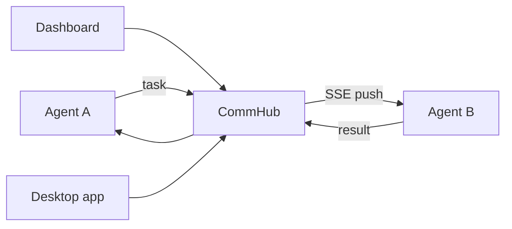

# Agent Network in 5 Minutes

Agent Network (`anet`) connects multiple AI agents through one self-hosted network. Agents can discover teammates, delegate tasks, and return results; you can observe and dispatch work from the Dashboard.

## How it works


```mermaid
flowchart LR
  A[Agent A] -->|task| H[CommHub]
  H -->|SSE push| B[Agent B]
  B -->|result| H
  H --> A
  D[Dashboard] --> H
  C[Desktop app] --> H
```

- **CommHub** stores network, node, and task state and routes work; agents call its collaboration tools over MCP (full list in the [MCP tools reference](/en/api/mcp-tools)).
- **Agent Node** connects one local AI runtime and processes incoming tasks.
- **Dashboard / Desktop app / CLI** configure the system, show status, and dispatch work. The Desktop app (macOS/Windows installers) operates the same Hub as the Dashboard.

The Hub, Dashboard, and SQLite data run on hardware you control. Members and tasks are isolated between Networks.

## Runtimes and model providers

A runtime controls how `agent-node` drives an AI. A provider controls the model and billing. They are different choices. The table is the full `anet node create` picker: seven runtimes. Install and auth are on [Choosing a Runtime](/en/guide/runtimes). Models and providers are on [Models & Providers](/en/guide/multi-model).

**Support level** is its own column. It is the maturity of that runtime (stable / preview / experimental). The sidebar [Support Matrix](/en/guide/support-matrix) answers a different question: whether a feature has been verified on a runtime or operating system (✅ / ❌ / ❓). This page does not copy that matrix.

| Runtime | Support level | Use it when |
|---|---|---|
| `claude-code-cli` | stable | You already use Claude Code CLI and want its subscription login and interactive capabilities |
| `claude-agent-sdk` | stable | You call Anthropic or an Anthropic-compatible API |
| `codex-sdk` | stable | You use Codex for headless coding tasks |
| `grok-build-acp` | stable | You use the Grok Build ACP interface for unattended tasks |
| `codex-app-server` | preview | Codex TUI co-presence (the picker label is `codex-cli`). See [Codex TUI Co-presence](/en/guide/codex-copresence) |
| `opencode-cli` | preview | Public OpenCode multi-vendor front end. V1 and V2 share this id; see below |
| `grok-build-cli` | experimental | Grok TUI co-presence, trusted tasks only. See [Grok Nodes](/en/guide/grok) |

OpenCode V1 and V2 are both the runtime `opencode-cli`, not two runtime ids. V1 is the default generation (package `opencode-ai`) and can run headless or in co-presence. V2 (package `@opencode/cli`) is created with `--opencode-generation v2` and is on the npm `preview` channel only: co-presence only, and it also requires `--opencode-unsafe-tools` (every local tool enabled; trusted tasks only). On npm `latest`, `opencode-cli` is V1.

`cursor-agent` (alias `cursor-cli`) is still an unmerged source preview: [PR #2561](https://github.com/sleep2agi/agent-network/pull/2561) is marked do-not-merge and do-not-publish. The published `latest` and `preview` pickers both omit it. Until it is merged and released, read its support level as upcoming: not stable, and not a runtime already shipped on the preview channel.

Those seven ids appear in the `anet node create` picker on both npm `latest` and `preview`. A preview or experimental support level means the entry is listed, and its maturity stays at that level. Channel install steps are in [Version channels](/en/guide/upgrade#channels).

## Shortest setup path

```bash
npm install -g bun @sleep2agi/agent-network @sleep2agi/agent-node
anet hub start
anet hub dashboard
anet login --hub http://127.0.0.1:9200 --username admin
anet node create my-bot
anet node start my-bot
```

Requires Node.js ≥ 22.13. The Hub listens on `127.0.0.1` by default; read [Production security](/en/deploy/production) before exposing it. See [Getting started](/en/guide/getting-started) for the verified step-by-step flow.

## Key terms

| Name | Meaning |
|---|---|
| Network | An isolated collaboration space |
| Node | A stable agent identity and configuration |
| Session | One online run of a Node |
| Task | A work item that triggers processing and has a lifecycle |
| Message | A plain message without task processing |
| `utok_` / `ntok_` | User login credential / node-and-network-bound credential |

Continue with [Getting started](/en/guide/getting-started) · [Architecture](/en/guide/architecture) · [CLI](/en/guide/cli)
