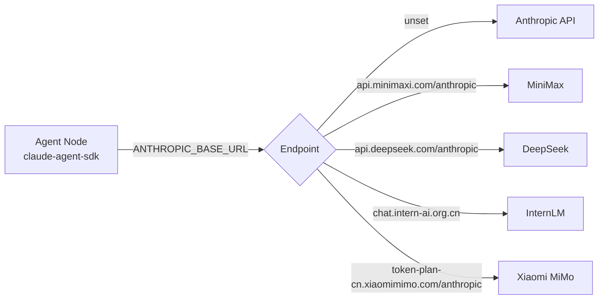

# Multi-Model Configuration

One Agent Network can run nodes backed by different vendors and models at the same time. Every node speaks the same CommHub protocol, so dispatching and replying work the same whatever model sits behind a node.

This page covers which providers are supported, how to configure each one, how `ANTHROPIC_BASE_URL` works, the vendor adapter that corrects one vendor's behavior, a mixed-fleet example, and model-selection tips. Runtime prerequisites are in [Runtimes](/en/guide/runtimes).

## Supported providers {#supported-providers}

The vendor picker in `anet node create` (the `VENDORS` list in the source) has the providers below built in. The model ids in the picker are only the values it pre-fills at create time. Vendors ship new models, so **take the current model id from the vendor's console**.

| Provider | Runtime | Auth | `ANTHROPIC_BASE_URL` | Models pre-filled by the picker |
|---|---|---|---|---|
| Anthropic Claude (API) | `claude-agent-sdk` | `ANTHROPIC_API_KEY` | unset (official endpoint) | Sonnet / Opus / Haiku lines |
| Claude Code | `claude-code-cli` | `claude auth login` (Claude Pro/Team/Max subscription) | n/a | no picker; follows the subscription |
| OpenAI Codex | `codex-sdk` | `codex login` | n/a | built-in default, override with `--model` |
| MiniMax | `claude-agent-sdk` | `ANTHROPIC_AUTH_TOKEN` | `https://api.minimaxi.com/anthropic` | `MiniMax-M3` (image input), `MiniMax-M2.7` (text only) |
| DeepSeek | `claude-agent-sdk` | `ANTHROPIC_AUTH_TOKEN` | `https://api.deepseek.com/anthropic` | `deepseek-v4-pro`, `deepseek-v4-flash` |
| InternLM | `claude-agent-sdk` | `ANTHROPIC_AUTH_TOKEN` | `https://chat.intern-ai.org.cn` (bare hostname, no `/anthropic`) | `intern-s2-preview`, `intern-s1-pro` |
| Xiaomi MiMo | `claude-agent-sdk` | `ANTHROPIC_AUTH_TOKEN` | `https://token-plan-cn.xiaomimimo.com/anthropic` | `mimo-v2.5-pro`, `mimo-v2.5`, `mimo-v2-pro`, `mimo-v2-omni`, `mimo-v2.5-tts-voicedesign` |
| Custom (GLM, Kimi, OpenRouter, self-hosted, ...) | `claude-agent-sdk` | `ANTHROPIC_AUTH_TOKEN` | the Anthropic-compatible endpoint from the vendor's docs | you enter it |

`mimo-v2.5-tts-voicedesign` is a voice-design (TTS) model; for a text agent pick one of the other four.

Two more routes do not use `ANTHROPIC_BASE_URL`:

- **xAI Grok**: the `grok-build-acp` runtime reuses your `grok login` session, or `GROK_CODE_XAI_API_KEY`. See [grok-build-acp](/en/guide/runtimes#grok-build-acp).
- **OpenCode**: the `opencode-cli` runtime lets the opencode CLI talk to the vendor. See [Runtimes](/en/guide/runtimes).

::: tip Any Anthropic-compatible service works
`claude-agent-sdk` is an Anthropic Messages API client. Any service with an Anthropic-compatible endpoint (GLM, Kimi, OpenRouter, SiliconFlow, Qwen, self-hosted vLLM, ...) can be connected through the picker's "custom" entry. Take the endpoint and model id from that vendor's docs.
:::

## Create with the wizard {#create-with-the-wizard}

Run it in an interactive terminal without `--runtime` and the wizard asks, in order:

```bash
anet node create writer-1
# 1. pick a runtime  → claude-agent-sdk
# 2. pick a vendor   → e.g. MiniMax
# 3. pick a model
# 4. paste the API key (the picker tells you where to sign up)
anet node start writer-1
```

Only `claude-agent-sdk` opens the vendor picker; `claude-code-cli`, `codex-sdk` and `grok-build-acp` just remind you to log in.

If your shell already exports `ANTHROPIC_AUTH_TOKEN` or `ANTHROPIC_API_KEY`, the wizard skips the vendor picker. In that case use the commands in the next section and pass `--model` explicitly.

## Configure per provider {#configure-per-provider}

### Where credentials go {#where-credentials-go}

For a `claude-agent-sdk` node, `anet node create` records `ANTHROPIC_BASE_URL`, `ANTHROPIC_AUTH_TOKEN` and `ANTHROPIC_API_KEY` from the current shell into the node's config, so the node still starts later from a fresh shell. You can also pass them with `--env KEY=VALUE`; explicit values win.

Secret values are not written into `config.json` in plain text. They become environment references, and the actual values go into `.anet/nodes/<alias>/.env` (mode 0600). Do not commit the `.anet/` directory. See [Node files](/en/guide/agent-node#node-files).

### Claude {#claude}

```bash
# Option 1: Anthropic API key (claude-agent-sdk)
# --model: the current model id from Anthropic's docs
ANTHROPIC_API_KEY=sk-ant-xxx \
anet node create reasoner --runtime claude-agent-sdk --model <anthropic-model-id>

# Option 2: Claude Code subscription (claude-code-cli), no API key
claude auth login
anet node create all-rounder --runtime claude-code-cli

anet node start reasoner
```

Current model ids: [Anthropic Models](https://docs.anthropic.com/claude/docs/models-overview).

### Codex {#codex}

```bash
codex login
anet node create coder --runtime codex-sdk            # uses the built-in default model
anet node create coder-2 --runtime codex-sdk --model <codex-model-id>
anet node start coder
```

`codex-sdk` does not read the `--tools` option. For login options see [codex-sdk](/en/guide/runtimes#codex-sdk).

### Built-in Anthropic-compatible providers {#built-in-anthropic-compatible}

MiniMax, DeepSeek, InternLM and Xiaomi MiMo are configured the same way; only `ANTHROPIC_BASE_URL` and the model differ:

```bash
# MiniMax
ANTHROPIC_BASE_URL=https://api.minimaxi.com/anthropic \
ANTHROPIC_AUTH_TOKEN=<minimax-api-key> \
anet node create writer-1 --runtime claude-agent-sdk --model <minimax-model-id>

# DeepSeek
ANTHROPIC_BASE_URL=https://api.deepseek.com/anthropic \
ANTHROPIC_AUTH_TOKEN=<deepseek-api-key> \
anet node create reviewer --runtime claude-agent-sdk --model <deepseek-model-id>

# InternLM: bare hostname, no /anthropic suffix
ANTHROPIC_BASE_URL=https://chat.intern-ai.org.cn \
ANTHROPIC_AUTH_TOKEN=<intern-api-key> \
anet node create researcher --runtime claude-agent-sdk --model <intern-model-id>

# Xiaomi MiMo
ANTHROPIC_BASE_URL=https://token-plan-cn.xiaomimimo.com/anthropic \
ANTHROPIC_AUTH_TOKEN=<mimo-api-key> \
anet node create thinker --runtime claude-agent-sdk --model <mimo-model-id>
```

Always pass `--model` when creating from the command line: skipping the wizard means no vendor default model is filled in.

API keys and current model ids: [MiniMax](https://platform.minimaxi.com), [DeepSeek](https://platform.deepseek.com), [InternLM](https://chat.intern-ai.org.cn/), [Xiaomi MiMo](https://platform.xiaomimimo.com).

The InternLM endpoint automatically enables the [vendor adapter](#vendor-adapters) described below.

### Custom Anthropic-compatible endpoint {#custom-endpoint}

GLM (Zhipu), Kimi (Moonshot), OpenRouter, self-hosted gateways and the like are not in the built-in list. Use "custom":

```bash
ANTHROPIC_BASE_URL=<the vendor's Anthropic-compatible endpoint> \
ANTHROPIC_AUTH_TOKEN=<api-key> \
anet node create analyst --runtime claude-agent-sdk --model <vendor-model-id>
```

Keep in mind:

- The endpoint is the base that the Anthropic SDK appends `/v1/messages` to; follow the vendor's docs.
- The model id format is up to the vendor; OpenRouter, for example, uses `provider/model`.
- After creating the node, send it a small task to confirm it replies before relying on it.

## How ANTHROPIC_BASE_URL works {#how-anthropic-base-url-works}

`claude-agent-sdk` calls the official Anthropic API by default. With `ANTHROPIC_BASE_URL` set, the same Messages API requests go to that address and are served by that vendor's model:



Because the request format does not change, switching vendors only means changing `ANTHROPIC_BASE_URL`, the API key and `--model`. The rest of the node and network configuration stays the same.

The Anthropic-compatible protocol standardizes the wire format only. It does not guarantee that every vendor's model behaves the same, especially around tool calls. That is what the vendor adapter in the next section handles.

## Vendor adapters {#vendor-adapters}

The same `tools` + `tool_choice: "auto"` request can behave differently across vendors:

- Anthropic and MiniMax return `tool_use` content blocks as expected.
- InternLM `intern-s2-preview` defaults to long "Thinking Process" text and returns no `tool_use` block; forcing `tool_choice` is rejected (error `-20077`). The node receives tasks but cannot dispatch work.

To handle this, the agent-node `claude-agent-sdk` runtime checks `ANTHROPIC_BASE_URL`. When it matches the InternLM endpoint, it puts a fixed bias prompt at the very start of the system prompt so the model returns `tool_use` blocks directly. This is a stopgap and is meant to be removed once the vendor fixes the default behavior.

### Trigger {#vendor-adapter-trigger}

It fires when `ANTHROPIC_BASE_URL` matches the regex `/intern-ai\.org\.cn|chat\.intern-ai/i`, which is the case for the built-in InternLM endpoint `https://chat.intern-ai.org.cn`. Other vendors are not affected.

The prepended text is:

```text
When a tool is available and applicable to the user request, you MUST respond by emitting a tool_use content block, not by writing text that describes the tool call. Do not show a verbose thinking process. Do not embed tool-call JSON inside text. Use the tool_use content channel directly. If no tool fits, respond normally with text.
```

### Side effects {#vendor-adapter-side-effects}

- **No visible reasoning**: the model skips InternLM's visible thinking, so while debugging you cannot see why it made a decision.
- **URL-only detection**: self-hosted lmdeploy, a proxy, or an aggregator such as OpenRouter in front of an InternLM model will not match the URL. The bias does not apply and tool calls may still fail.
- **Implicit injection**: the effective system prompt is "bias + your prompt". Keep that in mind when you customize prompts.
- **Leans toward tool calls**: good for multi-agent coordination, but when you only want a node to write a report it may reach for tools instead.

### Can you turn it off {#vendor-adapter-opt-out}

Not currently. For InternLM endpoints the bias is always prepended:

- A custom system prompt for the node (the `systemPrompt` field in `.anet/nodes/<alias>/config.json`, or running `agent-node --prompt` directly) is appended after the bias; it does not replace it. `anet node start` has no `--prompt` option.
- A custom prompt can still steer behavior, for example "Only write the report; do not call tools."
- The only way to run without the bias is a non-InternLM endpoint.

The other way round: if you reach an InternLM model through a self-hosted or proxied URL that does not trigger the bias, copy the text above into that node's `systemPrompt` in `config.json`.

## Mixed fleet example {#mixed-fleet}

Assign models by task type within one network:

```bash
anet hub start

# Copy and translation: low-cost model
ANTHROPIC_BASE_URL=https://api.minimaxi.com/anthropic \
ANTHROPIC_AUTH_TOKEN=<minimax-api-key> \
anet node create writer-1 --runtime claude-agent-sdk --model <minimax-model-id>

# Code review: DeepSeek
ANTHROPIC_BASE_URL=https://api.deepseek.com/anthropic \
ANTHROPIC_AUTH_TOKEN=<deepseek-api-key> \
anet node create reviewer --runtime claude-agent-sdk --model <deepseek-model-id>

# Coding: Codex
codex login
anet node create coder --runtime codex-sdk

anet node start writer-1
anet node start reviewer
anet node start coder
```

Once the nodes are online, dispatch to them from the Dashboard, or let a coordinator node route by task type. Put the coordinator's routing rules in its `systemPrompt`, for example:

```text
You are the coordinator. Send coding tasks to coder, reviews to reviewer, and copy or translation to writer-1.
Use commhub_get_all_status to see who is online and commhub_send_task to dispatch.
```

For running nodes in containers, see [Docker deployment](/en/deploy/clean-server#docker).

## Model selection and cost {#model-selection-and-cost}

| Scenario | Suggestion |
|---|---|
| Hard reasoning, architecture | a high-end Claude model, or a Claude Code subscription |
| Writing code, running commands | Codex, or Claude |
| Translation, summaries, bulk text | low-cost models such as MiniMax or DeepSeek |
| Image input | a model explicitly marked image-capable, e.g. MiniMax-M3 (labeled vision in the picker) or Claude |
| Scientific reasoning | InternLM (see the vendor adapter above) |

Ways to keep cost down:

- **Tiered dispatch**: send most simple tasks to low-cost models and reserve the high-end model for the few hard ones. Prices change often; check each vendor's official price list before budgeting.
- **Per-task budget cap** (`claude-agent-sdk`): set `budget` (USD) under `flags` in `.anet/nodes/<alias>/config.json`, then restart the node; or pass `--max-budget <usd>` when running agent-node directly.
- **Turn limit** (`claude-agent-sdk`): pass `--max-turns <n>` at create time so one task cannot run for too many turns.
- **Concurrency**: most vendors cap concurrent requests. Check your quota before starting many nodes; for rate-limit errors see the [FAQ](/en/troubleshooting#faq).

```json
{
  "flags": {
    "budget": 1.0
  }
}
```

## Next steps {#next-steps}

- Runtime prerequisites and differences: [Runtimes](/en/guide/runtimes)
- Node files, environment variables and secrets: [Agent Node](/en/guide/agent-node)
- Container deployment: [Docker deployment](/en/deploy/clean-server#docker)
